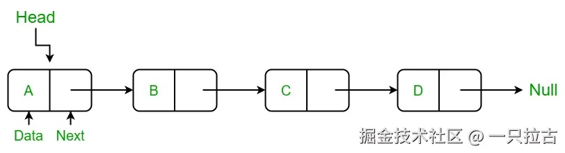
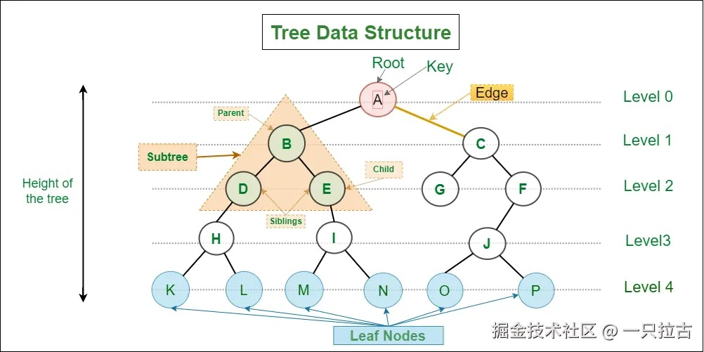
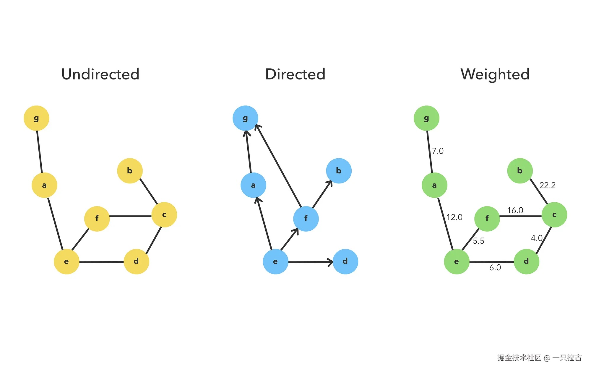

# Mastering Advanced Data Structures: Linked List, Tree, and Graph Explained in LeetCode

In this article, we will explore three fundamental advanced data structures: Linked List, Tree, and Graph. These data structures are crucial for solving various problems in computer science and are frequently encountered in technical interviews. We will explore how each structure works, its use cases, and analyze some common interview questions.

---

## **Linked List**



A linked list is a linear data structure where elements are stored in nodes. Each node contains a value and a reference to the next node. Linked lists come in several types:

- **Singly Linked List**: Each node points to the next node.
- **Doubly Linked List**: Each node points to both the next and the previous node.
- **Circular Linked List**: The last node points to the first node.

### **Common Operations**

- **Traversal**: Iterating through the nodes to access their elements.
- **Insertion**: Adding new nodes at the beginning, end, or middle of the list.
- **Deletion**: Removing nodes from the list.

### **Example: Reversing a Singly Linked List**

```csharp
public class ListNode {
    public int val;
    public ListNode next;
    public ListNode(int x) { val = x; }
}

public class Solution {
    public ListNode ReverseList(ListNode head) {
        ListNode prev = null;
        ListNode curr = head;
        while (curr != null) {
            ListNode nextTemp = curr.next;
            curr.next = prev;
            prev = curr;
            curr = nextTemp;
        }
        return prev;
    }
}
```

### **LeetCode Problems Related to Linked List**

- [206. Reverse Linked List](https://leetcode.cn/problems/reverse-linked-list/)
- [19. Remove Nth Node from End of List](https://leetcode.cn/problems/remove-nth-node-from-end-of-list/)
- [21. Merge Two Sorted Lists](https://leetcode.cn/problems/merge-two-sorted-lists/)
- [141. Linked List Cycle](https://leetcode.cn/problems/linked-list-cycle/)

---

## **Tree**



A tree is a hierarchical data structure consisting of nodes and edges. The most common type is the binary tree, where each node has at most two children (left and right).

### **Types of Trees**

- **Binary Tree**: Each node has two children.
- **Binary Search Tree (BST)**: A binary tree where the left child is smaller than the node and the right child is larger than the node.
- **AVL Tree**: A self-balancing binary search tree.
- **Trie**: A tree-like structure used for efficiently storing strings.

### **Tree Traversal Methods**

- **Preorder Traversal**: Visit the root node, then the left subtree, and finally the right subtree.
- **Inorder Traversal**: Visit the left subtree, then the root node, and finally the right subtree.
- **Postorder Traversal**: Visit the left subtree, then the right subtree, and finally the root node.
- **Level-order Traversal**: Traverse the nodes by levels.

### **Example: Binary Tree Traversal (Inorder)**

```csharp
public class TreeNode {
    public int val;
    public TreeNode left;
    public TreeNode right;
    public TreeNode(int x) { val = x; }
}

public class Solution {
    public IList<int> InorderTraversal(TreeNode root) {
        List<int> result = new List<int>();
        Inorder(root, result);
        return result;
    }

    private void Inorder(TreeNode root, List<int> result) {
        if (root == null) return;
        Inorder(root.left, result);
        result.Add(root.val);
        Inorder(root.right, result);
    }
}
```

### **LeetCode Problems Related to Tree**

- [94. Binary Tree Inorder Traversal](https://leetcode.cn/problems/binary-tree-inorder-traversal/)
- [226. Invert Binary Tree](https://leetcode.cn/problems/invert-binary-tree/)
- [104. Maximum Depth of Binary Tree](https://leetcode.cn/problems/maximum-depth-of-binary-tree/)
- [144. Binary Tree Preorder Traversal](https://leetcode.cn/problems/binary-tree-preorder-traversal/)
- [98. Validate Binary Search Tree](https://leetcode.cn/problems/validate-binary-search-tree/)

---

## **Graph**



A graph is a collection of nodes (vertices) and edges. A graph can be directed or undirected, and it may contain cycles or be acyclic.

### **Types of Graphs**

- **Directed Graph (Digraph)**: The edges have direction (A → B).
- **Undirected Graph**: The edges are bidirectional (A ↔ B).
- **Weighted Graph**: The edges have weights or associated costs.
- **Cyclic and Acyclic Graphs**: If there is a path from a vertex that leads back to itself, the graph is cyclic.

### **Common Graph Algorithms**

- **Depth-First Search (DFS)**: Traverse as deeply as possible along a branch, backtracking when necessary.
- **Breadth-First Search (BFS)**: Traverse neighbors first, then explore the next level of neighbors.
- **Dijkstra’s Algorithm**: Used to find the shortest path in a weighted graph.

### **Example: Graph Cloning (DFS)**

```csharp
public class Node {
    public int val;
    public IList<Node> neighbors;

    public Node() {
        val = 0;
        neighbors = new List<Node>();
    }

    public Node(int _val) {
        val = _val;
        neighbors = new List<Node>();
    }

    public Node(int _val, List<Node> _neighbors) {
        val = _val;
        neighbors = _neighbors;
    }
}

public class Solution {
    private Dictionary<Node, Node> visited = new Dictionary<Node, Node>();

    public Node CloneGraph(Node node) {
        if (node == null) return null;

        if (visited.ContainsKey(node)) {
            return visited[node];
        }

        Node cloneNode = new Node(node.val, new List<Node>());
        visited[node] = cloneNode;

        foreach (var neighbor in node.neighbors) {
            cloneNode.neighbors.Add(CloneGraph(neighbor));
        }

        return cloneNode;
    }
}
```

### **LeetCode Problems Related to Graph**

- [133. Clone Graph](https://leetcode.cn/problems/clone-graph/)
- [200. Number of Islands](https://leetcode.cn/problems/number-of-islands/)
- [207. Course Schedule](https://leetcode.cn/problems/course-schedule/)
- [417. Pacific Atlantic Water Flow](https://leetcode.cn/problems/pacific-atlantic-water-flow/)
- [997. Find the Town Judge](https://leetcode.cn/problems/find-the-town-judge/)

---

## **Node Structures: LeetCode vs. Professional Codebases**

When working with linked lists, trees, and graphs, the structure of nodes can differ significantly depending on the environment. A common distinction is the **direct reference** approach, often used in algorithm challenges like LeetCode, versus the **node ID and lookup** method, which is common in professional codebases. Let’s explore why these differences exist and how they impact coding.

### **LeetCode Style Node Structure (Direct Reference)**

In platforms like LeetCode, nodes typically reference their adjacent or child nodes directly. For example, a graph node might look like this:

```csharp
public class Node {
    public int val;
    public IList<Node> neighbors;
}
```

This structure is simple and focused on the algorithm being tested rather than complex node management. Here’s why this structure is common on platforms like LeetCode:

- **Algorithm-Centric**: By directly referencing neighbor nodes, recursive or iterative operations become more intuitive, allowing developers to focus on implementing algorithms like Depth-First Search (DFS) or Breadth-First Search (BFS).
- **Minimal Setup**: No need for complex node management or ID lookups, keeping attention on solving the core algorithm problem.
- **Efficiency for Small Data**: Since many LeetCode problems involve small to medium-sized data structures, direct references are efficient and won’t lead to memory issues.

However, this design is better suited for short-term algorithmic problems, rather than scenarios where large-scale node management is required.

### **Professional Codebase Node Structure (Node ID and Lookup)**

In real-world applications, relationships between nodes are often represented using IDs and lookup tables or maps:

```csharp
class Node {
    public int NodeId { get; set; }
    public Dictionary<int, double> Neighbors { get; set; } // Key: Neighbor Node ID, Value: Distance
}

class Map {
    public HashSet<Node> Nodes { get; set; }

    // Lookup node by ID
    public Node GetNodeById(int nodeId) {
        return Nodes.FirstOrDefault(node => node.NodeId == nodeId);
    }
}
```

This design has the following advantages:

- **Scalability**: In large systems like map applications or network routing, storing node references by ID can reduce memory usage and is easier to serialize or deserialize nodes.
- **Flexibility**: Using IDs decouples node management from the neighbors, making it easier to update or manage nodes independently. This is especially important when adding or removing nodes dynamically.
- **Distributed Systems**: When nodes are distributed across different services or modules, using IDs ensures consistency and makes it easier to cache or store node information.
- **Efficiency for Large Graphs**: In large graphs, looking up nodes by ID simplifies managing and updating connections.

Though this approach introduces more complexity, it’s crucial for handling large datasets and ensuring scalability in systems.

### **When to Use Which Approach**

- **LeetCode**: If you're solving algorithm-centric problems, especially with small to medium-sized data sets, the direct reference approach simplifies the code and focuses on the algorithmic logic.
- **Professional Systems**: If you’re designing a system that handles a large number of nodes and requires scalability or persistent storage (e.g., game, map system, or network model), the node ID and lookup table approach is better for memory management and flexibility.

---

## **Conclusion**

Understanding advanced data structures such as linked lists, trees, and graphs is crucial for solving a wide range of problems in computer science. These structures form the foundation of many algorithms, and mastering them will significantly enhance your problem-solving ability in both interviews and real-world applications.

Make sure to solidify your understanding of these data structures by practicing relevant LeetCode problems. Each problem presents a different challenge, helping you explore the diversity of these data structures.
