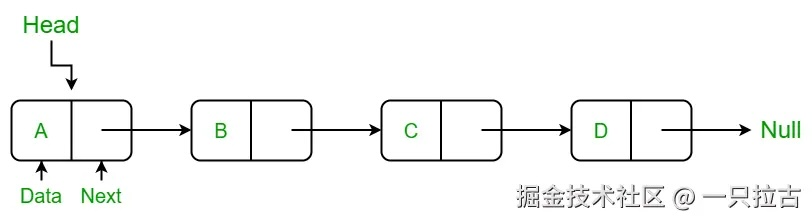
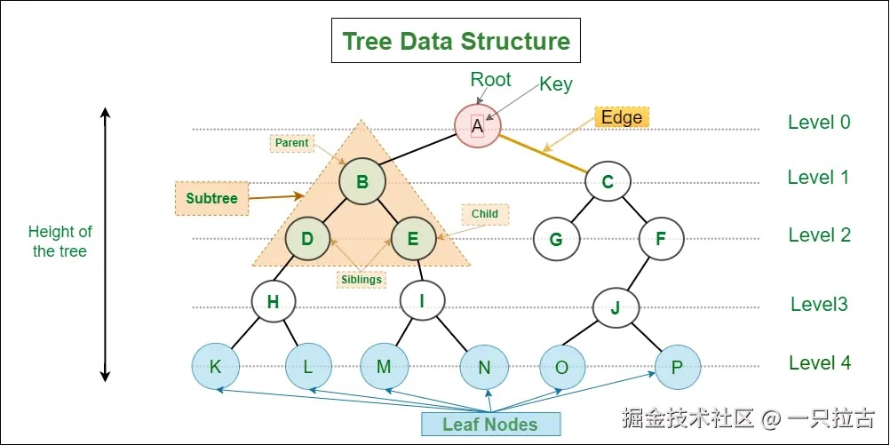
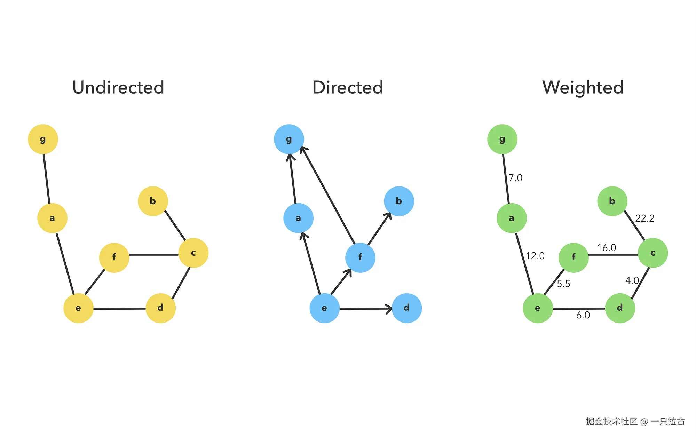

# 掌握高级数据结构：LeetCode中的链表(Linked List)、树(Tree)和图(Graph)详解

在这篇文章中，我们将深入探讨三种基础的高级数据结构：链表、树和图。这些数据结构在解决计算机科学中的各种问题时至关重要，并且在技术面试中经常遇到。我们将探索每种结构的工作原理、应用场景，并分析一些常见的面试题。

---

## **链表(Linked List)**



链表是一种线性数据结构，元素存储在节点中。每个节点包含一个值和一个指向下一个节点的引用。链表有几种类型：

- **单向链表**：每个节点指向下一个节点。
- **双向链表**：每个节点既指向下一个节点，也指向前一个节点。
- **循环链表**：最后一个节点指向第一个节点。

### **常见操作**

- **遍历**：迭代访问节点中的元素。
- **插入**：在链表的开头、结尾或中间添加新节点。
- **删除**：从链表中移除节点。

### **示例：反转单向链表**

```csharp
public class ListNode {
    public int val;
    public ListNode next;
    public ListNode(int x) { val = x; }
}

public class Solution {
    public ListNode ReverseList(ListNode head) {
        ListNode prev = null;
        ListNode curr = head;
        while (curr != null) {
            ListNode nextTemp = curr.next;
            curr.next = prev;
            prev = curr;
            curr = nextTemp;
        }
        return prev;
    }
}
```

### **与链表相关的LeetCode题目**

- [206. 反转链表](https://leetcode.cn/problems/reverse-linked-list/)
- [19. 删除链表的倒数第N个节点](https://leetcode.cn/problems/remove-nth-node-from-end-of-list/)
- [21. 合并两个有序链表](https://leetcode.cn/problems/merge-two-sorted-lists/)
- [141. 环形链表](https://leetcode.cn/problems/linked-list-cycle/)

---

## **树(Tree)**



树是一种由节点(Node)和边组成的层次数据结构。最常见的类型是二叉树，每个节点最多有两个子节点（左子节点和右子节点）。

### **树的类型**

- **二叉树**：每个节点有两个子节点。
- **二叉搜索树 (BST)**：一种二叉树，左子节点小于节点，右子节点大于节点。
- **AVL树**：一种自平衡的二叉搜索树。
- **字典树 (Trie)**：一种树状结构，常用于高效存储字符串。

### **树的遍历方式**

- **前序遍历**：先访问根节点，再访问左子树，最后访问右子树。
- **中序遍历**：先访问左子树，再访问根节点，最后访问右子树。
- **后序遍历**：先访问左子树，再访问右子树，最后访问根节点。
- **层序遍历**：按层次逐级遍历节点。

### **示例：二叉树遍历（中序）**

```csharp
public class TreeNode {
    public int val;
    public TreeNode left;
    public TreeNode right;
    public TreeNode(int x) { val = x; }
}

public class Solution {
    public IList<int> InorderTraversal(TreeNode root) {
        List<int> result = new List<int>();
        Inorder(root, result);
        return result;
    }

    private void Inorder(TreeNode root, List<int> result) {
        if (root == null) return;
        Inorder(root.left, result);
        result.Add(root.val);
        Inorder(root.right, result);
    }
}
```

### **与树相关的LeetCode题目**

- [94. 二叉树的中序遍历](https://leetcode.cn/problems/binary-tree-inorder-traversal/)
- [226. 翻转二叉树](https://leetcode.cn/problems/invert-binary-tree/)
- [104. 二叉树的最大深度](https://leetcode.cn/problems/maximum-depth-of-binary-tree/)
- [144. 二叉树的前序遍历](https://leetcode.cn/problems/binary-tree-preorder-traversal/)
- [98. 验证二叉搜索树](https://leetcode.cn/problems/validate-binary-search-tree/)

---

## **图(Graph)**



图是一组节点（顶点）和边的集合。图可以是有向的或无向的，并且可能包含环或是无环图。

### **图的类型**

- **有向图**：边具有方向性（A → B）。
- **无向图**：边是双向的（A ↔ B）。
- **加权图**：边有权重或相关的成本。
- **有环图与无环图**：如果图中存在一条路径可以从某一顶点出发并回到该顶点，则图是有环的。

### **常见的图算法**

- **深度优先搜索 (DFS)**：沿着一个分支尽可能深入，直到无法继续，然后回溯。
- **广度优先搜索 (BFS)**：优先访问邻居节点，然后再遍历下一级邻居。
- **Dijkstra算法**：用于查找加权图中的最短路径。

### **示例：图的克隆（DFS）**

```csharp
public class Node {
    public int val;
    public IList<Node> neighbors;

    public Node() {
        val = 0;
        neighbors = new List<Node>();
    }

    public Node(int _val) {
        val = _val;
        neighbors = new List<Node>();
    }

    public Node(int _val, List<Node> _neighbors) {
        val = _val;
        neighbors = _neighbors;
    }
}

public class Solution {
    private Dictionary<Node, Node> visited = new Dictionary<Node, Node>();

    public Node CloneGraph(Node node) {
        if (node == null) return null;

        if (visited.ContainsKey(node)) {
            return visited[node];
        }

        Node cloneNode = new Node(node.val, new List<Node>());
        visited[node] = cloneNode;

        foreach (var neighbor in node.neighbors) {
            cloneNode.neighbors.Add(CloneGraph(neighbor));
        }

        return cloneNode;
    }
}
```

### **与图相关的LeetCode题目**

- [133. 克隆图](https://leetcode.cn/problems/clone-graph/)
- [200. 岛屿数量](https://leetcode.cn/problems/number-of-islands/)
- [207. 课程表](https://leetcode.cn/problems/course-schedule/)
- [417. 太平洋大西洋水流问题](https://leetcode.cn/problems/pacific-atlantic-water-flow/)
- [997. 找到小镇的法官](https://leetcode.cn/problems/find-the-town-judge/)

---

## **节点结构：LeetCode vs. 专业代码库**

在处理链表、树和图时，节点的结构可能因环境不同而显著变化。一个常见的区别是 **直接引用** 的方式，通常用于 LeetCode 等算法挑战，而 **节点 ID 和查找** 的方式常见于专业代码库中。让我们来探讨为什么会有这些差异以及它们对编码的影响。

### **LeetCode风格的节点结构（直接引用）**

在 LeetCode 等代码挑战平台中，节点通常直接引用其相邻或子节点。例如，一个图节点可能如下所示：

```csharp
public class Node {
    public int val;
    public IList<Node> neighbors;
}
```

这种结构简单明了，主要目的是专注于所测试的算法，而不必处理复杂的节点管理。以下是为什么这种结构在 LeetCode 等平台上很常见的原因：

- **算法为中心**：通过直接引用邻居节点，递归或迭代操作变得更直观，允许开发者专注于实现深度优先搜索（DFS）或广度优先搜索（BFS）等算法。
- **最小化设置**：不需要复杂的节点管理或 ID 查找，从而避免分散解决核心问题的注意力。
- **小规模数据的性能**：由于许多 LeetCode 问题涉及的小到中型数据结构，直接引用高效且不会引发内存问题。

然而，这种设计更适合于短期的算法问题，而不太适用于需要大规模节点管理的场景。

### **专业代码库中的节点结构（节点 ID 和查找）**

在现实世界的应用中，节点之间的关系通常通过 ID 和查找表或映射来表示：

```csharp
class Node {
    public int NodeId { get; set; }
    public Dictionary<int, double> Neighbors { get; set; } // Key: 邻居节点ID, Value: 距离
}

class Map {
    public HashSet<Node> Nodes { get; set; }

    // 根据ID查找节点
    public Node GetNodeById(int nodeId) {
        return Nodes.FirstOrDefault(node => node.NodeId == nodeId);
    }
}
```

这种设计具有以下优势：

- **可扩展性**：在类似地图软件或网络路由等大型系统中，通过 ID 存储节点引用可以减少内存开销，并且更容易序列化或反序列化节点。
- **灵活性**：使用 ID 将节点结构解耦，使得节点可以独立于其邻居进行管理或更新。这在动态添加或删除节点时尤其重要。
- **分布式系统**：在节点分布在不同服务或模块的情况下，使用 ID 可以保持一致性，并且更容易缓存或存储节点信息。
- **大型图的高效性**：处理大规模图时，通过 ID 查找节点可以降低管理和更新连接的复杂性。

虽然这种方法引入了更多复杂性，但对于处理大型数据集和维护系统的可扩展性至关重要。

### **何时使用哪种方法**

- **LeetCode**：如果你正在解决以算法为中心的问题，尤其是处理小到中型数据集时，使用直接引用可以简化代码并集中于算法逻辑。
- **专业系统**：如果你在设计一个处理大量节点的系统，且需要扩展或持久化存储（例如游戏、地图系统或网络模型），使用节点 ID 和查找表是更好的选择，有助于更好的内存管理和灵活性。

---

## **结论**

理解链表、树和图等高级数据结构对于解决计算机科学中的各种问题至关重要。这些结构是许多算法的基础，掌握它们将大大提升你在面试和现实应用中的问题解决能力。

确保通过相关的 LeetCode 题目练习来巩固你对这些数据结构的理解。每个题目都提供了不同的挑战，帮助你探索这些数据结构的多样性。
