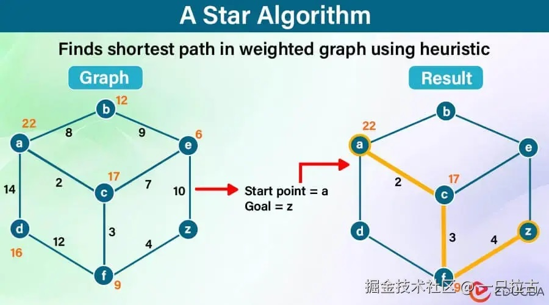

# Mastering the A* Pathfinding Algorithm: A Practical Guide with C# Implementation

Pathfinding plays a critical role in many applications, ranging from map navigation in video games and robotics to real-world systems like Google Maps. Among various algorithms for this purpose, the **A* (A-star) algorithm** stands out as one of the most efficient and widely used techniques, especially for grid-based maps.  

In this blog, we'll dive deep into the fundamentals of the A-star algorithm, understand its working principles, demonstrate a detailed C# implementation, and compare A-star with other popular pathfinding algorithms such as BFS and DFS. By the end of this guide, you'll have a solid grasp of why A* is often the go-to algorithm for solving complex pathfinding problems.

---

## Why Choose the A* Algorithm?

Before exploring the A* algorithm, let's briefly compare it to other search algorithms, such as **Depth-First Search (DFS)** and **Breadth-First Search (BFS)**, which we discussed in a previous blog.

* **DFS** explores a possible path deeply until it reaches the end, then backtracks. While useful in some cases, it can get stuck in long, inefficient paths and does not guarantee finding the shortest path.  
* **BFS** explores all possible paths layer by layer, ensuring the shortest path is found in an unweighted graph. However, it becomes inefficient in weighted graphs or more complex environments (e.g., maps with obstacles).  

**A-star Algorithm** improves upon BFS by introducing a **heuristic** function that guides the search based on the remaining distance to the goal. This makes A* both optimal, like BFS, and more efficient, like DFS.

---

## How Does the A* Algorithm Work?



The A* algorithm uses a **heuristic** function to estimate the best path to the goal. Its core idea is to evaluate each node based on two values:  

* **g(n):** Known cost from the start node to the current node.  
* **h(n):** Estimated cost from the current node to the goal (heuristic).  

The total cost `f(n)` is calculated as:  

    f(n) = g(n) + h(n)

Where:  

* `g(n)` is the known cost to reach node `n`.  
* `h(n)` is the heuristic estimate of the cost from node `n` to the goal.  

The algorithm maintains two lists:  

* **Open list:** The set of nodes to be explored, prioritized by their `f(n)` values.  
* **Closed list:** The set of nodes that have already been fully explored.  

### Steps Explained

1. **Initialize the open list**, adding the starting node.  
2. **Repeat until the goal is reached**:  
   * Select the node with the smallest `f(n)` value from the open list.  
   * For each neighboring node, calculate its `f(n)` value, updating it if a better path is found.  
   * Move the current node to the closed list.  
3. **Reconstruct the path**, backtracking from the goal node to the start node.  

---

## C# Implementation of the A* Algorithm  

Let's implement the A* algorithm in C#. Imagine we're building a city routing service where each Point of Interest (POI) is represented as a **Node**, and the connections between these POIs form a weighted **Graph**. Each edge represents the distance or travel cost between two POIs. With this structure, we can efficiently compute the shortest path between two POIs while accounting for distances and obstacles, much like real-world navigation systems.

### 1. **Define Node and Map Classes**

    ```csharp
    class Node
    {
        public int NodeId { get; set; }
        public int X { get; set; }
        public int Y { get; set; }
        public Dictionary<int, double> Neighbors { get; set; } // Key: Neighbor Node ID, Value: Distance
    }

    class Map
    {
        public HashSet<Node> Nodes { get; set; }

        // Retrieve a node by ID
        public Node GetNodeById(int nodeId)
        {
            return Nodes.FirstOrDefault(node => node.NodeId == nodeId);
        }
    }
    ```

### 2. **Manhattan Distance as a Heuristic Function**

    For simplicity, we'll use the **Manhattan distance** heuristic (assuming grid-based movement):  

    ```csharp
    double Heuristic(Node current, Node goal)
    {
        return Math.Abs(current.X - goal.X) + Math.Abs(current.Y - goal.Y);
    }
    ```

### 3. **Implementing the A* Algorithm**

    Here, we use dictionaries to track the cost (`G`), heuristic (`H`), and parent nodes, which are specific to the algorithm itself.  

    ```csharp
    List<Node> AStar(Node start, Node goal, Map map)
    {
        var openList = new List<Node> { start };
        var closedList = new HashSet<Node>();

        // Dictionaries to store g(n), h(n), and parent mapping
        var gScore = new Dictionary<int, double> { [start.NodeId] = 0 };
        var hScore = new Dictionary<int, double> { [start.NodeId] = Heuristic(start, goal) };
        var parentMap = new Dictionary<int, Node>();

        while (openList.Count > 0)
        {
            // Find the node with the lowest F value in the open list
            var current = openList.OrderBy(node => gScore[node.NodeId] + hScore[node.NodeId]).First();

            if (current.NodeId == goal.NodeId)
            {
                return ReconstructPath(parentMap, current);
            }

            openList.Remove(current);
            closedList.Add(current);

            foreach (var neighborId in current.Neighbors.Keys)
            {
                var neighbor = map.GetNodeById(neighborId);
                if (neighbor == null || closedList.Contains(neighbor)) continue;

                // Calculate tentative gScore (current gScore + distance to neighbor)
                double tentativeGScore = gScore[current.NodeId] + current.Neighbors[neighborId];

                if (!gScore.ContainsKey(neighbor.NodeId) || tentativeGScore < gScore[neighbor.NodeId])
                {
                    // Update gScore and hScore
                    gScore[neighbor.NodeId] = tentativeGScore;
                    hScore[neighbor.NodeId] = Heuristic(neighbor, goal);

                    // Set the current node as the parent of the neighbor
                    parentMap[neighbor.NodeId] = current;

                    if (!openList.Contains(neighbor))
                    {
                        openList.Add(neighbor);
                    }
                }
            }
        }

        return null; // Path not found
    }
    ```

### 4. **Reconstructing the Path**

    Backtrack from the goal node to form the path:  

    ```csharp
    List<Node> ReconstructPath(Dictionary<int, Node> parentMap, Node current)
    {
        var path = new List<Node> { current };

        while (parentMap.ContainsKey(current.NodeId))
        {
            current = parentMap[current.NodeId];
            path.Add(current);
        }

        path.Reverse();
        return path;
    }
    ```

---

## Advantages of the A* Algorithm

The A* algorithm offers several advantages, especially compared to BFS and DFS, making it a popular choice for pathfinding.  

* **Performance Efficiency:**  
  A-star reduces the number of nodes explored by guiding the search with a heuristic function, often outperforming BFS and DFS. BFS explores all possible paths to guarantee the shortest path, while DFS may explore irrelevant paths. A* strikes a balance between exploring new nodes and focusing on the most promising path.  

* **Flexibility and Customization:**  
  The algorithm allows customization of the heuristic function (how future costs are estimated) and distance calculation. For example, the distance calculation can be adjusted based on factors such as safety, speed, or scenic value, making A* adaptable to various practical applications.  

* **Incorporating Penalties or Preferences:**  
  A* can easily accommodate penalties or preferences for specific routes. For example, routes with heavy traffic or dangerous terrain can be penalized by increasing their costs. Conversely, preferred routes can have reduced costs.  

* **Pre-computed Data Usage:**  
  A* can leverage pre-computed data, such as distances between nodes in a map. This enables faster decision-making during execution, enhancing its speed and responsiveness in real-time applications.  

---

## Conclusion

The A-star algorithm is a powerful tool for finding the shortest path in complex environments. By balancing the cost of exploring nodes with the heuristic cost to the goal, A-star excels in efficiency and adaptability across various applications. Whether in games, mapping systems, or robotics, A* is an essential algorithm in your toolkit.
