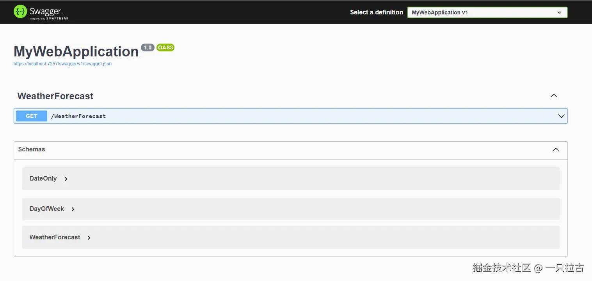
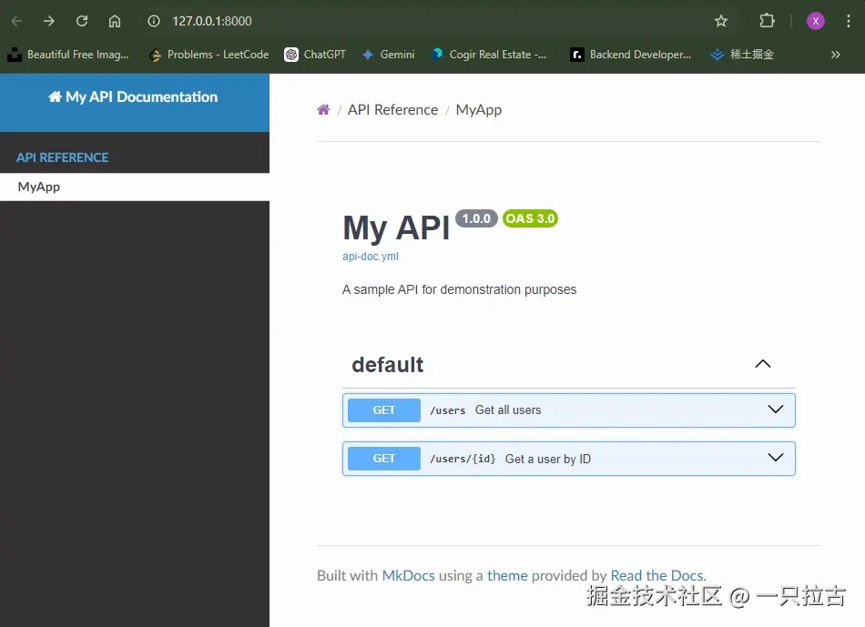

# 简化 API 文档：Swagger 的自动生成与手动创建方法

显然，API 文档在多种场景中都至关重要：无论是为了给其他团队查看，还是为了公开文档，或只是为了记录可用的 API。Swagger 是一个很好的工具，它相当于一个模板，只要符合规定的格式，就能生成文档。

在这篇博客中，我将一步一步带你了解两种方法：

1. **从现有的 .NET Core 项目中自动生成 Swagger 文档。**
2. **手动设置 Swagger 文件，并使用 MkDocs 生成静态文档站点。**

***

## 第一部分：从 .NET Core 项目中自动生成 Swagger 文档

假设您已经有一个 .NET Core Web API 项目，这样我们就可以轻松集成 Swagger 以实现自动 API 文档生成。

### 步骤 1：添加 Swagger NuGet 包

使用 NuGet 管理器或以下命令安装 `Swashbuckle.AspNetCore` 包：

```bash
dotnet add package Swashbuckle.AspNetCore
```

安装包后，Swagger 会自动配置 `Program.cs` 文件。由于 .NET 6+ 使用简化的 `Program.cs`，您无需手动添加 `Startup.cs` 文件。

### 步骤 2：验证配置

安装包后，您会注意到 `Program.cs` 文件中自动添加了必要的 Swagger 配置，包括：

```csharp
// 了解有关配置 Swagger/OpenAPI 的更多信息，请访问 https://aka.ms/aspnetcore/swashbuckle
builder.Services.AddEndpointsApiExplorer();
builder.Services.AddSwaggerGen();

var app = builder.Build();

// 配置 HTTP 请求管道。
if (app.Environment.IsDevelopment())
{
    app.UseSwagger();
    app.UseSwaggerUI();
}
```

此配置启用了 Swagger 的生成和 UI。尽管 `app.UseSwaggerUI()` 留空，但 Swagger UI 仍将以默认 URL 提供：`http://localhost:<port>/swagger`

### 步骤 3：查看自动生成的文档

运行您的项目并导航到 `http://localhost:<port>/swagger` 以查看您的 API 自动生成的 Swagger 文档。



***

## 第二部分：手动创建 Swagger YAML/JSON 文件并使用 MkDocs 生成静态站点

为了更好地控制您的 API 文档，您可以手动创建 Swagger 文件并使用 MkDocs 生成静态站点。

### 步骤 1：项目结构和文件布局

创建一个目录结构来组织您的 Swagger 文档和 MkDocs 配置。基本结构如下：

``` plaintext
    swagger-server/
    │
    ├── docs/
    │   └── api-doc.yml
    │   └── index.md
    │
    ├── mkdocs.yml
    └── Pipfile
```

* `docs/api-doc.yml`：这是您存储 Swagger 规范的地方。
* `mkdocs.yml`：MkDocs 配置文件。
* `Pipfile`：用于添加虚拟环境所需的依赖项。

### 步骤 2：设置虚拟环境

建议设置虚拟环境以便在本地管理依赖项。我们将使用 **Pipenv** 来方便地管理虚拟环境和依赖项。

假设您已经安装了 Python。如果没有，您需要安装 Python，推荐使用 3.12 版本。

如果您还没有安装 Pipenv，可以通过 pip 安装：

```bash
pip install pipenv
```

接下来，创建一个 `Pipfile` 来管理项目的依赖项。以下是我们的项目 `Pipfile` 的内容：

``` Pipfile
    [[source]]
    url = "https://pypi.org/simple"
    verify_ssl = true
    name = "pypi"

    [packages]
    mkdocs = "*"
    mkdocs-render-swagger-plugin = "*"
    mkdocs-swagger-ui = "*"

    [dev-packages]

    [requires]
    python_version = "3.12.6"
```

有了 `Pipfile`，运行以下命令安装依赖项：

```bash
pipenv install
```

此命令将创建虚拟环境并安装 `Pipfile` 中指定的所有必需包。

### 步骤 3：创建 Swagger YAML 文件

在 `docs/` 文件夹中，创建 `api-doc.yml` 以定义您的 API 文档。以下是一个示例：

```yaml
openapi: 3.0.0
info:
  title: My API
  description: 一个用于演示目的的示例 API
  version: 1.0.0
paths:
  /users:
    get:
      summary: 获取所有用户
      responses:
        '200':
          description: 一组用户对象的 JSON 数组
          content:
            application/json:
              schema:
                type: array
                items:
                  type: object
                  properties:
                    id:
                      type: integer
                    name:
                      type: string
  /users/{id}:
    get:
      summary: 通过 ID 获取用户
      parameters:
        - name: id
          in: path
          required: true
          schema:
            type: integer
      responses:
        '200':
          description: 用户详细信息
        '404':
          description: 用户未找到
```

### 步骤 4：配置 MkDocs

在根目录中，创建 `mkdocs.yml` 文件以配置 MkDocs：

```yaml
site_name: 我的 API 文档
theme: readthedocs

nav:
- API reference:
  - MyApp: index.md

plugins:
  - swagger-ui-tag
```

此配置将加载您创建的 Swagger 规范，并应用 `swagger-ui-tag` 插件以用户友好的格式显示它。

index.md：

``` xml
<swagger-ui src="api-doc.yml"/>
```

### 步骤 5：构建和服务文档

一旦一切设置完成，您可以本地构建和服务文档：

```bash
mkdocs build // 创建站点文件夹
mkdocs serve // 返回一个可以访问的链接
```

访问 `http://127.0.0.1:8000/` 在浏览器中查看通过 MkDocs 托管的 Swagger 生成的 API 文档。



### 步骤 6：托管您的文档

要托管您的文档，您可以将 MkDocs 生成的静态站点部署到任何支持静态站点托管的平台上，例如：

* **GitHub Pages**
* **Netlify**
* **AWS S3**

***

## 结论

在这篇文章中，我们介绍了使用 Swagger 创建 API 文档的两种方法：

1. **自动生成文档**，通过 .NET Core 项目，轻松快速地记录您的 API。
2. **手动创建 Swagger YAML/JSON 文件** 并使用 MkDocs 生成静态文档站点，让您完全控制文档的外观和风格。

这两种方法都非常强大，您可以选择最适合您项目需求的方法。如果您有任何问题或建议，请在下面留言。

祝文档编写愉快！
