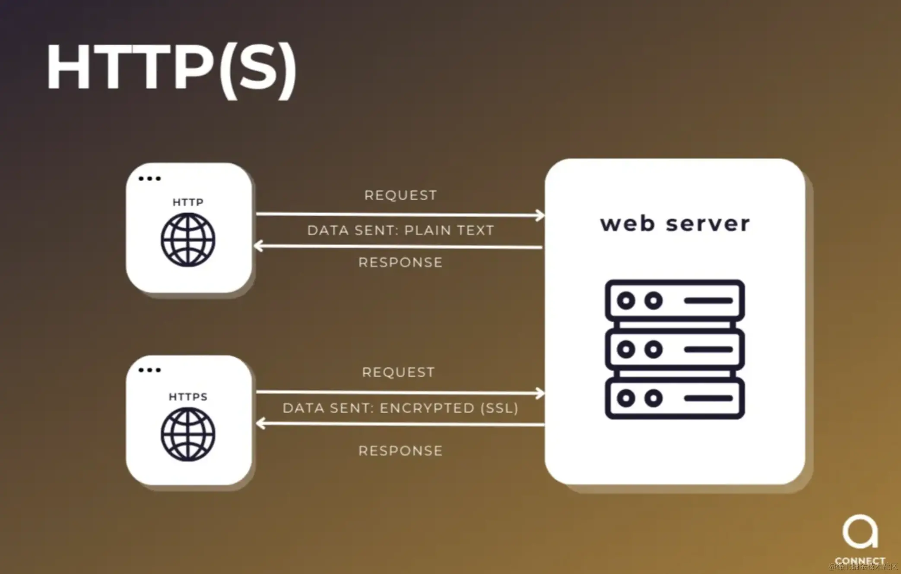
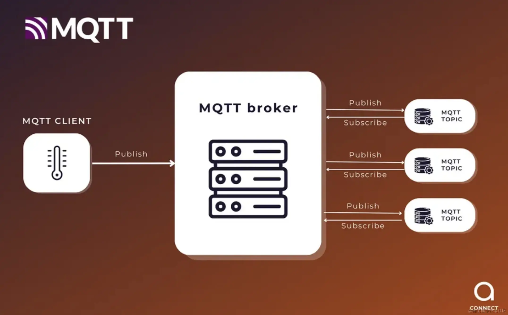

# From Theory to Practice: Efficient Messaging with MQTT in the .NET Framework

## Introduction

In today’s interconnected world, efficient and reliable communication between devices is critical. MQTT (Message Queuing Telemetry Transport) is a lightweight messaging protocol designed for this purpose. In this article, we’ll explore what MQTT is, its benefits, and how to set up and implement it in the .NET framework. By the end, you’ll have a clear understanding of MQTT and a practical example to help you get started.

## 1. What is MQTT?

**Definition and Overview**:  
MQTT stands for Message Queuing Telemetry Transport. It is a lightweight publish-subscribe network protocol used for transmitting messages between devices. It is particularly suited for remote connections with minimal code footprint or limited network bandwidth. Learn more on the [HiveMQ blog](https://hivemq.com/blog/mqtt-vs-http-protocols-in-iot-iiot/).

**Advantages of MQTT**:

- **Low Bandwidth Usage**: MQTT is designed to minimize network bandwidth, making it ideal for resource-constrained environments.
- **Efficient Messaging**: It ensures reliable message delivery through various Quality of Service (QoS) levels.
- **Scalability**: Suitable for implementations ranging from small-scale to large-scale, seamlessly handling thousands of devices.
- **Ease of Use**: Simple to implement and integrates with various platforms.

**Comparison with Traditional Methods**:

  
  

- **Without MQTT**: Traditional communication methods like HTTP are heavier and less efficient, especially for IoT applications.
- **With MQTT**: Provides a lightweight, efficient, and reliable messaging mechanism, improving performance and reducing latency.

---

## 2. Setting Up MQTT in .NET Framework

**Step-by-Step Guide**:

### Installing the MQTT Package

1. Open your .NET project in Visual Studio.
2. Right-click the project in the Solution Explorer and select **Manage NuGet Packages**.
3. Search for and install the **M2Mqtt** package.

### Writing the MQTT Client Code

Create a new class to handle MQTT client operations. Initialize the MQTT client, configure connection options, and connect to the broker.

```csharp
using System;
using System.Collections.Generic;
using System.Diagnostics;
using System.Text;
using System.Threading.Tasks;
using uPLibrary.Networking.M2Mqtt;
using uPLibrary.Networking.M2Mqtt.Exceptions;
using uPLibrary.Networking.M2Mqtt.Messages;

namespace MQTT
{
    public class MqttManager
    {
        #region Observer Pattern
        private HashSet<string> topics = new HashSet<string>();
        private HashSet<IMqttListener> listeners = new HashSet<IMqttListener>();
        private readonly ushort keepAlivePeriod = 30;

        private readonly string BrokerIp;
        private readonly int? BrokerPort = null;
        private string clientId;

        private string Username = null;
        private string Password = null;

        private MqttClient mqttClient;

        public MqttManager(string brokerIp, int? brokerPort = null, string username = null, string password = null)
        {
            BrokerIp = brokerIp;
            BrokerPort = brokerPort;
            Username = username;
            Password = password;

            clientId = RandomClientId();
            Debug.WriteLine($"mqttClient clientId: {clientId}");

            InitMQTT();
        }

        public void Register(string topic, IMqttListener listener)
        {
            if (!topics.Contains(topic))
            {
                Subscribe(topic);
            }

            listeners.Add(listener);
        }

        public void UnRegister(IMqttListener listener)
        {
            listeners.Remove(listener);
        }

        public void NotifyListeners(string topic, string message)
        {
            foreach (IMqttListener listener in listeners)
            {
                listener.OnMqttMessage(topic, message);
            }
        }

        #endregion

        #region Initializing MQTT        

        private async void InitMQTT()
        {
            Debug.WriteLine($"mqttClient.Try connecting to brokerIp: {BrokerIp}");
            mqttClient = new MqttClient(BrokerIp);
            mqttClient.MqttMsgPublishReceived += (sender, e) =>
            {
                string topic = e.Topic;
                string message = Encoding.UTF8.GetString(e.Message);

                Debug.WriteLine($"mqttClient.MessageReceived. {topic} -> {message}");

                NotifyListeners(topic, message);
            };

            var connectToBroker = new Func<Task>(() =>
            {
                return Task.Run(() =>
                {
                    byte resultCode = mqttClient.Connect(clientId, Username, Password, true, keepAlivePeriod);

                    if (resultCode == 0)
                    {
                        foreach (var topic in topics)
                        {
                            Subscribe(topic);
                        }
                    }
                });
            });

            mqttClient.ConnectionClosed += async (s, e) =>
            {
                await Task.Delay(TimeSpan.FromSeconds(5));

                while (!mqttClient.IsConnected)
                {
                    try
                    {
                        await connectToBroker();
                    }
                    catch (Exception ex)
                    {
                        Console.WriteLine($"An error occurred: {ex.Message}");
                        await Task.Delay(TimeSpan.FromSeconds(5));
                    }
                }
            };

            while (!mqttClient.IsConnected)
            {
                try
                {
                    await connectToBroker();
                }
                catch (Exception ex)
                {
                    Console.WriteLine($"An error occurred: {ex.Message}");
                    await Task.Delay(TimeSpan.FromSeconds(5));
                }
            }

            Console.WriteLine("Connected to Broker Successfully!");
        }

        private void Subscribe(string topic)
        {
            Debug.WriteLine($"mqttClient.TryToSubscribe -> {topic}");
            mqttClient.Subscribe(new string[] { topic }, new byte[] { MqttMsgBase.QOS_LEVEL_AT_MOST_ONCE });
            topics.Add(topic);
        }

        private string RandomClientId()
        {
            return $"Server-{Guid.NewGuid()}";
        }
        #endregion
    }

    public interface IMqttListener
    {
        void OnMqttMessage(string topic, string message);
    }
}
```

---

### Implementation

The above code snippet provides a robust implementation for an MQTT client. It demonstrates how to handle:

- Connecting to the MQTT broker.
- Subscribing to topics dynamically.
- Notifying registered listeners when messages are received.

This framework can be expanded to suit specific use cases such as IoT applications, message analytics, or real-time monitoring systems.

---

## 3. Example Implementation: Handling Messages

**Scenario**: Implement an MQTT client that subscribes to a topic and processes incoming messages.

**Detailed Steps**:

- **Subscribe to a Topic**: Modify the client code to subscribe to a specific topic.  
- **Handle Incoming Messages**: Use an event handler to process incoming messages.

```csharp
public class BoostMqtt : Singleton<BoostMqtt>, IMqttListener
{
    public readonly MqttManager MqttManager;
    private const string TOPIC = "example_topic";
    public static ConcurrentQueue<MqttMessage> MqttMessageQueue = new ConcurrentQueue<MqttMessage>();

    private BoostMqtt()
    {
        string brokerIp = GetBrokerIp();
        int? brokerPort = GetBrokerPort();
        (string username, string password) = GetUsernamePassword();

        MqttManager = new MqttManager(brokerIp, brokerPort, username, password);
        MqttManager.Register(TOPIC, this);

        StartProcessingMqttMessagesFromQueue();
    }

    ~BoostMqtt()
    {
        MqttManager?.UnRegister(this);
    }

    private string GetBrokerIp()
    {
        try
        {
            return ConfigurationManager.AppSettings["MqttBrokerIpAddress"];
        }
        catch (Exception e)
        {
            Logging.Instance.WriteErrorToLog(e);
            return string.Empty;
        }
    }

    private int? GetBrokerPort()
    {
        try
        {
            if (int.TryParse(ConfigurationManager.AppSettings["MqttBrokerPort"], out int port))
            {
                return port;
            }
        }
        catch (Exception e)
        {
            Logging.Instance.WriteErrorToLog(e);
        }
        return null;
    }

    private (string, string) GetUsernamePassword()
    {
        try
        {
            string username = ConfigurationManager.AppSettings["MqttUsername"];
            string password = ConfigurationManager.AppSettings["MqttPassword"];
            return (username, password);
        }
        catch (Exception e)
        {
            Logging.Instance.WriteErrorToLog(e);
            return (null, null);
        }
    }

    public void StartProcessingMqttMessagesFromQueue()
    {
        int numThreads = Environment.ProcessorCount;

        for (int i = 0; i < numThreads; i++)
        {
            var thread = new Thread(() =>
            {
                while (true)
                {
                    try
                    {
                        if (MqttMessageQueue.TryDequeue(out MqttMessage message))
                        {
                            ProcessMqttMessage(message.Topic, message.Message);
                        }
                    }
                    catch (Exception e)
                    {
                        Logging.Instance.WriteErrorToLog(e);
                    }
                    Thread.Sleep(1);
                }
            });
            thread.Start();
        }
    }

    public void ProcessMqttMessage(string topic, string original_message)
    {
        if (topic.Contains("example_topic"))
        {
            // Handle the message here
        }
    }
}
```

---

## Comparison of HiveMQ, RabbitMQ, Kafka, and MQTT

| Feature       | HiveMQ                      | RabbitMQ           | Kafka           | MQTT            |
| ------------- | --------------------------- | ------------------ | --------------- | --------------- |
| **Optimization** | Optimized for IoT with extensive monitoring and management | Flexibility with multiple protocols and complex routing | High throughput, real-time data processing | Low-bandwidth, high-latency environments |
| **Ideal Use Case** | Large-scale IoT deployments           | Enterprise messaging and microservices architectures | Big data and event-stream applications | IoT and mobile applications |

**Key Takeaways**:

- **HiveMQ**: Optimized for IoT with extensive monitoring and management features, ideal for large-scale industrial and commercial IoT deployments.
- **RabbitMQ**: Offers flexibility with multiple protocols and complex routing capabilities, making it suitable for enterprise messaging and microservices architectures.
- **Kafka**: Excels in high throughput and real-time data processing, perfect for big data and event-stream applications.
- **MQTT**: Lightweight and efficient, designed for low-bandwidth, high-latency environments, making it ideal for IoT and mobile applications.

---

## Conclusion

In this article, we introduced the fundamentals of MQTT, its benefits, and demonstrated how to set up and implement it in the .NET framework. We also showcased a practical example of using MQTT to handle messages. By leveraging MQTT’s lightweight and efficient protocol, you can significantly enhance communication between devices in your applications. Ready to implement MQTT in your next project? Start experimenting today!
