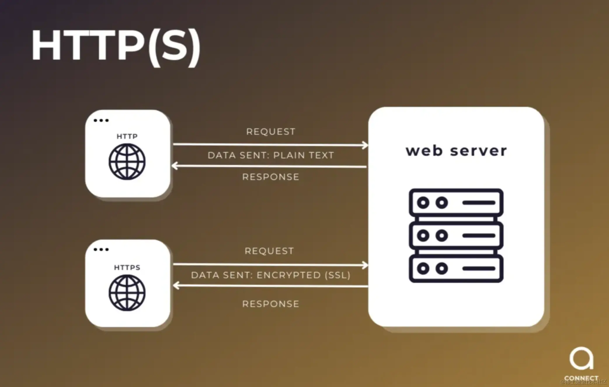

# 从理论到实践：.NET 框架中的 MQTT 高效消息传递

## 介绍

在当今互联的世界中，设备之间高效且可靠的通信至关重要。MQTT（消息队列遥测传输）是一种为此目的设计的轻量级消息传输协议。在本文中，我们将探讨什么是MQTT，它的好处，以及如何在.NET框架中进行设置和实现。通过阅读本文，您将对MQTT有一个清晰的了解，并且能够通过一个实际的示例帮助您入门。

## 1. 什么是MQTT？

**定义与概述**： MQTT代表消息队列遥测传输。它是一种轻量级的发布-订阅网络协议，用于在设备之间传输消息。它特别适用于需要小代码占用或网络带宽有限的远程连接。了解更多信息，请访问[HiveMQ的博客](https://hivemq.com/blog/mqtt-vs-http-protocols-in-iot-iiot/)。

**MQTT的优势**：

- **低带宽使用**：MQTT旨在最小化网络带宽的使用，使其非常适合资源受限的环境。
- **高效的消息传递**：它通过不同的服务质量（QoS）级别确保可靠的消息传递。
- **可扩展性**：适用于从小型到大规模的实现，能够无缝处理数千个设备。
- **易用性**：简单易实现，并且能够与各种平台集成。

**与传统方法的比较**：




- **没有MQTT**：传统的通信方法如HTTP较重且效率较低，特别是对于物联网应用。
- **使用MQTT**：提供了一种轻量、高效且可靠的消息传递机制，改善了性能并减少了延迟。

---

## 2. 在.NET框架中设置MQTT

**逐步指南**：

**安装MQTT包**：

1. 在Visual Studio中打开您的.NET项目。
2. 右键点击解决方案资源管理器中的项目并选择“管理NuGet程序包”。
3. 搜索并安装M2Mqtt包。

**编写MQTT客户端代码**： 创建一个新类来处理MQTT客户端操作。初始化MQTT客户端，配置连接选项并连接到代理服务器。

```csharp
using System;
using System.Collections.Generic;
using System.Diagnostics;
using System.Text;
using System.Threading.Tasks;
using uPLibrary.Networking.M2Mqtt;
using uPLibrary.Networking.M2Mqtt.Exceptions;
using uPLibrary.Networking.M2Mqtt.Messages;

namespace MQTT
{
    public class MqttManager
    {
        #region 观察者模式
        private HashSet<string> topics = new HashSet<string>();
        private HashSet<IMqttListener> listeners = new HashSet<IMqttListener>();
        private readonly ushort keepAlivePeriod = 30;

        private readonly string BrokerIp;
        private readonly int? BrokerPort = null;
        private string clientId;

        private string Username = null;
        private string Password = null;

        private MqttClient mqttClient;

        public MqttManager(string brokerIp, int? brokerPort = null, string username = null, string password = null)
        {
            BrokerIp = brokerIp;
            BrokerPort = brokerPort;
            Username = username;
            Password = password;

            clientId = RandomClientId();
            Debug.WriteLine($"mqttClient clientId: {clientId}");

            InitMQTT();
        }

        public void Register(string topic, IMqttListener listener)
        {
            if (!topics.Contains(topic))
            {
                Subscribe(topic);
            }

            listeners.Add(listener);
        }

        public void UnRegister(IMqttListener listener)
        {
            listeners.Remove(listener);
        }

        public void NotifyListeners(string topic, string message)
        {
            foreach (IMqttListener listener in listeners)
            {
                listener.OnMqttMessage(topic, message);
            }
        }

        #endregion

        #region 初始化Mqtt        

        async private void InitMQTT()
        {
            Debug.WriteLine($"mqttClient.Try connecting to brokerIp: {BrokerIp}");
            mqttClient = new MqttClient(BrokerIp);
            mqttClient.MqttMsgPublishReceived += (sender, e) =>
            {
                string topic = e.Topic;
                string message = Encoding.UTF8.GetString(e.Message);

                Debug.WriteLine($"mqttClient.MessageReceived. {topic} -> {message}");

                NotifyListeners(topic, message);
            };

            var connectToBroker = new Func<Task>(() =>
            {
                return Task.Run(() =>
                {
                    byte resultCode = mqttClient.Connect(clientId, Username, Password, true, keepAlivePeriod);

                    if (resultCode == 0)
                    {
                        foreach (var topic in topics)
                        {
                            Subscribe(topic);
                        }
                    }
                });
            });

            mqttClient.ConnectionClosed += async (s, e) =>
            {
                await Task.Delay(TimeSpan.FromSeconds(5));

                while (!mqttClient.IsConnected)
                {
                    try
                    {
                        await connectToBroker();
                    }
                    catch (Exception ex)
                    {
                        Console.WriteLine($"An error occurred: {ex.Message}");
                        await Task.Delay(TimeSpan.FromSeconds(5));
                    }
                }
            };

            while (!mqttClient.IsConnected)
            {
                try
                {
                    await connectToBroker();
                }
                catch (Exception ex)
                {
                    Console.WriteLine($"An error occurred: {ex.Message}");
                    await Task.Delay(TimeSpan.FromSeconds(5));
                }
            }

            Console.WriteLine("Connected to Broker Successfully!");
        }

        async private void Subscribe(string topic)
        {
            Debug.WriteLine($"mqttClient.TryToSubscribe -> {topic}");
            mqttClient.Subscribe(new string[] { topic }, new byte[] { MqttMsgBase.QOS_LEVEL_AT_MOST_ONCE });
            topics.Add(topic);
        }

        private string RandomClientId()
        {
            return $"Server-{Guid.NewGuid()}";
        }
    }

    public interface IMqttListener
    {
        void OnMqttMessage(string topic, string message);
    }
}
```

---

## 3. 示例实现：处理消息

**场景**： 实现一个MQTT客户端，订阅一个主题并处理传入的消息。

**详细步骤**：

- **订阅主题**：修改客户端代码以订阅特定主题。
- **处理传入消息**：使用事件处理程序处理传入消息。

```csharp
public class BoostMqtt : Singleton<BoostMqtt>, IMqttListener
{
    public readonly MqttManager MqttManager;
    private const string TOPIC = "example_topic";
    public static ConcurrentQueue<MqttMessage> MqttMessageQueue = new ConcurrentQueue<MqttMessage>();

    private BoostMqtt()
    {
        string brokerIp = GetBrokerIp();
        int? brokerPort = GetBrokerPort();
        (string username, string password) = GetUsernamePassword();

        MqttManager = new MqttManager(brokerIp, brokerPort, username, password);
        MqttManager.Register(TOPIC, this);

        StartProcessingMqttMessagesFromQueue();
    }

    ~BoostMqtt()
    {
        MqttManager?.UnRegister(this);
    }

    private string GetBrokerIp()
    {
        try
        {
            return ConfigurationManager.AppSettings["MqttBrokerIpAddress"];
        }
        catch (Exception e)
        {
            Logging.Instance.WriteErrorToLog(e);
            return string.Empty;
        }
    }

    private int? GetBrokerPort()
    {
        try
        {
            if (int.TryParse(ConfigurationManager.AppSettings["MqttBrokerPort"], out int port))
            {
                return port;
            }
        }
        catch (Exception e)
        {
            Logging.Instance.WriteErrorToLog(e);
        }
        return null;
    }

    private (string, string) GetUsernamePassword()
    {
        try
        {
            string username = ConfigurationManager.AppSettings["MqttUsername"];
            string password = ConfigurationManager.AppSettings["MqttPassword"];
            return (username, password);
        }
        catch (Exception e)
        {
            Logging.Instance.WriteErrorToLog(e);
            return (null, null);
        }
    }

    public void StartProcessingMqttMessagesFromQueue()
    {
        int numThreads = Environment.ProcessorCount;

        for (int i = 0; i < numThreads; i++)
        {
            var thread = new Thread(() =>
            {
                while (true)
                {
                    try
                    {
                        if (MqttMessageQueue.TryDequeue(out MqttMessage message))
                        {
                            ProcessMqttMessage(message.Topic, message.Message);
                        }
                    }
                    catch (Exception e)
                    {
                        Logging.Instance.WriteErrorToLog(e);
                    }
                    Thread.Sleep(1);
                }
            });
            thread.Start();
        }
    }

    public void ProcessMqttMessage(string topic, string original_message)
    {
        if (topic.Contains("example_topic"))
        {
            // 在这里处理消息
        }
    }
}

```

---

## 比较HiveMQ、RabbitMQ、Kafka和MQTT

| 特性       | HiveMQ                 | RabbitMQ          | Kafka       | MQTT      |
| -------- | ---------------------- | ----------------- | ----------- | --------- |
| **优化**   | 针对物联网进行优化，具有广泛的监控和管理功能 | 提供多种协议和复杂路由功能的灵活性 | 高吞吐量、实时数据处理 | 低带宽、高延迟环境 |
| **理想用途** | 大规模物联网部署               | 企业消息传递和微服务架构      | 大数据和事件流应用   | 物联网和移动应用  |

**关键要点**：

- **HiveMQ**：针对物联网进行优化，具有广泛的监控和管理功能，非常适合大规模工业和商业物联网部署。
- **RabbitMQ**：提供多种协议和复杂路由功能的灵活性，适用于企业消息传递和微服务架构。
- **Kafka**：在高吞吐量、实时数据处理方面表现出色，适用于大数据和事件流应用。
- **MQTT**：轻量且高效，适用于低带宽、高延迟环境，非常适合物联网和移动应用。

---

## 结论

在本文中，我们介绍了MQTT的基础知识及其优势，并讲解了如何在.NET框架中进行设置和实现。我们还通过一个实际示例展示了如何使用MQTT处理消息。通过利用MQTT轻量且高效的协议，您可以显著提高应用中设备之间的通信效率。准备好在您的下一个项目中实现MQTT了吗？开始尝试吧！
