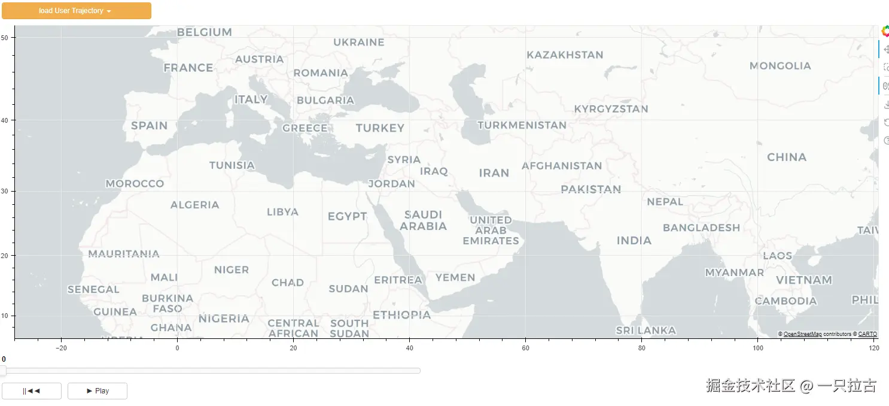
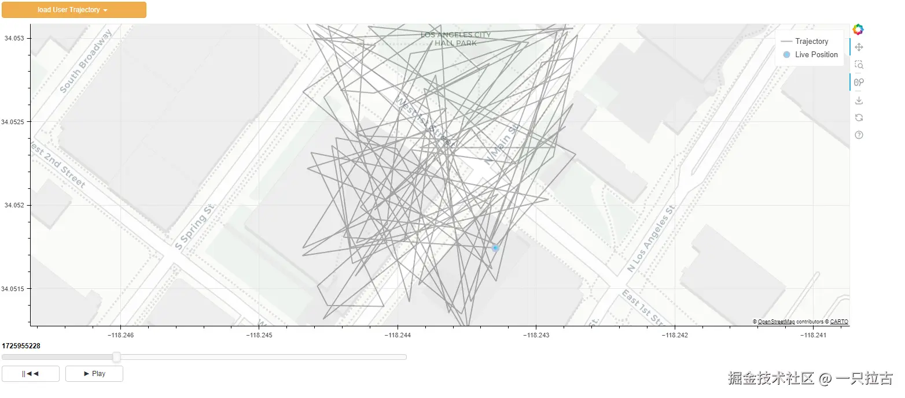

# Building Interactive Web Applications with Bokeh: A Hands-On Guide

Building interactive web applications might seem a bit daunting, but with [Bokeh](https://bokeh.org/), you can easily create dynamic, data-driven apps using Python! In this tutorial, I'll guide you step-by-step to build an interactive web application visualizing user movement. Our simple application will include:

* **Dropdown menus** to select users,  
* **Map widgets** to display user trajectories and current locations, and  
* **Playback controls** to move forward, backward, and adjust playback speed.  

By the end of this tutorial, you'll have a fully functional interactive web application that leverages Bokeh's widgets, charts, and callbacks. Whether you're new to Bokeh or looking to explore its advanced capabilities, this guide will provide hands-on experience in building interactive data visualizations.

Let's get started!

***

## Setting Up the Environment

To build our interactive Bokeh application, we first need to set up a Python environment and install the necessary packages. We'll use **Pipenv** to manage the virtual environment and dependencies.

Assuming you already have Python installed, if not, make sure to install Python (version 3.12 is recommended).

### Step 1: Install Pipenv

If you don't already have Pipenv installed, you can install it via pip:

```bash
pip install pipenv
```

### Step 2: Create a Virtual Environment

Navigate to your project directory and run the following command to create a new virtual environment:

```bash
pipenv --python 3.12.6
```

### Step 3: Define Dependencies

Next, create a `Pipfile` to manage your project's dependencies. Below is the content of the `Pipfile` for this project:

```toml
[[source]]
url = "https://pypi.org/simple"
verify_ssl = true
name = "pypi"

[packages]
bokeh = "*"
pandas = "*"
numpy = "*"

[dev-packages]

[requires]
python_version = "3.12.6"
```

### Step 4: Install Dependencies

After preparing the `Pipfile`, install the dependencies by running the following command:

```bash
pipenv install
```

This command will create the virtual environment and install all the required packages listed in the `Pipfile`.

***

## Preparing the Data

In this tutorial, we'll use CSV files for simplicity. Each user will have their own CSV file containing timestamped trajectory data. The data will include timestamps (in Unix format) and location coordinates (latitude and longitude).

Here's an example of the CSV file structure:

```csv
timestamp,user_id,latitude,longitude
1694130000,User1,37.7749,-122.4194
1694130001,User1,37.7750,-122.4195
1694130002,User1,37.7751,-122.4196
```

While production applications often use database connections, we'll stick to CSV files to keep things straightforward.

***

## Main Python Code

Now, let's start building the application. We'll set up the widgets and layout. The primary components we need are:

1. **Dropdown menus** to load user data,  
2. **Map widgets** to visualize user trajectories, and  
3. **Playback controls** for interacting with the data.  

Below is an example of the code to set up the widgets:

```python
#region ---------------------- Setting Up Widgets ----------------------
geo_plot = figure(
    height=550,
    width=1500,
    x_range=(-2000000, 2000000), 
    y_range=(1000000, 7000000),
    x_axis_type="mercator", 
    y_axis_type="mercator",
    active_scroll='wheel_zoom'
)

geo_plot.add_tile("CartoDB Positron", retina=True)

# Time Slider
slider_time = Slider(start=0, end=100, value=0, step=1, title="", width=700)

# Playback Controls
button_reset_state = Button(label="||◄◄", button_type="default", width=100)
button_play = Button(label="► Play", button_type="default", width=100)

# User Selection Dropdown
users_menu = ["user1", "user2", "user3"]
dropdown_Users = Dropdown(label="Load User Trajectory", button_type="warning", menu=users_menu, width=250)
#endregion

#region ---------------------- Setting Up Layout and Adding to Document ----------------------
doc_layout = column(
    dropdown_Users,
    geo_plot,
    slider_time, 
    row(button_reset_state, button_play)
)

curdoc().add_root(doc_layout)
curdoc().title = "Trajectory Playback"
#endregion
```



Next, we need to set up the data format and methods to read the data source, reorganizing it into the correct format.

```python
#region ---------------------- Setting Up Data ----------------------
# Coordinate conversion to Web Mercator
def latlon_to_mercator(lat, lon):
    """
    Converts latitude and longitude to Mercator projection coordinates.

    Parameters:
    lat (float): Latitude in degrees.
    lon (float): Longitude in degrees.

    Returns:
    tuple: Mercator projection x and y coordinates (in meters).
    """
    # Constants
    RADIUS = 6378137  # Earth radius (meters, WGS84)
    ORIGIN_SHIFT = 2 * math.pi * RADIUS / 2.0
    
    # Convert latitude and longitude from degrees to radians
    lat_rad = math.radians(lat)
    lon_rad = math.radians(lon)
    
    # Mercator projection formula
    x = lon_rad * RADIUS
    y = math.log(math.tan(math.pi / 4 + lat_rad / 2)) * RADIUS
    
    return (x, y)

# Initialize Data Sources
trajectory = {'x': [], 'y': [], 'unix_s': []} 
live_position_data = ColumnDataSource(data={'x': [], 'y': []})

def loadUserTrajectoryData(event):
    # Load the selected user's CSV file
    user_id = event.item
    user_file = f"Data/{user_id}_trajectory.csv"
    data = pd.read_csv(user_file)
    
    # Clear previous data
    trajectory['x'].clear()
    trajectory['y'].clear()
    
    # Convert latitude/longitude to Mercator for map plotting
    for _, row in data.iterrows():
        lat, lon = row['latitude'], row['longitude']
        merc_x, merc_y = latlon_to_mercator(lat, lon)
        trajectory['x'].append(merc_x)
        trajectory['y'].append(merc_y)
        trajectory['unix_s'].append(row['timestamp'])
    
    # Initialize Plot
    plot_session_init_data()

def plot_session_init_data():
    # Update ColumnDataSource with initial data
    live_position_data.data = {'x': trajectory['x'], 'y': trajectory['y']}
    geo_plot.line(trajectory['x'], trajectory['y'], line_width=2, color="black", line_alpha=0.3, legend_label='Trajectory')
    zoom_to_trajectory()

    # Set initial user position (first point)
    if trajectory['x'] and trajectory['y']:
        live_position_data.data = {'x': [trajectory['x'][0]], 'y': [trajectory['y'][0]]}
        geo_plot.scatter(x="x", y="y", size=10, fill_color="deepskyblue", fill_alpha=0.6, line_color="lightsteelblue", line_width=4,
                                source=live_position_data, level='overlay', name='fusedPos', legend_label='Live Position')

def zoom_to_trajectory():
    buff = 200
    aspectRatio = 550 / 1500

    # Calculate trajectory bounds (min and max values)
    min_x, max_x = min(trajectory['x']), max(trajectory['x'])
    min_y, max_y = min(trajectory['y']), max(trajectory['y'])
    xRange = abs(max_x - min_x)
    yRange = abs(max_y - min_y)
    map_range = max(xRange, yRange) / 2.0
        
    centerX = (min_x + max_x) / 2
    centerY = (min_y + max_y) / 2
    
    # Set plot x_range and y_range to zoom into trajectory
    geo_plot.x_range.start = centerX - map_range - buff
    geo_plot.x_range.end = centerX + map_range + buff
    geo_plot.y_range.start = centerY - (map_range + buff) * aspectRatio
    geo_plot.y_range.end = centerY + (map_range  + buff) * aspectRatio

#endregion
```

At this stage, you should be able to select a user and view their trajectory.

Finally, let's add callbacks to make the slider and playback functionalities work.

```python
#region ---------------------- Setting Up Callbacks ----------------------
def reset_state():
    global state
    state = slider_time.value
    state = min(trajectory['unix_s'])
    slider_time.value = state

waitTime = 200
def animate():
    global callback_id, state
    cur_time = time.time() * 1000
    time_step = slider_time.value * waitTime
    if slider_time.value < len(trajectory['unix_s']):
        slider_time.value += 1

        # Update user position
        state = trajectory['unix_s'][slider_time.value]
        cur_x = trajectory['x'][slider_time.value]
        cur_y = trajectory['y'][slider_time.value]

        # Update plot
        live_position_data.data = {'x': [cur_x], 'y': [cur_y]}
    else:
        # Reset playback
        slider_time.value = 0
        button_play.label = '► Play'
        curdoc().remove_periodic_callback(callback_id)
        callback_id = None

def update_time_slider():
    if button_play.label == '► Play':
        button_play.label = '⏸️ Pause'
        callback_id = curdoc().add_periodic_callback(animate, waitTime)
    else:
        button_play.label = '► Play'
        curdoc().remove_periodic_callback(callback_id)
        callback_id = None

# Bind Callbacks
dropdown_Users.on_click(loadUserTrajectoryData)
button_reset_state.on_click(reset_state)
button_play.on_click(update_time_slider)

#endregion
```

With these steps completed, you should have a fully functional interactive Bokeh application.



***

## Running the Application

Save the code into a file, such as `TrajectoryDataVis.py`, and run the following command:

```bash
pipenv run bokeh serve --show TrajectoryDataVis.py
```

This will start the Bokeh server, open your default web browser, and display the interactive web application.

***

## Conclusion

Congratulations on completing this tutorial! By following these steps, you've learned how to build an interactive web application using Bokeh, focusing on responsive data visualization.

The core concept is similar to frameworks like ReactJS: managing the state of your data. In this tutorial, we focused on three key states:

1. **Trajectory Data**: Updated when new user data is loaded.  
2. **Current Time**: Adjusted during playback to reflect the current time point.  
3. **Live Position**: Continuously updated over time to display the user's current position.  

Armed with these principles, Bokeh allows you to create dynamic and responsive visualizations. I hope you found this tutorial both fun and insightful. You can use Bokeh to add even cooler features and build more robust dashboards. To explore further, I encourage you to dive into the [official Bokeh documentation](https://bokeh.org/) for more examples and learn how to customize and extend your interactive dashboards.

Happy coding!
