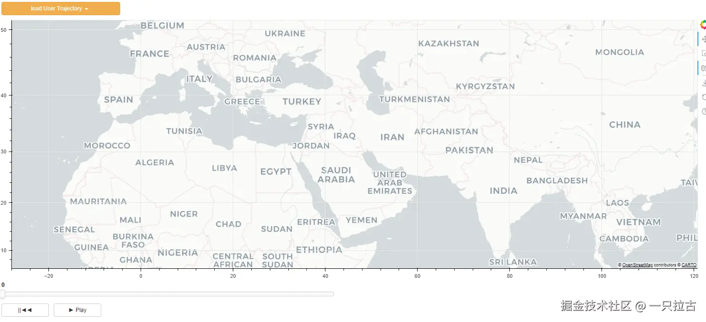
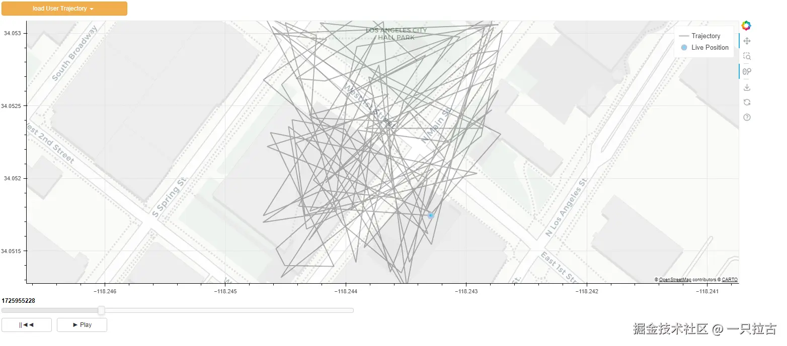

# 使用 Bokeh 构建交互式 Web 应用：实战指南

构建交互式 web 应用可能看起来有点复杂，但借助 [Bokeh](https://bokeh.org/)，其实我们可以轻松地使用 Python 创建动态的数据驱动应用！在本教程中，我将逐步指导你创建一个可视化用户移动的交互式 web 应用。我们的简单应用将包含：

* **下拉菜单** 用于选择用户，
* **地图小部件** 显示用户的轨迹和当前位置，以及
* **播放控制** 以向前、向后移动并调整播放速度。

通过本教程，你将拥有一个功能齐全的交互式 web 应用，利用 Bokeh 的小部件、图表和回调。无论你是 Bokeh 的新手还是希望探索其高级功能的用户，本教程将为你提供构建交互式数据可视化的实践经验。

让我们开始吧！

***

## 环境设置

要构建我们的交互式 Bokeh 应用，我们首先需要设置一个 Python 环境，并安装必要的包。我们将使用 **Pipenv** 进行虚拟环境和依赖管理。

假设你已经安装了 Python。如果没有，请安装 Python，推荐使用 3.12 版本。

### 第一步：安装 Pipenv

如果你还没有安装 Pipenv，可以通过 pip 安装：

```bash
pip install pipenv
```

### 第二步：设置虚拟环境

导航到你的项目目录，并运行以下命令以创建一个新的虚拟环境：

```bash
pipenv --python 3.12.6
```

### 第三步：定义依赖项

接下来，创建一个 `Pipfile` 来管理项目的依赖项。以下是我们项目的 `Pipfile` 内容：

```toml
[[source]]
url = "https://pypi.org/simple"
verify_ssl = true
name = "pypi"

[packages]
bokeh = "*"
pandas = "*"
numpy = "*"

[dev-packages]

[requires]
python_version = "3.12.6"
```

### 第四步：安装依赖项

在 `Pipfile` 文件准备好后，通过运行以下命令安装依赖项：

```bash
pipenv install
```

该命令将创建虚拟环境并安装 `Pipfile` 中指定的所有所需包。

***

## 准备数据

在本教程中，我们将使用 CSV 文件来简化数据处理。每个用户将有自己的 CSV 文件，包含时间戳轨迹数据。数据将包括时间戳（Unix 格式）和位置坐标（纬度和经度）。

以下是 CSV 文件的示例结构：

```csv
timestamp,user_id,latitude,longitude
1694130000,User1,37.7749,-122.4194
1694130001,User1,37.7750,-122.4195
1694130002,User1,37.7751,-122.4196
```

虽然在生产应用中更常使用数据库连接，但为了简化教程，我们将使用 CSV 文件。

***

## 主要 Python 代码

现在，让我们开始构建应用。我们将设置小部件和布局。我们需要的主要组件是：

1. **下拉菜单** 用于加载用户数据，
2. **地图小部件** 用于可视化用户的轨迹，以及
3. **播放控制** 用于与数据互动。

以下是设置小部件的示例代码：

```python
#region ---------------------- 设置小部件 ----------------------
geo_plot = figure(
    height=550,
    width=1500,
    x_range=(-2000000, 2000000), 
    y_range=(1000000, 7000000),
    x_axis_type="mercator", 
    y_axis_type="mercator",
    active_scroll='wheel_zoom'
)

geo_plot.add_tile("CartoDB Positron", retina=True)

# 时间滑块
slider_time = Slider(start=0, end=100, value=0, step=1, title="", width=700)

# 播放控制
button_reset_state = Button(label="||◄◄", button_type="default", width=100)
button_play = Button(label="► Play", button_type="default", width=100)

# 用户选择下拉菜单
users_menu = ["user1", "user2", "user3"]
dropdown_Users = Dropdown(label="加载用户轨迹", button_type="warning", menu=users_menu, width=250)
#endregion

#region ---------------------- 设置布局并添加到文档 ----------------------
doc_layout = column(
    dropdown_Users,
    geo_plot,
    slider_time, 
    row(button_reset_state, button_play)
)

curdoc().add_root(doc_layout)
curdoc().title = "播放轨迹数据"
#endregion
```



接下来，我们需要设置数据格式和读取数据源的方法，并将数据重新组织成正确的格式。

```python
#region ---------------------- 设置数据 ----------------------
# 坐标转换为 Web Mercator
def latlon_to_mercator(lat, lon):
    """
    将纬度和经度转换为 Mercator 投影坐标。

    参数：
    lat (float): 纬度（度）。
    lon (float): 经度（度）。

    返回：
    tuple: Mercator 投影的 x 和 y 坐标（米）。
    """
    # 常量
    RADIUS = 6378137  # 地球半径（米，WGS84）
    ORIGIN_SHIFT = 2 * math.pi * RADIUS / 2.0
    
    # 将纬度和经度从度转换为弧度
    lat_rad = math.radians(lat)
    lon_rad = math.radians(lon)
    
    # Mercator 投影公式
    x = lon_rad * RADIUS
    y = math.log(math.tan(math.pi / 4 + lat_rad / 2)) * RADIUS
    
    return (x, y)

# 初始化数据源
trajectory = {'x': [], 'y': [], 'unix_s': []} 
live_position_data = ColumnDataSource(data={'x': [], 'y': []})

def loadUserTrajectoryData(event):
    # 加载所选用户的 CSV 文件
    user_id = event.item
    user_file = f"Data/{user_id}_trajectory.csv"
    data = pd.read_csv(user_file)
    
    # 清除之前的数据
    trajectory['x'].clear()
    trajectory['y'].clear()
    
    # 将纬度/经度转换为 Mercator 以用于地图绘制
    for _, row in data.iterrows():
        lat, lon = row['latitude'], row['longitude']
        merc_x, merc_y = latlon_to_mercator(lat, lon)
        trajectory['x'].append(merc_x)
        trajectory['y'].append(merc_y)
        trajectory['unix_s'].append(row['timestamp'])
    
    # 初始化图表
    plot_session_init_data()

def plot_session_init_data():
    # 使用初始数据更新 ColumnDataSource
    live_position_data.data = {'x': trajectory['x'], 'y': trajectory['y']}
    geo_plot.line(trajectory['x'], trajectory['y'], line_width=2, color="black", line_alpha=0.3, legend_label='轨迹')
    zoom_to_trajectory()

    # 设置用户的初始位置（第一个点）
    if trajectory['x'] and trajectory['y']:
        live_position_data.data = {'x': [trajectory['x'][0]], 'y': [trajectory['y'][0]]}
        geo_plot.scatter(x="x", y="y", size=10, fill_color="deepskyblue", fill_alpha=0.6, line_color="lightsteelblue", line_width=4,
                                source=live_position_data, level='overlay', name='fusedPos', legend_label='实时位置')

def zoom_to_trajectory():
    buff = 200
    aspectRatio = 550 / 1500

    # 计算轨迹的边界（最小值和最大值）
    min_x, max_x = min(trajectory['x']), max(trajectory['x'])
    min_y, max_y = min(trajectory['y']), max(trajectory['y'])
    xRange = abs(max_x - min_x)
    yRange = abs(max_y - min_y)
    map_range = max(xRange, yRange) / 2.0
        
    centerX = (min_x + max_x) / 2
    centerY = (min_y + max_y) / 2
    
    # 设置图表的 x_range 和 y_range 以缩放到轨迹
    geo_plot.x_range.start = centerX - map_range - buff
    geo_plot.x_range.end = centerX + map_range + buff
    geo_plot.y_range.start = centerY - (map_range + buff) * aspectRatio
    geo_plot.y_range.end = centerY + (map_range  + buff) * aspectRatio

#endregion
```

到目前为止，你应该能够选择用户并查看其轨迹。

最后，我们需要添加回调，使滑块和播放功能能够正常工作。

```python
#region ---------------------- 设置回调 ----------------------
def reset_state():
    global state
    state = slider_time.value
    state = min(trajectory['unix_s'])
    slider_time.value = state

waitTime = 200
def animate():
    global callback_id, state
   

 cur_time = time.time() * 1000
    time_step = slider_time.value * waitTime
    if slider_time.value < len(trajectory['unix_s']):
        slider_time.value += 1

        # 更新用户位置
        state = trajectory['unix_s'][slider_time.value]
        cur_x = trajectory['x'][slider_time.value]
        cur_y = trajectory['y'][slider_time.value]

        # 更新图表
        live_position_data.data = {'x': [cur_x], 'y': [cur_y]}
    else:
        # 重置播放
        slider_time.value = 0
        button_play.label = '► Play'
        curdoc().remove_periodic_callback(callback_id)
        callback_id = None

def update_time_slider():
    if button_play.label == '► Play':
        button_play.label = '⏸️ Pause'
        callback_id = curdoc().add_periodic_callback(animate, waitTime)
    else:
        button_play.label = '► Play'
        curdoc().remove_periodic_callback(callback_id)
        callback_id = None

# 绑定回调
dropdown_Users.on_click(loadUserTrajectoryData)
button_reset_state.on_click(reset_state)
button_play.on_click(update_time_slider)

#endregion
```

完成上述步骤后，你应该拥有一个功能完整的交互式 Bokeh 应用。



***

## 运行应用程序

要运行应用程序，请将代码保存到一个文件中，例如 `TrajectoryDataVis.py`，然后使用以下命令：

```bash
pipenv run bokeh serve --show TrajectoryDataVis.py
```

这将启动 Bokeh 服务器，打开默认的 Web 浏览器，并显示交互式 Web 应用程序。

***

## 结论

恭喜你完成了这个教程！通过这些步骤，你已经学习了如何使用 Bokeh 构建交互式 Web 应用，专注于响应式数据可视化。

核心概念类似于 ReactJS 等框架：管理数据的状态。在本教程中，我们关注了三个关键状态：

1. **轨迹数据**：在加载新用户数据时更新。
2. **当前时间**：在播放过程中调整，以反映当前时间点。
3. **实时位置**：随着时间的推移不断更新，显示用户的当前位置。

掌握了这些原则，Bokeh 允许你创建动态和响应式的可视化。我希望你发现这个教程既有趣又富有启发性。你可以使用 Bokeh 添加更多炫酷的功能，以构建更强大的仪表板。为了进一步探索，我鼓励你深入阅读[官方 Bokeh 文档](https://bokeh.org/)，获取更多示例，并发现如何自定义和扩展你的交互式仪表板。

祝编码愉快！
