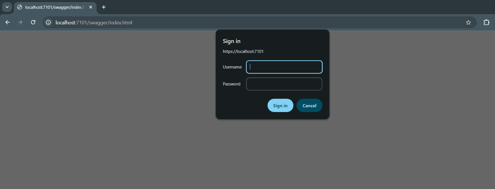
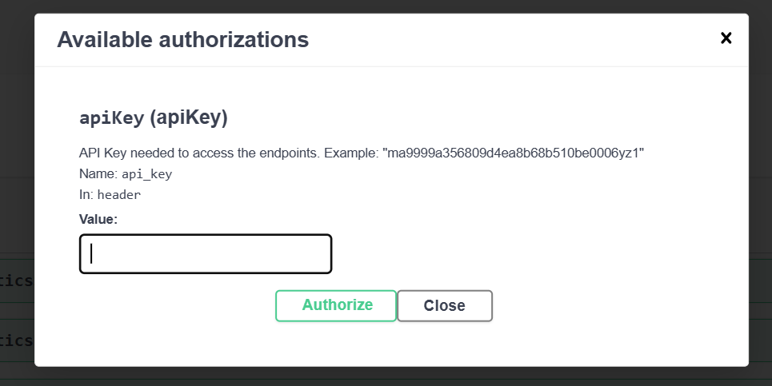

# Locking Down Swagger: Implementing Basic Auth & API Key Security in .NET

## 1. Introduction & Recap

In my previous post, **[Part 1: Automatically Generate Swagger Documentation from a .NET Core Project](06_Swagger_API_Doc.md)**, we covered the basics of integrating Swashbuckle to turn your C# controllers into a beautiful, interactive documentation page. It’s a game-changer for local development, allowing you to test endpoints with a single click at `localhost`.

However, as your project moves out of your local environment and onto a staging or production server, a new challenge arises: **The "Localhost" bubble pops.** 

### The Risk of the Open Map
When you deploy your API, simply moving Swagger to a public URL (e.g., `https://api.yourdomain.com/swagger`) is like leaving a detailed blueprint of your bank’s vault on the front door.

Exposing your raw API schema to the public internet carries significant risks:

* **Attack Surface Mapping:** Hackers don't have to guess your endpoints; Swagger tells them exactly where your sensitive data lives.
* **Information Leakage:** Your internal data models, parameter types, and logic flow become public knowledge.
* **Resource Exhaustion:** Without protection, anyone (or any bot) can use the "Try it out" feature to spam your database with requests.

### Moving Beyond Development Mode

In the default .NET template, you’ll notice that Swagger is wrapped in an `if (app.Environment.IsDevelopment())` block. While this keeps your production server safe by hiding the docs entirely, it’s not helpful when you need to share those docs internally with other departments, frontend teams, or QA testers.

In this post, we are going to bridge that gap. We will walk through how to keep Swagger active in production while adding **two essential layers of security**:

1. **User Credentials (Basic Auth):** A "Front Door" lock that requires a username and password just to view the documentation page.
2. **API Keys:** A "Key Card" system that ensures only authorized users can actually execute the APIs from within the Swagger interface.

Let’s dive into how to secure your documentation without sacrificing its usefulness.

---

## 2. Gating the Documentation (The "Front Door")

### The Goal

The first step in securing a deployed Swagger instance is ensuring that the documentation website itself is not public. We want to prevent unauthorized users, scrapers, and bots from even seeing our API definitions.

### The Solution: HTTP Basic Authentication

To achieve this, we implement a **Custom Middleware** for HTTP Basic Authentication. When a user navigates to the `/swagger` URL, the server will intercept the request and challenge the browser for a username and password before rendering any content.

### Implementation: `SwaggerBasicAuthMiddleware`

Below is the middleware logic. It checks if the request path starts with `/swagger`, looks for an `Authorization` header, and validates the credentials against your configuration.

```csharp
public class SwaggerBasicAuthMiddleware
{
    private readonly RequestDelegate _next;
    public SwaggerBasicAuthMiddleware(RequestDelegate next) => _next = next;

    public async Task InvokeAsync(HttpContext context)
    {
        // Target only the Swagger endpoints
        if (context.Request.Path.StartsWithSegments("/swagger"))
        {
            string authHeader = context.Request.Headers["Authorization"];
            if (authHeader != null && authHeader.StartsWith("Basic "))
            {
                var header = System.Net.Http.Headers.AuthenticationHeaderValue.Parse(authHeader);
                var credentials = System.Text.Encoding.UTF8.GetString(Convert.FromBase64String(header.Parameter)).Split(':');
                var user = credentials[0];
                var password = credentials[1];

                // Validate against your settings (preferably from Environment Variables)
                if (user == "admin" && password == "YourStrongPassword") 
                {
                    await _next(context);
                    return;
                }
            }

            // If unauthorized, send the challenge header to the browser
            context.Response.Headers["WWW-Authenticate"] = "Basic";
            context.Response.StatusCode = 401;
        }
        else
        {
            await _next(context);
        }
    }
}

```

### Understanding the `WWW-Authenticate` Header

The "magic" happens with this line:

`context.Response.Headers["WWW-Authenticate"] = "Basic";`

When a browser receives a `401 Unauthorized` status along with this specific header, it automatically triggers its **native login popup**. This is a lightweight way to add security without building a custom login page or UI.

### Configuration: Registering the Middleware

Order is everything in the .NET Middleware pipeline. To protect Swagger, you must register your custom middleware **before** the Swagger services are called in `Program.cs`.

If you place it after `app.UseSwagger()`, the documentation will load before the security check ever runs!

```csharp
var app = builder.Build();

// 1. Register Basic Auth FIRST to gate the page
app.UseMiddleware<SwaggerBasicAuthMiddleware>();

// 2. Then enable Swagger
app.UseSwagger();
app.UseSwaggerUI();

app.UseHttpsRedirection();
// ... rest of your pipeline

```

  

By adding this layer, you've successfully hidden your API "blueprint" from the public eye.

---

## 3. Authorizing the API Calls (The "Key Card")

### The Goal

Now that the "Front Door" is locked, we have a second challenge: allowing authorized users to actually test the endpoints. Since our production APIs are likely protected by their own security logic, we need a way for Swagger to pass a "Key Card" (an API Key) with every request made through the UI.

### Step A: The Swagger UI Setup

To enable this, we have to tell Swagger that our API expects a security token. This is done inside the `AddSwaggerGen` configuration in `Program.cs`.

We use two specific methods:

1. **`AddSecurityDefinition`**: Defines *how* the security works (e.g., an API Key in the Header).
2. **`AddSecurityRequirement`**: Ensures that the "Lock" icon appears on our endpoints and that the key is actually sent when we click "Execute."

```csharp
builder.Services.AddSwaggerGen(c =>
{
    c.SwaggerDoc("v1", new OpenApiInfo { Title = "My API", Version = "v1" });

    // Define the API Key security scheme
    c.AddSecurityDefinition("apiKey", new OpenApiSecurityScheme
    {
        Description = "Enter your API Key to unlock the endpoints.",
        Name = "api_key",             // The name of the header or query parameter
        In = ParameterLocation.Header, // We'll put ours in the Header
        Type = SecuritySchemeType.ApiKey,
        Scheme = "ApiKeyScheme"
    });

    c.AddSecurityRequirement(new OpenApiSecurityRequirement
    {
        {
            new OpenApiSecurityScheme
            {
                Reference = new OpenApiReference { Type = ReferenceType.SecurityScheme, Id = "apiKey" }
            },
            Array.Empty<string>()
        }
    });
});

```

#### **Header vs. Query: Which should you use?**

* **`ParameterLocation.Header`**: The standard for modern APIs. The key is sent as an HTTP header (e.g., `api_key: your_key_here`). It’s cleaner and doesn’t show up in server logs or browser history.
* **`ParameterLocation.Query`**: The key is appended to the URL (e.g., `?api_key=your_key_here`). This is easier for quick debugging but less secure as the key is visible in the address bar.

---

### The Smart Middleware: `SwaggerApiKeyMiddleware`

Simply adding the button to Swagger isn't enough; the server needs to actually *validate* that key. We use a custom middleware to intercept these calls.

### **The Pro-Tip: The Referer Logic**

A common problem is that we only want this specific API Key check to apply to **people using the Swagger page**. We don't want to break access for Postman users or our mobile app, which might use a completely different authentication system (like JWT).

By checking the **`Referer`** header, we can detect if the request originated from the Swagger UI.

```csharp
public class SwaggerApiKeyMiddleware
{
    private readonly RequestDelegate _next;
    private const string APIKEYNAME = "api_key";

    public SwaggerApiKeyMiddleware(RequestDelegate next) => _next = next;

    public async Task InvokeAsync(HttpContext context)
    {
        string referer = context.Request.Headers["Referer"].ToString();

        // ONLY enforce this check if the request is coming from the Swagger UI
        if (!string.IsNullOrEmpty(referer) && referer.Contains("/swagger"))
        {
            if (!context.Request.Headers.TryGetValue(APIKEYNAME, out var extractedApiKey))
            {
                context.Response.StatusCode = 401;
                await context.Response.WriteAsync("API Key missing. Please use the 'Authorize' button in Swagger.");
                return;
            }

            var actualKey = Environment.GetEnvironmentVariable("SWAGGER_API_KEY");
            if (actualKey == null || !actualKey.Equals(extractedApiKey))
            {
                context.Response.StatusCode = 401;
                await context.Response.WriteAsync("Invalid API Key.");
                return;
            }
        }

        await _next(context);
    }
}

```


  

### Why this is "Smart"

This middleware acts as a **context-aware guard**. If you call the API from Postman, the middleware sees no "Swagger" referer and steps aside, letting your standard API authentication take over. But the moment someone tries to use the "Try it out" button on your public Swagger page, they are hit with the requirement to enter the correct API Key.

It’s the perfect balance between usability for internal teams and security against external curiosity.

---

## 4. Putting it All Together: The Middleware Pipeline

In ASP.NET Core, the order in which you register middleware is just as important as the code itself. If you place your security checks after your endpoints are mapped, the "gate" will be behind the "house."

To ensure our dual-layer security works correctly, your `Program.cs` pipeline should follow this specific sequence:

### The "Order Matters" Breakdown

1. **`app.UseMiddleware<SwaggerBasicAuthMiddleware>()`**: We start here. This ensures that the very first thing the server does when someone hits `/swagger` is challenge them for a username and password.
2. **`app.UseSwagger()` & `app.UseSwaggerUI()**`: Once the user passes Basic Auth, we allow the Swagger engine to generate the JSON documentation and render the UI.
3. **`app.UseRouting()`**: This identifies which controller/action the incoming request is trying to reach.
4. **`app.UseMiddleware<SwaggerApiKeyMiddleware>()`**: Now that routing is established, we check the `Referer`. If the request is coming from the Swagger UI we just loaded, we force the API Key check.
5. **`app.MapControllers()`**: Finally, if all guards are passed, the request is allowed to reach your actual API logic.

### Visualizing the Pipeline

| Order | Component | Purpose |
| --- | --- | --- |
| 1 | **Basic Auth Middleware** | Blocks unauthorized viewing of the documentation "website." |
| 2 | **Swagger Middleware** | Serves the documentation files. |
| 3 | **API Key Middleware** | Blocks unauthorized "Try it out" executions originating from Swagger. |
| 4 | **Endpoint Mapping** | Executes the actual API logic. |

---

## 5. Conclusion

### Defense in Depth

What we have implemented is a classic **"Defense in Depth"** strategy. Instead of relying on a single security measure, we layered our protections:

* **Layer 1** protects your intellectual property and API schema from being indexed or scanned.
* **Layer 2** protects your data and server resources from being misused by unauthorized users who might have gained access to the documentation.

By using the **Referer logic**, we created a "smart" security system that knows when to be strict (for browser-based Swagger users) and when to step aside for other authorized integration tools like Postman or mobile clients.

### When to Use This vs. Full Identity Server/JWT

While this setup is incredibly effective for internal tools, staging environments, or small-to-medium team collaborations, it isn't a replacement for a full-scale Identity Provider (like Keycloak, Auth0, or Microsoft Entra ID) in high-stakes production environments.

* **Use this approach** when you need a quick, robust way to share documentation with other internal groups or trusted partners without the overhead of a full OAuth2 setup.
* **Move to JWT/OpenID Connect** when your API requires granular user permissions (Scopes), multi-factor authentication, or is being consumed by public third-party developers.

Securing Swagger doesn't have to mean hiding it. With a few lines of strategic middleware, you can turn your documentation from a liability into a secure, professional asset for your entire organization.
