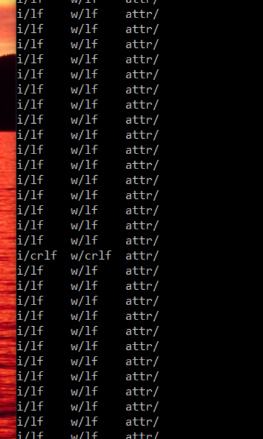

# Stop the Toggle: A Permanent Fix for Annoying Line Endings Issues

## 1. The "Ghost" Diff Problem

We’ve all been there. You just spent three hours crushing a tricky bug or perfectly refactoring a service. You’re feeling like a rockstar. You commit your code, push it up, and open the Pull Request, expecting to see a clean "5 files changed" badge.

Instead, you see it: **Files changed: 54.**

Your heart sinks. You click the "Files changed" tab and scroll through a sea of red and green. But here’s the kicker—as you look closer, the code on the left is exactly the same as the code on the right. Git is screaming that every single line has changed, even though you didn’t touch 90% of them.

This is what I call the **Ghost Diff**. It’s the ultimate PR killer. When your reviewer opens your code, they can’t find your actual logic changes because they’re buried under hundreds of lines of "invisible" updates. It’s frustrating for you, and it’s exhausting for your team. Usually, this ends with a comment like, *"Hey, what happened here? Why did you reformat the whole project?"*

The worst part? You didn't. Your editor did it behind your back.

In my case, I’ve always been a "strictly LF" (Line Feed) developer to keep things compatible with our Linux containers. But after the VS 2026 upgrade, my new changes are CRLF (Carriage Return + Line Feed). Before I knew it, I was checking in files with mixed endings—half the file used the old standard, and the new lines I wrote used the new one.

It’s a mess, it’s annoying, and frankly, we have better things to do than fight with invisible characters. But before we fix it, let’s quickly look at what these characters actually are.

---

## 2. Decoding the Invisible: CR, LF, and CRLF

Before we fix the problem, we need to understand what these "invisible" characters actually are. If you’ve ever opened a file in a basic text editor and seen all the code smashed into one single, endless line, you’ve seen what happens when line endings go wrong.

Back in the day, different operating systems couldn't agree on how to tell a computer, "Okay, this line is done; move to the next one."

* **LF (`\n`):** Stands for **Line Feed**. This is the standard for Linux and macOS. It’s lean, simple, and generally what the modern web runs on.
* **CRLF (`\r\n`):** Stands for **Carriage Return + Line Feed**. This is the classic Windows way of doing things. It’s a bit of a holdover from the days of physical typewriters where you had to physically slide the carriage back (CR) and then roll the paper up (LF).
* **CR (`\r`):** Just the **Carriage Return**. You’ll rarely see this unless you’re working on legacy Apple systems from the 90s.

### Why this matters for C# Developers

You might think, *"I’m a C# developer, I work on Windows, why should I care?"* In the modern .NET world, our code doesn't stay on Windows anymore. We write in Visual Studio on our PCs, but our CI/CD pipelines often run on Linux agents, and our apps usually get packed into **Linux-based Docker containers**.

If your Windows machine is slapping `\r\n` on every line, but your Linux container is expecting `\n`, you can run into some really weird bugs—especially with shell scripts or configuration files. Even if it doesn't break the app, it definitely breaks your **Git history**. When one developer uses LF and the next uses CRLF, Git sees two completely different files.

The goal is to pick a standard—usually **LF**—and make sure everyone (and every IDE) sticks to it.

---

## 3. The Audit: Which Files are the Culprits?

Before we start swinging the "fix-it" hammer, we need to know the scale of the damage. If you have a massive solution with hundreds of projects, opening every file to check its properties is a nightmare. Instead, we can use the command line to get a bird's-eye view of exactly which files are using which line endings.

### Using Git to see the "Truth"

Git actually has a built-in tool that shows you exactly how it’s perceiving your files. Open your terminal (PowerShell or Git Bash) in your project root and run:

```bash
git ls-files --eol

```

The output might look a bit cryptic at first, but it’s actually very logical. You’ll see columns like this:
`i/lf    w/crlf  attr/text=auto  src/Program.cs`

* **The 1st column (`i/...`):** This is what is currently **committed** to your Git index.
* **The 2nd column (`w/...`):** This is what is currently in your **working directory** (on your actual hard drive).
* **The 3rd column:** Shows any attributes (like `.gitattributes`) currently affecting that file.

If you see `i/lf` but `w/crlf`, it means Git has a "clean" file in the cloud, but your local Visual Studio has converted it to the Windows standard on your machine. This is usually where the friction starts.

### Decision Time

Once you see the data, you can make an informed choice. If 90% of your files are already LF, it’s a no-brainer: we need to bring that rogue 10% in line. If it's a 50/50 split, it's time to pick a side, draw a line in the sand, and fix it once and for all.

  

---

## 4. The Shield: `.gitattributes`

If the audit showed you a mess of mixed line endings, don’t panic. We aren't going to fix them one by one. Instead, we’re going to use a `.gitattributes` file. Think of this as the "law of the land" for your repository. It tells Git exactly how to treat every file, regardless of what operating system or IDE a developer is using.

**Recommended `.gitattributes` for all Projects:**

```gitconfig
# ===========================
# Default behavior
# ===========================
* text=auto

# ===========================
# Explicit LF for most source code
# ===========================
*.c       text eol=lf
*.cpp     text eol=lf
*.h       text eol=lf
*.hpp     text eol=lf
*.cs      text eol=lf
*.java    text eol=lf
*.kt      text eol=lf
*.swift   text eol=lf
*.ts      text eol=lf
*.js      text eol=lf
*.jsx     text eol=lf
*.tsx     text eol=lf
*.py      text eol=lf
*.rb      text eol=lf
*.go      text eol=lf
*.sh      text eol=lf
*.sql     text eol=lf
*.json    text eol=lf
*.xml     text eol=lf
*.yml     text eol=lf
*.yaml    text eol=lf
*.md      text eol=lf
*.txt     text eol=lf
*.rst     text eol=lf

# ===========================
# Windows scripts → CRLF
# ===========================
*.bat     text eol=crlf
*.cmd     text eol=crlf
*.ps1     text eol=crlf

# ===========================
# Binary files → never touch
# ===========================
*.png     binary
*.jpg     binary
*.jpeg    binary
*.gif     binary
*.ico     binary
*.zip     binary
*.tar     binary
*.gz      binary
*.7z      binary
*.dll     binary
*.so      binary
*.a       binary
*.lib     binary
*.exe     binary
*.mp3     binary
*.mp4     binary
*.mov     binary

# ===========================
# Optional: logs → LF
# ===========================
*.log     text eol=lf
```

### Why this works

By setting `eol=lf` (End of Line = Line Feed) in your `.gitattributes`, you are telling Git: *"I don't care what the developer's local settings are; when this code is committed to the server, it must use LF."* This creates a consistent baseline for everyone on the team.

### The "Big Bang" Normalization

Adding the file is step one, but Git won't automatically go back and fix old files just because the new rule exists. To force Git to look at every file in your repo and bring it into compliance with your new `.gitattributes`, you need to run this command:

```bash
git add --renormalize .
```

### ⚠️ Fair Warning: The Giant PR

When you run the renormalization command, Git will likely touch **almost every file in your project**.

If you work on a team, **do not sneak this into a feature branch.** If you do, your teammates will have a nightmare trying to merge their work. The best way to handle this is:

1. Warn the team that a "Line Ending Cleanup" is coming.
2. Tell everyone to commit and push their current work.
3. Create a dedicated PR that *only* contains the `.gitattributes` file and the renormalized changes.
4. Merge it immediately.

It’s one "noisy" PR now to ensure every PR for the rest of the year is perfectly clean.

---

## 5. The Enforcer: `.editorconfig`

If `.gitattributes` is the shield that protects your repository, then `.editorconfig` is the **enforcer** that sits right inside your IDE.

While Git handles what happens during a `commit` or `checkout`, the `.editorconfig` file tells **Visual Studio 2026** (and VS Code, Rider, etc.) exactly how to behave while you are actually typing. This is the secret sauce to stopping those annoying "Mixed Line Endings" warning bars from ever appearing at the top of your editor.

### Why you need it

Even with Git set up correctly, a local IDE update—like the jump to VS 2026—might change your "Global" settings to default back to CRLF. Without an `.editorconfig`, Visual Studio will use its own defaults. By adding this file to your solution root, you are overriding the user's local IDE settings with **project-specific rules.**

### The "Auto-Fix" on Save

The real magic happens the moment you hit `Ctrl + S`. When you have `end_of_line = lf` defined:

* **Automatic Conversion:** If you open an old CRLF file and make a change, Visual Studio will silently convert the whole file to LF when you save.
* **Consistency:** It ensures that `trim_trailing_whitespace` and `insert_final_newline` are applied, keeping your diffs incredibly clean.
* **No More Warnings:** You’ll stop seeing that yellow bar asking if you want to "Normalize Line Endings" because the editor already knows exactly what to do.

### One File to Rule Them All

The beauty of this approach is that it's **cross-platform**. If you have one developer on a Mac using JetBrains Rider and another on Windows using Visual Studio 2026, they will both be forced to use the same indentation and line endings. It takes the "style wars" out of the equation entirely.

---

## 6. Conclusion

At the end of the day, as C# developers, we want to spend our time solving complex business problems and writing elegant logic, not fighting with invisible characters.

The "Ghost Diff" problem is a frustrating distraction, but it’s also a great reminder of how our tools can sometimes work against us if we don't give them clear instructions. By taking ten minutes to set up your repository properly, you’re saving yourself (and your teammates) hours of PR headaches in the future.

### Key Takeaways:

* **Consistency is Key:** Line endings shouldn't be a manual task or a mental burden. They should be a "set it and forget it" part of your infrastructure.
* **Team Harmony:** By pairing `.gitattributes` with `.editorconfig`, you bridge the gap between different environments. Whether your team uses Windows, Mac, or Linux, the code stays uniform.
* **The VS 2026 Lesson:** Treat major IDE updates as a "health check" for your project. If an update can break your workflow, it’s a sign that your project-level configurations need to be more robust.

Next time you see a sea of red and green in a PR that shouldn't be there, don't just click "Ignore." Fix it permanently, renormalize your repo, and get back to the work that actually matters.
