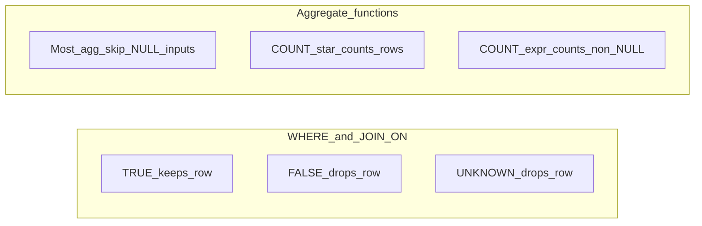

# 📚 SQL 陷阱与边界场景 —— 第 1 部分：基础

本文是两部分系列中的**第 1 部分**，聚焦 SQL 在**语言层面**的易错点：看起来为真却实际为 unknown 的谓词、含 `NULL` 的聚合、连接结果形状、以及集合操作。**[第 2 部分](SQL_Questions_Part2_CN.md)** 会继续讲窗口函数、`DISTINCT ON`、CTE 与递归、`LATERAL`，以及数据变更类陷阱。

---

## 1. 🚀 引言

SQL 在纸面上看起来是声明式的。很多面试题只有五行，但结果取决于你在日常写报表时很少明说的规则：谓词中的 **`NULL`** 作为第三种真值、对 **`WHERE` vs `HAVING`** 执行顺序的直觉、**`OUTER JOIN` + `WHERE` 过滤**、以及会静默跳过 `NULL` 输入的聚合函数。

本文刻意**聚焦**：它是对百科式 **[DBMS Questions](DBMS_Questions_CN.md)** 面试问答的补充，核心是这些陷阱的**心智模型**。示例优先使用 **PostgreSQL**（作者在现代 SQL 面试中的个人偏好）。在 **SQL Server** 或 **MySQL** 常见分歧处会给出简短说明——只要理解不变的底层规律，就不必死记三套方言。

主线与 **[C# 陷阱](CSharp_Questions_CN.md)** 系列一致：理解引擎为什么这样做，才能在新题目里冷静推导。

谓词与聚合（两个反复出现的核心概念）：



---

## 2. 🔲 `NULL`、三值逻辑与谓词

**`NULL`** 表示“没有值”，不是 0，也不是空字符串。在 SQL 谓词中，只要比较涉及 `NULL`，结果通常是 **`UNKNOWN`**（既不是 **`TRUE`** 也不是 **`FALSE`**），直到你显式决定如何处理这个 `UNKNOWN`。

**过滤规则。** `WHERE`、`JOIN ... ON` 和（聚合后的）`HAVING` 只保留布尔表达式结果为 **`TRUE`** 的行。结果为 **`FALSE`** 或 **`UNKNOWN`** 的行都会被丢弃——因此从调用者视角看，**`UNKNOWN`** 像 **`FALSE`**，但在复合表达式内部它并不是同一个逻辑值。

**常见面试雷点：**  

```sql
-- 错误写法：判断 “col 是否为 NULL”
SELECT * FROM t WHERE col = NULL;  -- 每一行都是 UNKNOWN；结果为空。

-- 正确写法
SELECT * FROM t WHERE col IS NULL;
SELECT * FROM t WHERE col IS NOT NULL;
```

**`=` 的行级相等。** 对两个可空列 `a` 与 `b`，只要任一操作数是 **`NULL`**，`a = b` 就是 **`UNKNOWN`**（除非在重定义比较语义的上下文中，例如 **`DISTINCT`** 或某些集合操作——它们在去重时会把 **`NULL`** 与 **`NULL`** 视为可比较）。

快速真值表（面试常识）：

| `p`     | `NOT p` |
|---------|---------|
| `TRUE`  | `FALSE` |
| `FALSE` | `TRUE`  |
| `UNKNOWN` | `UNKNOWN` |

| `p` AND `q` when `q` is … | `TRUE` | `FALSE` | `UNKNOWN` |
|---------------------------|--------|---------|-----------|
| `p = TRUE`                | …      | `FALSE` | `UNKNOWN` |
| `p = FALSE`               | `FALSE`| `FALSE` | `FALSE`   |
| `p = UNKNOWN`             | …      | `FALSE` | `UNKNOWN` |

粗略记忆法：**`AND`** 遇到 **`FALSE`** 一定是 **`FALSE`**；**`OR`** 遇到 **`TRUE`** 一定是 **`TRUE`**；**其他情况下 `UNKNOWN` 往往会传播。**

**外连接。** 外连接会保留一侧行，即使 **`ON`** 不匹配。若非保留侧没有匹配行，该侧列会以 **`NULL`** 形式出现。若 **`ON`** 写成 **`a.col = b.col`** 且 `b.col` 可为 **`NULL`**，则 **`UNKNOWN`** 会阻止匹配——即便保留侧在 **`LEFT`** 语义下仍会被保留。

面试官常把这些拼在一起问：

* **“为什么我加了 `NOT` 后整张表都没了？”** 因为 **`NOT UNKNOWN`** 仍是 **`UNKNOWN`**，而 **`UNKNOWN`** 会让行被过滤——见下文 **`NOT IN`**。
* **`COALESCE` vs `CASE`。** **`COALESCE(a,b)`** 大致是“取第一个非空值”，可视作 **`CASE`** 简写；**`NULLIF(a,b)`** 会把相等的两者映射成 **`NULL`**（在除法前常用）。

常见陷阱：

* 写 **`WHERE col != NULL`**，却期待 **`IS NOT NULL`** 的行为。
* 误以为 **`JOIN ... ON a.x = b.x`** 等同于 **`IS NOT DISTINCT FROM`**（`a.x` 与 `b.x` 同为 **`NULL`** 时，普通 **`=`** 不成立）。

在 **PostgreSQL** 中，**`IS DISTINCT FROM`** 与 **`IS NOT DISTINCT FROM`** 是显式的二值比较；当你需要“类似 `=` 且不受 `UNKNOWN` 干扰”的语义时非常有用。

---

## 3. ↔️ `IN`、`NOT IN`、`EXISTS`、`NOT EXISTS`

**`EXISTS(subquery)`**：只要子查询返回至少一行就是 **`TRUE`**；**`NOT EXISTS`**：子查询无行时为 **`TRUE`**。它并不按“标量逐行相等比较（且受 `NULL` 脆弱性影响）”来工作——在表达“是否存在匹配”时更稳妥。

**`IN (list)`** 等价于 **`= ANY(...)`**：`expr IN (v1,v2,...,NULL)` 可看作 **`(expr = v1) OR … OR (expr = vN)`**。若 **`expr`** 等于某个 **`vi`**，结果可为 **`TRUE`**。若 **`expr`** 不等于所有非空 **`vi`**，且列表中含 **`NULL`**，至少一个析取项可能为 **`UNKNOWN`**；除非别的析取项为 **`TRUE`**，否则整体会落到 **`UNKNOWN`**。

经典脚枪：

```sql
-- 假设子查询返回 (2), (3), (NULL)。
SELECT ...
FROM outer_t o
WHERE o.id NOT IN (SELECT nullable_col FROM inner_t WHERE ...);

-- 等价直觉：FOR ALL ... NOT (... = inner)
-- 只要有 inner 行为 NULL，该次比较即为 UNKNOWN；
-- 除非每次比较都能明确为 TRUE/FALSE，否则 NOT IN 会变成 UNKNOWN（没有行通过）。
```

当可能出现 **`NULL`** 时，表达“没有对应项”几乎总是 **`NOT EXISTS`** 更清晰：

```sql
SELECT o.*
FROM outer_t o
WHERE NOT EXISTS (
  SELECT 1
  FROM inner_t i
  WHERE i.foreign_key = o.id AND /* ... */
);
```

面试结论：

* 当子查询列可能为 **`NULL`** 时，优先 **`NOT EXISTS`**，而不是 **`NOT IN (SELECT …)`**。

**`IN (subquery)`** 写得不当也可能重复工作——但优化器通常会把 **`EXISTS`** 形态改写。优先清晰性，不要迷信微优化传说。

面试官常问：

* **为什么 `NOT IN` 会意外返回 0 行？**
* **`EXISTS SELECT 1` vs `SELECT *`**：仅是约定；**`EXISTS`** 逻辑上会短路。

*[关联子查询](DBMS_Questions_CN.md)基础见 **[DBMS Questions](DBMS_Questions_CN.md)**；本节只聚焦谓词真值。*

常见陷阱：

* 子查询表达式可空时直接用 **`NOT IN`**。
* 误以为 **`WHERE x NOT IN (...)`** 在含 **`NULL`** 场景下就是 **`WHERE x IN (...)`** 的严格逻辑否定。

---

## 4. 🔢 聚合、`FILTER`、`NULL` 与 distinct

**跳过 `NULL`。** **`SUM`**、**`AVG`**、**`MIN`**、**`MAX`** 只聚合非空值。**`COUNT(expr)`** 只计 **`expr` 非空** 的行。**`COUNT(*)`** 计的是组内行数——即使投影列全是 **`NULL`** 也照样计（被 **`WHERE`** 先过滤掉的行根本到不了 **`GROUP BY`**）。

面试对照：

```sql
SELECT AVG(x)::numeric         -- 分母忽略 NULL 的 x
FROM (VALUES (NULL::int), (2), (4)) AS t(x);  -- 结果：3（仅非空行求均值）

SELECT COUNT(*) FROM (VALUES (NULL::int), (2), (4)) AS t(x);  -- 3
SELECT COUNT(x) FROM (VALUES (NULL::int), (2), (4)) AS t(x);  -- 2（NULL 不算 x 的值）
SELECT COUNT(*) FILTER (WHERE x IS NOT DISTINCT FROM NULL)
FROM (VALUES (NULL::int), (2), (4)) AS t(x);  -- 1 —— 仅 x 为 NULL 的行
```

PostgreSQL 的 **`FILTER (WHERE …)`** 是聚合修饰语：与 **`SUM(CASE WHEN … THEN … END)`** 同义，通常更直观。

**`COUNT(DISTINCT x)`**：先去重再计数；**`NULL`** 在 **distinct count** 里通常被丢弃（不会像朴素按行计数那样把重复 **`NULL`** 多次计入）。

面试常考：

* **空集合的平均值**：聚合结果是 **`NULL`**，不是 0。
* **为什么两个 null 会在 `DISTINCT` 下折叠**：`DISTINCT` 在去重键上把 **`NULL`** 与 **`NULL`** 视作不可区分。

常见陷阱：

* 期待 **`AVG`** 的分母与 **`COUNT(*)`** 一致。
* **`MAX`/`MIN`** 用在布尔或字符串上“语义正确但违背直觉”，尤其是只按整数思维时。

---

## 5. 📊 `GROUP BY`、`SELECT` 列对齐与 `HAVING`

**经验规则。** 使用 **`GROUP BY`** 后，`SELECT` 中每个列要么出现在 **`GROUP BY`**，要么被聚合，或在方言规则允许下可被证明函数依赖于分组键。

**PostgreSQL** 默认较严格：除非所有非分组输出都聚合，或可证明函数依赖于 **`GROUP BY`** 键。**SQL Server** 与 **MySQL（开启 `ONLY_FULL_GROUP_BY`）** 也趋向“不能从组里任取一个任意列”。因此面试里常见的坏例子 **`SELECT dept, salary FROM emp GROUP BY dept`** 是有问题的。

概念执行顺序（**不等于**物理执行计划）：

1. **`FROM`** / **`JOIN`**
2. **`WHERE`**（分组前先过滤行）
3. **`GROUP BY`**（形成分组）
4. **`HAVING`**（过滤分组）
5. **`SELECT`** 投影（从结果形状角度看在这里，所以非聚合列必须与 **`GROUP BY`** 对齐）
6. **`ORDER BY`**

**没有 `GROUP BY` 的 `HAVING`：** 把整体视为一个隐式分组，因此可以写 **`HAVING COUNT(*) > 10`**。

面试陷阱：

```sql
-- WHERE vs HAVING 的直觉
SELECT dept, AVG(salary)
FROM emp
WHERE salary IS NOT NULL
GROUP BY dept
HAVING AVG(salary) > 90000;

-- 错误心智模型："HAVING 取代 WHERE"；实际它是在聚合之后作用于组。
```

**`GROUP BY`** 遇到 **`NULL`** 时会把所有 **`NULL`** 键放到**同一个桶**里。

*[基础版“什么是 `HAVING`”在 **[DBMS Questions](DBMS_Questions_CN.md)** 也有；此处侧重正确性与方言严格性]*

常见陷阱：

* 在 **`WHERE`** 里过滤聚合表达式（语法/逻辑都不对——应使用 **`HAVING`** 或子查询）。
* 选择不确定的裸列并依赖 **`MAX` 对应行** 的隐藏技巧（在 PostgreSQL 严格模式下无效；应显式写成 **`DISTINCT ON`**、`array_agg` 取首，或 **`ROW_NUMBER()`**，见 **[第 2 部分](SQL_Questions_Part2_CN.md)**）。

---

## 6. 🔗 Join：扇出与意外内连接

**连接扇出（fan-out）。** 若右表一条左键对应 **`N`** 行，左表该行会出现 **`N`** 次。面试里“为什么重复了”往往是“连接基数导致的倍增”，不是要盲目加 **`DISTINCT`**。

**`LEFT JOIN … WHERE rhs.col = …`**：当 `rhs` 列可空且你写了 **`WHERE rhs.id IS NOT NULL`**，通常已把 **`LEFT`** 语义转成了内连接（除非你本来就只要匹配行）。若你要保留左侧主干，请把匹配条件放进 **`ON`**。

```sql
-- 可选连接后仍保留左侧行（即使无匹配）
FROM customer c
LEFT JOIN latest_order lo ON lo.customer_id = c.id AND lo.is_cancelled = false;
-- 若把 is_cancelled 推到 WHERE，通常会丢失未匹配客户！
```

自连接（员工/经理图）里，经理键为 **`NULL`** 的根节点会被 **`INNER JOIN`** 丢掉——若要保留根节点，应使用 **`LEFT`**。

*[自连接以及 **`=` vs `LIKE` 的备注在 **[C# Part 2](CSharp_Questions_Part2_CN.md)** §13 也有简述，便于全栈速读保持一致。]*

常见陷阱：

* 写了 **`OUTER`** join 后，又在 **`WHERE`** 中过滤被保留侧对应的可空外键。
* 白板题漏写 **`JOIN`** 条件（`FROM a, b`）导致笛卡尔积。

---

## 7. 🔀 `UNION`、`INTERSECT`、`EXCEPT`

**`UNION`** 会去重；**`UNION ALL`** 直接拼接多重集（**更快**，保留重复）。除非确实要唯一性，否则优先 **`UNION ALL`**——面试陷阱常在“忘了去重代价与 `NULL` 去重语义”。

集合操作要求**列数与类型兼容**。隐式转换可能造成惊讶（某些引擎里字符串 vs 数值）——做题时先讲清字面量类型。

**`INTERSECT` / `EXCEPT`：** 去重行为与 **`DISTINCT`** 对 **`NULL`** 的语义一致；实践上可理解为：重复的 **`NULL`** 键会被视作重复并折叠。

PostgreSQL 在这里基本贴近 ISO SQL；细小差异多在类型强制顺序。若遇到面试题争议，先口头对齐类型再推导。

常见陷阱：

* 误以为 **`UNION`** 会先分别按每个操作数内部顺序排序后再合并；没有外层 **`ORDER BY`** 就不保证顺序。

---

## 8. 📍 `ORDER BY`、`NULL` 与非确定排序

在 PostgreSQL 中，默认 **`ORDER BY col`** 时 **`ASC`** 把 **`NULL`** 放后、**`DESC`** 把 **`NULL`** 放前；可显式写 **`NULLS FIRST`** / **`NULLS LAST`**。其他引擎默认值可能相反——在 **SQL Server** 与 **MySQL** 中历史/版本差异更多。**永远先问：`NULL` 怎么排？**

**稳定 vs 确定。** 没有**打破并列（tie-break）**时，相同键的行顺序可任意（读取计划变化会影响）。例如 **`ORDER BY amount DESC`** 若 amount 重复，就不是全序；面试里加上 **`..., id`** 才可复现。

常见面试点：

* **分页正确性**（**`OFFSET`/`LIMIT`** 或 **`FETCH`**）在不稳定排序下会出现页间重叠或乱序，尤其并发插入时。

*[模式匹配（`LIKE`）陷阱可结合 **[C# Part 2](CSharp_Questions_Part2_CN.md)** §13 一起看；其中“前导 `%` 对索引不友好”依然是核心直觉。]*

常见陷阱：

* 以为 **`LIMIT n`** 会自动选出“最好的 n 条”，却没给确定排序。
* 忽略 **`NULLS FIRST`** / `LAST` 的可移植性。

---

## 9. 🌍 方言差异速记（以 PostgreSQL 为中心）

本系列示例除特别说明外均采用 **PostgreSQL**。

| 概念 | PostgreSQL | SQL Server（常见） | MySQL（常见） |
|------|-------------|----------------------|----------------|
| 排序后截取 | **`LIMIT`** / **`OFFSET`** 或 **`FETCH FIRST`** | **`TOP (n)`** 或较新 **`FETCH`/`OFFSET`** | **`LIMIT`** |
| 大小写不敏感匹配 | **`ILIKE`**、**`~*`**（正则）或排序规则 | 借助排序规则 / 类 **`ILIKE`** 方式 | 借助排序规则 / **`LIKE BINARY`** 区分 |
| 每组取首行 | **`DISTINCT ON`**、**`LATERAL`**、窗口函数 | **`OUTER APPLY`**、窗口函数 | 历史上宽松 **`GROUP BY`**、窗口函数 |
| Upsert 语义 | **`ON CONFLICT`** | **`MERGE`**（**谨慎**） | **`ON DUPLICATE KEY UPDATE`** |

**`FETCH FIRST n ROWS ONLY`** 是标准写法；Postgres 同时支持它与 **`LIMIT`**。

字符串字面量使用 **`'`**；Postgres 标识符用 **`"`** 引号，和字符串不同。复制粘贴片段时，单双引号混用是常见雷点。

---

## 10. 🏁 第 1 部分收尾

你现在已有一组不变规则：谓词（只有 `TRUE` 存活，**`UNKNOWN`/`FALSE`** 过滤）、聚合与 **`COUNT(*)`** 的差异、严格分组规则、**`OUTER`** join 过滤位置、**`NOT IN`** vs **`NOT EXISTS`**、以及排序稳定性。

继续阅读 **[SQL 陷阱与边界场景 —— 第 2 部分：窗口、递归、lateral、数据变更](SQL_Questions_Part2_CN.md)**，学习排名、**`DISTINCT ON`**、CTE 细节、**`LATERAL`**、实战数据变更脚枪，以及面试前速记清单。
