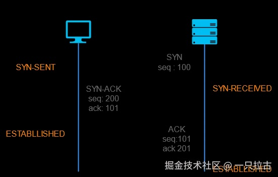

# Roadmap to Backend Programming Master: Internet Basics

Welcome to the first article in this series, which will guide you through the essential topics required to become a backend developer. This roadmap is designed to cover fundamental concepts to more advanced topics, reflecting what I wish I had mastered if I could learn everything again from scratch. Each article delves into technical details, real-world application examples, and common interview questions to help you build a solid foundation for becoming a backend developer.  

In this series, we will also explore the roles and responsibilities of backend developers in industry-level applications. We will discuss the structure of web applications, the division of responsibilities between frontend and backend developers, and the tasks a backend developer typically undertakes (such as providing APIs and handling server-side logic).  

This article focuses on the basics of the internet—how it works, key concepts such as HTTP/HTTPS, domain names, hosting, DNS, and browsers. These are the building blocks every backend developer should be familiar with.  

---

## **How the Internet Works**  

The internet allows devices to communicate over vast distances by breaking data into smaller packets and transmitting them through multiple layers, each with its own responsibilities. While backend developers don’t need to understand these layers deeply on a daily basis, having a basic understanding is beneficial.  

The core protocol enabling this communication is the **Transmission Control Protocol/Internet Protocol (TCP/IP)**. TCP ensures data is broken into smaller packets, transmitted across the network, and reassembled correctly, while IP handles addressing so data can be routed to the correct destination.  

Key concepts to understand:  

- **Client-Server Model**: The client requests resources, and the server responds with the corresponding data.  
- **Data Packets**: Data sent over the internet is broken into small pieces called packets, each containing information about how to reassemble it.  
- **Routers**: These devices guide packets to their destinations by reading IP address information.  

  

### **The Layers of the Internet**  

1. **Application Layer**: This is where high-level communication between applications occurs, such as your browser or email client. Protocols like **HTTP, HTTPS, FTP**, and **SMTP** operate at this layer, handling data exchange between applications.  
2. **Transport Layer**: This layer ensures reliable data transmission between devices. It breaks data into packets and manages connections. The main protocols are **TCP** (ensures all packets are delivered) and **UDP** (faster but does not guarantee delivery).  
3. **Internet Layer**: This layer is responsible for routing packets across networks, ensuring data reaches the correct destination. The primary protocol is **IP (Internet Protocol)**, which assigns unique addresses to devices (IP addresses) and guides packets to their destinations.  
4. **Link Layer**: This layer handles communication between devices within the same local network, ensuring data is transmitted from your device to a nearby router, which then forwards it to its destination.  

---

## **HTTP Basics and Features**  

**HTTP (Hypertext Transfer Protocol)** is the foundation of web communication. It is a stateless protocol, meaning each request is handled independently, without retaining session information between requests.  

Key features of HTTP:  

- **Request/Response Model**: The client (browser) sends requests to the server, which responds with data (e.g., HTML files, images).  
- **Statelessness**: Each request is independent, and the server does not retain information between requests unless cookies or session mechanisms are used.  
- **Readability**: HTTP requests and responses are easy to read, simplifying debugging.  

### **GET vs. POST**  

In HTTP, **GET** and **POST** are the two most commonly used request methods:  

- **GET**: Used to request data from the server. GET requests are idempotent (can be called multiple times without changing the result) and do not modify server data. Parameters are sent via the URL (e.g., `example.com/api?param=value`).  
- **POST**: Used to submit data to the server, typically resulting in changes to server data (e.g., submitting a form). POST requests send data in the request body, making them suitable for sending sensitive or large amounts of data.  

The choice between GET and POST depends on the operation type:  

- Use **GET** for retrieving data without changing the state.  
- Use **POST** for creating or modifying data.  

### **HTTP vs. HTTPS**  

**HTTP** transmits data in plain text, making it vulnerable to interception by attackers. This is where **HTTPS** becomes crucial.  

- **HTTPS (Hypertext Transfer Protocol Secure)** adds encryption to HTTP using the **SSL/TLS** protocol. This ensures that data exchanged between the client and server is secure and cannot be easily intercepted.  
- **SSL/TLS** also provides authentication, ensuring that the server you’re communicating with is legitimate, thereby preventing man-in-the-middle attacks.  

---

## **Domain Names, Hosting, and DNS**  

A **domain name** is the human-readable address of a website, such as `http://www.example.com`. Behind every domain name is an **IP address**, a numerical label assigned to each device connected to the internet. When you type a domain name into your browser, it is converted into an IP address so the browser can communicate with the correct server.  

**Hosting** refers to the service that makes a website accessible on the internet. Different hosting options include:  

- **Shared Hosting**: Multiple websites share the same server, which is cost-effective but offers lower performance.  
- **VPS (Virtual Private Server) Hosting**: Provides more control and resources with better performance.  
- **Dedicated Hosting**: You have an entire server to yourself, offering the best performance at the highest cost.  
- **Cloud Hosting**: Utilizes a network of virtual servers, providing scalability and redundancy.  

As a backend developer, you may need to configure environments, ensure servers are set up correctly, and handle domain or hosting configurations.  

**DNS (Domain Name System)** acts like the internet's phonebook, translating domain names into IP addresses so browsers can load the correct web resources. Here’s how DNS works:  

1. You type a domain name into your browser.  
2. The browser contacts a DNS resolver, which queries different DNS servers to find the corresponding IP address.  
3. Once the IP address is located, the browser can send a request to the server at that IP address to load the website.  

Without DNS, we’d have to remember complex IP addresses instead of easy-to-remember domain names.  

---

## **TCP, Three-Way Handshake, and Four-Way Teardown**  

**TCP (Transmission Control Protocol)** is a core internet protocol responsible for establishing reliable connections between devices. It ensures data is transmitted accurately and in order.  

  

Before sending data, TCP establishes a connection between the client and server using the **three-way handshake**:  

1. **SYN (Synchronize)**: The client sends a **SYN** packet to the server to initiate a connection.  
2. **SYN-ACK (Synchronize-Acknowledge)**: The server responds with a **SYN-ACK** packet, acknowledging the client’s request and indicating it is ready to establish the connection.  
3. **ACK (Acknowledge)**: Finally, the client sends an **ACK** packet to confirm the connection is established, and data transmission can begin.  

This handshake ensures that both the client and server are ready to communicate before data is sent.  

  

When disconnecting, TCP uses a **four-way teardown** to gracefully close the connection between the client and server. This process ensures both parties have completed data transmission and are ready to terminate the connection:  

1. **FIN (Finish)**: The party initiating the termination (usually the client) sends a **FIN** packet, indicating it has finished sending data.  
2. **ACK (Acknowledge)**: The other party (usually the server) responds with an **ACK** packet to acknowledge the **FIN** request.  
3. **FIN (Finish)**: The server then sends its own **FIN** packet, indicating it has also finished sending data.  
4. **ACK (Acknowledge)**: Finally, the client sends an **ACK** packet to confirm it has received the server’s **FIN**, and the connection is formally terminated.  

This four-step process ensures both the client and server have an opportunity to complete their data transmission and cleanly close the connection, avoiding data loss or incomplete transfers.  

---

## **How Browsers Work**  

When you type a URL into your browser and press Enter, several things happen behind the scenes:  

1. **DNS Resolution**: The domain name is resolved into an IP address using DNS.  
2. **Establishing a Connection**: The browser establishes a connection with the server using **TCP/IP**.  
3. **Sending an HTTP/HTTPS Request**: The browser sends an HTTP request to the server to retrieve resources such as HTML, CSS, or JavaScript files.  
4. **Rendering the Webpage**: The browser's rendering engine processes the HTML and CSS files to display content, while the JavaScript engine executes any interactive functionality.  

Understanding how browsers work can help you as a backend developer, particularly when optimizing server responses and ensuring compatibility with various browsers.  

---

## **Conclusion**  

In this article, we covered the basics of the internet, from HTTP/HTTPS to DNS and how browsers process data. For backend developers, understanding the internet and its foundational concepts is crucial. Whether you're building or managing server-side logic, understanding client-server communication, HTTP/HTTPS, and API structures will help you create efficient and secure systems. Familiarity with key protocols like TCP and DNS can optimize application performance and reliability.  

Additionally, knowing how browsers behave and how data flows across the internet enables you to troubleshoot problems, secure data transmission, and improve user experience. These core concepts not only lay the groundwork for building modern web applications but also help you stand out when designing scalable, secure, and efficient backend systems.  

Stay tuned for the next article, where we’ll dive into the fundamentals of programming languages (C#), discussing key features and best practices for backend development.  
