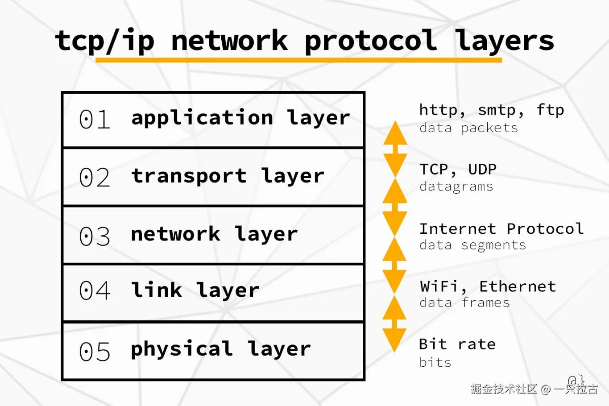
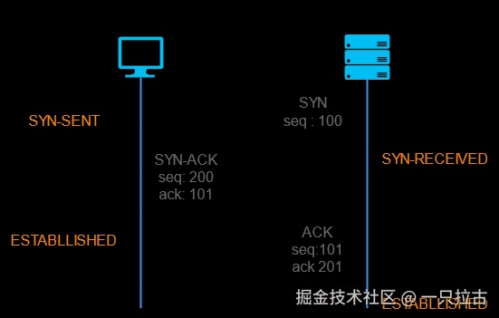
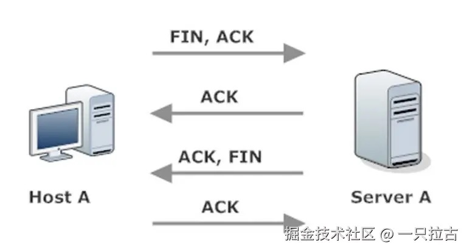

## 从小白到大神：后端开发必学之互联网入门

欢迎阅读本系列文章的第一篇，它将带领你了解成为后端程序员所需掌握的重要主题。这条路线图设计从基础概念到更高级的主题，反映了如果我能够重新学习时我希望掌握的内容。每篇文章都会深入技术细节、真实的应用示例以及常见的面试问题，帮助你建立成为后端开发人员的坚实基础。

在本系列中，我们还将探讨在行业级应用中，后端开发人员的职责是什么。我们将讨论 web 应用的结构、前端和后端开发人员的责任划分，以及作为一名后端开发人员所需承担的任务（如提供 API 和处理服务器端逻辑）。

本篇文章主要关注互联网的基础知识——它是如何运作的，HTTP/HTTPS、域名、主机托管、DNS 以及浏览器等关键概念。这些是每个后端开发人员都应该熟悉的构件。

---

### **互联网是如何运作的**

互联网通过将数据分解为较小的数据包并通过多个层进行传输，使得设备可以在广阔的距离间进行通信，每一层都有各自的责任。作为后端开发人员，你不需要每天深入了解这些层，但基本的理解是有帮助的。

这种通信的核心协议是**传输控制协议/互联网协议 (TCP/IP)**。TCP 确保数据被分解为较小的包，传输到网络上并被正确重新组装，而 IP 负责处理地址，以便数据可以被路由到正确的目的地。

需要了解的关键概念：

- **客户端-服务器模型**：客户端请求资源，服务器响应相应的数据。
- **数据包**：通过互联网发送的数据被分解为称为数据包的小块，每个包都包含数据以及如何重新组装它的信息。
- **路由器**：这些设备通过读取 IP 地址信息引导数据包到达目的地。

#### **互联网的各层：**

1.  **应用层**：这是应用之间进行高级通信的地方，比如你的浏览器或电子邮件客户端。**HTTP, HTTPS, FTP**和**SMTP**等协议在这一层运行，负责在应用间进行数据交换。
2.  **传输层**：该层确保两个设备之间的数据传输可靠。它负责将数据分解为数据包并管理连接。主要的协议是**TCP**（确保所有数据包都能传递）和**UDP**（更快但不保证数据包的传递）。
3.  **互联网层**：这一层负责网络间的数据包路由，确保你发送的数据能够到达正确的目的地。该层的主要协议是**IP（互联网协议）**，它为设备分配唯一地址（IP 地址），并引导数据包到达目的地。
4.  **链路层**：链路层处理同一局域网内设备之间的通信，确保数据可以从你的设备传输到附近的路由器，再由路由器将其转发到最终目的地。

---

### **HTTP 基础与特性**

**HTTP（超文本传输协议）** 是网页通信的基础。它是一个无状态协议，这意味着每个请求都是独立处理的，且不会在请求之间保留会话信息。

HTTP 的关键特性：

- **请求/响应模型**：客户端（浏览器）向服务器发送请求，服务器以数据（如 HTML 文件、图片等）响应。
- **无状态**：每个请求都是独立的，服务器不会在请求之间保留信息，除非使用了 Cookie 或会话机制。
- **可读性强**：HTTP 请求和响应易于阅读，简化了调试过程。

#### **GET 与 POST**

在 HTTP 中，**GET** 和 **POST** 是最常用的两种请求方法：

- **GET**：用于向服务器请求数据。GET 请求是幂等的（可以多次调用且不会改变结果），且不会修改服务器数据。参数通过 URL 发送（如 `example.com/api?param=value`）。

- **POST**：用于向服务器提交数据，通常会导致服务器数据的更改（如提交表单）。POST 请求将数据放在请求主体中，适合发送敏感或大量数据。

GET 与 POST 的选择取决于操作的类型：

- **GET** 用于在不改变状态的情况下检索数据。
- **POST** 用于创建或修改数据。

#### **HTTP 与 HTTPS**

**HTTP** 以明文形式传输数据，这意味着它可以被攻击者拦截并读取。这时 **HTTPS** 就显得尤为重要。

- **HTTPS（安全超文本传输协议）** 通过使用 **SSL/TLS** 协议为 HTTP 增加了加密功能。这确保了客户端和服务器之间发送的数据是安全的，且不会轻易被拦截。
- **SSL/TLS** 还提供了身份验证，确保你与之通信的服务器是合法的，从而防止中间人攻击。

---

### **域名，托管，DNS**

**域名** 是网站的可读地址,如 `http://www.example.com`。每个域名背后都有一个 **IP 地址**，它是分配给每个连接到互联网的设备的数字标签。当你在浏览器中输入域名时，域名会被转换为 IP 地址，以便浏览器能够与正确的服务器通信。

**托管** 指的是使网站能够在互联网上访问的服务。不同的托管选项包括：

- **共享托管**：多个网站共享同一台服务器，成本低但性能较差。
- **VPS（虚拟专用服务器）托管**：提供更多的控制和资源，性能更好。
- **独立托管**：你可以拥有整个服务器，虽然成本最高，但提供了最佳性能。
- **云托管**：使用虚拟服务器网络，提供可扩展性和冗余。

作为后端开发人员，你可能需要配置环境，确保服务器正确设置，并处理域名或托管的配置。

**DNS（域名系统）** 就像互联网的电话簿，它将域名转换为 IP 地址，以便浏览器可以加载正确的网络资源。以下是 DNS 的工作过程：

1.  你在浏览器中输入一个域名。
2.  浏览器联系 DNS 解析器，解析器向不同的 DNS 服务器查询对应的 IP 地址。
3.  一旦找到 IP 地址，浏览器就可以向该 IP 地址的服务器发送请求以加载网站。

没有 DNS，我们就得记住复杂的 IP 地址，而不是容易记住的域名。

---

### **TCP，三次握手 与 四次挥手**

**TCP（传输控制协议）** 是互联网的核心协议，负责在设备之间建立可靠的连接。它确保数据准确且按顺序传输。

在发送数据之前，TCP 通过 **三次握手** 来建立客户端和服务器之间的连接：

1.  **SYN（同步）**：客户端向服务器发送一个 **SYN** 包，以启动连接。
2.  **SYN-ACK（同步确认）**：服务器响应一个 **SYN-ACK** 包，确认客户端的请求并表示它已准备好建立连接。
3.  **ACK（确认）**：最后，客户端发送一个 **ACK** 包，确认连接已建立，数据传输可以开始。

这个握手过程确保客户端和服务器在传输数据之前已经准备好进行通信。

在断开连接时，TCP 使用**四次挥手**来优雅地关闭客户端和服务器之间的连接。这个过程确保双方都完成了数据发送，并准备终止连接：

1.  **FIN（终止）**：发起终止的一方（通常是客户端）发送一个**FIN**包，表示它已经完成数据发送。
2.  **ACK（确认）**：另一方（通常是服务器）回应一个**ACK**包，确认收到了**FIN**请求。
3.  **FIN（终止）**：随后服务器发送自己的**FIN**包，表示它也已经完成了数据发送。
4.  **ACK（确认）**：最后，客户端发送一个**ACK**包，确认收到了服务器的**FIN**，连接正式终止。

这四步流程确保客户端和服务器双方都有机会完成各自的数据传输，并干净地关闭连接，避免数据丢失或传输不完整的情况。

---

### **浏览器的工作原理**

当你在浏览器中输入一个 URL 并按下回车时，背后发生了很多事情：

1.  **DNS 解析**：域名通过 DNS 被转换为 IP 地址。
2.  **建立连接**：浏览器通过 **TCP/IP** 与服务器建立连接。
3.  **发送 HTTP/HTTPS 请求**：浏览器向服务器发送 HTTP 请求，获取 HTML、CSS 或 JavaScript 文件等资源。
4.  **渲染网页**：浏览器的渲染引擎处理 HTML 和 CSS 文件以显示内容，而 JavaScript 引擎执行任何交互功能。

了解浏览器的工作原理将有助于你作为后端开发人员，特别是在优化服务器响应和确保与各种浏览器兼容时。

---

### **总结**

在这篇文章中，我们介绍了互联网的基础知识，包括从 HTTP/HTTPS 到 DNS 以及浏览器如何处理数据。对于后端开发人员来说，理解互联网及其基础概念至关重要。在构建和管理服务器端逻辑时，了解客户端-服务器通信、HTTP/HTTPS 以及 API 结构将帮助你创建高效且安全的系统。熟悉像 TCP 和 DNS 这样的关键协议，可以优化应用程序的性能和可靠性。

此外，理解浏览器的行为以及数据在互联网中的传输方式，有助于你解决问题、保护数据传输并提升用户体验。这些核心概念不仅为构建现代 web 应用程序奠定了基础，也有助于你在设计可扩展、安全且高效的后端系统中脱颖而出。

敬请期待下一篇文章，我们将深入探讨编程语言基础（C#），介绍其关键特性和后端开发的最佳实践。
