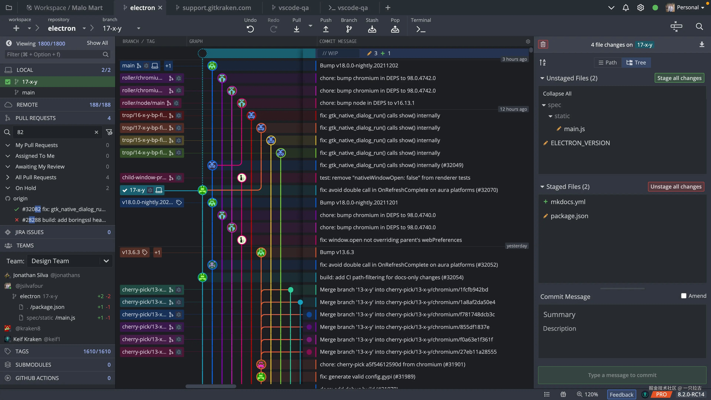

# Roadmap to Backend Programming Master: Git, Code Hosting, and CI/CD

Welcome to the third article in the Backend Development Roadmap series. This article will focus on the importance of **Git**, **code hosting services**, and **CI/CD (Continuous Integration/Continuous Deployment)**. These tools and practices are fundamental to modern software development, ensuring code quality, collaboration, and efficient deployment.

***

## **Why Git and CI/CD are Important**

* **Git** is the industry-standard version control system used by developers worldwide. It is primarily used to manage code changes, collaborate on development projects, and maintain a history of code updates. It is an essential tool for managing source code in any backend project.
* **Code hosting services** like **GitHub**, **GitLab**, and **Bitbucket** allow developers to collaborate easily, review code contributions, and deploy projects across multiple environments.
* **CI/CD pipelines** automate testing, building, and deploying code. These practices not only save time but also improve reliability, enabling teams to release new features faster with fewer errors.

***

## **Git Beginner's Guide**

### **What is Git?**

Git is a distributed version control system used to track changes to files over time. It allows developers to collaborate without overwriting each other's work and retains a detailed history of all changes made to the codebase.

### **How Git Works**


You can think of a Git **repository** as a tree. The **main** and **dev** branches are like the trunk, representing the core of the project. When developers begin a new feature or bug fix, they create **branches**, which are like the smaller branches of the tree.

Each branch is an independent development line where you can make changes, test code, and experiment without affecting the main parts of the project. Once changes are complete and tested, you can "merge" the branch back into the **main** (or **dev**) branch, like reconnecting a branch back to the trunk. This process helps keep the code organized and allows multiple people to work on different parts of the project without interfering with each other.

### **Key Concepts:**

* **Repository:** A project folder managed by Git.
* **Commit:** A snapshot of changes to the code.
* **Branch:** An independent development line in the project.
* **Merge:** Combining the changes from one branch into another.
* **Pull Request (PR):** A proposed change to the codebase that is reviewed before being merged.

```bash
  # Initialize a new repository
  git init

  # Clone an existing repository
  git clone <repo_url>

  # Add a file to the staging area
  git add <file_name>

  # Commit changes with a message
  git commit -m "Commit message"

  # Create a new branch
  git checkout -b <branch_name>

  # Merge a branch
  git merge <branch_name>

  # Push changes to the remote repository
  git push origin <branch_name>
```

Here’s a great Git tutorial: [Git for Professionals Tutorial - Tools & Concepts for Mastering Version Control with Git](https://youtu.be/Uszj_k0DGsg?si=7GJLjWGudS_v6Q4l)

***

## **Choosing a Code Hosting Service**

When selecting a code hosting service, there are several options to choose from, each with its own benefits. These services allow you to store code online, collaborate with team members, and manage version control.

* **GitHub**: The most popular choice, especially for open-source projects. It offers a powerful platform for version control and collaboration, with features like pull requests, issue tracking, and CI/CD pipeline integration.
* **GitLab**: Known for its integrated DevOps lifecycle, GitLab not only provides version control tools but also supports continuous integration and delivery. It also offers free private repositories.
* **Bitbucket**: Ideal for teams already using Atlassian tools like Jira, Bitbucket provides tight integration with these tools and is often used in enterprise environments. It also offers free private repositories.

In addition to code hosting, these platforms also have built-in team collaboration and CI/CD features. However, using Git via the command line may seem daunting, especially for beginners. Many developers use third-party tools to manage Git more intuitively.

### **Using Third-Party Tools for Git Operations**

There are several third-party tools available to simplify Git operations such as fetching, pulling, and committing code. These tools provide graphical interfaces, so you can manage repositories without using the command line.



* **GitKraken**: A popular Git graphical client known for its visually appealing interface and intuitive workflow. GitKraken allows you to view the Git commit graph, manage branches, and resolve merge conflicts. It also integrates with GitHub, GitLab, and Bitbucket.

* **Sourcetree**: A free Git client for Windows and macOS that provides an easy way to interact with Git repositories. Sourcetree is great for visualizing code history, managing branches, and performing basic Git operations like fetch, pull, and push with a few clicks.

* **GitHub Desktop**: Built for GitHub users, GitHub Desktop offers a simplified experience for managing repositories hosted on GitHub. It streamlines the Git workflow, providing tools for commits, branching, and pull requests with a clean interface.

These tools are particularly useful for beginners who are not familiar with Git's command line, offering a friendlier experience while still retaining full Git functionality. Whether collaborating with a team or managing your own projects, these GUI tools can make the Git workflow smoother and more accessible.

***

## **CI/CD: Streamlining the Development Process**

### **What is CI/CD?**

* **Continuous Integration (CI):** Regularly merging code changes into a shared repository, automating testing and building to catch errors early.
* **Continuous Deployment (CD):** The process of automating the deployment of code changes to production or staging environments.

### **Key Benefits:**

* **Faster Releases:** CI/CD ensures code is frequently tested and deployed, reducing the time from development to release.
* **Improved Collaboration:** CI/CD pipelines automate the tedious parts of development, allowing developers to focus on writing code and improving products.
* **Fewer Bugs:** Automated testing helps catch bugs early, reducing the risk of critical errors reaching production.

### **Common CI/CD Tools:**

* **GitHub Actions:** Integrated with GitHub, used for automating testing, building, and deployment.
* **GitLab CI:** A powerful built-in CI/CD tool that allows you to automate pipelines.
* **Jenkins:** An open-source automation server commonly used for building and deploying projects.

### **Setting Up a CI/CD Pipeline**

* **Step 1: Write Automated Tests**
    Before setting up CI, write automated tests for your codebase. These tests will automatically trigger when code is pushed to the repository.

* **Step 2: Configure CI/CD Tools**
  * For **GitHub**, set up **GitHub Actions** by creating a `.github/workflows` directory and defining your workflow in a YAML file.
  * For **GitLab**, create a `.gitlab-ci.yml` file in the project root and define the pipeline stages.

* **Step 3: Define Pipeline Stages**
    A typical pipeline includes:
    1. **Build:** Compile or package the code.
    2. **Test:** Run unit tests, integration tests, etc.
    3. **Deploy:** Push the build to staging or production environments.

***

## **Summary**

Mastering **Git**, **code hosting services**, and **CI/CD** is crucial for every backend developer. These tools not only simplify the development process but also ensure collaboration, code quality, and faster delivery. By integrating automated pipelines into your workflow, you'll build more reliable, scalable applications and become more efficient in backend development.

Stay tuned for the next article in this series, where we will dive into databases and APIs, covering key concepts and best practices in backend programming.
