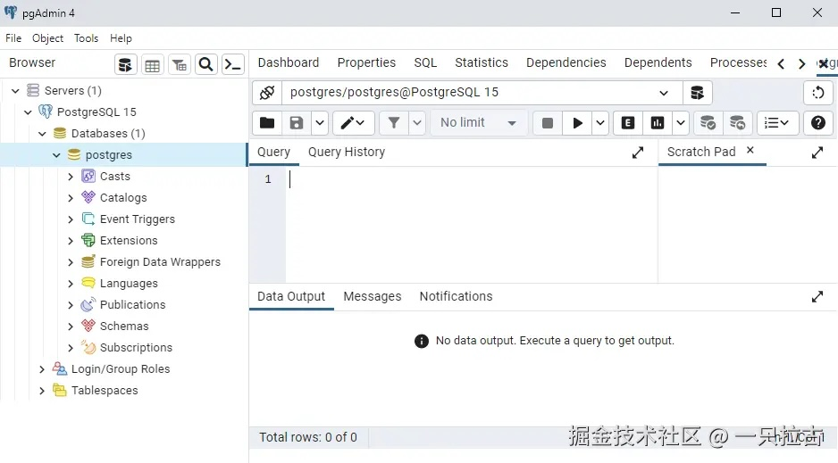
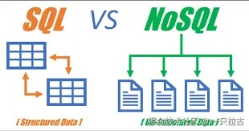

# Roadmap to Backend Programming Master: Essential Database Fundamentals

In this article, we will dive into the basic knowledge of database management, focusing on the core concepts every backend developer should understand. From the differences between SQL and NoSQL, to SQL query optimization and the use of indexes, we will cover key topics essential for building databases.

***

## **SQL vs NoSQL**

**SQL (Structured Query Language)** databases are relational databases where data is stored in **tables** with predefined **schemas**. They are widely used in scenarios where relationships between entities are important and data consistency and structure are required.



* **Examples**: MySQL, PostgreSQL, Microsoft SQL Server.
* **Key Features**:
  * Predefined schema and data types.
  * Powerful querying capabilities.
  * Follows the ACID principles (Atomicity, Consistency, Isolation, Durability).

**NoSQL** databases are non-relational databases designed for handling unstructured data, offering flexible data storage and retrieval methods.

* **Examples**: MongoDB, Cassandra, Redis.
* **Key Features**:
  * Dynamic schema.
  * Optimized for scalability.
  * Suitable for handling large amounts of unstructured data.

Understanding the differences between SQL and NoSQL is crucial for choosing the right database for a project. SQL is often the better choice for applications that require strict consistency and complex relationships. NoSQL, on the other hand, is better suited for handling large amounts of rapidly changing data.

***

## **Database Management Software**

When managing databases, although command-line connections and operations (a traditional yet effective method) can be used, modern database management software with intuitive graphical interfaces is often more convenient. These tools provide a more direct interface for creating, modifying, and querying databases, making database operations more convenient and efficient.



* **PgAdmin**: A popular open-source PostgreSQL management tool that offers an easy-to-use graphical interface for managing databases, executing queries, and visualizing database structures.
* **DbForge**: A commercial tool that supports multiple databases (e.g., MySQL, PostgreSQL, SQL Server). It offers advanced features such as SQL query building, data comparison, and database synchronization, making it a powerful assistant for developers.

Both tools offer features that simplify database management and provide powerful capabilities when handling large-scale applications.

***

## **SQL Basics**

SQL is a powerful language, and mastering its basics is essential for every backend developer. Here are some core statements:

```sql
-- Retrieve all users older than 25
SELECT * FROM users WHERE age > 25;

-- Insert a new user named 'Alice', age 30
INSERT INTO users (name, age) VALUES ('Alice', 30);

-- Update Alice's age to 31
UPDATE users SET age = 31 WHERE name = 'Alice';

-- Delete users younger than 20
DELETE FROM users WHERE age < 20;

-- Join users and orders tables to get all orders with user information
SELECT users.name, orders.order_id, orders.total
FROM users
JOIN orders ON users.user_id = orders.user_id;

-- Group by age and get the number of users in each age group
SELECT age, COUNT(*) AS user_count
FROM users
GROUP BY age;

-- Order users by name in ascending order
SELECT * FROM users
ORDER BY name ASC;

-- Limit the results to 10
SELECT * FROM users
LIMIT 10;

-- Find the average age of users
SELECT AVG(age) AS average_age
FROM users;
```

### **Tips for Writing Efficient SQL Queries**

Writing efficient SQL queries is crucial for improving database performance, especially when dealing with large datasets. Here are some best practices to optimize query speed and resource consumption:

1. **Use `JOIN` instead of nested subqueries**:
    * **Reason**: Nested subqueries often add extra overhead and complexity for the database engine, which can degrade performance. **JOIN** can more efficiently merge related tables, reducing additional query execution steps.
    * **Example**:

    ```sql
    -- Recommended JOIN query:
    SELECT users.name, orders.order_id
    FROM users
    JOIN orders ON users.user_id = orders.user_id;
    ```

2. **Select only the required columns, not `SELECT *`**:
    * **Reason**: Using `SELECT *` retrieves all columns, including those you might not need. This increases the amount of data processed and transmitted, slowing down query performance, especially for large tables. Selecting only the necessary columns reduces data load and improves performance.
    * **Example**:

    ```sql
    -- Recommended select specific columns:
    SELECT name, age FROM users;
    ```

3. **Avoid using `OR`, use `UNION/UNION ALL` instead**:
    * **Reason**: Queries that rely heavily on `OR` conditions can cause the database to scan larger datasets, slowing down query speed. In some cases, rewriting the query and using `UNION` or `UNION ALL` can optimize performance since each condition can be processed more efficiently.
    * **Example**:

    ```sql
    -- Slow query
    SELECT * FROM users WHERE age < 18 OR age > 60;

    -- Performance optimization
    SELECT * FROM users WHERE age < 18
    UNION
    SELECT * FROM users WHERE age > 60;
    ```

4. **Avoid using `!=` or `<>` operators, use `IN` instead**:
    * **Reason**: `!=` and `<>` operators hinder the database from effectively using indexes. It's better to use `IN` with a list of values, which typically optimizes index usage and generates more efficient query plans.
    * **Example**:

    ```sql
    -- Slow query
    SELECT * FROM orders WHERE status != 'shipped';

    -- Optimized index usage
    SELECT * FROM orders WHERE status IN ('pending', 'delivered');
    ```

5. **Avoid using `%` at the beginning of a `LIKE` pattern**:
    * **Reason**: Using `LIKE '%something%'` prevents the database from effectively using indexes because it has to scan every row in the table to find matches. Try to avoid patterns starting with `%` and optimize the query structure so that indexes can be used.
    * **Example**:

    ```sql
    -- Avoid:
    SELECT * FROM users WHERE name LIKE '%Smith';

    -- Recommended:
    SELECT * FROM users WHERE name LIKE 'Smith%';
    ```

6. **Avoid using functions (like `LOWER()`, `UPPER()`) on indexed columns**:
    * **Reason**: Applying functions on indexed columns forces the database to process each row individually rather than using the index. This significantly slows down queries. Instead, try to manipulate input values or, if necessary, consider creating function-based indexes.
    * **Example**:

    ```sql
    -- Avoid:
    SELECT * FROM users WHERE LOWER(name) = 'john';

    -- Recommended:
    SELECT * FROM users WHERE name = 'John';
    ```

7. **Limit result sets**: Use `LIMIT` (or `TOP` in SQL Server) to retrieve only the number of rows you need.
    * **Example**:

    ```sql
    SELECT * FROM users WHERE age > 25 LIMIT 100;
    ```

8. **Use appropriate data types**: Ensure that columns are defined with the smallest data types needed to store the expected values. For example, use `TINYINT` instead of `INT` for boolean columns.

9. **Analyze query execution plans**: Use tools like **EXPLAIN** (in MySQL/PostgreSQL) or the query execution plan in SQL Server Management Studio to analyze how queries are executed and identify potential bottlenecks.

***

## **Indexes**

Indexes are like pointers in a database table, similar to a table of contents in a book. Instead of scanning the entire table to perform a query, the database can use an index to quickly locate the data. Indexes are an essential tool for performance optimization, as they speed up data retrieval by creating references, thus improving query speed.

However, adding indexes is not always straightforward, as improper indexing can lead to additional overhead and slower write operations. Here are some best practices when adding indexes to a table:

### **1. Choose the Right Columns for Indexing**

Not every column needs an index. Focus on columns that frequently appear in `WHERE` clauses, `JOIN` conditions, or operations like sorting or grouping (`ORDER BY`, `GROUP BY`).

* **Primary Keys and Unique Columns**: These are typically indexed by default, as they uniquely identify records.
* **Foreign Keys**: Index foreign key columns to speed up join operations.
* **Frequently Filtered Columns**: Index columns that are often used in queries with conditions.

### **2. Avoid Too Many Indexes**

While indexes speed up read operations, they add overhead to write operations (`INSERT`, `UPDATE`, `DELETE`) because the indexes themselves also need to be updated. Adding too many indexes, especially on columns that are frequently updated, can lead to performance degradation.

### **3. Use Composite Indexes (Indexes on Multiple Columns)**

Sometimes queries involve filtering or sorting based on multiple columns. In this case, you can use composite indexes (indexes on multiple columns). However, make sure that the order of the columns in the index matches the order of conditions in the query.

* **Composite Index Example:**

If you frequently query based on `last_name` and `first_name`, you can create a composite index.

```sql
CREATE INDEX idx_name ON users(last_name, first_name);
```

This index will speed up queries that use both `last_name` and `first_name` and will also accelerate queries that filter by `last_name` alone, but it will not speed up queries that filter only by `first_name`.

### **4. Index High-Selectivity Columns**

Indexes are most effective on columns with high selectivity, meaning columns that have many different values. For example, indexing a `gender` column (which only has two values: 'Male' and 'Female') will not significantly improve query performance. Instead, focus on columns with more unique values, such as `email` or `order_id`.

### **5. Covering Index**

A covering index is an index that includes all the columns needed for a query, so there's no need to look up the table data. Covering indexes are particularly useful for queries that frequently retrieve specific columns.

```sql
CREATE INDEX idx_order_summary ON orders(user_id, order_date, total);
```

In this example, the index can cover queries requesting `user_id`, `order_date`, and `total` columns without performing a full table scan.

### **6. Monitor and Optimize Indexes**

Regularly monitor the usage of indexes to ensure they are being efficiently utilized. Use SQL query optimization tools, such as `EXPLAIN` (in MySQL/PostgreSQL), to analyze the effectiveness of indexes, and adjust as needed.

By following these best practices, you can optimize database performance by strategically adding indexes while avoiding unnecessary overhead, thus preventing performance degradation in write operations.

***

## **Using Dapper to Connect to Databases**

In any backend application, connecting to the database is the core operation for storing, retrieving, and updating data. Whether retrieving user information, writing new records, or updating existing ones, your application needs to interact with the database to manage data efficiently. The reliable execution of these operations is the foundation of backend development.

To simplify this interaction, many developers use **Object-Relational Mapping (ORM)** to handle database operations. ORM allows you to treat data as objects in your application code, simplifying the process of mapping tables and columns to class properties.

**Dapper** is a lightweight ORM (Object-Relational Mapper) for .NET, designed to simplify database interaction. It's particularly useful for developers who want the flexibility of SQL queries but need to map database records to .NET objects.

A typical workflow with Dapper includes establishing a database connection, executing queries, and mapping the results to C# classes. Here’s a short example:

```csharp
using (var connection = new SqlConnection(connectionString))
{
    var users = connection.Query<User>("SELECT * FROM users");
}
```

To learn how to use Dapper to connect a .NET project to a database, you can refer to my previous blog post [view here](https://juejin.cn/post/7373571989725200425).

***

## **Conclusion**

Understanding these fundamental concepts will significantly enhance your ability to work with databases effectively. Whether you're building an application from scratch or optimizing an existing system, mastering SQL and NoSQL, writing efficient SQL queries, and understanding indexes will help you make informed decisions that impact performance and scalability.

Stay tuned for the next article, where we will dive deeper into advanced database topics, including locks, transactions, and scalability strategies for modern applications.
