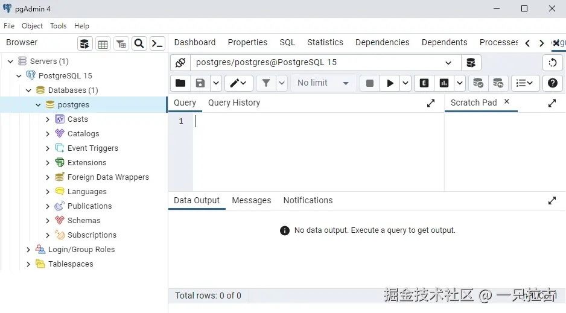

# 从小白到大神：后端开发者必学之数据库基础

在本文中，我们将深入探讨数据库管理的基本知识，重点关注每个后端开发者应了解的核心概念。从SQL和NoSQL的区别，到SQL语句优化和索引的使用，我们将涵盖构建数据库工作的关键主题。

***

## **SQL vs NoSQL**

**SQL (结构化查询语言)** 数据库是关系型数据库，数据存储在具有预定义 **模式** 的 **表** 中。它们广泛用于实体之间关系重要且需要数据一致性和结构的场景。



* **示例**: MySQL、PostgreSQL、Microsoft SQL Server。
* **关键特性**:
  * 预定义的模式和数据类型。
  * 强大的查询能力。
  * 符合ACID原则（原子性、一致性、隔离性、持久性）。

**NoSQL** 数据库则是非关系型数据库，专为处理非结构化数据设计，提供灵活的数据存储和检索方式。

* **示例**: MongoDB、Cassandra、Redis。
* **关键特性**:
  * 动态模式。
  * 针对可扩展性进行了优化。
  * 适合处理大量非结构化数据。

理解SQL和NoSQL之间的差异对于选择适合项目的数据库至关重要。对于需要严格一致性和复杂关系的应用，SQL通常是更好的选择。而NoSQL则更适合处理大量快速变化的数据。

***

## **数据库管理软件**

管理数据库时，虽然可以使用命令行进行连接和操作（这是一种传统但仍有效的方法），但使用现代数据库管理软件的直观图形界面通常更方便。这些工具提供了更直接的界面来创建、修改和查询数据库，使得数据库操作更加便捷高效。


* **PgAdmin**: 一个流行的开源PostgreSQL管理工具，提供易于使用的图形界面，用于管理数据库、执行查询和可视化数据库结构。
* **DbForge**: 一款支持多种数据库（如MySQL、PostgreSQL、SQL Server）的商业工具。它提供诸如SQL查询构建、数据对比和数据库同步等高级功能，是开发者的强大助手。

这两款工具都提供简化数据库管理的功能，并在处理大规模应用程序时提供了强大的能力。

***

## **SQL语句基础**

SQL是一门强大的语言，掌握其基础对于每个后端开发人员来说都至关重要。以下是一些核心语句：

```sql
-- 检索年龄大于25岁的所有用户
SELECT * FROM users WHERE age > 25;

-- 插入一名名为‘Alice’、年龄为30的新用户
INSERT INTO users (name, age) VALUES ('Alice', 30);

-- 将Alice的年龄更新为31
UPDATE users SET age = 31 WHERE name = 'Alice';

-- 删除年龄小于20岁的用户
DELETE FROM users WHERE age < 20;

-- 联合users和orders表获取包含用户信息的所有订单
SELECT users.name, orders.order_id, orders.total
FROM users
JOIN orders ON users.user_id = orders.user_id;

-- 按年龄分组并获取每个年龄段的用户数量
SELECT age, COUNT(*) AS user_count
FROM users
GROUP BY age;

-- 按名称升序排序用户
SELECT * FROM users
ORDER BY name ASC;

-- 将结果限制为10条
SELECT * FROM users
LIMIT 10;

-- 查找用户的平均年龄
SELECT AVG(age) AS average_age
FROM users;
```

### **编写高效SQL查询的技巧**

编写高效的SQL查询对于提升数据库性能尤其重要，特别是在处理大型数据集时。以下是一些优化查询速度和资源消耗的最佳实践：

1. **使用 `JOIN` 替代嵌套子查询**：
    * **原因**：嵌套子查询通常会给数据库引擎带来额外的开销和复杂性，从而导致性能下降。而 **JOIN** 则能更高效地合并相关表，减少额外的查询执行步骤。
    * **示例**：

    ```sql
    -- 推荐使用这个JOIN查询：
    SELECT users.name, orders.order_id
    FROM users
    JOIN orders ON users.user_id = orders.user_id;
    ```

2. **仅选择所需的列，而不是使用 `SELECT *`**：
    * **原因**：使用 `SELECT *` 时，数据库会检索所有列，包括你可能不需要的列。这会增加处理和传输的数据量，尤其是在处理大型表时，查询速度会变慢。选择必要的列可以减少数据负载，从而提高性能。
    * **示例**：

    ```sql
    -- 推荐选择特定列：
    SELECT name, age FROM users;
    ```

3. **避免使用 `OR`，可使用 `UNION/UNION ALL` 替代**：
    * **原因**：大量依赖 `OR` 条件的查询可能会导致数据库扫描更多数据集，进而减慢查询速度。在某些情况下，重写查询并使用 `UNION` 或 `UNION ALL` 可以优化性能，因为每个条件都可以更高效地处理。
    * **示例**：

    ```sql
    -- 慢查询
    SELECT * FROM users WHERE age < 18 OR age > 60;

    -- 优化性能
    SELECT * FROM users WHERE age < 18
    UNION
    SELECT * FROM users WHERE age > 60;
    ```

4. **避免使用 `!=` 或 `<>` 操作符，使用 `IN` 替代**：
    * **原因**：`!=` 和 `<>` 操作符会妨碍数据库有效地使用索引。尽可能使用 `IN` 和一个值列表，这通常能更好地优化索引使用，并生成更高效的查询计划。
    * **示例**：

    ```sql
    -- 慢查询
    SELECT * FROM orders WHERE status != 'shipped';

    -- 优化索引使用
    SELECT * FROM orders WHERE status IN ('pending', 'delivered');
    ```

5. **避免在 `LIKE` 中以 `%` 开头**：
    * **原因**：使用 `LIKE '%something%'` 会阻止数据库有效使用索引，因为它必须扫描表中的每一行来找到匹配项。尽量避免以 `%` 开头的模式，并优化查询结构，使数据库可以使用索引。
    * **示例**：

    ```sql
    -- 避免：
    SELECT * FROM users WHERE name LIKE '%Smith';

    -- 推荐：
    SELECT * FROM users WHERE name LIKE 'Smith%';
    ```

6. **避免在已索引的列上使用方法（如 `LOWER()`、`UPPER()`）**：
    * **原因**：在已索引的列上应用方法会迫使数据库对每一行单独处理，而不是使用索引。这会显著降低查询速度。相反，尽量操作输入值，或在必要时考虑创建基于函数的索引。
    * **示例**：

    ```sql
    -- 避免：
    SELECT * FROM users WHERE LOWER(name) = 'john';

    -- 推荐：
    SELECT * FROM users WHERE name = 'John';
    ```

7. **限制结果集**: 使用 `LIMIT`（在SQL Server中为 `TOP`）来检索你需要的行数。
    * **示例**：

    ```sql
    SELECT * FROM users WHERE age > 25 LIMIT 100;
    ```

8. **使用适当的数据类型**: 确保为列定义最小的数据类型来存储预期的值。例如，对于存储布尔值的数据列，可以使用 `TINYINT` 而不是 `INT`。

9. **分析查询执行计划**: 使用诸如 **EXPLAIN**（在MySQL/PostgreSQL中）或 **SQL Server Management Studio的查询执行计划** 来分析查询的执行方式，并识别潜在的瓶颈。

***

## **索引**

索引就像是数据库表中的指针，类似于书中的目录。与其扫描整个表来执行查询，数据库可以使用索引更快速地定位数据。索引是性能优化的重要工具，它通过创建引用来加速数据检索，从而提高查询速度。

然而，添加索引并非总是简单的，因为不当的索引会导致额外的开销和较慢的写操作。以下是一些在为表添加索引时的最佳实践：

### **1. 选择正确的列进行索引**

并非每一列都需要索引。应关注经常出现在 `WHERE` 子句、`JOIN` 条件、排序或分组操作（`ORDER BY`、`GROUP BY`）中的列。

* **主键和唯一列**：这些通常默认会建立索引，因为它们唯一地标识记录。
* **外键**：对外键列进行索引，以加速联接操作。
* **频繁过滤的列**：对经常在查询中使用条件的列进行索引。

### **2. 避免过多索引**

虽然索引加速了读取操作，但它们会在写操作（`INSERT`、`UPDATE`、`DELETE`）时增加额外的开销，因为索引本身也需要更新。因此，添加过多的索引，特别是在经常更新的列上，可能会导致性能下降。

### **3. 使用复合索引（多个列的索引）**

有时，查询涉及多个列的过滤或排序。在这种情况下，可以使用复合索引（多列索引）。但请注意，索引中列的顺序应与查询中的条件顺序相匹配。

* **复合索引示例：**

如果你经常根据 `last_name` 和 `first_name` 两个字段进行查询，可以创建一个复合索引。

```sql
CREATE INDEX idx_name ON users(last_name, first_name);
```

该索引可以加速同时使用 `last_name` 和 `first_name` 的查询，同时也会加速只过滤 `last_name` 的查询，但不会加速仅根据 `first_name` 进行过滤的查询。

### **4. 索引选择性高的列**

索引对于选择性较高的列最为有效，选择性高是指该列有大量不同的值。例如，索引 `gender` 列（只有两个值：'Male' 和 'Female'）不会显著提高查询性能。相反，应关注具有更多独特值的列，例如 `email` 或 `order_id`。

### **5. 覆盖索引**

覆盖索引是指包含查询所需所有列的索引，这样就不需要再查找表数据。对于频繁查询特定列的情况，覆盖索引非常有用。

```sql
CREATE INDEX idx_order_summary ON orders(user_id, order_date, total);
```

在这个例子中，该索引可以覆盖查询 `user_id`、`order_date` 和 `total` 列的请求，而无需执行全表扫描。

### **6. 监控和优化索引**

定期监控索引的使用情况，确保它们得到高效利用。使用 SQL 查询优化工具，如 `EXPLAIN`（在 MySQL/PostgreSQL 中）分析索引的执行效果，并根据需要进行调整。

通过遵循这些最佳实践，你可以通过有策略地添加索引来优化数据库性能，同时避免不必要的开销，从而避免影响写操作的性能。

***

## **使用 Dapper 连接数据库**

在任何后台应用程序中，连接数据库是存储、检索和更新数据的核心操作。无论是获取用户信息、写入新记录，还是更新现有记录，你的应用程序都需要与数据库进行交互，以便高效地管理数据。这些操作的可靠执行是后台开发的基石。

为了简化这种交互，许多开发者使用 **对象关系映射（ORM）** 来处理数据库操作。ORM 允许你在应用代码中将数据视为对象，简化了将表和列映射到类属性的过程。

**Dapper** 是一个轻量级的 ORM（对象关系映射工具），适用于 .NET，它旨在简化与数据库的交互。特别适用于那些希望拥有 SQL 查询灵活性，但又需要将数据库记录映射到 .NET 对象的开发者。

使用 Dapper 的典型工作流包括建立数据库连接、执行查询并将结果映射到 C# 类。以下是一个简短的示例：

```csharp
using (var connection = new SqlConnection(connectionString))
{
    var users = connection.Query<User>("SELECT * FROM users");
}
```

要了解如何使用 Dapper 将 .NET 项目连接到数据库，可以参考我之前的博客文章 [在此查看](https://juejin.cn/post/7373571989725200425)。

***

## **结论**

了解这些基本概念将大大增强你有效使用数据库的能力。无论你是在从零开始构建应用程序，还是在优化现有系统，掌握 SQL 与 NoSQL、编写高效的 SQL 查询和索引的知识将帮助你做出影响性能和可扩展性的明智决策。

敬请期待下一篇文章，我们将深入探讨数据库的高级主题，包括锁、事务以及现代应用程序的扩展策略。
