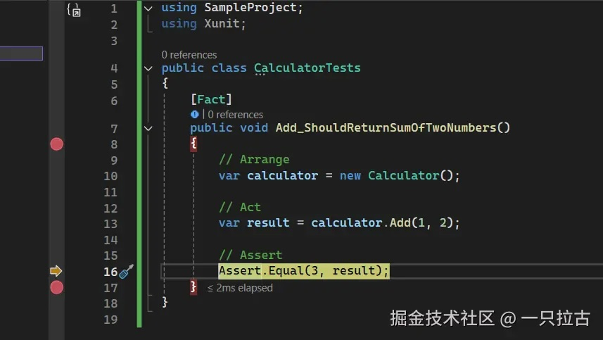
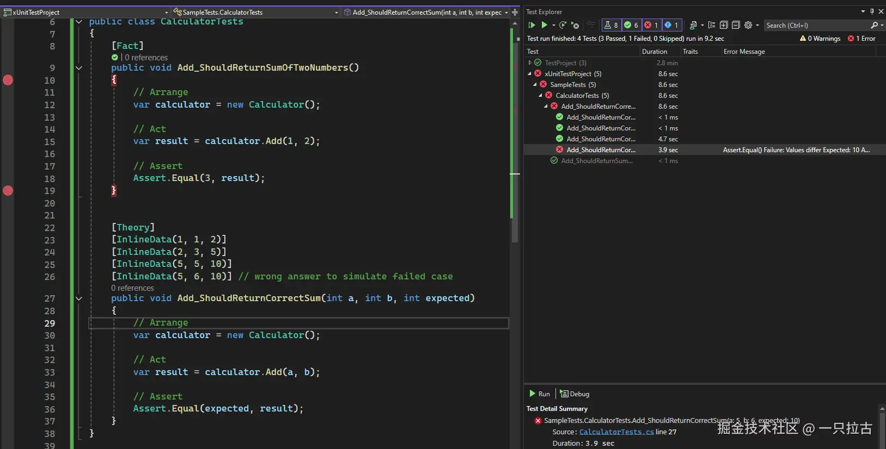

# Roadmap to Backend Programming Master: Unit Testing in .NET Core

Unit testing is a crucial part of modern software development. It ensures that the individual components of an application work as expected and helps maintain code quality over time. In this blog post, we will explore how to write unit tests in .NET Core, covering everything from setting up a test project to advanced techniques like mocking, testing asynchronous code, and continuous integration.

Unit tests are used to verify that specific parts of the code (such as methods) work as expected. They form the foundation of any testing strategy, allowing you to catch errors early and refactor your code confidently. Unlike integration tests, unit tests focus on testing small, independent parts of the code without external dependencies such as databases or APIs.

In .NET Core, you can choose from several popular testing frameworks, such as **xUnit**, **NUnit**, and **MSTest**. This guide will primarily focus on xUnit, but these concepts can be easily transferred to other frameworks.

***

## Setup

The first step is to create a new unit testing project. If you're using Visual Studio, you can do this by selecting "Add New Project" and choosing the **xUnit Test Project** template. This will create a new test project pre-configured with xUnit.

Once the project is set up, reference your main project in the test project. Simply right-click on the xUnit test project, select **Add**, then choose **Project Reference** to include the project you want to test.

***

## Structure of Unit Tests

Unit tests typically follow the **Arrange-Act-Assert** pattern:

* **Arrange**: Set up any data or dependencies required for the test.
* **Act**: Perform the action to be tested.
* **Assert**: Verify the result of the action.

In most cases, the method you're testing is in the main project, while the unit test is in the xUnit test project.

Here’s a simple example:

```csharp
// Method in Main Project
public class Calculator
{
    public int Add(int a, int b) => a + b;
}

// Unit Test
public class CalculatorTests
{
    [Fact]
    public void Add_ShouldReturnSumOfTwoNumbers()
    {
        // Arrange
        var calculator = new Calculator();

        // Act
        var result = calculator.Add(1, 2);

        // Assert
        Assert.Equal(3, result);
    }
}
```

In this test, we are checking if the `Add` method correctly adds two numbers.

### Debugging Unit Tests in xUnit

You can also debug the method you're testing directly from the xUnit test project. Here are the steps:

1. **Set breakpoints**: Add breakpoints in the method you're testing (in the main project) and the corresponding unit test (in the xUnit test project).

2. **Run tests in debug mode**:
    * Right-click on the test method in the xUnit project and select **Debug Tests**.
    * Alternatively, in the **Test Explorer**, find the test you want to debug and click **Debug**.

3. **Step through the code**: When the debugger hits the breakpoint, you can step through the code, inspect variables, trace execution flow, and see exactly how the code behaves.



***

## Mocking Dependencies

When writing unit tests, you often deal with methods that depend on external services or databases. For example, a class might need to retrieve data from a database, call an API, or interact with other services. Testing these interactions directly can make unit tests unreliable and slow because they depend on external factors.

To address this, we use **mocking**, which allows us to replace external dependencies with "fake" objects that we can control. This way, we can focus on testing the behavior of the method, not the actual implementation of the external dependencies.

It’s important to note that the goal of mocking is **not** to test the external service itself. Instead, we use mock data to ensure that the method under test correctly handles the data it receives. For example, we might want to test how the method formats or processes data, so we provide controlled mock data and validate the results. This approach allows us to focus on testing one functionality at a time.

Let’s look at a simple example where the `UserGreeting` class depends on the external `IUserService` to get the user’s name. We want to test how the `GetGreeting()` method formats the greeting message using the user's name.

```csharp
// Method in Main Project
public interface IUserService
{
    string GetUserName(int userId);
}

public class UserGreeting
{
    private readonly IUserService _userService;

    public UserGreeting(IUserService userService)
    {
        _userService = userService;
    }

    public string GetGreeting(int userId)
    {
        var userName = _userService.GetUserName(userId);
        return $"Hello, {userName}!";
    }
}
```

In this example, `UserGreeting` uses `IUserService` to get the user's name. However, in our unit test, we won’t rely on a real `IUserService` implementation. Instead, we’ll use a mock object (mock object).

```csharp
// Unit Test with Mocking
using Xunit;
using Moq;

public class UserGreetingTests
{
    [Fact]
    public void GetGreeting_ShouldReturnGreetingWithUserName()
    {
        // Arrange: Create a mock for IUserService
        var mockUserService = new Mock<IUserService>();
        
        // Set up the mock to return a fake user name when GetUserName is called
        mockUserService.Setup(service => service.GetUserName(1)).Returns("Alice");
        
        // Pass the mock object to UserGreeting
        var greeting = new UserGreeting(mockUserService.Object);

        // Act: Call the method we’re testing
        var result = greeting.GetGreeting(1);

        // Assert: Verify the result is formatted correctly
        Assert.Equal("Hello, Alice!", result);
    }
}
```

### Explanation

* **Mock Setup**: We create a mock object for `IUserService` using `Mock<IUserService>()`. This mock object simulates the behavior of the real service.

* **Controlled Data**: Using `mockUserService.Setup(service => service.GetUserName(1)).Returns("Alice")`, we specify that whenever `GetUserName(1)` is called, it will return `"Alice"`. This is the **controlled data** we’re testing with.

* **Test Focus**: We’re not testing whether the real `IUserService` works correctly (that should be done in other tests). Instead, we’re testing whether the `GetGreeting()` method in `UserGreeting` correctly formats the greeting message using the name it receives.

* **Result Validation**: Finally, we assert that the output is exactly as expected: `"Hello, Alice!"`.

By using mock objects, we ensure that:

* Our test focuses on the logic of the `GetGreeting()` method, without needing to rely on the real `IUserService` implementation.
* The test is fast and reliable, as it doesn't depend on external systems like a database or API.
* We can easily test edge cases or unexpected scenarios (e.g., how the method handles `null` or empty strings) by controlling the data returned by the mock object.

***

## Data-Driven Tests

Running the same method with different inputs can make your tests more comprehensive and robust. In xUnit, you can use the **\[Theory]** and **\[InlineData]** attributes to run the same test logic with multiple datasets, ensuring your method works correctly with different inputs.

```csharp
public class CalculatorTests
{
    [Theory]
    [InlineData(1, 1, 2)]
    [InlineData(2, 3, 5)]
    [InlineData(5, 5, 10)]
    public void Add_ShouldReturnCorrectSum(int a, int b, int expected)
    {
        // Arrange
        var calculator = new Calculator();

        // Act
        var result = calculator.Add(a, b);

        // Assert
        Assert.Equal(expected, result);
    }
}
```

In this example, we test the `Add()` method with different input pairs to check whether it returns the correct sum. The **\[InlineData]** attribute provides the data for each test run. Here, the test will run three times, once for each dataset (`(1, 1, 2)`, `(2, 3, 5)`, and `(5, 5, 10)`).

When debugging data-driven tests, Visual Studio treats each set of **\[InlineData]** as a separate test case. When stepping through the code, it will cycle through the different inputs.



***

## Other Best Practices for Writing Unit Tests

To ensure that your unit tests are effective, follow these best practices:

* **Isolate Tests**: Each test should run independently and should not rely on external systems.
* **Use Clear, Descriptive Names**: The names of test methods should clearly describe what they are testing.
* **Keep Tests Fast**: Tests should run quickly to allow for frequent execution.
* **Test Positive and Negative Scenarios**: Ensure your tests cover expected cases as well as edge cases.

***

## Using GitHub Actions for Continuous Integration

Automating unit tests through CI/CD pipelines ensures that tests are run every time a new commit is made. For example, using [**GitHub Actions**](https://docs.github.com/en/actions/use-cases-and-examples/building-and-testing/building-and-testing-net), you can create a workflow to automatically build and test your .NET Core application. Below is a simple workflow example that triggers unit tests every time a push is made to the `main` branch.

```yaml
name: .NET Core Tests

on:
  push:
    branches:
      - main

jobs:
  build:
    runs-on: ubuntu-latest

    steps:
    - uses: actions/checkout@v2
    - name: Setup .NET Core
      uses: actions/setup-dotnet@v1
      with:
        dotnet-version: '6.0.x'
    - name: Restore dependencies
      run: dotnet restore
    - name: Build
      run: dotnet build --configuration Release --no-restore
    - name: Run tests
      run: dotnet test --no-build --verbosity normal
```

### Visualizing Test Results in GitHub Actions

1. [**Test Reporter**](https://github.com/marketplace/actions/test-reporter): You can use the **Test Reporter** action to visualize test results directly on GitHub. It generates reports from test results (in XML or JSON format) and comments on the lines of code where failures occurred.

2. [**Test Summary**](https://github.com/test-summary/action): GitHub also provides the **Test Summary** action, which gives an overview of the test results directly in your CI/CD pipeline. This helps you quickly assess the impact of changes in a pull request.

3. [**Workflow Visualization Graph**](https://docs.github.com/en/actions/monitoring-and-troubleshooting-workflows/monitoring-workflows/using-the-visualization-graph): The Actions tab in GitHub includes a workflow visualization graph where you can see the status of each job in the pipeline. This is useful for tracking which stage passed or failed during test execution.

***

## Using Coverlet for Code Coverage

To ensure your tests cover the main parts of your codebase, you can integrate [**Coverlet**](https://learn.microsoft.com/en-us/dotnet/core/testing/unit-testing-code-coverage?tabs=windows) for code coverage analysis in your .NET Core project.

### Setting up Coverlet

1. **Install Coverlet**: Add the `coverlet.collector` package to your test project using the NuGet package manager.

2. **Run Tests and Collect Coverage**: After installing Coverlet, you can collect code coverage data by running the following command:

    ```bash
    dotnet test --collect:"XPlat Code Coverage"
    ```

    This will generate a coverage report in the `TestResults` directory.

3. **Generate Detailed Report**: To get a more readable report, you can use the `ReportGenerator` tool. Install it using the following command:

    ```bash
    dotnet tool install -g dotnet-reportgenerator-globaltool
    ```

    Then generate the report:

    ```bash
    reportgenerator -reports:TestResults/**/*.xml -targetdir:coveragereport
    ```

    This will create an HTML coverage report in the `coveragereport` directory. Open `index.html` to view detailed line-by-line coverage information.

### Integrating Coverlet with GitHub Actions

You can also automate the code coverage process within your GitHub Actions workflow. Here’s an example of how to integrate Coverlet:

```yaml
name: CI

on: [push, pull_request]

jobs:
  build:
    runs-on: ubuntu-latest

    steps:
    - uses: actions/checkout@v2
    - name: Setup .NET
      uses: actions/setup-dotnet@v3
      with:
        dotnet-version: '7.0'
    - run: dotnet restore
    - run: dotnet build --no-restore
    - run: dotnet test --no-build --collect:"XPlat Code Coverage"
    - name: Generate Coverage Report
      run: |
        dotnet tool install -g dotnet-reportgenerator-globaltool
        reportgenerator -reports:TestResults/**/*.xml -targetdir:coveragereport
    - name: Upload Coverage Report
      uses: actions/upload-artifact@v3
      with:
        name: coverage-report
        path: coveragereport
```

This workflow will:

* Run your unit tests
* Collect code coverage data
* Generate an HTML report
* Upload the report as an artifact, allowing you to download and review it later.

***

## Conclusion

Unit testing in .NET Core is an essential practice for maintaining high-quality code. By following the steps outlined in this guide, you will be able to set up unit tests, mock dependencies, handle asynchronous code, and automate the testing process. As you progressively improve your test suite, you'll find that you can catch bugs earlier and safely refactor your code.

Happy testing!
