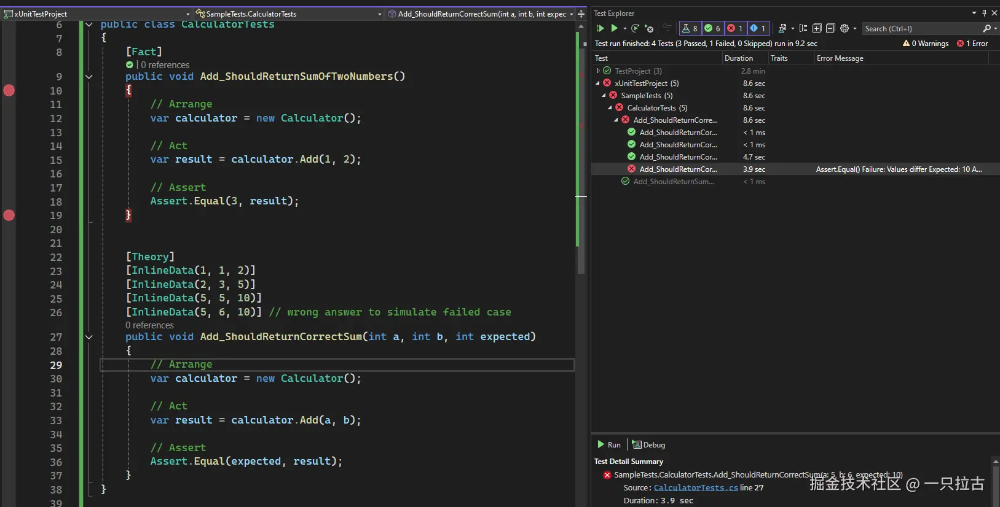

# 在 .NET Core 中进行单元测试：全面指南

单元测试是现代软件开发中至关重要的一部分。它确保应用程序的各个组件按预期工作，并有助于随着时间推移保持代码质量。在这篇博客文章中，我们将探讨如何在 .NET Core 中编写单元测试，涵盖从设置测试项目到高级技术（如模拟、异步代码测试和持续集成）的方方面面。

单元测试用于验证代码的特定部分（例如方法）是否按预期工作。它们构成任何测试策略的基础，使您能够及早发现错误并自信地重构代码。与集成测试不同，单元测试专注于测试代码的独立小部分，而无需外部依赖（如数据库或 API）。

在 .NET Core 中，您可以选择几种流行的测试框架，例如 **xUnit**、**NUnit** 和 **MSTest**。在本指南中，我们将主要关注 xUnit，但这些概念可以轻松地转移到其他框架中。

***

## 设置

第一步是创建一个新的单元测试项目。如果您使用的是 Visual Studio，可以通过选择“添加新项目”并选择 **xUnit 测试项目**模板来完成。这将创建一个已预先配置了 xUnit 的新测试项目。

设置项目后，在测试项目中引用您的主项目。只需右键单击 xUnit 测试项目，选择**添加**，然后选择**项目引用**，以包含您要测试的项目。

***

## 单元测试的结构

单元测试通常遵循 **安排-执行-断言 (Arrange-Act-Assert)** 模式：

* **安排 (Arrange)**：设置测试所需的数据或依赖项。
* **执行 (Act)**：执行要测试的操作。
* **断言 (Assert)**：验证操作的结果。

在大多数情况下，您正在测试的方法位于主项目中，而单元测试位于 xUnit 测试项目中。

以下是一个简单的例子：

```csharp
// 主项目中的方法
public class Calculator
{
    public int Add(int a, int b) => a + b;
}

// 单元测试
public class CalculatorTests
{
    [Fact]
    public void Add_ShouldReturnSumOfTwoNumbers()
    {
        // 安排
        var calculator = new Calculator();

        // 执行
        var result = calculator.Add(1, 2);

        // 断言
        Assert.Equal(3, result);
    }
}
```

在这个测试中，我们检查 `Add` 方法是否正确地将两个数字相加。

### 在 xUnit 中调试单元测试

您还可以直接从 xUnit 测试项目中调试正在测试的方法。以下是具体步骤：

1. **设置断点 (breakpoints)**：在您要测试的方法（主项目中）和相应的单元测试（xUnit 测试项目中）添加断点。

2. **以调试模式运行测试**：
    * 右键单击 xUnit 项目中的测试方法，选择 **Debug Tests**（调试测试）。
    * 或者，在 **Test Explorer**（测试资源管理器）中找到您要调试的测试，然后点击 **Debug**（调试）。

3. **逐步执行代码**：当调试器命中断点时，您可以逐步执行代码，检查变量，跟踪执行流程，查看代码的具体行为。


***

## 模拟依赖项

当编写单元测试时，您经常会遇到依赖外部服务或数据库的方法。例如，一个类可能需要从数据库获取数据、调用 API 或与其他服务交互。直接测试这些交互可能会导致单元测试不可靠且较慢，因为它们依赖于外部因素。

为了解决这个问题，我们使用 **模拟（mocking）**，这允许我们用“假”对象替换外部依赖项，并对其进行控制。通过这种方式，我们可以专注于测试方法的行为，而不必担心外部依赖项的实际实现。

需要注意的是，模拟的目的是**不**测试外部服务本身。相反，我们使用模拟数据来确保被测试的方法在**接收到数据时能够正确处理**。例如，我们希望测试方法如何格式化或处理数据，因此我们提供可控的假数据，并验证结果。这样的方法可以帮助我们专注于一次测试一个功能。

让我们来看一个简单的例子，其中类 `UserGreeting` 依赖于外部的 `IUserService` 来获取用户的姓名。我们希望测试 `GetGreeting()` 方法如何使用用户的姓名格式化问候消息。

```csharp
// Method in Main Project
public interface IUserService
{
    string GetUserName(int userId);
}

public class UserGreeting
{
    private readonly IUserService _userService;

    public UserGreeting(IUserService userService)
    {
        _userService = userService;
    }

    public string GetGreeting(int userId)
    {
        var userName = _userService.GetUserName(userId);
        return $"Hello, {userName}!";
    }
}
```

在这个例子中，`UserGreeting` 使用 `IUserService` 来获取用户的姓名。然而，在我们的单元测试中，我们不会依赖真实的 `IUserService` 实现，而是使用一个模拟对象（mock object）。

```csharp
// Unit Test with Mocking
using Xunit;
using Moq;

public class UserGreetingTests
{
    [Fact]
    public void GetGreeting_ShouldReturnGreetingWithUserName()
    {
        // Arrange: Create a mock for IUserService
        var mockUserService = new Mock<IUserService>();
        
        // Set up the mock to return a fake user name when GetUserName is called
        mockUserService.Setup(service => service.GetUserName(1)).Returns("Alice");
        
        // Pass the mock object to UserGreeting
        var greeting = new UserGreeting(mockUserService.Object);

        // Act: Call the method we’re testing
        var result = greeting.GetGreeting(1);

        // Assert: Verify the result is formatted correctly
        Assert.Equal("Hello, Alice!", result);
    }
}
```

### 解释

* **模拟设置**：我们使用 `Mock<IUserService>()` 为 `IUserService` 接口创建了一个模拟对象。这个模拟对象模拟了真实服务的行为。

* **受控数据**：通过 `mockUserService.Setup(service => service.GetUserName(1)).Returns("Alice")`，我们指定每当调用 `GetUserName(1)` 时，返回 `"Alice"`。这是我们测试的**受控数据**。

* **测试重点**：我们不是在测试真实的 `IUserService` 是否工作正常（那应该在其他测试中完成）。我们测试的重点是 `UserGreeting` 类中的 `GetGreeting()` 方法是否正确地使用接收到的姓名格式化问候信息。

* **结果验证**：最后，我们断言输出结果与预期完全一致，即 `"Hello, Alice!"`。

通过使用模拟对象，我们可以确保：

* 我们将测试重点放在 `GetGreeting()` 方法的逻辑上，而不需要依赖真实的 `IUserService` 实现。
* 测试快速且可靠，因为它不依赖于外部系统如数据库或 API。
* 通过控制模拟对象返回的数据，我们可以轻松测试边界情况或意外场景（例如测试方法如何处理 `null` 值或空字符串）。

***

## 数据驱动测试

测试相同的方法但使用不同的输入可以使你的测试更加全面和稳健。在 xUnit 中，你可以使用 **\[Theory]** 和 **\[InlineData]** 特性来使用多个数据集运行相同的测试逻辑，从而确保你的方法在不同的输入下表现正确。

```csharp
public class CalculatorTests
{
    [Theory]
    [InlineData(1, 1, 2)]
    [InlineData(2, 3, 5)]
    [InlineData(5, 5, 10)]
    public void Add_ShouldReturnCorrectSum(int a, int b, int expected)
    {
        // 安排
        var calculator = new Calculator();

        // 执行
        var result = calculator.Add(a, b);

        // 断言
        Assert.Equal(expected, result);
    }
}
```

在这个例子中，我们使用不同的输入对来测试 `Add()` 方法，以检查它是否返回正确的和。**\[InlineData]** 特性提供了每次测试运行的数据。在这里，测试将运行三次，每次使用一个数据集（`(1, 1, 2)`、`(2, 3, 5)` 和 `(5, 5, 10)`）。

在调试数据驱动的测试时，Visual Studio 会将每组 **\[InlineData]** 视为一个单独的测试用例。当你逐步执行代码时，它将依次循环不同的输入。



## 编写单元测试的其他最佳实践

为了确保你的单元测试有效，请遵循以下最佳实践：

* **隔离测试**：每个测试应该独立运行，不依赖于外部系统。
* **使用清晰、描述性的名称**：测试方法的名称应该清楚地描述它们在测试什么。
* **保持测试快速**：测试应该运行迅速，以便可以经常执行。
* **测试正面和负面场景**：确保你的测试覆盖了预期的情况和边界情况。

***

## 使用 GitHub Actions 进行持续集成

通过 CI/CD 管道自动化单元测试可以确保每次新提交时都会运行测试。例如，使用 [**GitHub Actions**](https://docs.github.com/en/actions/use-cases-and-examples/building-and-testing/building-and-testing-net)，你可以创建一个工作流来自动构建和测试你的 .NET Core 应用程序。下面是一个简单的工作流示例，它会在每次推送到 `main` 分支时触发单元测试。

```yaml
name: .NET Core Tests

on:
  push:
    branches:
      - main

jobs:
  build:
    runs-on: ubuntu-latest

    steps:
    - uses: actions/checkout@v2
    - name: Setup .NET Core
      uses: actions/setup-dotnet@v1
      with:
        dotnet-version: '6.0.x'
    - name: Restore dependencies
      run: dotnet restore
    - name: Build
      run: dotnet build --configuration Release --no-restore
    - name: Run tests
      run: dotnet test --no-build --verbosity normal
```

### GitHub Actions 中的测试结果可视化

1. [**测试报告 (Test Reporter)**](https://github.com/marketplace/actions/test-reporter)：你可以使用 **测试报告器** 动作直接在 GitHub 上可视化测试结果。它从测试结果（XML 或 JSON 格式）生成报告，并注释代码中的失败行。

2. [**测试总结 (Test Summary)**](https://github.com/test-summary/action)：GitHub 还提供了 **测试总结** 动作，它在你的 CI/CD 管道中直接提供测试结果的概述。这有助于你快速评估拉取请求中的更改影响。

3. [**工作流可视化图 (Workflow Visualization Graph)**](https://docs.github.com/en/actions/monitoring-and-troubleshooting-workflows/monitoring-workflows/using-the-visualization-graph)：GitHub 的 Actions 选项卡包括一个工作流可视化图，你可以在其中查看管道中每个作业的状态。这对于跟踪测试执行期间哪个阶段通过或失败很有用。

***

## 使用 Coverlet 进行代码覆盖率检测

为了确保你的测试覆盖了代码库的主要部分，你可以在你的 .NET Core 项目中集成 [**Coverlet**](https://learn.microsoft.com/en-us/dotnet/core/testing/unit-testing-code-coverage?tabs=windows) 进行代码覆盖率分析。

### 设置 Coverlet

1. **安装 Coverlet**：使用 NuGet 包管理器将 `coverlet.collector` 包添加到你的测试项目中。

2. **运行测试并收集覆盖率**：添加 Coverlet 后，你可以通过运行以下命令收集代码覆盖率数据：

    ```bash
    dotnet test --collect:"XPlat Code Coverage"
    ```

    这将在 `TestResults` 目录中生成一个覆盖率报告。

3. **生成详细报告**：要获得更易读的报告，可以使用 `ReportGenerator` 工具。使用以下命令安装它：

    ```bash
    dotnet tool install -g dotnet-reportgenerator-globaltool
    ```

    然后，生成报告：

    ```bash
    reportgenerator -reports:TestResults/**/*.xml -targetdir:coveragereport
    ```

    这将在 `coveragereport` 目录中创建一个 HTML 覆盖率报告。打开 `index.html` 以查看详细的逐行覆盖信息。

### 将 Coverlet 集成到 GitHub Actions 中

你还可以在 GitHub Actions 工作流中自动化代码覆盖率过程。以下是如何集成 Coverlet 的示例：

```yaml
name: CI

on: [push, pull_request]

jobs:
  build:
    runs-on: ubuntu-latest

    steps:
    - uses: actions/checkout@v2
    - name: 设置 .NET
      uses: actions/setup-dotnet@v3
      with:
        dotnet-version: '7.0'
    - run: dotnet restore
    - run: dotnet build --no-restore
    - run: dotnet test --no-build --collect:"XPlat Code Coverage"
    - name: 生成覆盖率报告
      run: |
        dotnet tool install -g dotnet-reportgenerator-globaltool
        reportgenerator -reports:TestResults/**/*.xml -targetdir:coveragereport
    - name: 上传覆盖率报告
      uses: actions/upload-artifact@v3
      with:
        name: coverage-report
        path: coveragereport
```

这个工作流将：

* 运行你的单元测试
* 收集代码覆盖率数据
* 生成一个 HTML 报告
* 将报告作为一个工件上传，使你可以稍后下载和查看。

***

## 结论

在 .NET Core 中进行单元测试是维护高质量代码的必要实践。通过遵循本指南中概述的步骤，你将能够设置单元测试、模拟依赖项、处理异步代码，并自动化测试过程。随着你逐步完善你的测试套件，你会发现能够更早地捕捉到漏洞并安全地重构代码。

祝测试愉快！
