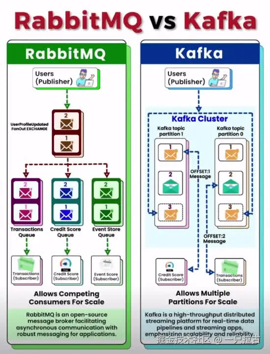

# Roadmap to Backend Programming Master: Understanding and Implementing Message Brokers in .NET Applications

## Message Brokers

A **message broker** is a middleware system that facilitates communication between distributed components or services by receiving, routing, and delivering messages. They act as intermediaries, decoupling message producers (senders) from consumers (receivers), thus enhancing system flexibility, scalability, and resilience.


In distributed architectures, synchronous communication (e.g., REST API calls) can lead to tightly coupled services, where the failure of one service may impact others. Message brokers solve this problem by enabling asynchronous communication, allowing producers and consumers to operate independently. This asynchronous model ensures that messages are reliably stored and delivered even when the target service is temporarily unavailable.

**Real-world scenarios:**

- **Real-time data processing:** In applications like stock trading platforms or IoT systems, data must be processed and transmitted in real time. Message brokers like Kafka can handle millions of events per second, ensuring efficient data flow.
- **Event-driven architecture:** Modern microservices use event-driven architectures, communicating through events (messages). For example, in an e-commerce application, the order service publishes an event when an order is created, triggering inventory and payment services.
- **Task queues:** Message brokers like RabbitMQ are used for background task distribution. For instance, in video processing systems, uploaded videos can be queued for asynchronous processing without blocking the main application.

---

## Core Concepts of Message Brokers

To understand message brokers, it's essential to grasp a few core concepts:

- **Producers and Consumers:**
  - **Producers:** Entities (applications or services) that send messages to the message broker.
  - **Consumers:** Entities that receive and process messages from the broker. Decoupling producers and consumers allows independent scalability.

- **Topics, Queues, and Exchanges:**
  - **Queue:** Used for point-to-point messaging, where each message is processed by a single consumer.
  - **Topic:** Used in publish-subscribe systems, where multiple consumers can subscribe to a topic and receive the same message.
  - **Exchange:** In RabbitMQ, an exchange receives messages from producers and routes them to queues based on predefined rules (e.g., direct, topic, fanout).

- **Message Delivery Guarantees:**
  - **At-Most-Once:** Messages are delivered only once, but delivery is not guaranteed in case of failure.
  - **At-Least-Once:** Ensures messages are delivered at least once, though duplicates may occur.
  - **Exactly-Once:** Guarantees each message is delivered exactly once, preventing duplicates or losses. This is the most complex but essential mode for transactional systems.

- **Persistence and Acknowledgments:**
  - **Persistence:** Messages can be stored on disk, ensuring they aren't lost if the broker crashes.
  - **Acknowledgments:** Consumers confirm receipt of messages. If acknowledgment fails, messages can be retried, ensuring reliable delivery.

- **Asynchronous vs. Synchronous Communication:**
  - **Synchronous:** The producer waits for a consumer response, leading to tight coupling.
  - **Asynchronous:** The producer sends messages and continues processing without waiting, improving performance and system resilience by decoupling components.

---

## Types of Message Brokers

Message brokers can be categorized based on their messaging patterns:

- **Point-to-Point (Queue-based):**\
   In this model, each message is delivered to a single consumer. Suitable for scenarios where tasks need to be distributed among multiple workers.
  - **Example:** **RabbitMQ** uses queues to ensure that each message is processed by only one consumer. Ideal for background task processing or task queues where each task is handled once.

- **Publish/Subscribe (Topic-based):**\
   In this model, messages are published to a topic, and multiple consumers can subscribe to receive the same message. Useful for broadcasting events to multiple services.
  - **Example:** **Apache Kafka** is designed for high-throughput event streams, where each message can be consumed by multiple services. Commonly used for real-time analytics or monitoring systems.

---

## Overview of Popular Message Brokers

Here's a brief comparison of some popular message brokers, highlighting their unique features:



- **Apache Kafka:**
  - **Overview:** A distributed event streaming platform designed for high throughput and fault-tolerant message handling.
  - **Features:** Supports partitioned logs, ensuring scalability and fault tolerance. Excels in real-time analytics, log aggregation, and event stream processing.
  - **Use cases:** Large-scale data pipelines, real-time analytics, and event-driven architectures.

- **RabbitMQ:**
  - **Overview:** A message queue system based on the AMQP protocol, known for reliability and flexibility.
  - **Features:** Supports various exchange types (direct, topic, fanout), message acknowledgments, and persistence. Lightweight and easy to deploy.
  - **Use cases:** Task queues, background task processing, and scenarios requiring complex routing patterns.

- **MQTT:**
  - **Overview:** A lightweight publish-subscribe protocol designed for low-bandwidth, high-latency networks, making it ideal for IoT applications.
  - **Features:** Optimized for constrained devices, supports small message sizes and efficient bandwidth usage. Provides QoS levels to ensure reliable delivery.
  - **Use cases:** IoT applications like remote monitoring, sensor networks, and smart home devices.
  - **Reference:** For more details, see [my blog on using MQTT in .NET applications](../Industry_Experience/10_MQTT_CN.md).

---

## Implementing RabbitMQ in .NET

Integrating RabbitMQ into a .NET application involves setting up the RabbitMQ server, implementing producers and consumers, and configuring various exchange types. Here’s a quick guide to get started:

### **Setup and Configuration**

First, install RabbitMQ on your system. Download it from the [RabbitMQ official website](https://www.rabbitmq.com/download.html) and follow the installation instructions. Ensure Erlang is installed as it is a dependency for RabbitMQ.

Once installed, start the RabbitMQ service and access the management UI at `http://localhost:15672` (default credentials: guest/guest). This UI allows you to monitor queues, exchanges, and messages.

### **Producer Implementation**

To send messages from a .NET application, install the `RabbitMQ.Client` NuGet package:

```bash
dotnet add package RabbitMQ.Client
```

Here’s a simple producer example:

```csharp
using RabbitMQ.Client;
using System.Text;

class Producer
{
    public static void Main()
    {
        var factory = new ConnectionFactory() { HostName = "localhost" };
        using (var connection = factory.CreateConnection())
        using (var channel = connection.CreateModel())
        {
            channel.QueueDeclare(queue: "hello", durable: false, exclusive: false, autoDelete: false, arguments: null);

            string message = "Hello RabbitMQ!";
            var body = Encoding.UTF8.GetBytes(message);

            channel.BasicPublish(exchange: "", routingKey: "hello", basicProperties: null, body: body);
            Console.WriteLine($" [x] Sent {message}");
        }
    }
}
```

### **Consumer Implementation**

To receive and process messages, implement a consumer as follows:

```csharp
using RabbitMQ.Client;
using RabbitMQ.Client.Events;
using System.Text;

class Consumer
{
    public static void Main()
    {
        var factory = new ConnectionFactory() { HostName = "localhost" };
        using (var connection = factory.CreateConnection())
        using (var channel = connection.CreateModel())
        {
            channel.QueueDeclare(queue: "hello", durable: false, exclusive: false, autoDelete: false, arguments: null);

            var consumer = new EventingBasicConsumer(channel);
            consumer.Received += (model, ea) =>
            {
                var body = ea.Body.ToArray();
                var message = Encoding.UTF8.GetString(body);
                Console.WriteLine($" [x] Received {message}");
            };
            channel.BasicConsume(queue: "hello", autoAck: true, consumer: consumer);

            Console.WriteLine(" Press [enter] to exit.");
            Console.ReadLine();
        }
    }
}
```

### **Exchange Types**

RabbitMQ supports different exchange types for routing messages:

- **Direct Exchange:** Routes messages based on exact routing key matches.
- **Topic Exchange:** Routes messages based on wildcard matches in the routing key.
- **Fanout Exchange:** Broadcasts messages to all bound queues.
- **Headers Exchange:** Routes messages based on header properties.

Example for setting up a direct exchange:

```csharp
channel.ExchangeDeclare(exchange: "direct_logs", type: ExchangeType.Direct);
channel.QueueBind(queue: "hello", exchange: "direct_logs", routingKey: "info");
```

### **Error Handling and Retry Mechanisms**

To ensure reliable message processing, implement error handling and retry mechanisms. Use `try-catch` blocks and consider using dead-letter exchanges (DLX) for failed messages:

```csharp
try
{
    // Message processing logic
}
catch (Exception ex)
{
    Console.WriteLine($"Error processing message: {ex.Message}");
    // Optionally requeue the message or log it to a dead-letter exchange
}
```

### **References**

For more details, refer to the [RabbitMQ official documentation](https://www.rabbitmq.com/documentation.html).

---

## Implementing Apache Kafka in .NET

Apache Kafka is a powerful distributed event-streaming platform that integrates seamlessly with .NET applications. This section guides you through setting up Kafka, producing and consuming messages, and introduces advanced concepts like partitions and offsets.

### **Setting Up Kafka**

1. **Download and Install Kafka:**
   - Download Kafka from the [Apache Kafka official website](https://kafka.apache.org/downloads).
   - Extract the archive and navigate to the Kafka directory.

2. **Start Zookeeper and Kafka Servers:**\
   Open a terminal or command prompt and run the following commands:

   ```bash
   # Start Zookeeper
   bin/zookeeper-server-start.sh config/zookeeper.properties

   # Start Kafka broker
   bin/kafka-server-start.sh config/server.properties
   ```

3. **Create a Kafka Topic:**\
   Kafka topics store messages. You can create a topic with the following command:

   ```bash
   bin/kafka-topics.sh --create --topic test-topic --bootstrap-server localhost:9092 --partitions 1 --replication-factor 1
   ```

### **Producing Messages**

To send messages from a .NET application, use the `Confluent.Kafka` NuGet package:

```bash
dotnet add package Confluent.Kafka
```

**Kafka Producer Example:**

```csharp
using Confluent.Kafka;
using System;
using System.Threading.Tasks;

class KafkaProducer
{
    public static async Task Main()
    {
        var config = new ProducerConfig { BootstrapServers = "localhost:9092" };

        using (var producer = new ProducerBuilder<string, string>(config).Build())
        {
            try
            {
                var message = new Message<string, string> { Key = "key1", Value = "Hello Kafka!" };
                var deliveryReport = await producer.ProduceAsync("test-topic", message);
                Console.WriteLine($"Delivered '{message.Value}' to '{deliveryReport.TopicPartitionOffset}'");
            }
            catch (ProduceException<string, string> e)
            {
                Console.WriteLine($"Delivery failed: {e.Error.Reason}");
            }
        }
    }
}
```

### **Consuming Messages**

To consume messages, implement a Kafka consumer:

**Kafka Consumer Example:**

```csharp
using Confluent.Kafka;
using System;

class KafkaConsumer
{
    public static void Main()
    {
        var config = new ConsumerConfig
        {
            BootstrapServers = "localhost:9092",
            GroupId = "consumer-group-1",
            AutoOffsetReset = AutoOffsetReset.Earliest
        };

        using (var consumer = new ConsumerBuilder<string, string>(config).Build())
        {
            consumer.Subscribe("test-topic");

            try
            {
                while (true)
                {
                    var consumeResult = consumer.Consume();
                    Console.WriteLine($"Consumed message '{consumeResult.Message.Value}' at: '{consumeResult.TopicPartitionOffset}'");
                }
            }
            catch (OperationCanceledException)
            {
                consumer.Close();
            }
        }
    }
}
```

### **Partitions and Offset Handling**

- **Partitions:** Kafka topics are divided into multiple partitions to distribute the load across brokers. Each partition contains uniquely indexed messages.
- **Offsets:** Represent the position of messages in a partition. Consumers track offsets to resume processing from the correct position during recovery.

Kafka's partitioning mechanism ensures parallel processing and scalability:

- Multiple consumers in the same group can read from different partitions simultaneously.
- Offsets ensure consumers process messages in order and prevent message loss during restarts.

### **Kafka Streams and Real-Time Processing**

Kafka Streams is a client library for real-time data processing and transformation within Kafka. It enables building real-time applications that process Kafka topics and write results back to topics.

Key features include:

- **Stateful and stateless processing:** Aggregate data or apply transformations.
- **Windowing:** Perform time-based aggregations.

> *Note:* Kafka Streams support in .NET is available through third-party libraries like [Kafka.Streams.NET](https://github.com/streamiz/Streamiz.Kafka.Net). For more details, refer to the [official Confluent Kafka for .NET documentation](https://docs.confluent.io/clients-confluent-kafka-dotnet/current/index.html).

---

## Kafka vs. RabbitMQ: Choosing the Right Message Broker

Choosing Apache Kafka or RabbitMQ depends on your application's specific requirements. Below is a detailed comparison to help you make an informed decision:

### **Performance and Throughput**

- **Apache Kafka:**
  Designed for high throughput, Kafka can handle massive amounts of data and is ideal for real-time data stream processing. It supports horizontal scaling through distributed partitions, capable of processing millions of messages per second with low latency.

- **RabbitMQ:**
  While RabbitMQ's throughput is lower than Kafka's, it offers lower latency and more predictable performance, making it suitable for smaller workloads. It is optimized for message queuing and task distribution, ideal for applications with high reliability and acknowledgment requirements.

### **Complexity and Learning Curve**

- **Kafka:**
  Kafka's distributed architecture, along with concepts like partitions, offsets, and brokers, makes the learning curve steeper. Setting up Kafka requires understanding Zookeeper (or the newer KRaft) and managing a distributed system.

- **RabbitMQ:**
  RabbitMQ setup and configuration are relatively simpler. It follows a more straightforward queue-based model, and its management UI provides intuitive monitoring and control. This makes RabbitMQ more accessible for smaller projects or teams new to message brokers.

### **Use Cases**

- **Kafka:**
  - **Event streaming:** Continuous real-time data flow processing.
  - **Analytics pipelines:** Large-scale log and clickstream data processing.
  - **Microservices communication:** Broadcasting messages to multiple consumers.

- **RabbitMQ:**
  - **Task queues:** Distributing work across multiple consumers (e.g., background tasks).
  - **Order processing:** Ensuring reliable message delivery and processing.
  - **IoT applications:** Lightweight messaging with guaranteed delivery.

### **Integration with .NET Ecosystem**

- **Kafka:**
  The **Confluent.Kafka** library provides robust .NET support, enabling developers to easily build producers, consumers, and stream processing applications. Kafka integrates seamlessly with ASP.NET Core and is widely used in high-throughput scenarios.

- **RabbitMQ:**
  The **RabbitMQ.Client** library works well with .NET, offering comprehensive support for message publishing and consumption. RabbitMQ integrates effectively with .NET Core and ASP.NET applications.

---

## Best Practices and Challenges

Implementing a message broker in a production environment comes with challenges. Follow these best practices to ensure system reliability:

### **Scalability Considerations**

- **Horizontal scaling:** Both Kafka and RabbitMQ support horizontal scaling. Kafka achieves this through partitions, while RabbitMQ uses clustering.
- **Load balancing:** Distribute messages across multiple consumers or brokers to avoid bottlenecks.

### **Error Handling**

- **Dead-letter queues (DLQ):** Use DLQs to handle messages that cannot be processed successfully.
- **Retries:** Implement retry logic with exponential backoff to avoid message loss.
- **Poison message handling:** Identify and isolate problematic messages to prevent repeated failures.

### **Security**

- **SSL/TLS:** Enable encrypted communication between producers, consumers, and brokers.
- **Authentication and authorization:** Use Kafka's SASL mechanisms and RabbitMQ's built-in user management for access control.
- **Firewall rules:** Restrict access to broker ports to ensure only authorized services can communicate.

### **Monitoring and Logging**

- **Kafka:** Use tools like **Kafka Manager**, **Confluent Control Center**, and **Prometheus** for monitoring.
- **RabbitMQ:** Leverage the built-in **RabbitMQ Management Plugin** and tools like **Grafana** for real-time monitoring.
- **Logging:** Enable detailed logging to track message flow, errors, and broker health.

---

## Conclusion and Key Takeaways

Message brokers play a vital role in modern distributed systems, supporting asynchronous communication, decoupling components, and improving scalability. Key points:

- **Kafka:** Best suited for real-time data streaming, event processing, and high-throughput scenarios.
- **RabbitMQ:** Ideal for task queues, reliable messaging, and simpler setups.

The choice of message broker depends on your project's needs—consider factors like performance, complexity, and use cases. Both Kafka and RabbitMQ integrate well with .NET and provide robust libraries for implementing producers and consumers.

---

## Resources and References

- [Apache Kafka Official Documentation](https://kafka.apache.org/documentation/)
- [RabbitMQ Official Documentation](https://www.rabbitmq.com/documentation.html)
- [Confluent Kafka for .NET](https://docs.confluent.io/clients-confluent-kafka-dotnet/current/index.html)
- [RabbitMQ.Client NuGet Page](https://www.nuget.org/packages/RabbitMQ.Client/)
- **Previous Blog:** [Implementing MQTT in .NET Applications](../Industry_Experience/10_MQTT_EN.md) – A lightweight IoT messaging solution.

**Recommended Reading:**

- *Designing Data-Intensive Applications* by Martin Kleppmann  
- *Kafka: The Definitive Guide* by Neha Narkhede, Gwen Shapira, Todd Palino
