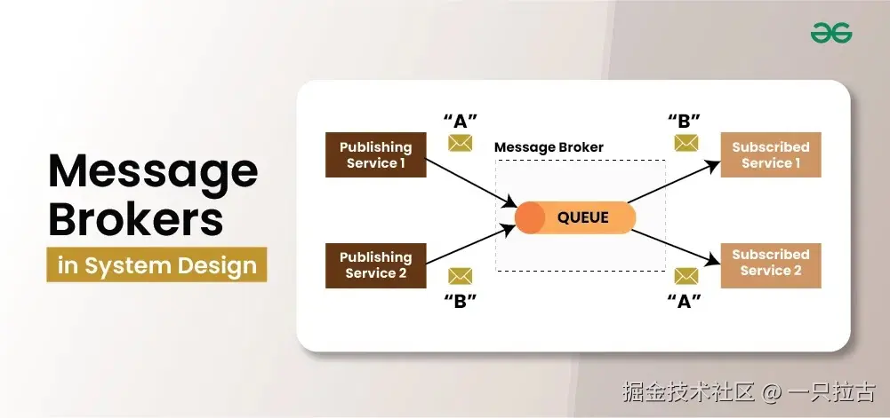
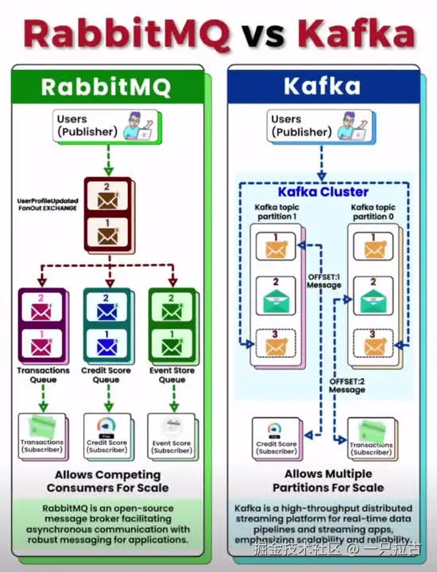

# 后端编程大师之路：在 .NET 应用中理解并实现消息代理

## 消息代理

消息代理是一种中间件系统，通过接收、路由和传递消息来促进分布式组件或服务之间的通信。它们充当中介，将消息生产者（发送方）与消费者（接收方）解耦，从而增强系统的灵活性、可扩展性和弹性。



在分布式架构中，同步通信（如 REST API 调用）会导致服务之间的紧密耦合，这意味着一个服务的故障可能会影响其他服务。消息代理通过实现异步通信解决了这个问题，使生产者和消费者能够独立运行。这种异步模型确保消息被可靠地存储和传递，即使目标服务暂时不可用。

**实际场景：**

* **实时数据处理：** 在股票交易平台或物联网系统等应用中，数据必须实时处理和传输。Kafka 等消息代理能够每秒处理数百万个事件，确保数据高效流动。
* **事件驱动架构：** 现代微服务使用事件驱动架构，通过事件（消息）进行通信。例如，在电商应用中，订单服务在订单创建时发布事件，从而触发库存和支付服务。
* **任务队列：** RabbitMQ 等消息代理用于后台任务分发。例如，在视频处理系统中，上传的视频可以异步排队处理，而不会阻塞主应用程序。

***

## 消息代理的核心概念

理解消息代理需要熟悉几个核心概念：

* **生产者与消费者：**
  * **生产者：** 发送消息到消息代理的实体（应用程序或服务）。
  * **消费者：** 从代理接收并处理消息的实体。生产者和消费者的解耦使系统能够独立扩展。

* **主题、队列与交换机：**
  * **队列：** 用于点对点消息传递，每条消息只由一个消费者处理。
  * **主题：** 用于发布-订阅系统，多个消费者可以订阅一个主题并接收相同的消息。
  * **交换机：** 在 RabbitMQ 中，交换机接收生产者的消息，并根据预定义规则（如 direct、topic、fanout）将消息路由到队列。

* **消息投递保证：**
  * **至多一次 (At-Most-Once)：** 消息仅投递一次，但如果发生问题，投递无法保证。
  * **至少一次 (At-Least-Once)：** 确保消息至少投递一次，可能会有重复消息。
  * **仅一次 (Exactly-Once)：** 确保每条消息恰好投递一次，防止重复或丢失。这是最复杂但对事务系统至关重要的模式。

* **持久性与确认：**
  * **持久性：** 消息可以持久存储在磁盘上，确保在代理崩溃时不会丢失。
  * **确认：** 消费者确认收到消息。如果确认失败，消息可以重试，确保可靠投递。

* **异步与同步通信：**
  * **同步：** 生产者等待消费者的响应，导致紧密耦合。
  * **异步：** 生产者发送消息后继续处理，而无需等待，提高性能并通过解耦系统组件增强弹性。

***

## 消息代理的类型

根据消息传递模式，消息代理可以分为两大类：

* **点对点（基于队列）：**\
    在此模型中，每条消息仅传递给一个消费者。适用于需要将任务分配给多个工作者的场景。
  * **示例：** **RabbitMQ** 使用队列确保每条消息只被一个消费者处理。适合后台任务处理或任务队列，每个任务只需处理一次。

* **发布/订阅（基于主题）：**\
    在此模型中，消息发布到一个主题，多个消费者可以订阅并接收相同的消息。适合向多个服务广播事件。
  * **示例：** **Apache Kafka** 专为高吞吐量事件流设计，每条消息可以被多个服务消费。常用于实时分析或监控系统。

***

## 主流消息代理概述

以下是对一些主流消息代理的简要比较，突出它们的独特特性：



* **Apache Kafka：**
  * **概述：** Kafka 是一个分布式事件流平台，专为高吞吐量和容错消息处理设计。
  * **特性：** 支持分区日志，确保可扩展性和容错性。擅长实时分析、日志聚合和事件流处理。
  * **使用场景：** 大规模数据管道、实时分析和事件驱动架构。

* **RabbitMQ：**
  * **概述：** RabbitMQ 是基于 AMQP 协议的消息队列系统，以可靠性和灵活性著称。
  * **特性：** 支持多种交换机类型（direct、topic、fanout）、消息确认和持久性。轻量且易于部署。
  * **使用场景：** 任务队列、后台任务处理，以及需要复杂路由模式的场景。

* **MQTT：**
  * **概述：** MQTT 是一种轻量级发布-订阅协议，专为低带宽、高延迟网络设计，非常适合物联网应用。
  * **特性：** 针对受限设备进行优化，支持小消息大小和高效带宽利用。提供 QoS 级别，确保可靠投递，设计简单。
  * **使用场景：** 物联网应用，如远程监控、传感器网络和智能家居设备。
  * **参考：** 更多详情，请查看[我关于在 .NET 应用中使用 MQTT 的博客](https://juejin.cn/post/7376093651413925942)。

***

## 在 .NET 中实现 RabbitMQ

将 RabbitMQ 集成到 .NET 应用程序中涉及设置 RabbitMQ 服务器、实现生产者和消费者，并配置不同的交换类型。以下是入门指南：

### **设置和配置**

首先，在系统上安装 RabbitMQ。你可以从 [RabbitMQ 官方网站](https://www.rabbitmq.com/download.html) 下载并按照安装说明进行操作。确保 Erlang 已安装，因为它是 RabbitMQ 的依赖项。

安装完成后，启动 RabbitMQ 服务并访问管理 UI，地址为 `http://localhost:15672`（默认凭据：guest/guest）。这个 UI 可以帮助你监控队列、交换机和消息。

### **生产者实现**

要从 .NET 应用程序发送消息，你需要安装 `RabbitMQ.Client` NuGet 包：

```bash
dotnet add package RabbitMQ.Client
```

以下是一个简单的生产者示例：

```csharp
using RabbitMQ.Client;
using System.Text;

class Producer
{
    public static void Main()
    {
        var factory = new ConnectionFactory() { HostName = "localhost" };
        using (var connection = factory.CreateConnection())
        using (var channel = connection.CreateModel())
        {
            channel.QueueDeclare(queue: "hello", durable: false, exclusive: false, autoDelete: false, arguments: null);

            string message = "Hello RabbitMQ!";
            var body = Encoding.UTF8.GetBytes(message);

            channel.BasicPublish(exchange: "", routingKey: "hello", basicProperties: null, body: body);
            Console.WriteLine($" [x] Sent {message}");
        }
    }
}
```

### **消费者实现**

要接收和处理消息，可以实现一个消费者，如下所示：

```csharp
using RabbitMQ.Client;
using RabbitMQ.Client.Events;
using System.Text;

class Consumer
{
    public static void Main()
    {
        var factory = new ConnectionFactory() { HostName = "localhost" };
        using (var connection = factory.CreateConnection())
        using (var channel = connection.CreateModel())
        {
            channel.QueueDeclare(queue: "hello", durable: false, exclusive: false, autoDelete: false, arguments: null);

            var consumer = new EventingBasicConsumer(channel);
            consumer.Received += (model, ea) =>
            {
                var body = ea.Body.ToArray();
                var message = Encoding.UTF8.GetString(body);
                Console.WriteLine($" [x] Received {message}");
            };
            channel.BasicConsume(queue: "hello", autoAck: true, consumer: consumer);

            Console.WriteLine(" Press [enter] to exit.");
            Console.ReadLine();
        }
    }
}
```

### **交换类型**

RabbitMQ 支持不同的交换类型来路由消息：

* **直接交换（Direct Exchange）：** 根据与路由键的精确匹配将消息路由到队列。
* **主题交换（Topic Exchange）：** 根据路由键中的通配符匹配将消息路由到队列。
* **扇出交换（Fanout Exchange）：** 将消息广播到所有绑定的队列。
* **头交换（Headers Exchange）：** 根据消息头部属性路由消息。

直接交换设置示例如下：

```csharp
channel.ExchangeDeclare(exchange: "direct_logs", type: ExchangeType.Direct);
channel.QueueBind(queue: "hello", exchange: "direct_logs", routingKey: "info");
```

### **错误处理和重试机制**

为了确保消息处理的可靠性，可以实现错误处理和重试机制。使用 `try-catch` 块，并考虑使用死信交换（DLX）来处理失败的消息：

```csharp
try
{
    // 消息处理逻辑
}
catch (Exception ex)
{
    Console.WriteLine($"处理消息时出错: {ex.Message}");
    // 可选择重新排队消息或记录到死信交换
}
```

### **参考文献**

有关详细信息，请参考 [RabbitMQ 官方文档](https://www.rabbitmq.com/documentation.html)。

***

## 在 .NET 中实现 Apache Kafka

Apache Kafka 是一个强大的分布式事件流平台，可以与 .NET 应用程序无缝集成。本节将引导你完成 Kafka 的设置、消息生产和消费，并介绍分区和偏移量等高级概念。

### **设置 Kafka**

1. **下载并安装 Kafka：**
   * 从 [Apache Kafka 官方网站](https://kafka.apache.org/downloads) 下载 Kafka。
   * 解压归档文件，并导航到 Kafka 目录。

2. **启动 Zookeeper 和 Kafka 服务器：**\
    打开终端或命令提示符并运行以下命令：

    ```bash
    # 启动 Zookeeper
    bin/zookeeper-server-start.sh config/zookeeper.properties

    # 启动 Kafka broker
    bin/kafka-server-start.sh config/server.properties
    ```

3. **创建 Kafka 主题：**\
    Kafka 主题存储消息。你可以使用以下命令创建一个主题：

    ```bash
    bin/kafka-topics.sh --create --topic test-topic --bootstrap-server localhost:9092 --partitions 1 --replication-factor 1
    ```

### **生产消息**

要从 .NET 应用程序发送消息，使用 `Confluent.Kafka` NuGet 包：

```bash
dotnet add package Confluent.Kafka
```

**Kafka 生产者示例：**

```csharp
using Confluent.Kafka;
using System;
using System.Threading.Tasks;

class KafkaProducer
{
    public static async Task Main()
    {
        var config = new ProducerConfig { BootstrapServers = "localhost:9092" };

        using (var producer = new ProducerBuilder<string, string>(config).Build())
        {
            try
            {
                var message = new Message<string, string> { Key = "key1", Value = "Hello Kafka!" };
                var deliveryReport = await producer.ProduceAsync("test-topic", message);
                Console.WriteLine($"Delivered '{message.Value}' to '{deliveryReport.TopicPartitionOffset}'");
            }
            catch (ProduceException<string, string> e)
            {
                Console.WriteLine($"交付失败: {e.Error.Reason}");
            }
        }
    }
}
```

### **消费消息**

要消费消息，可以实现 Kafka 消费者：

**Kafka 消费者示例：**

```csharp
using Confluent.Kafka;
using System;

class KafkaConsumer
{
    public static void Main()
    {
        var config = new ConsumerConfig
        {
            BootstrapServers = "localhost:9092",
            GroupId = "consumer-group-1",
            AutoOffsetReset = AutoOffsetReset.Earliest
        };

        using (var consumer = new ConsumerBuilder<string, string>(config).Build())
        {
            consumer.Subscribe("test-topic");

            try
            {
                while (true)
                {
                    var consumeResult = consumer.Consume();
                    Console.WriteLine($"消费消息 '{consumeResult.Message.Value}' 位于: '{consumeResult.TopicPartitionOffset}'");
                }
            }
            catch (OperationCanceledException)
            {
                consumer.Close();
            }
        }
    }
}
```

### **分区和偏移量处理**

* **分区（Partitions）：** Kafka 主题被划分为多个分区，用于将负载分布到多个 broker 上。每个分区中的消息都有唯一的偏移量。
* **偏移量（Offsets）：** 表示消息在分区中的位置。消费者跟踪偏移量，以便在恢复时继续处理消息。

Kafka 的分区机制确保并行处理和可扩展性：

* 同一组的多个消费者可以同时读取不同的分区。
* 偏移量确保消费者按顺序处理消息，并防止重启期间丢失消息。

### **Kafka Streams 和实时处理**

Kafka Streams 是一个用于在 Kafka 内部进行实时数据处理和转换的客户端库。它使得构建实时应用程序成为可能，这些应用程序处理 Kafka 主题中的数据并将结果写回主题。

主要特点包括：

* **有状态和无状态处理：** 聚合数据或应用转换。
* **窗口化：** 处理基于时间的聚合。

> *注意：* Kafka Streams 在 .NET 中的支持通过第三方库，如 [Kafka.Streams.NET](https://github.com/streamiz/Streamiz.Kafka.Net) 实现。有关更详细的信息，请查看 [官方 Confluent Kafka for .NET 文档](https://docs.confluent.io/clients-confluent-kafka-dotnet/current/index.html)。

***

## Kafka 与 RabbitMQ：选择合适的消息代理

选择 Apache Kafka 还是 RabbitMQ 取决于应用程序的具体需求。以下是它们的详细比较，帮助你做出明智的决策：

### **性能与吞吐量**

* **Apache Kafka：**
    Kafka 设计用于高吞吐量，能够处理大量数据，并且非常适合实时数据流处理。它支持通过分布式分区进行水平扩展，能够以低延迟每秒处理数百万条消息。
* **RabbitMQ：**
    虽然 RabbitMQ 的吞吐量不如 Kafka 高，但它提供了较低的延迟和更可预测的性能，适用于较小负载的场景。它优化了消息队列和任务分发，适合那些对消息可靠性和确认有较高要求的应用程序。

### **复杂性与学习曲线**

* **Kafka：**
    Kafka 由于其分布式架构以及诸如分区、偏移量和代理等概念，学习曲线较陡。设置 Kafka 需要理解 Zookeeper（或新版本的 KRaft）并管理分布式系统。
* **RabbitMQ：**
    RabbitMQ 的设置和配置相对简单。它遵循较为简单的基于队列的模型，且其管理 UI 提供了直观的监控和控制功能。这使得 RabbitMQ 对于小型项目或新接触消息代理的团队更加友好。

### **使用场景**

* **Kafka：**
  * **事件流处理：** 处理连续的实时数据流。
  * **分析管道：** 处理大规模的日志数据和点击流数据。
  * **微服务通信：** 向多个消费者广播消息。

* **RabbitMQ：**
  * **任务队列：** 在多个消费者之间分配工作（例如后台任务）。
  * **订单处理：** 确保消息被可靠地传递和处理。
  * **物联网应用：** 轻量级的消息传递和保证交付。

### **与 .NET 生态系统的集成**

* **Kafka：**
    **Confluent.Kafka** 库提供了强大的 .NET 支持，使开发者能够轻松构建生产者、消费者和流处理应用程序。Kafka 与 ASP.NET Core 的集成非常完善，广泛应用于高吞吐量场景。
* **RabbitMQ：**
    **RabbitMQ.Client** 库易于与 .NET 配合使用，提供了全面的消息发布和消费支持。RabbitMQ 与 .NET Core 配合良好，并能无缝集成到 ASP.NET 应用程序中。

***

## 最佳实践与挑战

在生产环境中实施消息代理时会面临一些挑战。遵循以下最佳实践，确保系统的可靠性：

### **可扩展性考虑**

* **水平扩展：** Kafka 和 RabbitMQ 都支持水平扩展。Kafka 通过分区实现水平扩展，而 RabbitMQ 则通过集群来扩展。
* **负载均衡：** 将消息分发到多个消费者或代理，以避免瓶颈。

### **错误处理**

* **死信队列（DLQ）：** 使用死信队列处理无法成功处理的消息。
* **重试：** 实现带有指数回退的重试逻辑，以避免消息丢失。
* **毒瘤消息处理：** 识别并隔离问题消息，防止重复的处理失败。

### **安全性**

* **SSL/TLS：** 启用生产者、消费者和代理之间的加密通信。
* **身份验证与授权：** 使用 Kafka 的 SASL 机制和 RabbitMQ 内置的用户管理功能来控制访问权限。
* **防火墙规则：** 限制代理端口的访问，确保只有授权服务能够与代理通信。

### **监控与日志记录**

* **Kafka：** 使用 **Kafka Manager**、**Confluent Control Center** 和 **Prometheus** 等工具进行监控。
* **RabbitMQ：** 利用内置的 **RabbitMQ Management Plugin** 和工具如 **Grafana** 进行实时监控。
* **日志记录：** 启用详细日志记录，以跟踪消息流、错误和代理健康状况。

***

## 结论与关键要点

消息代理在现代分布式系统中扮演着至关重要的角色，它们支持异步通信、解耦组件，并提升系统的可扩展性。以下是总结要点：

* **Kafka：** 最适合实时数据流、事件处理和高吞吐量场景。
* **RabbitMQ：** 适用于任务队列、可靠的消息传递和更简单的设置。

选择合适的消息代理取决于项目的需求——请考虑性能、复杂性和使用场景等因素。Kafka 和 RabbitMQ 都能很好地与 .NET 集成，提供强大的库来实现生产者和消费者。

***

## 资源与参考资料

* [Apache Kafka 官方文档](https://kafka.apache.org/documentation/)
* [RabbitMQ 官方文档](https://www.rabbitmq.com/documentation.html)
* [Confluent Kafka for .NET](https://docs.confluent.io/clients-confluent-kafka-dotnet/current/index.html)
* [RabbitMQ.Client 库 NuGet 页面](https://www.nuget.org/packages/RabbitMQ.Client/)
* **上一篇博客：** [在 .NET 应用程序中实现 MQTT](https://juejin.cn/post/7376093651413925942) – 适用于轻量级物联网消息传递解决方案。

**推荐阅读：**

* 《设计数据密集型应用程序》 作者：Martin Kleppmann
* 《Kafka：权威指南》 作者：Neha Narkhede、Gwen Shapira、Todd Palino
