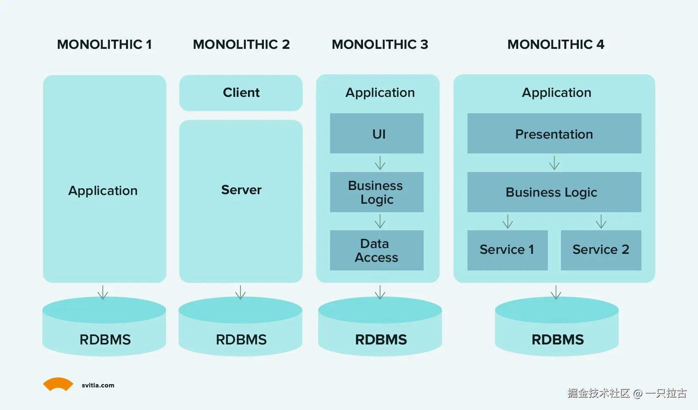
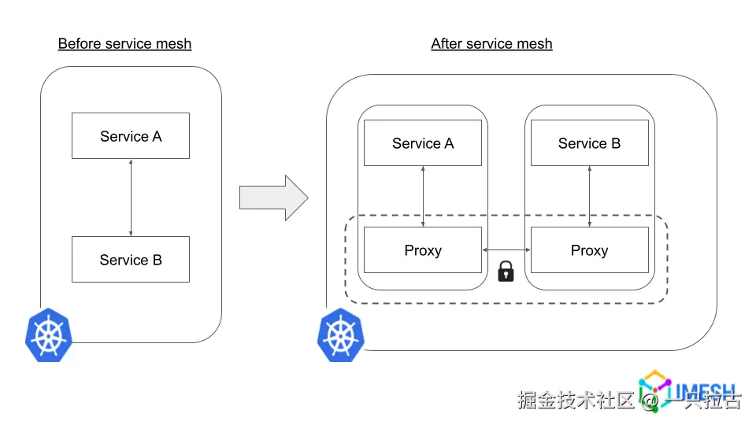

# Roadmap to Backend Programming Master: Architectural Patterns

In modern software development, selecting the right architectural pattern lays the groundwork for scalability, flexibility, and overall performance. Different architectures affect not only how code is organized but also how services interact, scale, and are maintained. For backend engineers, understanding these patterns is crucial to making informed decisions that meet both application and business needs.

This article continues our *Roadmap to Backend Mastery* series, diving deep into impactful backend architectural patterns: **Monolithic Architecture**, **Microservices**, **Service-Oriented Architecture (SOA)**, **Serverless Architecture**, **Service Mesh**, and **The Twelve-Factor App**. Each pattern comes with its strengths, limitations, and ideal use cases, which we’ll explore to provide a comprehensive understanding of when and why to adopt each approach.

After reading this article, you’ll have a better grasp of:

- The core concepts behind each architecture.
- Practical examples of their implementation.
- The trade-offs between simplicity, flexibility, and scalability.

Whether you’re building a small application or managing a large-scale system, mastering these architectural choices equips you to develop robust, efficient, and flexible backend systems.

---

## **1. Monolithic Architecture**

- **Description**: Monolithic architecture is a traditional, single-tier application development approach where all components—UI, business logic, and data access—are packaged and deployed as a single unit. This architecture is straightforward and ideal for small applications since all modules are tightly coupled within the same codebase, making testing, debugging, and deployment easier.

- **When to Use**: Monolithic architecture is best suited for small to medium-sized applications, proof-of-concept projects, or minimum viable products (MVPs). Its simplicity reduces initial development time and costs since all parts of the application are developed together, and internal communication is direct. Additionally, it requires fewer resources to deploy, as only one instance needs to be managed.

- **Drawbacks**: As applications grow, monolithic architectures face significant challenges. Scalability becomes harder since scaling requires deploying the entire application rather than individual components. Deployment complexity increases as even minor changes require redeploying the entire codebase. Furthermore, tightly coupled components can lead to "spaghetti code," making maintenance and updates difficult.

- **Real-World Example**: Companies like Netflix initially adopted monolithic architectures. As their platforms grew and scalability demands increased, they transitioned to microservices architectures to handle evolving requirements and expansion effectively.

---

## **2. Service-Oriented Architecture (SOA)**

- **Overview**: Service-Oriented Architecture (SOA) organizes application functionality into distinct "services" that communicate via well-defined interfaces, usually APIs. Each service encapsulates specific business functions (e.g., user authentication, payment processing, or data management) and can be accessed independently. While SOA structures services to achieve more modularity than monolithic applications, these services often remain part of a shared codebase and may rely on a central database.

- **Pros and Cons**:
  - **Pros**:
    - **Reusability**: Services in SOA can be reused across multiple applications, saving development time and ensuring consistency.
    - **Loose Coupling**: Independent development and updates minimize the impact on other services, enhancing flexibility.
    - **Scalability**: Portions of the application can scale independently to some extent, especially beneficial for enterprise applications.
  - **Cons**:
    - **Service Management and Governance**: Managing service versions, dependencies, and data consistency can be challenging.
    - **Performance Overhead**: Services communicate over a network, introducing latency, though typically less concerning than in microservices.
    - **Integration Complexity**: SOA often requires additional infrastructure for service interaction, security, and transaction management, increasing complexity.

- **Common Uses**: SOA is widely adopted in enterprise applications where reusability, service management, and integration with various systems (like legacy systems) are crucial. It’s ideal for systems requiring high levels of transaction management, such as banking, retail, and insurance.

---

## **3. Microservices Architecture**

- **Description**: Microservices architecture further decomposes SOA’s service-based approach into small, independent services, each responsible for a specific business function. Unlike SOA, microservices operate as standalone units, often with their own codebase and database, and communicate via lightweight protocols (typically HTTP or message queues). This ensures minimal dependencies and maximum flexibility.

- **Pros and Cons**:
  - **Pros**:
    - **Flexibility**: Teams can use different tech stacks, programming languages, or databases for each service.
    - **Scalability**: Each service can scale independently based on resource demands.
    - **Deployment Agility**: Changes to one service don’t affect others, enabling faster, more frequent deployments.
  - **Cons**:
    - **Increased Complexity**: Managing multiple independent services requires advanced DevOps practices, monitoring, and orchestration.
    - **Data Management**: Maintaining consistency with separate databases across services can be challenging.
    - **Testing and Debugging**: Testing across numerous services demands careful integration and end-to-end testing.

- **Choosing Between SOA and Microservices**:
  - **SOA**: Suitable for applications benefiting from modular services but not requiring extreme independence. It’s ideal for larger organizations integrating various applications (e.g., legacy systems), where shared services enhance consistency and modularity.
  - **Microservices**: Best for highly scalable, flexible applications needing frequent updates. It suits organizations with DevOps practices focused on agile methodologies and continuous delivery. Each service has its own database and infrastructure, offering unparalleled autonomy.
  - **Hybrid Approach**: Deploying multiple SOA applications in a “microservices-like” manner is feasible when full service separation isn’t practical. This hybrid method balances SOA’s modularity with microservices’ independence.

- **Real-World Example**: Netflix transitioned to microservices to handle growing user numbers and ensure high availability. By breaking applications into hundreds of services, Netflix can scale, deploy, and iterate quickly, minimizing downtime globally.

---

## **4. Service Mesh**

- **Overview**: A service mesh is an infrastructure layer designed to handle service-to-service communication in microservices architectures. As the number of microservices grows, managing their communication becomes complex. A service mesh abstracts this communication logic into an independent "mesh," managed by proxies that handle all requests between services.

- **When to Use**: Service meshes are ideal for large-scale microservices applications where direct communication management becomes challenging. They’re especially useful for implementing advanced routing, encryption, or deployment strategies like blue-green or canary releases.

- **Advantages**:
  - **Load Balancing**: Automatically balances requests across service instances, improving performance.
  - **Security**: Provides mTLS encryption for service communication without code changes.
  - **Traffic Control**: Enables fine-grained control over traffic routing and advanced patterns like rate limiting and retries.
  - **Observability**: Offers metrics, logs, and traces for service interactions.

Despite these benefits, service meshes add complexity and operational overhead. Tools like **Istio**, **Linkerd**, and **Consul** simplify service mesh management.

---

## **5. Serverless Architecture**

- **Definition**: Serverless architecture, or **Function-as-a-Service (FaaS)**, is an event-driven model where cloud providers dynamically manage server resources, allowing developers to deploy functions without managing infrastructure. Functions execute in response to events like HTTP requests or database changes.

- **Pros and Cons**:
  - **Pros**:
    - **Scalability**: Automatically scales based on demand.
    - **Reduced Infrastructure Management**: Focus on code without worrying about servers.
    - **Cost Efficiency**: Pay only for execution time.
  - **Cons**:
    - **Cold Start Latency**: Delays during initial invocation after inactivity.
    - **Vendor Lock-In**: High dependency on specific cloud providers.
    - **Execution Time Limits**: Unsuitable for long-running tasks.

- **Use Cases**:
  - **Data Processing**: Responding to data uploads for processing.
  - **IoT Events**: Handling sensor data from IoT devices.
  - **Scheduled Tasks**: Running periodic reports or clean-up jobs.

---

## **6. The Twelve-Factor App**

The Twelve-Factor App methodology provides best practices for building reliable, scalable, and cloud-native web applications. The principles emphasize portability and manageability across environments, making it ideal for **Platform-as-a-Service (PaaS)** deployments.

---

## **Conclusion**

We explored key backend architectural patterns—**Monolithic**, **SOA**, **Microservices**, **Service Mesh**, **Serverless**, and **The Twelve-Factor App**. Each pattern addresses specific challenges and needs, making them suitable for different projects. The right choice balances **scalability**, **maintainability**, and **complexity** based on your application’s requirements.
