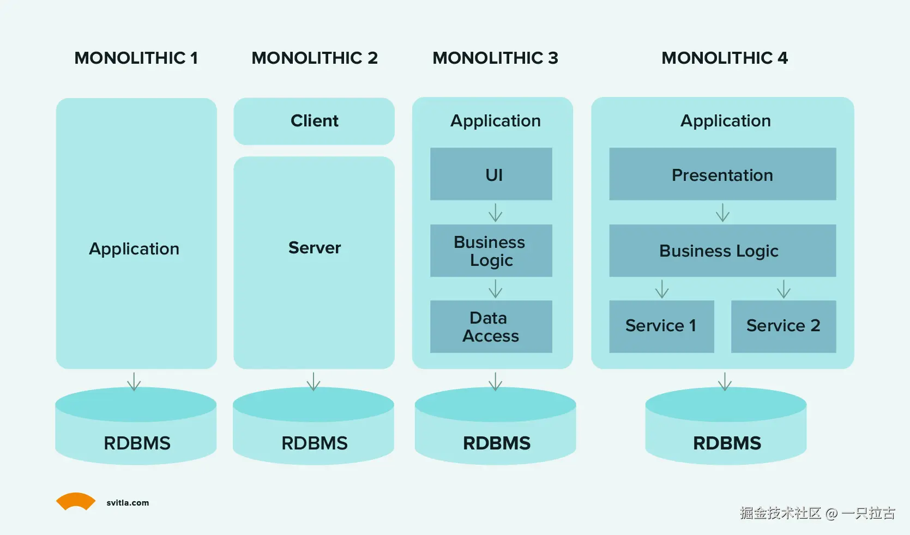
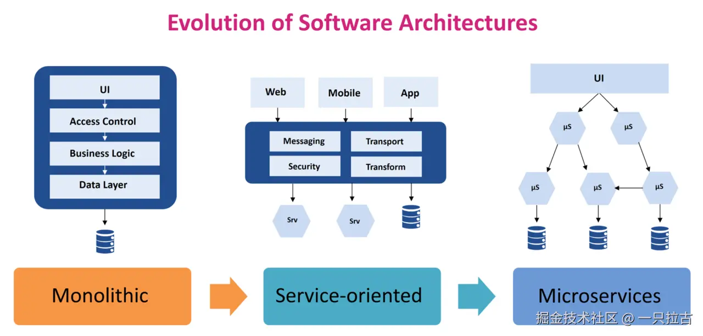
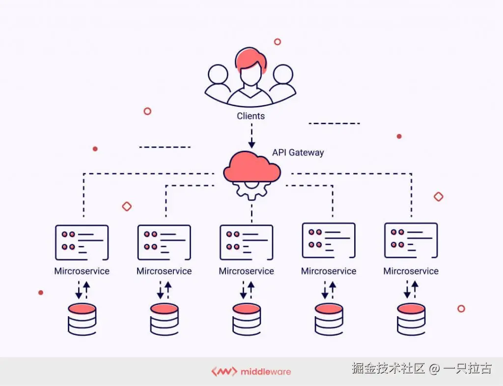
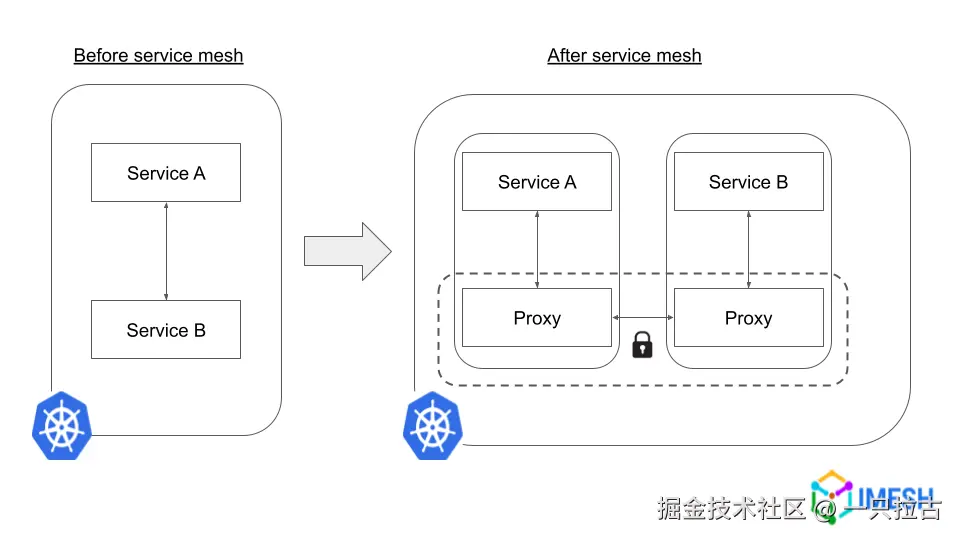
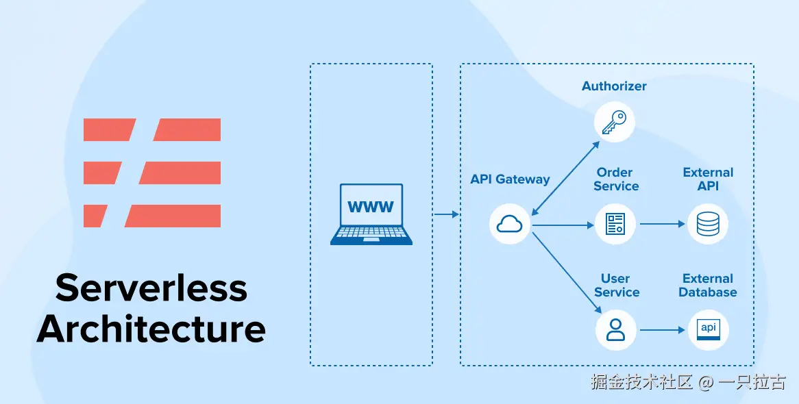

# 从小白到大神：后端开发者必学之架构模式

在现代软件开发中，选择合适的架构模式（Architectural Patterns）可以为应用程序的可扩展性、灵活性和整体性能奠定基础。不同的架构不仅影响代码的组织方式，还影响服务之间的交互、扩展和维护方式。对于后端工程师而言，理解架构模式对于做出符合应用需求和业务需求的明智决策至关重要。

在本篇文章中，我们将继续*成为后端编程大师的路线图*系列，深入探讨后端开发中一些最具影响力的架构模式：**单体架构**、**微服务架构**、**面向服务的架构（SOA）**、**无服务器架构**、**服务网格**以及**十二因素应用**。每种模式都有其优点、局限性和特定的使用场景，我们将对此进行探讨，以提供对何时以及为何采用每种方法的深入理解。

在阅读完本篇文章后，你将更好地理解：

* 每种架构背后的核心概念。
* 每种模式的实际应用示例。
* 简单性、灵活性和可扩展性之间的权衡。

无论你是在构建一个简单的应用程序，还是在管理一个大规模系统，掌握这些架构选择将为你提供开发强大、高效和灵活的后端系统的工具。

***

## **1. 单体架构(Monolithic Architecture)**

* **描述**：单体架构是一种传统的、单层的应用程序开发方法，所有组件——用户界面、业务逻辑和数据访问——都被打包并作为一个单一单元部署。这种架构简单易懂，适合小型应用程序，因为所有模块和组件都紧密耦合在同一个代码库中，使得测试、调试和部署变得容易。

* **使用时机**：单体架构最适合用于小型到中型的应用程序、概念验证项目或最小可行产品（MVP）。其简单性可以减少初始开发时间和成本，因为应用程序的所有部分都是一起开发的，系统内部的通信也是直接的。此外，它部署所需的资源较少，因为只需要管理一个实例。

* **缺点**：虽然单体架构在初始阶段较为简单，但随着应用程序的增长，它们可能面临重大挑战。可扩展性变得更加困难，因为扩展需要部署整个应用程序，而不是单独的组件。部署也变得复杂，因为任何变更，哪怕是微小的，都需要重新部署整个代码库。此外，紧密耦合的组件可能导致“意大利面条代码”，使得应用程序在维护和更新时更加困难。

* **现实示例**：许多公司，包括Netflix，最初采用单体架构。随着平台的增长和对可扩展性的需求，Netflix转向微服务架构，以有效应对日益复杂的需求和扩展。

***

## **2. 面向服务的架构 (Service-Oriented Architecture, SOA)**

* **概述**：面向服务的架构 (SOA) 是一种架构模式，专注于将应用程序功能组织为不同的“服务”，这些服务通过定义良好的接口（通常是API）进行相互通信。每个服务封装了特定的业务功能（如用户认证、支付处理或数据管理），并可以独立访问。SOA旨在通过允许服务在不同应用程序之间重用，促进重用性和灵活性。虽然SOA将服务结构化以实现比单体应用程序更模块化的方法，但这些服务通常仍是共享代码库的一部分，并且常常依赖于中央数据库。

* **优缺点**：
  * **优点**：
    * **重用性**：SOA中的服务可以在多个应用程序中重用，节省开发时间并确保一致性。
    * **松耦合**：每个服务可以独立开发和更新，对其他服务的影响最小，从而增强灵活性。
    * **可扩展性**：应用程序的部分功能可以在一定程度上独立扩展，尤其适用于对需求较高的企业应用程序。
  * **缺点**：
    * **服务管理和治理**：由于SOA依赖于同一应用程序中的多个服务，因此管理服务版本、依赖关系和数据一致性可能具有挑战性。
    * **性能开销**：服务通过网络进行通信，可能会引入延迟。在SOA中，这通常比微服务少令人担忧，但仍然是一个因素。
    * **集成复杂性**：SOA通常需要额外的基础设施来管理服务交互、处理安全性和事务管理，这增加了复杂性。

* **常见用途**：SOA广泛用于企业应用程序，重用性、服务管理以及与各种应用程序（如遗留系统）的集成至关重要。它非常适合具有复杂和多样化功能的系统，通常需要高水平的事务管理，如银行、零售和保险行业。

***

## **3. 微服务架构(Microservices Architecture)**

* **描述**：微服务架构将SOA的基于服务的方法进一步细分为小型独立服务，每个服务负责特定的业务功能。与SOA不同，微服务作为独立单元运行，服务之间通常共享资源并受到严格管理。每个服务都有自己的代码库，可能使用自己的数据库，并且可以单独部署。这些服务通过轻量级协议（通常是HTTP或消息队列）进行通信，确保最小的依赖关系和更大的灵活性。

* **优缺点**：
  * **优点**：
    * **灵活性**：由于每个微服务都是独立的，团队可以根据特定服务的需求使用不同的技术栈、编程语言或数据库。
    * **可扩展性**：每个服务可以根据其资源需求独立扩展，从而优化性能和成本。
    * **部署灵活性**：对一个服务的更改不会影响其他服务，使得更快、更频繁的部署成为可能，支持特定服务的CI/CD管道。
  * **缺点**：
    * **复杂性增加**：微服务需要更高水平的DevOps、监控和编排来管理许多独立部署的服务。
    * **数据管理**：当每个服务都有自己的数据库时，维护数据一致性可能具有挑战性。服务之间的协调变得至关重要。
    * **测试和调试**：跨多个独立服务的测试需要仔细的集成和端到端测试，增加了开发的复杂性。

* **选择SOA还是微服务的情况**：
  * **SOA**：适用于那些受益于模块化服务，但不需要微服务极端独立性的应用程序。它通常非常适合需要通过共享服务集成不同应用程序（如遗留系统）的较大组织，在这种情况下，实现某种程度的模块化和重用比完全的服务独立性更重要。SOA使这些组织能够分离前端和后端层，并创建可重用的服务模块，服务于各种应用程序（如网页、移动应用）。然而，SOA服务通常仍然是单一代码库的一部分，并且可能共享公共基础设施，导致服务之间存在一些依赖关系。
  * **微服务**：通常适用于需要高可扩展性、部署灵活性和频繁更新的应用程序。希望采用敏捷实践、独立扩展系统特定部分或处理高交易量的公司通常选择微服务。与SOA不同，微服务通过将每个服务分离到其自己的代码库、数据库和基础设施中，进一步提高了模块化。这意味着个别服务可以独立开发、部署和扩展，使团队能够快速移动并在不影响系统其他部分的情况下进行更改。微服务对于需要大规模持续交付和部署的具有DevOps实践的组织尤为重要。
  * **混合方法**：以“微服务”的方式部署多个SOA应用程序是一种可行的方法，特别是在完全将服务分离到独立代码库中不可行的情况下。这种混合方法可以在SOA的模块化和微服务的独立性之间提供一个折衷方案，通常是向微服务过渡的组织或那些不需要微服务全部灵活性的组织的实用解决方案。一些公司可能会从SOA开始，并独立部署服务，但随着规模扩大或新需求出现而逐渐过渡到微服务。这种混合方法在不管理完全独立代码库的情况下提供了一定程度的模块化，使企业能够隔离故障并独立扩展。

* **最佳实践**：
  * **事件驱动架构(Event-Driven Architecture)**：在服务之间使用异步消息传递以提高性能、可扩展性和可靠性。对于微服务，事件驱动架构非常合适，因为它允许服务在不需要了解彼此内部工作方式的情况下进行通信。这有助于减少紧密耦合，并实现实时更新和响应。对于SOA应用程序，异步消息传递也可以提供帮助，尽管SOA可能更多依赖于同步调用。事件驱动架构的流行工具包括消息中间件，如RabbitMQ、Apache Kafka或AWS SNS/SQS，支持SOA和微服务架构。
  * **容器和编排(Containers and Orchestration)**：使用容器（如Docker）将每个服务打包，提供标准化环境，使得在不同阶段的部署保持一致。Kubernetes等编排工具可以管理这些容器，实现自动扩展、负载均衡和故障转移管理，这些对微服务至关重要。在SOA中，容器化也可能帮助服务部署，但在微服务中尤其有价值，因为服务需要独立管理。Kubernetes可以通过将服务分布在多个实例上并在出现故障时自动恢复，确保高可用性。
  * **数据库策略**：在每个服务之间选择共享数据库和单独数据库是至关重要的。在SOA中，共享数据库更为常见，这简化了数据一致性，但引入了服务之间的依赖关系。在微服务中，每个服务拥有单独的数据库对于服务的自主性和独立扩展至关重要。然而，这种方法需要额外的努力来维护服务之间的数据一致性，通常使用事件溯源或最终一致性等技术。在采用微服务数据库策略时，组织必须考虑灵活性与管理分布式数据复杂性之间的权衡。

* **示例**：Netflix著名地采用微服务架构以应对不断增长的用户数量并提供高可用性。通过将应用程序拆分为数百个微服务，每个服务负责特定任务（如内容推荐、计费或播放），Netflix能够独立扩展服务并快速部署更改，帮助他们在全球范围内实现最小停机时间。

***

## **4. 服务网格**

**概述**：
服务网格是一个专门的基础设施层，用于管理微服务架构中的服务间通信。随着微服务数量的增加，管理服务间通信的复杂性也随之上升。服务网格通过将通信逻辑从应用程序代码中抽象出来，转移到一个独立的“网格”中，这个网格由代理处理服务之间的所有请求。该设置提供了对服务通信的集中控制，从而能够更稳健地管理流量、安全性和可观测性。

在典型的服务网格实施中，每个服务实例都与一个轻量级代理（通常称为“侧车”）配对，该代理拦截所有网络通信。这些侧车处理服务发现、负载均衡、重试等任务，并提供监控服务健康状态的指标。流行的服务网格解决方案包括 **Istio**、**Linkerd** 和 **Consul**。

**使用场景**：
服务网格通常适用于大规模微服务应用程序，在这些应用中，直接管理服务之间的通信将是一个挑战。如果你的应用程序有大量的服务间请求，需要严格的安全策略，或者需要动态路由和流量控制，服务网格可以显著简化这些任务。这种架构在具有复杂通信模式的应用程序中特别有用，在这些应用中，你需要实施像服务间加密的双向TLS（mTLS）或实现金丝雀发布和蓝绿部署等策略。

**优点**：

* **负载均衡(Load Balancing)**：自动在服务实例之间平衡请求，提高应用程序的性能和弹性。
* **安全性**：提供双向TLS（mTLS）以加密服务间的流量并进行连接身份验证，这增加了一层安全性，而无需修改应用程序代码。
* **流量控制**：支持对流量路由的细粒度控制，包括电路断路、速率限制和重试等高级模式。
* **可观测性**：服务网格提供全面的指标、日志和服务间流量的跟踪，使开发人员和运维人员能够有效监控服务交互并排查问题。

尽管服务网格提供了这些强大的功能，但它们也引入了额外的复杂性和操作开销。管理服务网格需要熟悉网格的控制平面及其配置，以及监控和维护侧车代理。对于较简单的微服务应用程序，这种开销可能不值得；然而，对于需要高级通信功能的应用程序，服务网格可以提供必要的价值。

***

## **5. 无服务器架构(Serverless Architecture)**

**定义**：
无服务器架构，也称为 **函数即服务 (FaaS)**，是一种事件驱动的模型，其中云提供商动态管理服务器资源，允许开发人员部署函数而无需管理底层基础设施。在无服务器设置中，代码会根据特定事件（如 HTTP 请求或数据库更改）执行。在这种架构中，每个函数都是一个独立的逻辑单元，能够根据需求自动扩展。流行的 FaaS 平台示例包括 **AWS Lambda**、**Google Cloud Functions** 和 **Azure Functions**。

**优缺点**：

* **优点**：
  * **可扩展性**：无服务器平台会自动根据传入请求的数量处理扩展，非常适合处理不同负载，而无需手动配置。
  * **减少基础设施管理**：由于云提供商管理服务器，开发人员可以专注于编写代码，而无需担心服务器维护、补丁或负载均衡。
  * **成本效益**：在无服务器架构中，你只需为实际使用的计算时间付费，使其在负载不规律或不可预测的使用模式下具有成本效益。

* **缺点**：
  * **延迟**：无服务器函数在一段时间不活动后被调用时，可能会经历“冷启动”延迟，这对于实时应用可能会造成问题。
  * **供应商锁定(Vendor Lock-In)**：无服务器实现通常与特定云提供商高度相关，这可能使迁移到其他平台变得困难，需进行重大代码更改。
  * **有限的执行时间**：无服务器函数通常受限于执行时间，这使其不太适合长期运行的任务。

**适用场景**：
无服务器架构最适合特定用例，如数据处理任务、物联网事件或事件驱动且不频繁的任务。示例包括：

* **数据处理**：对数据上传（如图像或视频处理）做出响应的函数。
* **物联网(IoT)**：响应物联网设备的传感器数据。
* **不频繁的任务**：定期运行每日报告或例行清理任务的调度函数。

**示例**：
初创公司经常使用无服务器架构来实现快速扩展，而无需承担基础设施管理的成本和复杂性。例如，一家推出新产品的初创公司可以使用无服务器函数来处理高初始用户需求，根据需要自动扩展或缩减，而无需提前投资于专用服务器。

***

## **6. 十二因素应用**

**原则**：
十二因素应用方法论是一套构建可靠、可移植和云原生 web 应用的最佳实践。它提供了确保应用可扩展、弹性和易于管理的指南。以下是十二个因素的简要概述：

1. **代码库**：一个代码库通过版本控制进行跟踪，可以进行多个部署。
2. **依赖关系**：明确声明并隔离依赖关系。
3. **配置**：将配置存储在环境中。
4. **后端服务**：将后端服务（如数据库）视为附加资源。
5. **构建(Build)、发布(Release)、运行(Run)**：严格区分构建和运行阶段。
6. **进程**：将应用作为一个或多个无状态进程执行。
7. **端口绑定**：通过端口绑定导出服务。
8. **并发**：通过进程模型进行扩展。
9. **可处置性**：通过快速启动和优雅关机最大化健壮性。
10. **开发/生产对等性**：尽可能保持开发、预发布和生产环境相似。
11. **日志**：将日志视为事件流。
12. **管理进程**：将管理任务作为一次性进程运行。

**使用案例**：
十二因素原则特别适用于为云环境构建的应用，因为它们确保了易于部署、可扩展和具备弹性。遵循这些指南非常适合 **云原生** 开发，其中可移植性和跨环境的可扩展性至关重要。

通过遵循十二因素方法论，应用程序变得非常适合在 **平台即服务 (PaaS)** 环境中部署，这些环境通常要求有效管理分布式系统中的应用程序。

***

## **结论**

在本指南中，我们探讨了几种基础软件架构模式——**单体架构**、**服务导向架构 (SOA)**、**微服务**、**服务网格**、**无服务器架构**以及**十二因素应用**。这些架构各自解决特定的需求和挑战，使它们适合不同的项目要求。

在选择合适的架构时，考虑因素如 **可扩展性**、**可维护性** 和 **操作复杂性**。例如，微服务和无服务器架构在灵活性和快速迭代至关重要的敏捷云原生环境中非常受欢迎。然而，更简单的架构如单体架构可能适合小型项目或早期初创公司，优先考虑开发速度。

架构选择中的权衡通常是在简单性和可扩展性之间取得平衡，每种模型都提供其优势和局限性。随着行业的不断发展，这些架构方法也在不断演变，因此保持对最佳实践和新兴技术的更新非常重要。

在未来的文章中，我们将深入探讨后端掌握所需的重要系统设计主题，包括数据库设计、缓存策略和分布式系统，帮助您构建稳健、可扩展的应用程序。
