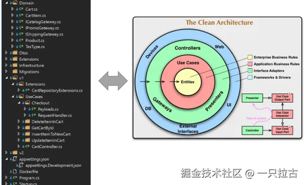
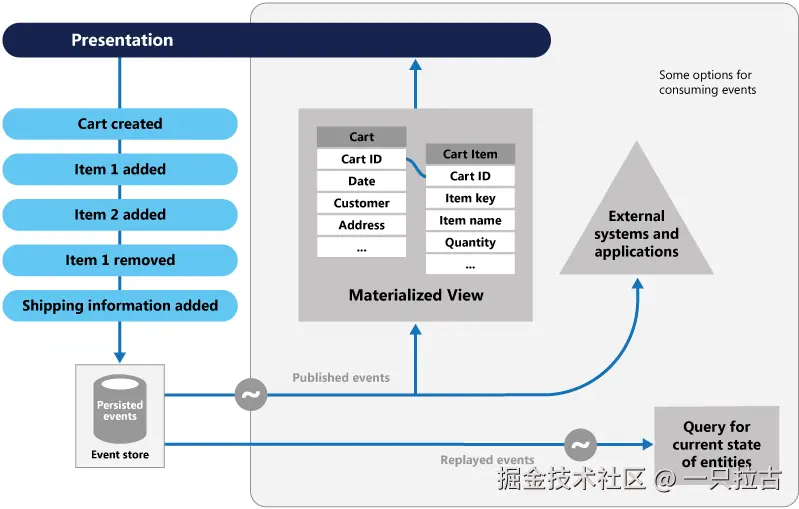

# Roadmap to Backend Programming Master: System Design Principles

In modern backend development, designing systems that are scalable, maintainable, and resilient is crucial. Achieving this requires not only strong coding skills but also a deep understanding of system design principles to create robust architectures. In this article, we will explore core principles in system design to help you build reliable and efficient backend systems. While these concepts may overlap, each principle addresses a unique aspect of architecture, ensuring your application is resilient, maintainable, and scalable as needed.

This is the next installment in the *Mastering Backend Programming* series, where we cover key principles that guide systematic approaches to system design. In system architecture, it’s crucial to understand how each principle fits into the bigger picture. Foundational techniques like design patterns provide reusable solutions to common problems in code structure, while concepts like Domain-Driven Design (DDD) introduce a holistic approach to building complex systems by focusing on the business domain itself. Mastering these principles will enable you to design systems that meet technical requirements while aligning with business goals.

---

## **GOF (Gang of Four) Design Patterns**

### **What are GOF Design Patterns?**

The Gang of Four (GOF) design patterns were introduced by Erich Gamma, Richard Helm, Ralph Johnson, and John Vlissides in their classic book on object-oriented design. These patterns offer proven solutions to common software design challenges, making it easier to write clean, reusable, and well-structured code. By implementing these patterns, developers can systematically address issues related to code structure and behavior, improving the readability and maintainability of the codebase.

### **Practical Application**

GOF patterns are divided into three categories, each addressing different aspects of system design:

- **Creational Patterns**: These patterns deal with object creation mechanisms, enhancing the flexibility of instantiating objects. They are particularly useful when decoupling clients from the concrete classes they use.
  - [Mastering Creational Patterns in C#: Singleton and Factory Method](../CSharp_OOP/03_Creational_1_EN.md)
  - [Exploring Advanced Creational Patterns in C#: Abstract Factory, Builder, and Prototype](../CSharp_OOP/04_Creational_2_EN.md)

- **Structural Patterns**: These patterns focus on the composition of classes and objects, ensuring complex structures can be created more efficiently and reused as building blocks. They are useful when defining relationships between classes or encapsulating complex relationships in a flexible way.
  - [Comprehensive Guide to Structural Patterns in C#](../CSharp_OOP/05_Structural_EN.md)

- **Behavioral Patterns**: These patterns handle communication between objects, managing how responsibilities are distributed and how classes interact. These patterns are especially helpful when objects need to collaborate in specific ways without being tightly coupled.
  - [Behavioral Patterns in C#: Chain of Responsibility, Command, and Observer](../CSharp_OOP/06_Behavioral_EN.md)

### **Value in System Design**

Although design patterns primarily offer solutions at the code level, their impact on system design is profound. By using these patterns, developers can lay a solid foundation for applications, making them more flexible, maintainable, and comprehensible. Design patterns solve common software problems, reduce the risk of errors, and simplify future modifications through consistent code structures. Whether designing new features or refactoring existing code, mastering a set of pattern tools helps you make more efficient, informed design decisions.

---

## **Domain-Driven Design (DDD)**

### **Overview**

Domain-Driven Design (DDD) is a software design strategy aimed at addressing complex business problems by organizing code around core business concepts rather than technical layers. This approach ensures that the software model reflects the actual business domain, fostering collaboration between developers and domain experts to better align applications with business objectives.



### **Key Concepts**

- **Bounded Context**:
  DDD emphasizes dividing complex business domains into smaller, manageable contexts called bounded contexts. Each bounded context represents an independent part of the business and maintains its own model, avoiding ambiguity and ensuring clarity within its boundaries.

- **Entities, Value Objects, Aggregates**:
  - **Entities** are objects defined by their unique identifiers (e.g., a `User` with a unique ID).
  - **Value Objects** are defined by their attributes and have no unique identifiers (e.g., reusable `Address` objects).
  - **Aggregates** are groups of related entities and value objects treated as a single unit, ensuring data consistency through an aggregate root (e.g., an `Order` entity containing `OrderItem` value objects).

### **Example**

Consider an e-commerce application that manages orders, products, and customers. With DDD, you create separate bounded contexts to isolate business logic and prevent coupling.

**Example Contexts**:

- **Order Context**: Manages `Order` processing, payments, and shipments.
- **Product Context**: Manages the product catalog, inventory, and pricing.
- **Customer Context**: Manages customer profiles, registration, and authentication.

In a C#/.NET application, you can design each bounded context with its own domain models, services, and repositories.

**C# Implementation Example**:

- The `Order` entity has a unique identifier and attributes like `Order Date`, `Customer ID`, and a collection of `Order Items`.
- The `Customer` entity includes attributes like `Customer ID`, `Name`, and `Email`.

```csharp
public class Order
{
    public Guid OrderId { get; private set; }
    public DateTime OrderDate { get; private set; }
    public Guid CustomerId { get; private set; }
    public List<OrderItem> Items { get; private set; }

    public Order(Guid customerId)
    {
        OrderId = Guid.NewGuid();
        OrderDate = DateTime.UtcNow;
        CustomerId = customerId;
        Items = new List<OrderItem>();
    }

    public void AddItem(Product product, int quantity)
    {
        if (product == null) throw new ArgumentNullException(nameof(product));
        if (quantity <= 0) throw new ArgumentOutOfRangeException(nameof(quantity));

        Items.Add(new OrderItem(product.Id, product.Price, quantity));
    }
}

public class Customer
{
    public Guid CustomerId { get; private set; }
    public string Name { get; private set; }
    public string Email { get; private set; }

    public Customer(string name, string email)
    {
        CustomerId = Guid.NewGuid();
        Name = name;
        Email = email;
    }
}
```

This design defines business objects and behaviors clearly, making business logic expression closer to reality and enhancing software maintainability and scalability.

---

## **Microservices Architecture**

### **Microservices Overview**

Microservices architecture organizes applications as a collection of loosely coupled services, each responsible for a specific functionality. These services can be developed, deployed, and scaled independently, providing flexibility and resilience.


### **Key Characteristics**

1. **Decentralized**: Each service manages its own database and logic, avoiding a single point of failure.
2. **Independent Deployment**: Updates to one service do not affect others, reducing downtime and deployment risks.
3. **Technology Agnostic**: Teams can use different languages or frameworks for different services.

### **Benefits**

- Enhanced scalability and performance.
- Improved fault isolation; one service failure doesn't bring down the entire application.
- Faster time-to-market due to independent development and deployment cycles.

### **Challenges**

- Increased complexity in managing distributed systems.
- Requires robust monitoring, logging, and testing practices.
- Needs efficient inter-service communication, often implemented using RESTful APIs or message queues.

### **Microservices Practical Application**

Consider an e-commerce platform. Instead of a monolithic architecture, you can split functionalities into microservices:

- **User Service**: Handles authentication, user profiles, and settings.
- **Order Service**: Manages order creation, status updates, and payment processing.
- **Inventory Service**: Tracks stock levels and updates availability.
- **Notification Service**: Sends emails, SMS, or push notifications.

**Communication Example**:  
The `Order Service` sends an event to the `Inventory Service` after an order is placed, which updates stock levels.

**C# Implementation Example**:

Using a message broker like RabbitMQ or Kafka to enable event-driven communication:

```csharp
public class OrderService
{
    private readonly IMessageBroker _messageBroker;

    public OrderService(IMessageBroker messageBroker)
    {
        _messageBroker = messageBroker;
    }

    public void CreateOrder(Order order)
    {
        // Logic to save order to database
        _messageBroker.Publish(new OrderCreatedEvent(order.OrderId, order.Items));
    }
}

public class InventoryService
{
    public void OnOrderCreated(OrderCreatedEvent event)
    {
        foreach (var item in event.Items)
        {
            UpdateStock(item.ProductId, item.Quantity);
        }
    }

    private void UpdateStock(Guid productId, int quantity)
    {
        // Logic to reduce stock in database
    }
}
```

This setup decouples services, enabling independent development and scalability.

---

## **CAP Theorem**

### **Definition**

The CAP theorem states that a distributed system can guarantee only two out of three properties at any given time:

1. **Consistency (C)**: All nodes see the same data simultaneously.
2. **Availability (A)**: Every request receives a response, even if some nodes fail.
3. **Partition Tolerance (P)**: The system continues operating despite network partitions.

### **Trade-offs**

When designing a distributed system, you must decide which two properties to prioritize based on business needs. For example:

- **CP Systems**: Prioritize consistency and partition tolerance (e.g., databases like HBase).
- **AP Systems**: Prioritize availability and partition tolerance (e.g., DynamoDB, Cassandra).

### **Practical Example**

For an e-commerce platform:

- **Inventory Updates**: Prioritize consistency to avoid overselling.
- **Product Catalog**: Prioritize availability, ensuring users can browse products even during network issues.

### **Impact on System Design**

Understanding the CAP theorem helps developers make informed decisions when choosing databases and designing systems. It also emphasizes the importance of aligning technical trade-offs with business requirements.

---

## **CQRS (Command Query Responsibility Segregation)**

### **CQRS Overview**

CQRS separates read and write operations into different models:

- **Command Model**: Handles writes (e.g., creating or updating data).
- **Query Model**: Handles reads (e.g., fetching data).

This separation improves performance, scalability, and security by optimizing each model for its specific purpose.

### **CQRS Example**

In an event-driven system, commands trigger events, which update the query model.

**Implementation in C#**:

```csharp
// Command model for writing data
public class CreateOrderCommand
{
    public Guid OrderId { get; set; }
    public Guid CustomerId { get; set; }
    public List<OrderItem> Items { get; set; }
}

// Query model for reading data
public class OrderQueryModel
{
    public Guid OrderId { get; set; }
    public string CustomerName { get; set; }
    public List<string> ProductNames { get; set; }
}
```

**Benefits**:

- **Scalability**: Query and command models can be scaled independently.
- **Flexibility**: Enables different storage strategies for read and write operations.

---

## **Event Sourcing**

### **What It Is**

Event sourcing is a technique where all state changes in an application are stored as a sequence of events. Unlike traditional systems that store only the current state, event sourcing maintains an event log that can be replayed to reconstruct the state at any point in time.



### **Advantages**

- **Auditability**: Every change to the state is tracked as an event, providing a detailed log for auditing.
- **Rebuildable State**: Since the state is the result of events, it can be rebuilt at any point by replaying the event stream.
- **Event Replay**: Allows for experimenting with different projections or views of the data.

### **Use Cases**

- **Financial Systems**: Where each transaction is logged and the entire transaction history is important for audits.
- **E-commerce**: In complex business processes like order management or inventory systems, where every step (order creation, payment, shipping) can be tracked.

### **How It Works**

1. Every action that modifies the state of the system is captured as an event.
2. These events are stored in an append-only log.
3. The current state is derived by replaying events.

### **Example:**

For an e-commerce system:

- An `OrderCreated` event is stored every time a new order is placed.
- An `OrderShipped` event is stored when an order is shipped.

**C# Example**:

```csharp
public class OrderCreatedEvent
{
    public Guid OrderId { get; set; }
    public Guid CustomerId { get; set; }
    public DateTime CreatedAt { get; set; }
}

public class OrderService
{
    private readonly IEventStore _eventStore;

    public OrderService(IEventStore eventStore)
    {
        _eventStore = eventStore;
    }

    public void CreateOrder(Order order)
    {
        var event = new OrderCreatedEvent
        {
            OrderId = order.OrderId,
            CustomerId = order.CustomerId,
            CreatedAt = DateTime.UtcNow
        };

        _eventStore.SaveEvent(event);
    }
}
```

This approach helps in achieving high levels of traceability and transparency.

---

## **Principles Interconnected**

In practice, combining multiple system design principles can create a robust, scalable, and maintainable architecture. Below is how these principles connect with each other:

- **DDD and CQRS**: Domain-driven design (DDD) provides structure for complex domain modeling, while CQRS enhances it by segregating command and query responsibilities, ensuring scalability and clear separation of concerns.
- **Event Sourcing and DDD**: Event sourcing complements DDD by ensuring every change is captured as a domain event. This improves the maintainability and scalability of complex systems, allowing systems to track all state changes and revisit historical states.
- **TDD in Advanced Architecture**: Test-driven development (TDD) ensures that even complex systems built using DDD, CQRS, or event sourcing remain reliable and meet requirements. Writing tests before code helps maintain correctness throughout the development lifecycle.

### **Trade-offs:**

While these principles provide numerous benefits, they also introduce certain challenges:

- **Increased Complexity**: Combining CQRS and event sourcing can lead to complex architectures that may be difficult to manage, especially for smaller teams.
- **Development Time**: Implementing TDD requires additional time for writing tests, which can delay initial development, but the long-term benefits in terms of code quality and maintainability outweigh the initial investment.

When choosing which principles to apply, consider project complexity, the team’s expertise, and long-term maintainability. A balanced approach that leverages the strengths of each principle can lead to a powerful and effective system.

---

## **Summary**

In this article, we explored how GOF design patterns, DDD, TDD, CQRS, and event sourcing help build scalable, maintainable, and flexible systems:

- **GOF Design Patterns** provide foundational solutions for common coding challenges.
- **DDD** helps structure complex domains around business needs.
- **TDD** promotes testable, reliable code from the start.
- **CQRS** improves scalability by separating read and write models.
- **Event Sourcing** ensures complete traceability and rebuildable state.

System design is not a one-size-fits-all approach. It requires assessing the unique needs of your project, understanding trade-offs, and strategically combining principles to achieve the best results. A successful architecture typically finds the right balance between simplicity, scalability, and developer efficiency.
