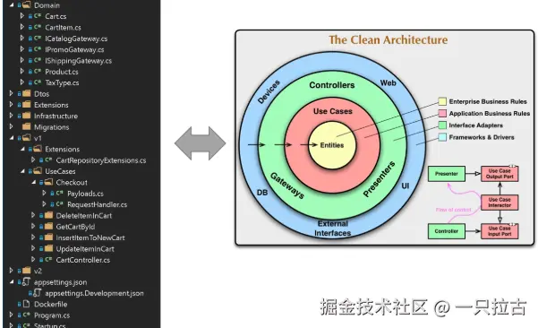

# 从小白到大神：后端开发者必学之系统设计原则

在现代后端开发中，设计能够扩展、长期可维护且能够从潜在问题中恢复的系统至关重要。这不仅需要强大的编码能力，还需要深入理解系统设计原则，以构建稳健的架构。在这篇文章中，我们将探讨系统设计中的核心原则，帮助你构建可靠且高效的后端系统。这些概念可能会有重叠，但每个原则都涉及架构的独特方面，确保应用程序具有弹性、易于维护并能根据需要进行扩展。

本篇是*后端编程大师之路*系列的下一步，我们将涵盖指导系统设计有序方法的关键原则。在系统架构中，理解每个原则如何融入更大的背景中至关重要。例如，基础技术如设计模式为代码结构中的常见问题提供了可重用的解决方案，而领域驱动设计（DDD）等概念通过关注业务领域本身，介绍了构建复杂系统的整体方法。掌握这些原则后，你将能够更好地设计既符合技术需求又满足业务目标的系统。

***

## **GOF（Gang of Four） 设计模式**

### **什么是 GOF 设计模式**

由 Erich Gamma、Richard Helm、Ralph Johnson 和 John Vlissides 在他们的经典著作中提出的“四个人”（Gang of Four, GOF）设计模式，是面向对象设计中的基础模式。这些模式为常见的软件设计挑战提供了经过验证的解决方案，使编写干净、可重用和结构良好的代码变得更加容易。通过实现这些模式，开发人员可以更系统地解决与代码结构和行为相关的问题，从而提高代码库的可读性和可维护性。

### **实际应用**

GOF 模式分为三大类，每类处理系统设计的不同方面：

* **创建型模式**：这些模式涉及对象创建机制，增强了实例化对象的灵活性。在需要将客户端与其使用的具体类解耦的场景中非常有用。
  * [掌握 C# 中的创建型(Creational) 模式：单例模式(Singleton)与工厂方法(Factory Method)](../CSharp_OOP/03_Creational_1_CN.md)
  * [探索高级创建型设计模式：C# 中的抽象工厂(Abstract Factory)、建造者(Builder)和原型(Prototype)模式](../CSharp_OOP/04_Creational_2_CN.md)

* **结构型模式**：结构型模式专注于类和对象的组合，有助于确保复杂结构可以更高效地创建并被重用作为构建模块。它们在定义类之间的关系或以灵活方式封装复杂关系时非常有用。
  * [精通 C# 中的结构型模式(structural patterns)：全面指南](../CSharp_OOP/05_Structural_CN.md)

* **行为型模式**：这些模式涉及对象之间的通信，管理职责如何分配以及类如何交互。当对象需要以特定方式协作而又不希望它们紧密耦合时，这些模式尤其有用。
  * [掌握 C# 中的行为模式：职责链(Chain of Responsibility)、命令(Command)和观察者(Observer)模式](../CSharp_OOP/06_Behavioral_CN.md)

### **系统设计中的价值**

尽管设计模式主要是代码级的解决方案，但它们对系统设计的影响是深远的。通过使用这些模式，开发人员可以为应用程序创建坚实的基础，使其更灵活、可维护且易于理解。设计模式解决了常见的软件问题，降低了出错风险，并通过建立一致的代码结构，使未来的修改变得更简单。无论是设计新功能还是重构现有代码，掌握一套模式工具有助于你做出更高效、合理的设计决策。

***

## **领域驱动设计 (DDD)**

### **概述**

领域驱动设计 (DDD) 是一种以应对复杂业务问题为目标的软件设计策略，通过围绕核心业务概念组织代码，而不是技术层面来实现。这种方法确保了软件模型反映实际的业务领域，促进开发人员和领域专家之间的协作，以更好地使应用程序与业务目标保持一致。



### **核心概念**

* **限界上下文**：
    DDD 强调将复杂的业务领域划分为更小、更易管理的上下文，称为限界上下文。每个限界上下文代表业务的独立部分，并维护自己的模型，避免了歧义，并确保在其边界内的清晰性。

* **实体、值对象、聚合**：
  * **实体** 是由其唯一标识符定义的对象（例如，具有唯一 ID 的 `用户`）。
  * **值对象** 由其属性定义，并没有唯一标识符（例如，可重用的 `地址` 对象）。
  * **聚合** 是一组相关的实体和值对象，作为一个单元处理，并通过聚合根确保数据一致性（例如，包含 `订单项` 值对象的 `订单` 实体）。

### **示例**

考虑一个需要管理订单、产品和客户的电子商务应用程序。在 DDD 方法中，你会创建独立的限界上下文来隔离业务逻辑，防止上下文间耦合。

**示例上下文**：

* **订单上下文**：管理 `订单` 处理、付款和发货。
* **产品上下文**：管理产品目录、库存和产品定价。
* **客户上下文**：管理客户资料、注册和身份验证。

在 C#/.NET 应用程序中，你可以为每个限界上下文设计其自己的领域模型、服务和存储库。

**C# 实现示例**：

* `订单` 实体将具有唯一标识符，并可能包括 `订单日期`、`客户 ID` 和 `订单项` 集合等属性。
* `客户` 实体将包含 `客户 ID`、`姓名` 和 `电子邮件` 等属性。

```csharp
    public class Order
    {
        public Guid OrderId { get; private set; }
        public DateTime OrderDate { get; private set; }
        public Guid CustomerId { get; private set; }
        public List<OrderItem> Items { get; private set; }

        public Order(Guid customerId)
        {
            OrderId = Guid.NewGuid();
            OrderDate = DateTime.UtcNow;
            CustomerId = customerId;
            Items = new List<OrderItem>();
        }

        public void AddItem(Product product, int quantity)
        {
            if (product == null) throw new ArgumentNullException(nameof(product));
            if (quantity <= 0) throw new ArgumentOutOfRangeException(nameof(quantity));

            Items.Add(new OrderItem(product.Id, product.Price, quantity));
        }
    }

    public class Customer
    {
        public Guid CustomerId { get; private set; }
        public string Name { get; private set; }
        public string Email { get; private set; }

        public Customer(string name, string email)
        {
            CustomerId = Guid.NewGuid();
            Name = name;
            Email = email;
        }
    }
```

这种设计方式通过清晰地定义业务对象及其行为，确保业务逻辑在系统中的表达更贴近现实，增强了软件的可维护性和可扩展性。

***

## **测试驱动开发 (TDD)**

### **TDD 概述**

测试驱动开发 (Test-driven Development, TDD) 是一种开发方法论，要求在实现实际代码之前先编写测试。开发人员先编写一个失败的小测试来定义新功能或特性，然后编写满足该测试的最少代码，接着重构代码以保持简洁和架构清晰。此方法确保了代码库从一开始就具备可靠、可测试的逻辑，并符合需求。

### **TDD 优势**

TDD 具有以下关键优势：

* **更高的代码质量**：先编写测试通常会导致更简洁、模块化的代码，更易于理解和维护。
* **更高的信心**：测试作为安全网，使代码重构或更新时不必担心意外的副作用。
* **更好的设计**：TDD 鼓励从用户的角度思考，并以满足实际需求的方式构建代码。
* **与 DDD 的互补性**：TDD 与领域驱动设计 (DDD) 结合良好，强制每部分业务逻辑清晰且可测试，确保业务需求得到满足并得到维护。

### **实用建议**

在后端系统中实施 TDD 需要严格的纪律。以下是一些入门建议：

* **从简单开始**：为核心业务逻辑编写简单测试，然后再扩展到更复杂的场景。
* **使用测试框架**：对于 C# 的后端开发，流行的测试框架如 `xUnit` 或 `NUnit` 可以提高测试编写和执行的效率。
* **保持测试独立**：确保每个测试独立运行，以防止不确定行为。

**示例代码**：

```csharp
[Fact]
public void CalculateTotalPrice_ShouldReturnCorrectValue()
{
    // Arrange
    var order = new Order();
    order.AddItem(new Product("Product1", 10), 2);
    
    // Act
    var total = order.CalculateTotalPrice();
    
    // Assert
    Assert.Equal(20, total);
}
```

这个简单的测试确保 `CalculateTotalPrice` 方法基于输入返回预期结果。

### **局限性**

TDD 并不适合所有开发场景。对于需求快速变化或原型项目，TDD 可能会显得更为繁琐而非有益。此外，它需要开发人员投入编写测试并遵循流程的承诺，这可能会减慢初期开发速度，但在长期的代码质量上有所回报。

***

## **CQRS (命令查询职责分离)**


* **是什么**：CQRS 是一种架构模式，用于将系统中的读取（查询）和写入（命令）操作分离开来。与使用相同模型处理两者不同，CQRS 允许分别为读取和写入操作创建优化的模型，从而提高可扩展性并更好地处理复杂的业务逻辑。
* **使用场景**：当读取和写入操作的性能需求显著不同，或系统复杂性需要明确的职责分离时，这种模式尤其有用。例如，一个读取数据非常密集但写入操作较少的应用程序可以从针对每种操作的专门优化策略中受益。
* **简单示意**：
    想象一个系统，用户发出更新订单详细信息的命令，与系统查询所有订单的报表是独立处理的。这种分离确保了优化的路径和较少的耦合。
* **与事件溯源的关系**：CQRS 通常与事件溯源搭配使用。事件溯源记录每个状态变化作为一个事件，这与 CQRS 的设计理念相辅相成——命令负责处理复杂操作，查询则专注于高效的数据提取。

***

## **事件溯源**


* **是什么**：事件溯源是一种技术，将所有对应用状态的更改存储为一系列事件。与仅持久化当前状态不同，事件溯源会维护每个改变状态的事件日志，使得可以通过重放这些事件来重建状态。
* **优势**：此方法提供了高度的可追溯性和审计能力，因为可以跟踪每个发生的更改。此外，事件日志允许重建过去的状态和场景，支持强大的数据恢复和分析功能。
* **使用场景**：事件溯源非常适合需要维护变更历史记录的系统，如财务账本或需要审计追踪的应用程序。当需要状态重建或回滚时，它也很有用。
* **与 CQRS 的关系**：事件溯源与 CQRS 互为补充，提供了将事件作为命令和查询两部分真实数据源的可靠方式。在 CQRS 架构中，事件可以用于构建读取模型，保持读取和写入数据路径的同步。

***

## **原则相互关联**

在实际应用中，结合多种系统设计原则可以构建出健壮、可扩展且易于维护的架构。以下是这些原则如何相互关联：

* **DDD 和 CQRS**：领域驱动设计（DDD）为复杂领域建模提供了结构，而 CQRS 通过分离命令和查询职责来增强这一结构。例如，一个基于 DDD 的电商应用可以使用 CQRS 在 `Order` 有界上下文中处理复杂的命令操作，确保写入操作不会干扰高效的查询。
* **事件溯源与 DDD**：事件溯源通过将变更持久化为领域事件来补充 DDD。这使系统能够维护状态更改的不可变历史，并支持诸如状态重建和审计等功能。例如，在金融应用中，将交易记录为事件可以确保每次变更都被详细追踪，这与 DDD 的领域聚焦方法相一致。
* **TDD 在高级架构中的应用**：测试驱动开发（TDD）有助于确保使用 DDD、CQRS 或事件溯源构建的复杂系统可靠且符合需求。通过在编写代码之前编写测试，开发人员可以确保 CQRS 或事件溯源系统的每个部分都按预期运行，使得重构和扩展更为安全。

**权衡取舍:**

虽然这些原则带来了显著优势，但也有一些挑战：

* **复杂性增加**：将 CQRS 与事件溯源结合使用可能会使架构更复杂，对于不熟悉这些模式的团队来说，维护起来会更困难。
* **开发时间**：TDD 需要在测试编写上进行初始投入，这可能会延长开发时间，但通常通过减少调试和提高代码质量来弥补。

建议根据项目的复杂性、团队的专业知识和长期的可维护性权衡这些好处。

***

## **总结**

在本文中，我们探讨了 GOF 设计模式、DDD、TDD、CQRS 和事件溯源如何帮助构建可扩展、可维护和灵活的系统：

* **GOF 设计模式** 提供了应对常见代码级挑战的基础解决方案。
* **DDD** 帮助以反映业务需求的方式对复杂领域进行建模。
* **TDD** 通过从一开始就强调测试，支持可靠的代码。
* **CQRS** 将读取和写入操作分离，以提高可扩展性。
* **事件溯源** 提供了状态更改的详细历史记录，并提高了审计能力。

请记住，系统设计并非“一刀切”的方法。它需要评估项目的独特需求、理解取舍，并有策略地组合原则以实现最佳结果。成功的架构通常在简单性、可扩展性和开发效率之间找到最佳平衡。
