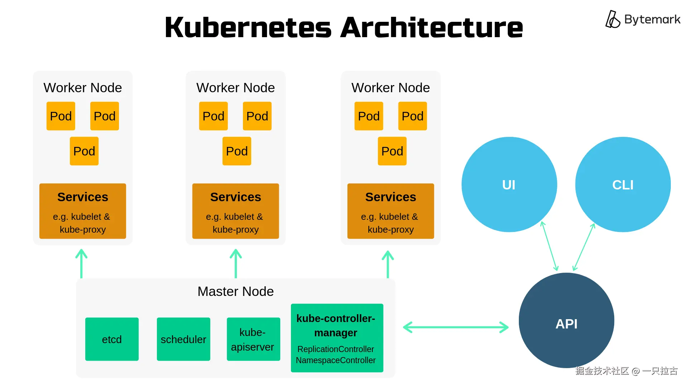

# Roadmap to Backend Programming Master: Containerization and Virtualization

Welcome to another article in the **Backend Programming Mastery** series! On the journey to becoming a skilled backend developer, mastering both foundational and cutting-edge technologies is essential. Today, we will explore a key topic in modern software development: **Efficient Resource Management**.

As applications grow and evolve, especially in the **cloud-native development** era, ensuring optimal system resource utilization becomes crucial. In this context, **containerization** and **virtualization** offer powerful solutions for managing workloads across various environments. These technologies not only enhance scalability and flexibility but also simplify workflows, making them indispensable tools for backend developers.

In this article, we will:

* Decode **containerization** and **virtualization**, explaining their basic concepts and the differences between them.
* Explore their practical applications and highlight use cases where one technology should be prioritized over the other.
* Introduce **Docker** and **Kubernetes**, two core tools that have revolutionized containerization and orchestration in modern development.

After reading this article, you will have a solid understanding of these technologies and how they fit into your backend development toolkit. Let’s get started!

***

## **Virtualization**

Virtualization is a technology that allows a single physical server to host multiple **virtual machines (VMs)**, each of which can function as an independent computer with its own operating system (OS), resources, and applications. This is achieved through hardware abstraction, enabling multiple environments to coexist on the same physical hardware without interference.

### **How Virtual Machines Work**

At the core of virtualization is the **hypervisor**, a software layer that sits between the hardware and virtual machines. The hypervisor is responsible for resource allocation, ensuring that each virtual machine gets the required CPU, memory, storage, and network bandwidth. Common hypervisors include **VMware**, **Microsoft Hyper-V**, and **KVM**.


Each virtual machine consists of the following components:

1. **Guest OS**: The operating system running inside the virtual machine.
2. **Virtualized Hardware**: The virtual representation of physical components (e.g., CPU, memory, and storage).
3. **Applications**: Programs running in the isolated virtual machine environment.

The hypervisor coordinates these elements, ensuring isolation between virtual machines while allowing them to share the same physical server resources.

### **Advantages of Virtualization**

Virtualization offers several advantages:

* **Improved Hardware Utilization**: By hosting multiple virtual machines on a single physical server, organizations can maximize hardware usage and reduce costs.
* **Isolation**: Each virtual machine runs independently, ensuring that a crash or issue in one VM does not affect others.
* **Flexibility and Portability**: Virtual machines can be easily created, cloned, and migrated, making them ideal for development, testing, and disaster recovery scenarios.
* **Compatibility**: Virtualization allows different operating systems (e.g., Linux and Windows) to run on the same physical machine, meeting diverse application requirements.

### **Limitations of Virtualization**

Despite its many advantages, virtualization has some limitations:

* **Higher Resource Consumption**: Each virtual machine requires its own operating system and associated processes, resulting in greater overhead compared to other technologies like containers.
* **Slower Startup Time**: Virtual machines require initialization of the entire operating system, which can take several seconds or even minutes.
* **Management Complexity**: In large-scale deployments, managing and orchestrating numerous virtual machines can become cumbersome without powerful management tools.
* **Less Efficient Scaling**: Scaling virtual machines requires additional OS configuration, making it less flexible compared to container-based solutions.

Virtualization remains a core technology in many application scenarios, particularly where strong isolation and legacy application support are required. However, as we will see later, **containerization** offers a lighter, more flexible alternative for modern cloud-native applications.

***

## **Containerization**

Containerization is a lightweight form of virtualization that packages an application and all its dependencies (such as libraries, runtimes, and configuration files) into a single **container**. Unlike virtual machines, containers share the host OS kernel but remain isolated at the application layer. This means containers don’t need their own operating system, making them more efficient and faster to start than traditional virtual machines.

Containers provide a consistent environment, ensuring that applications run seamlessly across different systems—whether on a developer’s laptop, a test server, or in production.


**How Containers Work:**

Containers are managed by containerization platforms like **Docker**, which leverage host OS features (e.g., Linux namespaces and control groups) to isolate processes and manage resources. Here's an overview of how they work:

1. **Packaging and Building**: Developers define the application and its dependencies in a lightweight configuration file (e.g., Dockerfile).
2. **Image Creation**: Docker builds an image from the Dockerfile, which serves as a blueprint for creating containers.
3. **Container Execution**: Using the image, Docker runs the container as an independent process on the host machine. Each container has its own filesystem, network, and processes, while sharing the underlying OS kernel.

For example, a Docker container might include a Python runtime, application code, and necessary libraries, ensuring the application behaves consistently across different environments.

**Advantages of Containerization:**

Containerization has become the cornerstone of modern application deployment due to its numerous advantages:

* **Efficient Resource Usage**: Containers don’t require a full OS, so they are more lightweight and better utilize resources compared to virtual machines.
* **Fast Startup**: Containers can start in seconds because they don’t need to initialize an entire OS.
* **Portability**: Containers bundle the application and its dependencies, making them platform-agnostic. A containerized application can run on any system that has Docker installed.
* **Scalability**: Containers can be easily scaled up or down based on workload demands, and orchestration tools like Kubernetes can automatically manage scaling in large deployments.
* **Simplified CI/CD**: Containers are perfect for continuous integration/continuous deployment workflows because they ensure consistency from development to production.

**Limitations of Containerization:**

While containerization is a powerful tool, it does have some challenges:

* **Security Concerns**: Since containers share the host OS kernel, vulnerabilities in the kernel may expose all containers.
* **Limited Isolation**: Unlike virtual machines that provide hardware-level isolation, containers only offer process-level isolation. This may not meet strict security or performance isolation needs.
* **Compatibility Issues**: Some legacy applications or applications tightly coupled to specific operating systems may not be suitable for containerization.
* **Operational Complexity**: Managing and orchestrating a large number of containers in production can become complex, requiring tools like Kubernetes for scaling, networking, and monitoring.

Overall, containerization provides a lightweight, flexible alternative for modern, cloud-native applications. While its advantages are significant, understanding the trade-offs is key to its effective adoption.

***

## **Docker: The Foundation of Containerization**

Docker is the leading platform in the containerization space, enabling developers to easily package, deploy, and manage applications, ensuring they run reliably across different environments from development to production. By encapsulating applications and their dependencies into lightweight, isolated containers, Docker offers a consistent and portable way to manage software.


**Key Components:**

1. **Docker Images**: A Docker image is the **blueprint** for containers. It contains everything needed to run an application, including the OS base layer, libraries, dependencies, and application code. Images are immutable, meaning their contents do not change once built, ensuring deployment consistency.
2. **Docker Containers**: A Docker container is a **running instance** of a Docker image. Containers are lightweight, isolated processes running on the host OS, offering efficiency and scalability. Containers can be easily started, stopped, and replicated, providing flexibility in development and deployment workflows.
3. **Dockerfile**: A Dockerfile is a **text file** containing instructions to build a Docker image. Developers use it to specify the base image, add application code, define dependencies, and configure how the container will run.
4. **Docker Hub**: Docker Hub is a **cloud-based image repository** where developers can store, share, and download Docker images. It contains pre-built images for common applications and services that teams can reuse and extend without building from scratch.

**Advantages of Docker:**

* **Development Speed**: Docker eliminates the "it works on my machine" problem, streamlining the development process. Developers can quickly set up a consistent development environment using pre-configured images.
* **Environment Consistency**: Docker ensures that the same application runs consistently across different environments, from development to production.
* **Scalability**: Containers are lightweight, enabling applications to scale easily to handle different workloads.
* **Collaboration**: Docker allows teams to share images and configurations, enabling seamless collaboration across development, testing, and operations.

**Simple Example:**

Here’s a sample Dockerfile for a Python web application using Flask:

```dockerfile
# Use the official Python runtime as the base image
FROM python:3.9-slim

# Set the working directory inside the container
WORKDIR /app

# Copy the application code and dependencies into the container
COPY requirements.txt .
COPY app.py .

# Install the required Python libraries
RUN pip install -r requirements.txt

# Expose the application port
EXPOSE 5000

# Define the command to run the application
CMD ["python", "app.py"]
```

**Steps to Run the Application:**

1. Build the Docker image:

    ```bash
    docker build -t my-flask-app .
    ```

2. Run the container:

    ```bash
    docker run -p 5000:5000 my-flask-app
    ```

This example demonstrates how Docker simplifies packaging and deploying applications by encapsulating dependencies and configurations into reusable, portable images.

***

## **Kubernetes**

Kubernetes (often abbreviated as K8s) is an open-source platform for automating the deployment, scaling, and management of containerized applications. It provides a powerful orchestration layer for containerized workloads, enabling efficient management across multiple hosts and ensuring the reliability, scalability, and high availability of applications. Kubernetes is especially suitable for cloud-native applications that require dynamic scaling and robust fault tolerance.



**Core Components:**

1. **Pods**: Pods are the **smallest deployable units** in Kubernetes. Each Pod typically contains one or more tightly coupled containers that share the same network namespace and storage volumes. For example, a Pod might contain a web server container and an auxiliary container for logging.
2. **Nodes and Clusters**: A **Node** is a worker machine in a Kubernetes cluster, which can be a physical server or a virtual machine. Nodes run containers and are managed by the Kubernetes control plane. A **Cluster** is a collection of nodes that work together to orchestrate the deployment of applications. The Kubernetes control plane ensures efficient deployment and management of applications across the cluster.
3. **Services and Ingress**: A **Service** provides network functionality and allows communication between Pods or between Pods and external clients. Services provide stable endpoints that do not change even if Pods are recreated or moved. **Ingress** is a special API object used to manage HTTP and HTTPS access to services within the cluster, supporting URL routing and SSL termination.

**Use Cases for Kubernetes:**

Kubernetes excels in **managing large-scale distributed applications**, with major advantages including:

* **Auto-scaling**: Kubernetes can automatically scale applications based on workload demands, ensuring optimal resource utilization.
* **Resilience and Recovery**: With built-in self-healing capabilities, Kubernetes can detect and replace failed Pods, ensuring that applications remain available.
* **Multi-environment management**: Kubernetes provides consistent deployment across development, testing, and production environments, making it well-suited for microservices architectures.
* **Load balancing and traffic routing**: Kubernetes can distribute traffic across multiple Pods, ensuring high availability and balanced resource utilization.

While Kubernetes provides powerful orchestration capabilities, it is more suitable for applications that require **scalability, fault tolerance**, and **frequent updates**. For simpler applications or smaller teams, using Kubernetes directly may introduce unnecessary complexity.

***

## **The Combination of Docker and Kubernetes**

Docker and Kubernetes form a powerful combination in modern application development:

* **Docker** focuses on **packaging applications into containers**, including their dependencies, ensuring consistency across different environments.
* **Kubernetes** excels at **orchestrating these containers**, automating deployment, scaling, and management.

Together, they create an ecosystem that simplifies building, delivering, and running distributed cloud-native applications.

**Example:**

1. **Build a Docker Image**:

    Write a simple Dockerfile to containerize the application:

    ```dockerfile
    # Dockerfile for Python Web Application
    FROM python:3.9-slim
    WORKDIR /app
    COPY requirements.txt .
    RUN pip install -r requirements.txt
    COPY . .
    CMD ["python", "app.py"]
    ```

    Build and tag the image:

    ```bash
    docker build -t my-app:1.0 .
    ```

2. **Push to Container Registry**:

    Push the built image to Docker Hub or a private registry:

    ```bash
    docker tag my-app:1.0 myusername/my-app:1.0
    docker push myusername/my-app:1.0
    ```

3. **Deploy on Kubernetes**:

    Create a Kubernetes deployment YAML file (deployment.yaml):

    ```yaml
    apiVersion: apps/v1
    kind: Deployment
    metadata:
      name: my-app-deployment
    spec:
      replicas: 3
      selector:
        matchLabels:
          app: my-app
      template:
        metadata:
          labels:
            app: my-app
        spec:
          containers:
          - name: my-app
            image: myusername/my-app:1.0
            ports:
            - containerPort: 5000
    ```

    Apply the deployment:

    ```bash
    kubectl apply -f deployment.yaml
    ```

4. **Expose the Application**:

    Use Kubernetes Service or Ingress to expose the application to external users:

    ```bash
    kubectl expose deployment my-app-deployment --type=LoadBalancer --port=80 --target-port=5000
    ```

**Considerations When Using Both:**

* **Operational Complexity**: Running a Kubernetes cluster increases operational complexity; using managed Kubernetes (e.g., GKE, AKS) can simplify management.
* **Cost**: Kubernetes requires significant resources, and small teams or projects may incur unnecessary costs.
* **Expertise**: Properly using Kubernetes requires in-depth knowledge of container orchestration and infrastructure management.

***

## **Key Takeaways**

**Summary Points:**

Virtualization technology allows multiple virtual machines (VMs) to run on a single physical server, with each VM having its own operating system. This provides strong isolation, but resource overhead is higher as each VM runs a separate operating system. Containerization, on the other hand, provides a lightweight and efficient alternative by sharing the operating system kernel. Containers are portable, resource-efficient, and ideal for modern application development. Docker is the leading tool for building and running containers, while Kubernetes provides powerful orchestration capabilities for managing large-scale containerized applications.

**Recommendations:**

When full isolation or running legacy applications that require a specific operating system is needed, virtual machines are the better choice. For scenarios that require portability, speed, and efficient resource usage, Docker containers are highly suitable. For managing large-scale distributed systems, Kubernetes is indispensable, offering automatic scaling, resilience, and advanced orchestration features.

**Future Trends:**

Looking ahead, hybrid cloud deployments are becoming increasingly popular, with more organizations merging on-premises, public cloud, and private cloud environments. Serverless containers (e.g., AWS Fargate) simplify container management by abstracting the underlying infrastructure. Meanwhile, the growth of microservices architectures further solidifies the role of containers and Kubernetes as the foundation for deploying scalable and modular applications. Staying up to date with these tools and trends is essential for backend developers to remain competitive in the ever-evolving tech landscape.
