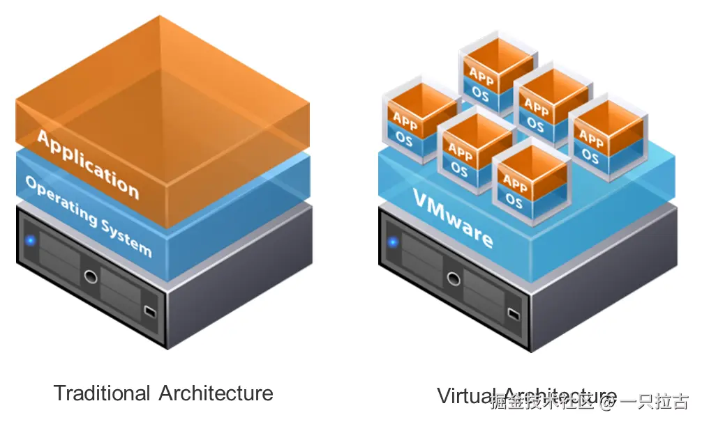
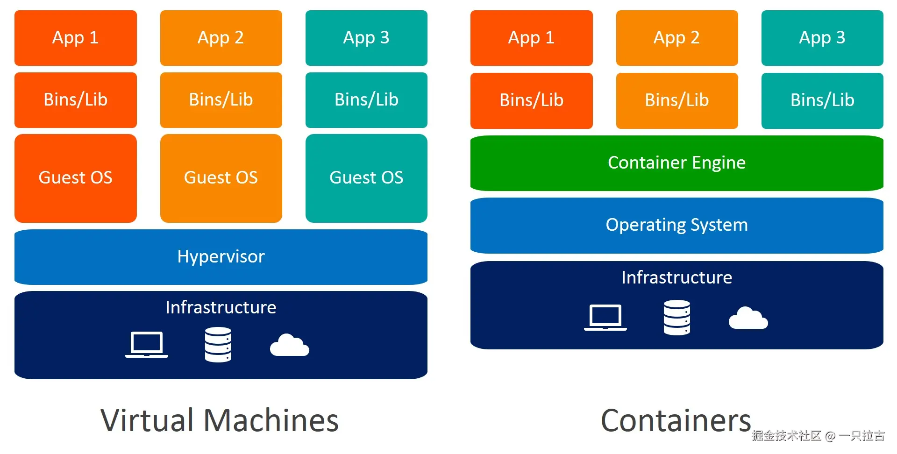
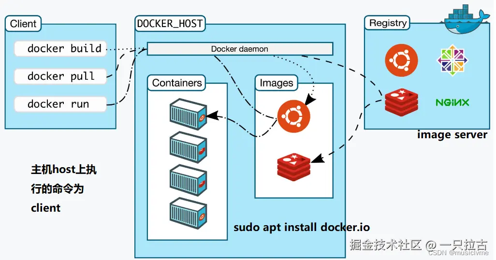
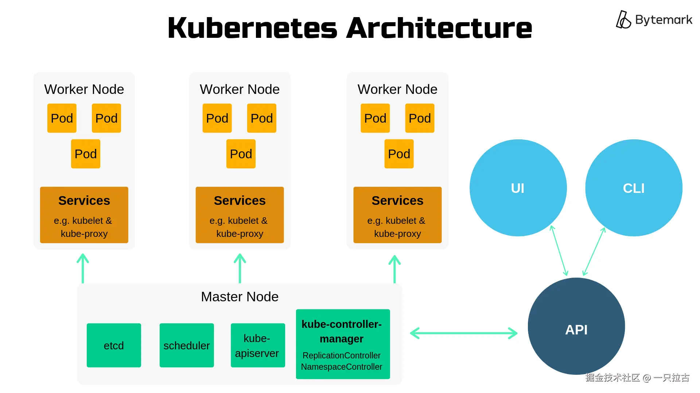

# 从小白到大神：后端开发必学之容器化与虚拟化

欢迎来到**后端编程大师之路**系列的另一篇文章！在成为一名熟练的后端开发者的旅途中，掌握基础技术和前沿技术是必不可少的。今天，我们将探讨现代软件开发中的一个关键主题：**高效的资源管理**。

随着应用程序的扩展和演变，特别是在**云原生开发**时代，确保系统资源的最佳利用变得至关重要。在这种背景下，**容器化**和**虚拟化**提供了强大的解决方案，用于管理跨各种环境的工作负载。这些技术不仅提高了可扩展性和灵活性，还简化了工作流程，使它们成为后端开发者不可或缺的工具。

在本篇文章中，我们将：

* 解密**容器化**和**虚拟化**，解释其基本概念以及它们的区别。
* 探讨它们的实际应用，强调在哪些用例中应该优先选择其中一种技术。
* 介绍**Docker**和**Kubernetes**，这两种在现代开发中彻底改变了容器化和编排的核心工具。

阅读完本文后，您将对这些技术有一个扎实的理解，并了解它们如何融入您的后端开发工具箱。让我们开始吧！

***

## **虚拟化**

虚拟化是一种技术，可以让单个物理服务器托管多个**虚拟机 (Virtual Machines, VMs)**，每个虚拟机都可以作为一个独立的计算机运行，拥有自己的操作系统 (OS)、资源和应用程序。这是通过抽象硬件层实现的，使多个环境能够在同一物理硬件上共存而互不干扰。

### **虚拟机如何工作**

虚拟化的核心是**虚拟机管理程序 (Hypervisor)**，它是一种位于硬件和虚拟机之间的软件层。虚拟机管理程序负责资源分配，确保每个虚拟机都能获得其所需的 CPU、内存、存储和网络带宽。常见的虚拟机管理程序包括 **VMware**、**Microsoft Hyper-V** 和 **KVM**。



每个虚拟机包括以下组件：

1. **客户操作系统 (Guest OS)**：运行在虚拟机中的操作系统。
2. **虚拟化硬件**：物理组件（如 CPU、内存和存储）的虚拟表示。
3. **应用程序**：运行在隔离虚拟机环境中的程序。

虚拟机管理程序协调这些元素，确保虚拟机之间保持隔离，同时共享同一物理服务器的资源。

### **虚拟化的优势**

虚拟化具有以下几个优势：

* **提高硬件利用率**：通过在一台物理服务器上托管多个虚拟机，企业可以最大化硬件使用并降低成本。
* **隔离性**：每个虚拟机独立运行，确保一个虚拟机的崩溃或问题不会影响其他虚拟机。
* **灵活性与可移植性**：虚拟机可以轻松创建、克隆和迁移，非常适合开发、测试和灾难恢复场景。
* **兼容性**：在同一台物理机器上运行不同的操作系统（如 Linux 和 Windows），满足多样化的应用需求。

### **虚拟化的局限性**

尽管有诸多优点，虚拟化也存在一些局限性：

* **更高的资源消耗**：每个虚拟机需要独立的操作系统及相关进程，导致与容器等其他技术相比开销较大。
* **启动时间较慢**：虚拟机启动时需要初始化整个操作系统，可能需要几秒甚至几分钟。
* **管理复杂性**：在大规模部署中，管理和编排大量虚拟机可能会变得繁琐，除非有强大的管理工具支持。
* **扩展效率较低**：为满足需求扩展虚拟机需要额外配置操作系统环境，灵活性不如基于容器的解决方案。

虚拟化仍然是许多应用场景中的核心技术，特别是在需要强隔离性和支持遗留应用的环境中。然而，正如我们稍后将看到的，**容器化**为现代云原生应用提供了一种更轻量、更灵活的替代方案。

***

## **容器化**

容器化是一种轻量化的虚拟化技术，它将应用程序及其所有依赖项（如库、运行时、配置文件）打包到一个单独的**容器**中。与虚拟机不同，容器共享宿主操作系统内核，但在应用层面上保持隔离。这意味着容器不需要自己的操作系统，从而比传统虚拟机更加高效且启动速度更快。

容器提供了一种一致的环境，确保应用程序在不同系统上都能无缝运行，无论是在开发人员的笔记本上、测试服务器上，还是在生产环境中。



**容器如何工作:**

容器由如 **Docker** 这样的容器化平台管理，这些平台利用宿主操作系统的功能（例如 Linux 的命名空间和控制组）来隔离进程并管理资源。以下是其工作原理的概述：

1. **打包和构建**：开发人员在轻量化配置文件（如 Dockerfile）中定义应用程序及其依赖项。
2. **镜像创建**：Docker 基于 Dockerfile 构建镜像，该镜像作为创建容器的蓝图。
3. **容器运行**：使用镜像，Docker 将容器作为宿主机器上的独立进程运行。每个容器拥有自己的文件系统、网络和进程，但共享底层操作系统内核。

例如，一个 Docker 容器可能包含 Python 运行时、应用程序代码和必要的库，确保应用程序在不同环境下行为一致。

**容器化的优势:**

容器化因其众多优势，已成为现代应用程序部署的基石：

* **高效资源使用**：容器无需完整的操作系统，因此更轻量化，与虚拟机相比能更好地利用资源。
* **启动速度快**：容器在几秒内即可启动，因为无需初始化整个操作系统。
* **可移植性**：容器打包了应用程序及其依赖项，使其与平台无关。一个容器化的应用程序可以在任何安装了 Docker 的系统上运行。
* **可扩展性**：容器可以轻松按需扩展或收缩工作负载，并且像 Kubernetes 这样的编排工具可以自动处理大规模部署的扩展过程。
* **简化 CI/CD 流程**：容器非常适合持续集成/持续部署工作流，因为它们确保了从开发到生产环境的一致性。

**容器化的局限性:**

尽管容器化是一种强大的工具，但它也存在一些挑战：

* **安全问题**：由于容器共享宿主操作系统内核，内核中的漏洞可能会暴露所有容器。
* **隔离性有限**：与在硬件层面隔离的虚拟机不同，容器仅提供进程级隔离。这可能不足以满足严格的安全或性能隔离需求。
* **兼容性问题**：一些遗留应用程序或紧耦合于特定操作系统的应用程序可能不适合容器化环境。
* **操作复杂性**：在生产环境中管理和编排大量容器可能会变得复杂，需要 Kubernetes 等工具来处理扩展、网络和监控等任务。

总的来说，容器化为现代、云原生应用提供了一种轻量、灵活的替代方案。虽然它的优势显著，但理解其权衡对于高效采用至关重要。

***

## **Docker：容器化的基础**

Docker 是容器化领域的领先平台，它使开发人员能够轻松打包、部署和管理应用程序，确保应用程序在从开发到生产的不同环境中可靠运行。通过将应用程序及其依赖项封装到轻量、隔离的容器中，Docker 提供了一种一致且可移植的方式。



**关键组件:**

1. **Docker 镜像**：Docker 镜像是容器的**蓝图**。它包含运行应用程序所需的一切，包括操作系统基础层、库、依赖项和应用程序代码。镜像是不可变的，一旦构建，内容不会更改，从而确保了部署的一致性。
2. **Docker 容器**：Docker 容器是 Docker 镜像的一个**可运行实例**。容器是运行在宿主操作系统上的轻量、隔离的进程，具有高效和可扩展的特点。容器可以轻松启动、停止和复制，为开发和部署工作流提供了灵活性。
3. **Dockerfile**：Dockerfile 是一个**文本文件**，包含构建 Docker 镜像的指令。开发人员可以用它来指定基础镜像、添加应用程序代码、定义依赖项，并配置容器的运行方式。
4. **Docker Hub**：Docker Hub 是一个**基于云的镜像仓库**，开发人员可以在其中存储、分享和下载 Docker 镜像。它包含大量常见应用和服务的预构建镜像，团队可以复用并扩展这些镜像，而无需从零开始。

**Docker 的优势:**

* **开发速度**：Docker 消除了“它在我机器上没问题”的问题，简化了开发流程。开发人员可以通过预配置的镜像快速设置一致的开发环境。
* **环境一致性**：Docker 确保相同的应用程序在不同环境中运行一致，从开发到生产都没有问题。
* **可扩展性**：容器轻量化，可以轻松扩展应用程序以处理不同的工作负载。
* **协作性**：Docker 允许团队分享镜像和配置，实现开发、测试和运维的无缝协作。

**简单示例:**

以下是一个使用 Flask 的 Python Web 应用程序的 Dockerfile 示例：

```dockerfile
# 使用官方 Python 运行时作为基础镜像
FROM python:3.9-slim

# 设置容器中的工作目录
WORKDIR /app

# 将应用程序代码和依赖项复制到容器中
COPY requirements.txt .
COPY app.py .

# 安装所需的 Python 库
RUN pip install -r requirements.txt

# 暴露应用程序的端口
EXPOSE 5000

# 定义运行应用程序的命令
CMD ["python", "app.py"]
```

**运行应用程序的步骤：**

1. 构建 Docker 镜像：

    ```bash
    docker build -t my-flask-app .
    ```

2. 运行容器：

    ```bash
    docker run -p 5000:5000 my-flask-app
    ```

这个示例展示了 Docker 如何通过将依赖项和配置封装到可复用、可移植的镜像中，简化了应用程序的打包和部署。

***

## **Kubernetes**

Kubernetes（常简称为 K8s）是一种开源平台，用于自动化容器化应用的部署、扩展和管理。它为容器化工作负载提供了强大的编排层，能够跨多个主机实现高效管理，确保应用的可靠性、可扩展性和高可用性。Kubernetes 特别适合需要动态扩展和强大容错能力的云原生应用。



**核心组件:**

1. **Pods**：Pods 是 Kubernetes 中 **最小的可部署单元**。每个 Pod 通常包含一个或多个紧密耦合的容器，这些容器共享相同的网络命名空间和存储卷。例如，一个 Pod 可以包含一个 Web 服务器容器和一个用于日志记录的辅助容器。
2. **节点和集群**：**节点（Node）** 是 Kubernetes 集群中的工作机，可以是物理服务器或虚拟机。节点运行容器，并由 Kubernetes 控制平面管理。**集群（Cluster）** 是由多个节点组成的集合，这些节点共同编排应用的部署。Kubernetes 控制平面确保应用在集群中的高效部署和管理。
3. **服务（Service）和 Ingress**：**服务（Service）** 提供网络功能，允许 Pods 之间或 Pods 与外部客户端之间通信。服务为 Pods 提供稳定的端点，即使 Pods 被重新创建或移动也不会改变。**Ingress** 是一种特殊的 API 对象，用于管理集群内服务的 HTTP 和 HTTPS 访问，支持 URL 路由和 SSL 终止等功能。

**Kubernetes 的适用场景:**

Kubernetes 在 **管理大规模分布式应用** 场景中表现尤为出色，其主要优势包括：

* **自动扩展**：Kubernetes 可以根据工作负载需求自动扩展应用，确保资源利用率最优。
* **弹性和恢复能力**：通过内置的自愈功能，Kubernetes 能检测并替换故障 Pods，确保应用始终可用。
* **多环境管理**：Kubernetes 提供从开发、测试到生产环境的一致部署，非常适合微服务架构。
* **负载均衡和流量路由**：Kubernetes 可以将流量分配到多个 Pods 中，确保高可用性和资源利用均衡。

虽然 Kubernetes 提供了强大的编排能力，但更适合需要 **扩展性、容错能力** 和 **频繁更新** 的应用。对于较简单的应用或小型团队，直接使用 Kubernetes 可能增加不必要的复杂性。

***

## **Docker 与 Kubernetes 的结合**

Docker 和 Kubernetes 是现代应用开发中的强大组合：

* **Docker** 专注于将应用 **打包为容器**，包含其依赖项，确保不同环境的一致性。
* **Kubernetes** 擅长 **编排这些容器**，实现部署、扩展和管理的自动化。

两者结合形成了一个简化构建、交付和运行分布式云原生应用的生态系统。

**示例:**

1. **构建 Docker 镜像**：

    编写简单的 Dockerfile 将应用容器化：

    ```dockerfile
    # 针对 Python Web 应用的 Dockerfile
    FROM python:3.9-slim
    WORKDIR /app
    COPY requirements.txt .
    RUN pip install -r requirements.txt
    COPY . .
    CMD ["python", "app.py"]
    ```

    构建并打标签镜像：

    ```bash
    docker build -t my-app:1.0 .
    ```

2. **推送到容器镜像仓库**：

    将构建好的镜像推送到 Docker Hub 或私有仓库：

    ```bash
    docker tag my-app:1.0 myusername/my-app:1.0
    docker push myusername/my-app:1.0
    ```

3. **在 Kubernetes 上部署**：

    创建 Kubernetes 部署 YAML 文件（deployment.yaml）：

    ```yaml
    apiVersion: apps/v1
    kind: Deployment
    metadata:
      name: my-app-deployment
    spec:
      replicas: 3
      selector:
        matchLabels:
          app: my-app
      template:
        metadata:
          labels:
            app: my-app
        spec:
          containers:
          - name: my-app
            image: myusername/my-app:1.0
            ports:
            - containerPort: 5000
    ```

    应用部署：

    ```bash
    kubectl apply -f deployment.yaml
    ```

4. **公开应用**：

    使用 Kubernetes Service 或 Ingress 将应用暴露给外部用户：

    ```bash
    kubectl expose deployment my-app-deployment --type=LoadBalancer --port=80 --target-port=5000
    ```

**使用两者的注意事项:**

* **操作复杂性**：运行 Kubernetes 集群增加了操作复杂性；使用托管 Kubernetes（如 GKE、AKS）可以简化管理。
* **成本**：Kubernetes 需要大量资源，小型团队或项目可能增加不必要的成本。
* **专业知识**：正确使用 Kubernetes 需要深入了解容器编排和基础设施管理。

***

## **关键点总结**

**要点回顾:**

虚拟化技术允许在单个物理服务器上运行多个虚拟机（VM），每个虚拟机都有自己的操作系统。这提供了强隔离性，但由于需要为每个虚拟机运行独立的操作系统，资源开销较大。而容器化技术通过共享操作系统内核提供了轻量级且高效的替代方案。容器便携、资源利用率高，是现代应用开发的理想选择。Docker 是构建和运行容器的领先工具，而 Kubernetes 为管理大规模容器化应用提供了强大的编排能力。

**选择建议:**

当需要完整隔离或运行依赖特定操作系统的旧应用时，虚拟机是更好的选择。对于需要便携性、速度和高效资源利用的场景，Docker 容器非常适用。而在管理大规模分布式系统时，Kubernetes 是不可或缺的，提供了自动扩展、弹性和高级编排功能。

**未来趋势:**

展望未来，混合云部署正逐渐流行，越来越多的组织在本地、公有云和私有云环境之间进行融合。无服务器容器（如 AWS Fargate）通过抽象底层基础设施简化了容器管理。同时，微服务架构的发展进一步巩固了容器和 Kubernetes 作为部署可扩展和模块化应用的基础技术的地位。紧跟这些工具和趋势，对于后端开发者在不断发展的技术领域保持竞争力至关重要。
