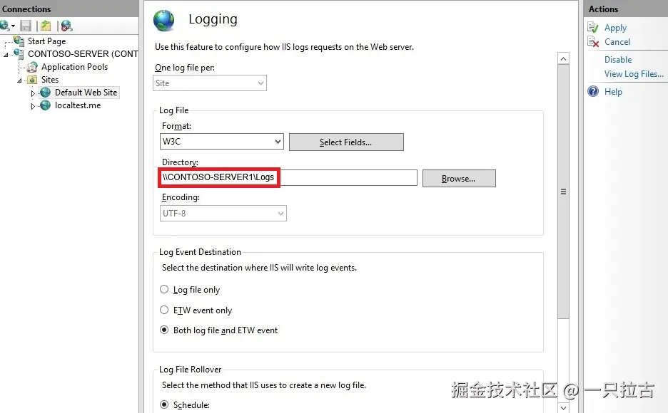

# Roadmap to Backend Programming Master: Hosting .NET Applications on IIS and Other Web Servers

## Web Servers

A web server is a software or hardware system that handles client requests, typically from web browsers, and serves web content such as HTML pages, images, and other resources. It processes incoming HTTP or HTTPS requests, interacts with application servers or databases when necessary, and sends back appropriate responses to the client. Essentially, a web server acts as an intermediary between the client and server-side resources, managing web traffic and ensuring smooth content delivery. Without a web server, hosting and delivering websites and web applications would be impossible.

Today, several web servers are available, each with its own advantages and use cases. Popular options include **Nginx**, known for its high performance and efficient handling of static content; **Apache HTTP Server**, recognized for its flexibility and wide range of module support; **Caddy**, favored for its simplicity and automatic HTTPS support; and **Microsoft Internet Information Services (IIS)**, deeply integrated with the Windows ecosystem. Each web server plays a critical role in traffic management, delivering static and dynamic content, and providing features like load balancing, caching, and security.

In this blog, we will focus on **Microsoft IIS**. For .NET developers, IIS is especially important because it seamlessly integrates with the Windows environment and offers strong support for ASP.NET applications. IIS provides a rich set of features, including request processing, authentication, SSL/TLS encryption, and URL rewriting, making it a powerful tool for hosting enterprise-level web applications. For backend developers working with the .NET framework, understanding IIS is crucial for deploying and managing scalable and secure web services.

***

## Introduction to IIS

**What is IIS?**
Microsoft Internet Information Services (IIS) is a flexible, secure, and high-performance web server developed by Microsoft to host and manage web applications and services on Windows servers. IIS was first introduced as part of Windows NT 3.51, and over the years, it has evolved with each version, enhancing performance, security, and functionality. IIS supports a wide range of web technologies, including ASP.NET, PHP, and static content, and provides tools to manage websites through both graphical user interface and command-line tools. IIS integrates deeply with other Microsoft products and services like Active Directory and SQL Server, making it a popular choice for enterprises.

**Installation and Setup**
Installing IIS on a Windows Server or Windows 10/11 is straightforward. Below are the installation steps:

1. Open **Server Manager** (Windows Server) or **Control Panel** (Windows Desktop).
2. Navigate to **Manage > Add Roles and Features** (Server Manager) or **Programs > Turn Windows features on or off** (Control Panel).
3. In the **Add Roles and Features Wizard**, select **Role-based or feature-based installation**.
4. Choose the target server and click **Next**.
5. In the **Roles** section, check the box for **Web Server (IIS)**.
6. Add other features as needed, such as **ASP.NET**, **FTP Server**, or **Common HTTP Features**.
7. Click **Install** and wait for the installation to complete.
8. After installation, search for **IIS Manager** in the Start menu and open it.

For developers, enabling specific features like **ASP.NET** or **WebSockets** during the installation is crucial for running modern web applications.

**Basic Configuration**
After installing IIS, basic configuration includes setting up a new website, managing application pools, and binding domains. Here are the steps to configure a simple website:

**Create a New Website:**

* Open **IIS Manager**.
* Right-click the **Sites** node on the left panel and select **Add Website**.
* Enter the **Site Name**, set the **Physical Path** to the folder containing the web application, and specify the **Binding** (IP address, port, and hostname).
* Click **OK** to create the site.

**Manage Application Pools:**

* Application pools help isolate different applications for enhanced security and performance.
* In **IIS Manager**, go to the **Application Pools** node.
* Right-click and select **Add Application Pool** to create a new pool.
* Choose the site, click **Basic Settings**, and assign the appropriate application pool.

**Bind a Domain:**

* To bind a custom domain to your website, go to the **Site Bindings** settings.
* Add a new binding for **HTTP** or **HTTPS**, specify the hostname, and configure an SSL certificate as needed.

With these steps, you will have a fully functional IIS setup capable of hosting web applications, managing traffic, and laying the foundation for more advanced configurations and optimizations.

***

## Core Features of IIS

**Request Handling and Pipeline**
IIS processes HTTP requests through a structured request pipeline, consisting of a series of stages where requests are handled and appropriate responses are generated. When a client sends a request, IIS receives the request and passes it through a series of modules and handlers. **Handlers** process the request based on the type of file or resource requested, while **modules** perform pre- or post-processing tasks like authentication or logging. For example, an ASP.NET page request is handled by the **ASP.NET handler**, while static files (like images or HTML pages) are managed by the **StaticFileModule**. Understanding the request pipeline allows developers to customize request processing by adding or configuring custom modules and handlers, which is essential for implementing custom logic or enhancing performance.

**Authentication and Authorization**
IIS provides robust built-in authentication mechanisms to protect web applications, including **Basic Authentication**, **Digest Authentication**, and **Windows Authentication**. These mechanisms help verify the identity of users accessing the server. **Basic Authentication** involves sending a username and password with each request, while **Digest Authentication** encrypts these credentials for added security. **Windows Authentication** uses Active Directory to authenticate users within a Windows domain. Once authentication is complete, IIS allows developers to set **authorization rules** to control access to specific resources or directories. These rules can be configured through the **IIS Manager** interface or the application's `web.config` file, providing fine-grained access control for different parts of the application.

**SSL/TLS Support**
IIS supports **SSL/TLS** to ensure secure communication between the client and server. Configuring SSL/TLS certificates in IIS involves obtaining a certificate from a trusted Certificate Authority (CA) and binding it to the target website. The steps to set up HTTPS are as follows:

1. Open **IIS Manager** and select the target site.
2. Go to **Bindings** and add an **HTTPS** binding.
3. Select the installed SSL certificate from the list.

This configuration encrypts data transmitted between the client and server, protecting sensitive information like login credentials and payment data. IIS also supports **Server Name Indication (SNI)**, which allows multiple SSL certificates to be bound to a single IP address, useful when hosting multiple secure sites on the same server.

**URL Rewriting and Routing**
The **URL Rewrite Module** in IIS allows developers to define rules for transforming URLs, creating cleaner, more user-friendly URLs. For example, `example.com/products?id=123` can be rewritten as `example.com/products/123`, improving readability and search engine optimization (SEO). The steps to set up URL rewriting are as follows:

1. Open **IIS Manager** and select the site.
2. Click on the **URL Rewrite** feature.
3. Create a new rule and specify the **Match URL** and **Action** settings.

URL rewriting can also be used to redirect traffic, enforce HTTPS, or handle legacy URLs. Combined with routing in ASP.NET, it provides powerful tools for managing navigation and resource access within web applications.

***

## Hosting .NET Applications on IIS

**Deploying ASP.NET Applications**
Deploying an ASP.NET application on IIS involves several steps to ensure the application runs smoothly. First, publish the application from **Visual Studio** or use the `dotnet publish` command. This generates a set of files that can be deployed to the server. Then, copy these files to a specified folder on the IIS server. In **IIS Manager**, create a new site and point the **Physical Path** to this folder. Make sure the application pool is configured to use the correct **.NET CLR version** or **.NET Core runtime**. For **ASP.NET Core** applications, ensure that **AspNetCoreModule** is installed to handle requests. Additionally, configure the `web.config` and `appsettings.json` files to match the server environment, including connection strings and environment settings.

**Managing Application Pools**
In IIS, **application pools** are used to isolate different web applications for improved reliability and security. Each application pool runs independently, preventing one application from affecting others. To create an application pool, open **IIS Manager**, go to **Application Pools**, and click **Add Application Pool**. Configure settings such as the **.NET CLR version** and **Managed Pipeline Mode** (Integrated or Classic). Assign a specific application pool to a website to ensure it runs in its own process, improving performance and allowing for application pool recycling without impacting other applications. Regularly recycling application pools can prevent memory leaks and improve stability.

**Handling Static and Dynamic Content**
IIS can handle both **static** and **dynamic content**. Static content (like HTML, CSS, JavaScript, and images) is served directly by the **StaticFileModule**. To enhance performance, IIS can cache frequently accessed static files, reducing server load. For **dynamic content** (such as ASP.NET MVC or Web API endpoints), IIS handles requests via the **ASP.NET pipeline**, allowing developers to create rich, interactive web applications that generate content dynamically based on user input or database interaction. Implementing caching mechanisms like **Output Caching** or **Response Caching** for dynamic content can significantly improve performance by reducing the time required to generate frequently accessed resources.

***

## Advanced IIS Features

**Load Balancing and Scalability**
IIS provides robust load balancing support to ensure high-availability applications can handle large traffic volumes efficiently. Load balancing distributes incoming requests across multiple servers to prevent any single server from becoming overwhelmed. This can be achieved using **Network Load Balancing (NLB)** in a Windows Server environment, or by integrating IIS with more advanced load balancers like **Azure Load Balancer** or **Application Gateway**. Configuring load balancing typically involves setting up multiple IIS servers to host the same application, ensuring that user sessions are distributed and managed effectively. Additionally, IIS supports **Web Farms**, allowing for centralized management and synchronization of multiple servers, making horizontal scaling easier as demand increases.

**Logging and Monitoring**
IIS provides comprehensive logging and monitoring features to help administrators track server performance and diagnose issues. To enable logging, open **IIS Manager**, select the target site, and navigate to the **Logging** feature to configure the log format and storage location. Logs provide important information about requests, response times, and errors, which can be used to analyze performance bottlenecks. For real-time monitoring, **IIS Manager** includes tools like **Worker Processes** and **Failed Request Tracing (FRT)**. Additionally, by integrating **Windows Performance Monitor**, you can track key metrics such as CPU usage, memory consumption, and request processing times. These tools help proactively identify issues and ensure the server operates at optimal performance.

**Security Best Practices**
Securing IIS servers is crucial to preventing potential threats. First, enable the **Windows Firewall** and configure it to allow only necessary traffic. Regularly apply updates and patches to protect against known vulnerabilities. Use **Request Filtering** to block potentially malicious requests and limit access to sensitive directories. IIS also supports **IP Address and Domain Restrictions**, allowing administrators to control which IP addresses can access the server. Implement **SSL/TLS** encryption to secure communication between the client and server, and enforce strong authentication methods to protect user data. Furthermore, enabling **Dynamic IP Restrictions** can help prevent brute-force attacks by blocking repeated failed login attempts.

***

## Common Issues and Troubleshooting

**Performance Bottlenecks**
In high-traffic environments, performance issues are common, and diagnosing them requires a systematic approach. Start by analyzing IIS logs to identify slow requests or high error rates. Use **Performance Monitor** to track key metrics like CPU, memory, and network usage. Common bottlenecks include inefficient database queries, resource overuse, or improper application pool configurations. Adjusting **application pool recycling settings** and optimizing **caching** can help alleviate performance issues. For advanced diagnostics, use **Application Insights** or third-party monitoring solutions to gain deeper insights into application performance and resource utilization.

**Error Handling**
IIS provides mechanisms for configuring custom error pages to improve user experience by displaying friendly error messages instead of generic HTTP error codes. To set custom error pages, open **IIS Manager**, select the site, and navigate to the **Error Pages** feature. Here, you can specify custom responses for common errors such as **404 (Not Found)** or **500 (Internal Server Error)**. Additionally, enabling **Failed Request Tracing (FRT)** can capture detailed logs for failed requests, helping to resolve complex issues. Reviewing these logs can pinpoint the root cause

 of errors such as misconfigurations, missing files, or permission issues.

***

## Conclusion

Mastering IIS is a crucial skill for any .NET developer focused on backend programming. By leveraging its rich features for security, performance, and scalability, you can create and manage robust web applications. Understanding key concepts like application pools, SSL/TLS encryption, and URL rewriting helps ensure efficient and secure web application deployment. By taking advantage of IIS's extensive logging, monitoring, and load balancing features, you can manage your applications more effectively while ensuring high performance even under heavy traffic conditions. Implementing security best practices ensures your applications stay protected, and learning to troubleshoot common issues improves overall system reliability.
