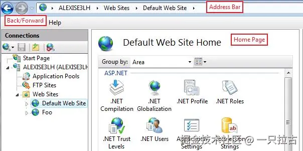
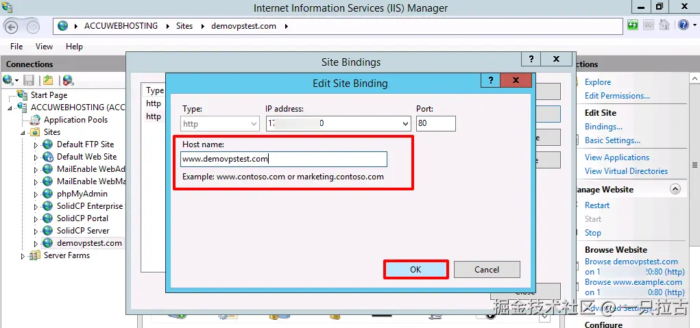
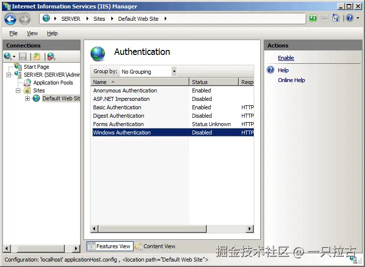

# 后端编程大师之路：在IIS等Web服务器上托管.NET应用程序

## Web服务器

Web服务器是处理客户端请求的软件或硬件系统，通常来自Web浏览器，并提供HTML页面、图像和其他资源等Web内容。它们处理传入的HTTP或HTTPS请求，必要时与应用服务器或数据库交互，并将相应的响应发送回客户端。基本上，Web服务器充当客户端与服务器端资源之间的中介，管理Web流量并确保内容的顺利交付。如果没有Web服务器，就无法托管和交付网站和Web应用程序。

如今有多种Web服务器可用，每种都有其优势和使用场景。流行的选项包括**Nginx**，以高性能和高效处理静态内容而闻名；**Apache HTTP服务器**，因其灵活性和广泛的模块支持而被广泛认可；**Caddy**，因其简单性和自动HTTPS支持而受到青睐；以及**Microsoft Internet Information Services (IIS)** ，与Windows生态系统深度集成。每个Web服务器在管理流量、提供静态和动态内容以及提供负载均衡、缓存和安全等功能方面都起着关键作用。

在本博客中，我们将重点介绍**Microsoft IIS**。对于.NET开发人员来说，IIS尤为重要，因为它与Windows环境无缝集成，并对ASP.NET应用程序提供强大的支持。IIS提供丰富的功能，包括请求处理、身份验证、SSL/TLS加密和URL重写，使其成为托管企业级Web应用程序的强大工具。对于使用.NET框架的后端开发人员，理解IIS对于部署和管理可扩展、安全的Web服务至关重要。

***

## IIS入门

**什么是IIS？**
Microsoft Internet Information Services (IIS)是微软开发的灵活、安全且高性能的Web服务器，用于在Windows服务器上托管和管理Web应用程序和服务。IIS最早作为Windows NT 3.51的一部分推出，经过多年的演变，每个版本都在性能、安全性和功能集方面不断增强。IIS支持广泛的Web技术，包括ASP.NET、PHP和静态内容，并提供通过图形用户界面或命令行工具管理网站的工具。IIS与其他Microsoft产品和服务（如Active Directory和SQL Server）深度集成，使其成为企业的热门选择。

**安装和设置**
在Windows服务器或Windows 10/11上安装IIS非常简单。以下是安装步骤：

1. 打开**服务器管理器（Windows Server）**或**控制面板（Windows桌面）** 。
2. 导航至**管理 > 添加角色和功能**（服务器管理器）或**程序 > 启用或关闭Windows功能**（控制面板）。
3. 在**添加角色和功能向导**中，选择**基于角色或基于功能的安装**。
4. 选择目标服务器并点击**下一步**。
5. 在**角色**部分，勾选**Web服务器（IIS）** 。
6. 根据需要添加其他功能，如**ASP.NET**、**FTP服务器**或**常见HTTP功能**。
7. 点击**安装**，等待安装完成。
8. 安装完成后，在开始菜单中搜索**IIS管理器**并打开。

对于开发人员来说，在安装过程中启用**ASP.NET**或**WebSockets**等特定功能对于运行现代Web应用程序至关重要。

**基本配置**
安装IIS后，基本配置包括设置新网站、管理应用程序池和绑定域。以下是配置简单网站的步骤：

**创建新网站：**

* 打开**IIS管理器**。
* 在左侧面板中右键单击**站点**节点，选择**添加网站**。
* 输入**站点名称**，设置**物理路径**为包含Web应用程序的文件夹，并指定**绑定**（IP地址、端口和主机名）。
* 点击**确定**创建站点。

**管理应用程序池：**

* 应用程序池有助于隔离不同应用程序，以提高安全性和性能。
* 在**IIS管理器**中，转到**应用程序池**节点。
* 右键单击并选择**添加应用程序池**以创建新池。
* 选择站点，点击**基本设置**，并分配适当的应用程序池。

**绑定域名：**

* 要将自定义域绑定到您的网站，进入**站点绑定**设置。
* 为**HTTP**或**HTTPS**添加新的绑定，指定主机名，并根据需要配置SSL证书。

通过这些步骤，您将拥有一个功能完整的IIS设置，能够托管Web应用程序、管理流量，并为更高级的配置和优化奠定基础。

***

## IIS 的核心功能

**请求处理和管道**
IIS 通过结构化的请求管道处理 HTTP 请求，该管道由一系列处理请求并生成适当响应的阶段组成。当客户端向服务器发送请求时，IIS 接收该请求并将其传递给一系列模块和处理程序。**处理程序**根据请求的文件类型或资源来处理请求，而**模块**执行预处理或后处理任务，例如身份验证或日志记录。例如，请求一个 ASP.NET 页面会由 **ASP.NET 处理程序**处理，而静态文件（如图片或 HTML 页面）则由 **StaticFileModule** 管理。了解请求管道可以让开发人员通过添加或配置自定义模块和处理程序来定制请求处理，这对于实现自定义逻辑或增强性能非常有用。

**身份验证与授权**
IIS 提供了强大的内置身份验证机制来保护 Web 应用程序，包括 **基本身份验证**、**摘要身份验证** 和 **Windows 身份验证**。这些机制帮助验证访问服务器的用户身份。**基本身份验证**涉及在每次请求中发送用户名和密码，而 **摘要身份验证** 会加密这些凭据以增加安全性。**Windows 身份验证** 利用 Active Directory 验证 Windows 域内的用户。身份验证完成后，IIS 允许开发人员设置**授权规则**，以控制对特定资源或目录的访问。这些规则可以通过 **IIS 管理器** 界面或应用程序的 `web.config` 文件进行配置，从而对应用程序的不同部分设置细粒度访问控制。

**SSL/TLS 支持**
IIS 支持 **SSL/TLS**，确保客户端和服务器之间的通信安全。在 IIS 中配置 SSL/TLS 证书涉及从受信任的证书颁发机构 (CA) 获取证书，并将其绑定到目标网站。设置 HTTPS 的步骤如下：

1. 打开 **IIS 管理器** 并选择目标站点。
2. 转到 **绑定** 并添加一个 **HTTPS** 绑定。
3. 从列表中选择已安装的 SSL 证书。

此配置会加密客户端与服务器之间传输的数据，保护登录凭据、支付数据等敏感信息。IIS 还支持 **服务器名称指示 (SNI)** ，允许将多个 SSL 证书绑定到单个 IP 地址，这在同一服务器上托管多个安全站点时特别有用。

**URL 重写与路由**
IIS 中的 **URL 重写模块** 允许开发人员定义 URL 转换规则，从而实现更清晰、更友好的 URL。例如，可以将 `example.com/products?id=123` 重写为 `example.com/products/123`，提高可读性和搜索引擎优化（SEO）。设置 URL 重写规则的步骤如下：

1. 打开 **IIS 管理器** 并选择站点。
2. 点击 **URL 重写** 功能。
3. 创建一个新规则并指定 **匹配 URL** 和 **操作** 设置。

URL 重写还可用于重定向流量、强制 HTTPS 或处理旧版 URL。结合 ASP.NET 中的路由，它为管理 Web 应用程序中的导航和资源访问提供了强大的工具。

***

## 在 IIS 上托管 .NET 应用程序

**部署 ASP.NET 应用程序**
在 IIS 上部署 ASP.NET 应用程序涉及多个步骤，以确保应用程序能够顺利运行。首先，从 **Visual Studio** 发布应用程序，或使用 `dotnet publish` 命令。此操作会生成一组可部署到服务器的文件。然后，将这些文件复制到 IIS 服务器上的指定文件夹。在 **IIS 管理器** 中，创建一个新网站，并将 **物理路径** 指向该文件夹。确保应用程序池配置使用适当的 **.NET CLR 版本** 或 **.NET Core 运行时**。对于 **ASP.NET Core** 应用程序，还需要确保已安装 **AspNetCoreModule** 以处理请求。此外，配置 `web.config` 和 `appsettings.json` 文件，以匹配服务器环境，包括连接字符串和环境设置。

**管理应用程序池**
IIS 中的**应用程序池**用于隔离不同的 Web 应用程序，从而提高可靠性和安全性。每个应用程序池独立运行，防止一个应用程序影响其他应用程序。要创建应用程序池，打开 **IIS 管理器**，转到 **应用程序池**，然后点击 **添加应用程序池**。可以配置设置，如 **.NET CLR 版本** 和 **托管管道模式**（集成或经典模式）。将特定应用程序池分配给网站可确保它在自己的进程中运行，从而提高性能，并允许回收应用程序池而不影响其他应用程序。定期回收应用程序池还可以防止内存泄漏并提高稳定性。

**处理静态与动态内容**
IIS 能够处理 **静态** 和 **动态内容**。静态内容（如 HTML、CSS、JavaScript 和图像）由 **StaticFileModule** 直接提供。为了提高性能，IIS 可以缓存经常访问的静态文件，减少服务器负载。对于 **动态内容**（如 ASP.NET MVC 或 Web API 端点），IIS 通过 **ASP.NET 管道** 处理请求。这允许开发人员创建丰富的、交互式的 Web 应用程序，根据用户输入或数据库交互动态生成内容。对动态内容实施缓存机制（如 **输出缓存** 或 **响应缓存**）可以显著提高性能，减少生成频繁访问资源所需的时间。

***

## 高级IIS功能

**负载均衡与可扩展性**
IIS提供强大的负载均衡支持，确保高可用性应用能够高效处理大量流量。负载均衡将传入请求分配到多个服务器，防止单个服务器过载。这可以通过Windows Server环境中的**网络负载均衡（NLB）** ，或将IIS与更先进的负载均衡器（如**Azure负载均衡器**或**应用网关**）集成来实现。配置负载均衡通常涉及设置多个IIS服务器托管相同的应用程序，确保用户会话能够有效地分布和管理。此外，IIS支持**Web场**配置，允许对多台服务器进行集中管理和同步，从而在需求增加时更容易进行水平扩展。

**日志记录与监控**
IIS提供全面的日志记录与监控功能，帮助管理员跟踪服务器性能并诊断问题。要启用日志记录，请打开**IIS管理器**，选择目标站点，然后进入**日志**功能，配置日志格式和存储位置。日志记录提供有关请求、响应时间和错误的重要信息，可用于分析性能瓶颈。对于实时监控，**IIS管理器**包含**工作进程**和**失败请求跟踪（FRT）**等工具。此外，通过集成**Windows性能监视器**，可以详细跟踪CPU使用率、内存消耗和请求处理时间等指标。这些工具有助于主动识别问题，确保服务器以最佳性能运行。

**安全最佳实践**
保护IIS服务器对于防止潜在威胁至关重要。首先，启用**Windows防火墙**并配置仅允许必要的流量。定期应用更新和补丁，以防范已知漏洞。使用**请求过滤**阻止潜在的恶意请求，并限制对敏感目录的访问。IIS还支持**IP地址和域限制**，管理员可以控制哪些IP地址可以访问服务器。实施**SSL/TLS**加密以保护客户端与服务器之间的通信，并强制使用强身份验证方法保护用户数据。此外，启用**动态IP限制**可以防止暴力破解攻击，通过阻止重复失败的登录尝试来增强安全性。

***

## 常见问题与故障排除

**性能瓶颈**
在高流量环境中，性能问题很常见，诊断这些问题需要系统化的方法。首先，分析IIS日志，识别较慢的请求或高错误率。使用**性能监视器**跟踪CPU、内存和网络使用等关键指标。常见瓶颈包括低效的数据库查询、资源过度使用或应用程序池配置不当。调整**应用程序池回收设置**并优化**缓存**有助于缓解性能问题。对于更高级的诊断，使用**Application Insights**或第三方监控解决方案，可以深入了解应用程序性能和资源利用情况。

**错误处理**
IIS提供配置自定义错误页面的机制，通过显示友好的错误消息改善用户体验，而不是显示通用HTTP错误代码。要设置自定义错误页面，打开**IIS管理器**，选择站点，然后导航到**错误页面**功能。在此处，可以为常见错误（如**404（未找到）**或**500（内部服务器错误）** ）指定自定义响应。此外，启用**失败请求跟踪（FRT）** ，可以通过捕获详细的失败请求信息来帮助解决复杂问题。查看这些日志有助于确定错误的根本原因，例如配置错误或应用程序代码问题。

**调试技巧**
在IIS中进行有效调试需要利用内置工具并遵循结构化方法。**失败请求跟踪（FRT）**是最强大的工具之一，允许捕获特定请求的详细跟踪日志。要启用FRT，在IIS管理器中配置**跟踪**功能，并设置捕获失败请求的规则。分析这些日志有助于识别问题，如执行速度慢、身份验证失败或模块配置错误。对于ASP.NET应用程序，使用**Visual Studio远程调试**功能可以在服务器上逐步调试代码。此外，查看**Windows事件日志**可以提供有关系统级问题或应用程序崩溃的线索。定期监控和主动诊断是维护稳定可靠的IIS环境的关键。

***

## 实际案例：在IIS上部署高流量.NET应用程序

在本场景中，假设有一个使用ASP.NET Core构建的高流量电商应用程序，在高峰时段需要处理成千上万的并发用户。该应用程序处理订单、管理用户账户，并提供动态内容，如产品推荐和实时库存更新。在IIS上部署该应用程序需要精心的架构规划和性能优化，以确保可靠性和可扩展性。

该架构包括多个IIS服务器，配置在**Web场**中，并位于**负载均衡器**之后，用于均匀分发传入的请求。这种设置可以防止任何单一服务器成为瓶颈，从而提高冗余性和可用性。配置**应用程序池**以实现隔离，确保每个应用实例独立运行，减少一个实例影响其他实例的风险。对于数据存储，应用程序连接到分布式SQL数据库，并使用**Redis**等缓存机制存储频繁访问的数据，从而减轻数据库负载并提高响应速度。

性能优化对于处理高并发至关重要。IIS中启用**HTTP压缩**可以减少服务器与客户端之间传输的数据量，从而提高加载速度。配置**静态内容缓存**，将图像和CSS文件等资源存储在客户端浏览器中，减少服务器负载。此外，对较少更新的动态页面应用**输出缓存**。在调整应用程序池时，需要设置合适的回收间隔，并调整最大工作进程数量，以优化资源利用率。

监控在保持性能方面发挥着关键作用。**IIS日志**和**性能监视器**提供请求处理和资源使用情况的见解，帮助识别瓶颈。通过利用这些策略，高流量.NET应用程序能够高效地处理大量请求，同时保持可靠性和响应速度。

***

## 结论与关键要点

IIS为托管.NET应用程序提供了一个强大、灵活且安全的平台，是Windows生态系统中开发人员的理想选择。它与Windows Server的深度集成、对ASP.NET的支持以及广泛的管理工具，为部署小型和大型应用程序提供了强大的环境。通过配置负载均衡、缓存和安全功能，高流量应用程序能够有效处理并发请求，同时保持可靠性。

了解IIS的核心功能，如应用程序池、请求处理和性能调优，对于后端开发人员至关重要。正确的配置与优化不仅能提升应用程序性能，还能构建更安全、可扩展的架构。掌握这些概念，开发人员可以自信地在生产环境中部署和管理.NET应用程序。

对于希望深入学习的开发人员，探索使用**PowerShell**脚本化IIS配置或将IIS与**Azure**等云服务集成，可以获得宝贵的见解。持续学习将使开发人员能够充分利用IIS的潜力，构建并维护高性能的Web应用程序。

***

## 资源与参考资料

* [Microsoft官方IIS文档](https://learn.microsoft.com/zh-cn/iis/)
* [在IIS上部署ASP.NET Core应用程序](https://learn.microsoft.com/zh-cn/aspnet/core/host-and-deploy/iis/)
* [使用PowerShell配置IIS](https://learn.microsoft.com/zh-cn/iis/manage/powershell/)
* 在Pluralsight和Udemy等平台上，针对.NET开发人员的IIS设置和管理教程。
