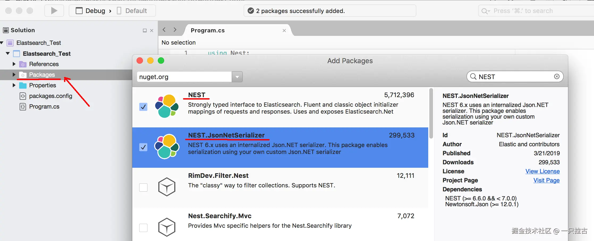
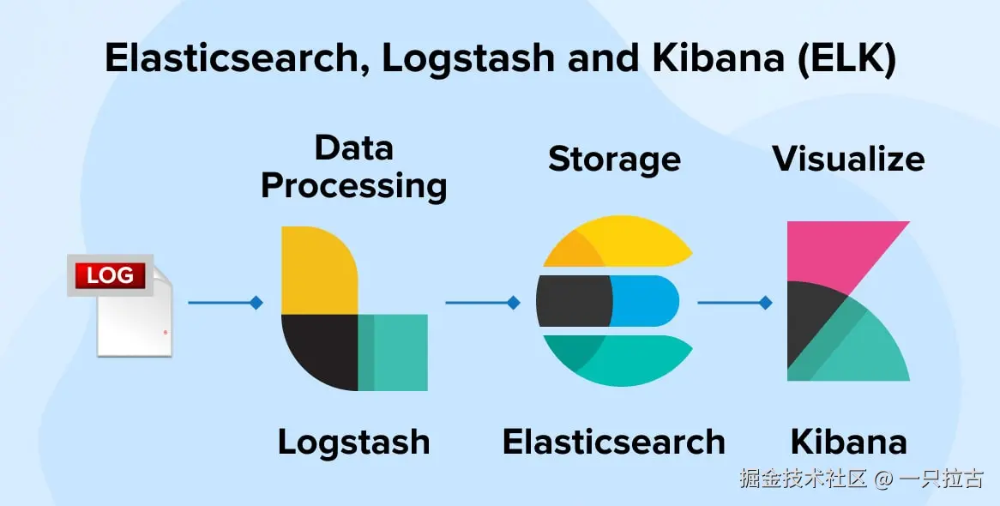
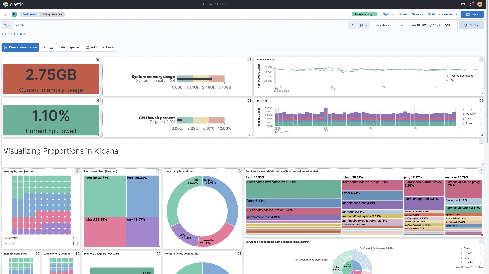

# Roadmap to Backend Programming Master: Log Management with Elasticsearch and Kibana in .NET Applications

## **1. Search Engines and an Introduction to Elasticsearch**

### **What is a Search Engine?**

A search engine is a powerful tool designed to locate, index, and retrieve relevant information from vast amounts of data. In software systems, they play a crucial role in efficiently organizing and querying both structured and unstructured data. By enabling rapid access to logs, metrics, and other data sources, search engines are indispensable when handling large-scale data in modern applications.

For instance, in backend applications, logs generated by APIs, microservices, or database queries can grow exponentially. Without a proper search engine, identifying errors, analyzing trends, or optimizing performance becomes an overwhelming task.

### **What is Elasticsearch?**


Elasticsearch is an open-source, distributed search and analytics engine built on Apache Lucene. It is designed for real-time data indexing, full-text search, and complex queries, making it an ideal solution for managing logs and event data. Elasticsearch is highly scalable and can operate across distributed systems, ensuring high availability and fault tolerance.

Key features of Elasticsearch include:

* **Real-time indexing**: Logs are indexed immediately upon generation, ensuring they are searchable right away.
* **Powerful query capabilities**: Elasticsearch supports advanced queries through its domain-specific language (DSL).
* **Aggregation and analysis**: It enables data analysis to extract meaningful insights, such as log trends or error patterns.

### **Why Use Elasticsearch for Log Management?**

Elasticsearch excels at log management because it is designed to handle high-speed, high-volume streaming data. Its advantages in log management include:

* **Scalability**: Elasticsearch can scale horizontally by adding nodes to a cluster, allowing it to handle growing log data without performance degradation.
* **Flexibility**: It can index both structured and unstructured data, such as JSON logs or free-text error messages.
* **Real-time capabilities**: Logs are searchable almost instantly, enabling rapid issue resolution and monitoring.
* **Query and aggregation**: Elasticsearch allows for deep analysis and filtering of logs, such as identifying common error messages or tracking API performance.

Common use cases for Elasticsearch in log management include:

* Centralized log aggregation for microservices or distributed systems.
* Real-time error tracking and alerting in production environments.
* Monitoring application performance metrics, such as response times and throughput.

### **Key Features of Elasticsearch**

1. **Full-Text Search**
   Elasticsearch provides advanced full-text search capabilities, supporting complex queries on log data. This includes:

   * **Relevance scoring**: Prioritizes search results based on their relevance to the query.
   * **Text analysis**: Analyzes log text to discover patterns, extract keywords, and perform stemming for better accuracy.
   * **Support for wildcards and regular expressions**: Enhances precision in searching free-text log entries.

2. **Distributed Architecture**
   Elasticsearch's distributed architecture breaks large datasets into smaller, manageable chunks called shards. Key benefits include:

   * **Horizontal scalability**: Adding more nodes to the cluster handles larger log volumes or query loads.
   * **Fault tolerance**: Data is replicated across nodes, ensuring logs remain accessible even if a node fails.

3. **Real-Time Indexing**
   Elasticsearch achieves real-time indexing, ensuring logs can be searched immediately after ingestion. This feature is particularly crucial in scenarios like:

   * Quickly diagnosing errors in production environments.
   * Monitoring dashboards that rely on up-to-date logs for accurate insights.

4. **Powerful Query DSL**
   Elasticsearch's query DSL provides a flexible way to build complex queries. Using the DSL, developers can:

   * Filter logs by fields such as `timestamp`, `log_level`, or `source`.
   * Combine conditions using logical operators for precise log analysis.
   * Aggregate data to generate summaries, such as error distributions across services.

5. **Aggregation and Analysis**
   Elasticsearch supports advanced aggregation features for analyzing log data. Examples include:

   * **Bucket aggregations**: Grouping logs by categories like `log_level` or `status_code`.
   * **Metric aggregations**: Calculating statistics such as averages, counts, or percentiles.
   * **Pipeline aggregations**: Performing multi-stage analysis, such as detecting trends in error rates over time.

With these features, Elasticsearch enables backend developers to efficiently manage logs, troubleshoot issues in real-time, and extract meaningful insights to optimize application performance.

***

## **2. Setting Up Elasticsearch Logging in .NET**

### **Installing Elasticsearch**

Before integrating Elasticsearch into a .NET application, you need to install and set it up. Here are three common installation methods:

1. **Using Docker**  
   Quickly start an Elasticsearch instance using Docker. Run the following command to start an Elasticsearch container:

   ```bash
   docker run -d --name elasticsearch -p 9200:9200 -e "discovery.type=single-node" docker.elastic.co/elasticsearch/elasticsearch:8.10.2
   ```

   Then, access the Elasticsearch instance at `http://localhost:9200`.

2. **Using Elastic Cloud**  
   Elastic Cloud provides a managed Elasticsearch solution. Visit [Elastic Cloud](https://www.elastic.co/cloud/), register, and create a cluster. After creation, you will receive a connection URL and authentication details for integration.

3. **Local Installation**  
   Download Elasticsearch from the [official website](https://www.elastic.co/elasticsearch/) and follow the instructions for your operating system. Once installed, start the Elasticsearch service with the following command:

   ```bash
   ./bin/elasticsearch
   ```

### **Connecting a .NET Application to Elasticsearch**



Use **NEST** or **Elasticsearch.Net** libraries to connect your .NET application to Elasticsearch:

1. **Install the NEST Library**  
   Add the NEST package to your project using NuGet:

   ```bash
   dotnet add package NEST
   ```

2. **Configure the Connection**  
   Configure the connection to Elasticsearch using the following code:

   ```csharp
   using Nest;

   var settings = new ConnectionSettings(new Uri("http://localhost:9200"))
       .DefaultIndex("logs"); // Set the default log index

   var client = new ElasticClient(settings);
   ```

   Replace `http://localhost:9200` with the URL of your Elasticsearch instance.

### **Basic Operations in Elasticsearch**

Here are some basic operations you can perform using the NEST client:

1. **Indexing Logs**  
   Add log entries to Elasticsearch:

   ```csharp
   var log = new { Timestamp = DateTime.UtcNow, Level = "Info", Message = "Application started" };
   var response = client.IndexDocument(log);
   ```

2. **Searching Logs**  
   Retrieve logs containing specific terms:

   ```csharp
   var searchResponse = client.Search<dynamic>(s => s
       .Query(q => q.Match(m => m.Field("Message").Query("started"))));
   ```

   Iterate through the search results:

   ```csharp
   foreach (var hit in searchResponse.Hits)
   {
       Console.WriteLine(hit.Source);
   }
   ```

3. **Deleting Logs**  
   Delete logs by ID or query:

   ```csharp
   var deleteResponse = client.DeleteByQuery<dynamic>(q => q
       .Query(rq => rq.Match(m => m.Field("Level").Query("Info"))));
   ```

### **Setting Up Log Indices**

In Elasticsearch, indices are used to organize log data for efficient retrieval. You can create custom indices with field mappings for logs:

1. **Define Index Mapping**  
   Use the following mapping to define the field structure for logs, such as `timestamp`, `level`, and `message`:

   ```csharp
   var createIndexResponse = client.Indices.Create("logs", c => c
       .Map(m => m
           .Properties(p => p
               .Date(d => d.Name("timestamp"))
               .Keyword(k => k.Name("level"))
               .Text(t => t.Name("message"))
           )
       )
   );
   ```

2. **Validate Index Creation**  
   Verify the index setup using Postman or Kibana Dev Tools:

   ```json
   GET /logs
   ```

### **Inserting Log Data into Elasticsearch**

Send structured log data to Elasticsearch from a .NET application. Here is an example of a log entry:

```csharp
var logEntry = new
{
    timestamp = DateTime.UtcNow,
    level = "Error",
    message = "NullReferenceException encountered in module XYZ."
};

var indexResponse = client.IndexDocument(logEntry);
Console.WriteLine(indexResponse.IsValid ? "Log indexed successfully" : "Error indexing log");
```

### **Querying Logs from Elasticsearch**

Retrieve specific logs based on search conditions. Below are some examples:

1. **Search Logs by Date**  
   Retrieve logs within a specific date range:

   ```csharp
   var dateQueryResponse = client.Search<dynamic>(s => s
       .Query(q => q
           .DateRange(r => r
               .Field("timestamp")
               .GreaterThanOrEquals("now-1d")
               .LessThanOrEquals("now")
           )
       )
   );
   ```

2. **Search Logs by Log Level**  
   Retrieve all logs with the error level:

   ```csharp
   var levelQueryResponse = client.Search<dynamic>(s => s
       .Query(q => q.Match(m => m.Field("level").Query("Error"))));
   ```

### **Log Aggregation and Analysis**

Elasticsearch's aggregation features can be used to analyze log trends and patterns:

1. **Count Log Levels**  
   Count logs grouped by log levels:

   ```csharp
   var aggregationResponse = client.Search<dynamic>(s => s
       .Aggregations(a => a
           .Terms("log_levels", t => t.Field("level.keyword"))
       )
   );

   var logLevels = aggregationResponse.Aggregations.Terms("log_levels");
   foreach (var bucket in logLevels.Buckets)
   {
       Console.WriteLine($"Level: {bucket.Key}, Count: {bucket.DocCount}");
   }
   ```

2. **Analyze Logs Over Time**  
   Group logs by hourly intervals:

   ```csharp
   var timeAggregationResponse = client.Search<dynamic>(s => s
       .Aggregations(a => a
           .DateHistogram("logs_over_time", h => h
               .Field("timestamp")
               .CalendarInterval(DateInterval.Hour)
           )
       )
   );

   var buckets = timeAggregationResponse.Aggregations.DateHistogram("logs_over_time").Buckets;
   foreach (var bucket in buckets)
   {
       Console.WriteLine($"Time: {bucket.KeyAsString}, Count: {bucket.DocCount}");
   }
   ```

By setting up Elasticsearch and performing these operations, you can efficiently index, search, and analyze logs in your .NET application, gaining valuable insights into system performance and issues.

***

## **3. Setting Up Elasticsearch Log Analysis in MySQL**

If your .NET application uses MySQL as its database, analyzing slow queries or frequent errors is crucial for maintaining performance and reliability. Directly querying MySQL for these insights may place an additional burden on the database, affecting its efficiency. By integrating Elasticsearch with MySQL, you can offload log analysis tasks to Elasticsearch, enabling advanced search and analysis capabilities without impacting MySQL's performance. This approach ensures seamless monitoring while maintaining optimal database performance.

### **Log Synchronization: Using Logstash to Set Up MySQL Logs**



Logstash is a flexible tool that can import MySQL data into Elasticsearch. Follow these steps to set up Logstash:

1. **Install Logstash**  
   Download and install Logstash from the [official website](https://www.elastic.co/logstash/).

2. **Configure the MySQL Pipeline**  
   Create a configuration file (`logstash.conf`) to define input, filter, and output settings for syncing MySQL logs:

   ```yaml
   input {
       jdbc {
           jdbc_driver_library => "/path/to/mysql-connector-java.jar"
           jdbc_driver_class => "com.mysql.jdbc.Driver"
           jdbc_connection_string => "jdbc:mysql://localhost:3306/logs"
           jdbc_user => "your_username"
           jdbc_password => "your_password"
           schedule => "* * * * *" # Run every minute
           statement => "SELECT * FROM application_logs WHERE timestamp > :sql_last_value"
           use_column_value => true
           tracking_column => "timestamp"
       }
   }

   filter {
       mutate {
           rename => { "log_message" => "message" }
       }
   }

   output {
       elasticsearch {
           hosts => ["http://localhost:9200"]
           index => "mysql_logs"
           document_id => "%{id}"
       }
   }
   ```

3. **Run Logstash**  
   Start Logstash with the configuration file:

   ```bash
   bin/logstash -f /path/to/logstash.conf
   ```

### **Indexing MySQL Logs in Elasticsearch**

Once data synchronization is complete, you can define the index structure in Elasticsearch to optimize log indexing:

1. **Define Index Mapping**  
   Set up field structures such as `timestamp`, `query`, and `error`:

   ```csharp
   var createIndexResponse = client.Indices.Create("mysql_logs", c => c
       .Map(m => m
           .Properties(p => p
               .Date(d => d.Name("timestamp"))
               .Keyword(k => k.Name("query"))
               .Text(t => t.Name("error"))
               .Number(n => n.Name("duration").Type(NumberType.Double))
           )
       )
   );
   ```

2. **Test the Index**  
   Verify that data is indexed correctly using Kibana or a REST client:

   ```json
   GET /mysql_logs/_search
   ```

### **Querying MySQL Logs in Elasticsearch**

After indexing MySQL logs into Elasticsearch, you can perform advanced queries to gain deeper insights:

1. **Identify Slow Queries**  
   Find queries with execution times exceeding a threshold:

   ```csharp
   var slowQueryResponse = client.Search<dynamic>(s => s
       .Query(q => q
           .Range(r => r
               .Field("duration")
               .GreaterThan(1000) // Queries taking more than 1000ms
           )
       )
   );
   ```

2. **Analyze Common Errors**  
   Use aggregations to identify the most common error patterns:

   ```csharp
   var errorAggregationResponse = client.Search<dynamic>(s => s
       .Aggregations(a => a
           .Terms("error_patterns", t => t.Field("error.keyword"))
       )
   );

   foreach (var bucket in errorAggregationResponse.Aggregations.Terms("error_patterns").Buckets)
   {
       Console.WriteLine($"Error: {bucket.Key}, Count: {bucket.DocCount}");
   }
   ```

3. **Monitor Resource-Intensive Operations**  
   Query logs for high-resource-consuming operations:

   ```csharp
   var resourceQueryResponse = client.Search<dynamic>(s => s
       .Query(q => q
           .Match(m => m.Field("query").Query("SELECT *"))
       )
   );
   ```

By integrating MySQL with Elasticsearch for log analysis, you can efficiently manage relational data while unlocking powerful search and analysis capabilities, providing deeper insights into system performance and reliability.

***

## **4. Visualizing Elasticsearch Logs with Kibana**

### **What is Kibana?**



Kibana is an open-source visualization and analysis tool that integrates seamlessly with Elasticsearch. It provides an intuitive interface for exploring, visualizing, and analyzing data stored in Elasticsearch. With interactive dashboards, advanced search capabilities, and real-time monitoring, Kibana enables users to derive actionable insights from log data.

**Key Features:**

* **Dashboards:** Create visual representations of log data such as pie charts, line graphs, and tables.
* **Visualizations:** Design and customize visual elements to highlight key metrics.
* **Real-Time Monitoring:** Monitor logs and system metrics in real-time for quick issue resolution.

### **Installing Kibana**

1. **Download and Install Kibana:**

    * Download the appropriate Kibana package for your operating system from the [Elastic website](https://www.elastic.co/kibana).
    * Alternatively, use Docker to install Kibana alongside Elasticsearch.

2. **Connect to Elasticsearch:**

    * Configure the `kibana.yml` file:

        ```yaml
        server.port: 5601
        elasticsearch.hosts: ["http://localhost:9200"]
        ```

    * Start Kibana and access it in your browser at `http://localhost:5601`.

### **Visualizing Logs in Kibana**

#### **Creating Index Patterns**

To visualize logs, Kibana requires an index pattern that matches the Elasticsearch index.

1. In the Kibana dashboard, go to **Management > Index Patterns**.
2. Create an index pattern that matches the name of your log index, such as `logs-*`.
3. Select a timestamp field (e.g., `@timestamp`) for time-based queries.

**Example:**
Create an index pattern for log data containing the following fields:

* `@timestamp`: Log generation time.
* `log_level`: Log level (e.g., INFO, WARN, ERROR).
* `message`: Log message.

#### **Building Dashboards**

Dashboards organize and display visualizations, allowing for quick insights.

1. **Create Visualizations:**

    * **Pie Charts:** Show the distribution of log levels (INFO, WARN, ERROR).
    * **Line Graphs:** Display trends in log volume over time.
    * **Tables:** List recent errors or system events for detailed analysis.

2. **Add Visualizations to Dashboards:**

    * Go to **Dashboard > Create New Dashboard**.
    * Add visualizations and arrange them for easy viewing.

**Example Dashboard Use Cases:**

* Identify peaks in errors using line graphs.
* Highlight the most common log levels with pie charts.

#### **Custom Queries in Kibana**

Use Kibana's query bar for advanced log filtering.

**Examples:**

* Search for errors within a specific time range:

    ```text
    log_level: ERROR AND @timestamp:[now-24h TO now]
    ```

* Search for logs containing specific terms:

    ```text
    message: "database connection failed"
    ```

#### **Real-Time Monitoring**

Use real-time dashboards to monitor key application metrics and system logs.

1. **Set Up Monitoring Dashboards:**

    * Create visualizations to track key metrics, such as:
        * **Errors per Second:** Track peaks in error rates.
        * **Average Response Time:** Monitor performance trends.

2. **Enable Auto-Refresh:**
    * Configure the dashboard to refresh periodically (e.g., every 5 seconds) to display the latest log data.

### **Using Kibana Alerts**

Kibana alerts can notify you of critical issues based on predefined conditions.

1. **Configure Alerts:**
    * In the **Alerts and Actions** section of the Kibana dashboard, create alerts for specific conditions, such as:
        * Error rate exceeding a threshold.
        * Average response time exceeding acceptable limits.
2. **Set Notification Channels:**
    * Configure notifications to be sent via email, Slack, or other services.

**Example Alert Use Cases:**

* Send an alert when the error rate exceeds 100 per minute.
* Notify the team when database response time exceeds 500 ms.

By combining Elasticsearch and Kibana, you can build a powerful ecosystem for logging, monitoring, and real-time analysis. This setup not only enhances visibility but also ensures proactive problem resolution.

***

## **5. Real-World Use Cases**

### **Application Logs**

Elasticsearch is a robust solution for centralizing logs from web applications, API services, and microservices. Aggregating logs into a single system simplifies debugging, analysis, and reporting.

**Example Use Cases:**

* Centralize logs from multiple microservices to identify cross-service issues.
* Aggregate API call logs to track usage patterns and detect anomalies.
* Index structured logs with fields like `request_id`, `user_id`, and `endpoint` for precise filtering and correlation.

### **Error Tracking and Debugging**

Elasticsearch simplifies error tracking and debugging in production environments by providing a powerful search and filtering interface.

**Real-World Examples:**

* Query logs for specific error messages or error codes:

    ```text
    log_level: ERROR AND message: "TimeoutException"
    ```

* Analyze error trends over time to identify recurring issues.
* Correlate errors using unique identifiers stored in logs, such as user sessions or transaction IDs.

### **Performance Monitoring**

Elasticsearch can also be used to monitor system performance metrics, such as request times, resource usage, and server health.

**Key Applications:**

* Track changes in request latency over time to detect performance degradation.
* Analyze CPU and memory usage patterns on servers.
* Monitor load balancer logs to ensure even traffic distribution.

Using Elasticsearch for performance monitoring provides real-time insights, enabling faster detection and resolution of performance bottlenecks.

***

## **6. Challenges and Limitations**

### **Scaling and Resource Management**

Managing Elasticsearch at scale involves the following challenges:

* **Cluster Size:** Large datasets require more nodes, increasing hardware costs.
* **Indexing Throughput:** High log volumes can stress the system, requiring optimized indexing strategies.
* **Shard Management:** Balancing shard allocation and avoiding hotspots is crucial for performance.

**Mitigation Strategies:**

* Use lifecycle policies to automatically archive or delete old logs.
* Optimize shard settings and node configurations for efficient resource utilization.

### **Complexity and Configuration**

Setting up and maintaining Elasticsearch in production can be complex:

* **Cluster Maintenance:** Regular updates, backups, and recovery processes are required.
* **Security:** Securing communication between nodes and preventing unauthorized access requires additional configuration.

### **Storage and Query Costs**

Elasticsearch's high storage requirements can drive up costs, especially for large-scale log aggregation. Complex queries may also consume significant CPU resources, impacting performance.

**Best Practices:**

* Compress logs and set rollover policies to reduce storage costs.
* Optimize query patterns to avoid wildcard searches or deeply nested filters.

***

## **7. Conclusion and Key Takeaways**

Elasticsearch offers an efficient and scalable solution for logging in .NET applications. Its powerful search capabilities, combined with visualization tools like Kibana, make it an essential resource for centralized log management, debugging, and performance monitoring.

**Key Takeaways:**

* Elasticsearch excels at handling high log volumes and providing real-time insights.
* While challenges in setup and scaling exist, careful planning and optimization can mitigate most issues.
* Integrating Elasticsearch into your .NET logging pipeline can significantly improve operational efficiency and reduce debugging time.

Start small, experiment based on your logging and analysis needs, and scale as your system grows.

***

## **8. Resources and References**

### **Official Documentation**

* [Elasticsearch Documentation](https://www.elastic.co/guide/en/elasticsearch/reference/current/index.html)
* [Kibana Documentation](https://www.elastic.co/guide/en/kibana/current/index.html)
* [Logstash Documentation](https://www.elastic.co/guide/en/logstash/current/index.html)

### **.NET Specific Libraries**

* [NEST Documentation](https://www.elastic.co/guide/en/elasticsearch/client/net-api/current/index.html)
* [Elasticsearch.Net Documentation](https://www.elastic.co/guide/en/elasticsearch/client/net-api/current/index.html)

### **Other Tutorials and Articles**

* [Getting Started with Elasticsearch and Kibana](https://www.elastic.co/webinars/getting-started-elasticsearch-and-kibana)
* [Logging Best Practices in .NET](https://docs.microsoft.com/en-us/dotnet/core/diagnostics/)

By exploring these resources, you can master Elasticsearch and leverage its capabilities to optimize your logging and analysis workflows.
