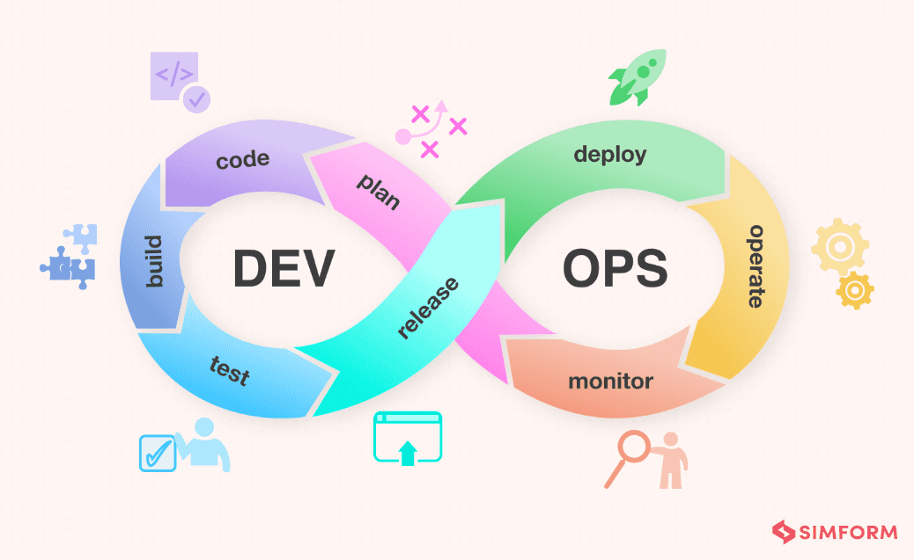

# What is DevOps (Big Picture Overview)

## 1. Introduction

If you’ve been following my previous blogs, you’ll know that up until now I’ve mostly shared insights around **backend programming, APIs, and system design**. That’s been a big part of my journey so far.  

Now, it’s time to open a **new chapter: DevOps**.  
This will be a new series of technical blogs where I’ll walk through the fundamentals and gradually build up to more advanced topics in the DevOps field.  

And like any good journey, we start with the foundation.  
This article is covering Linux basics — the essential prerequisite for anyone looking to step into the world of DevOps.  

But before diving into more technical details, let’s zoom out and answer a bigger question:

**What exactly is DevOps, and why does it matter?**

At its core, DevOps is about **bridging the gap** between software development (writing code, building features) and IT operations (running applications reliably in production).  

The goal of DevOps is simple but powerful:  

- Deliver features **faster**  
- Maintain **high quality**  
- Reduce **downtime and friction**  

Instead of devs “throwing code over the wall” to ops, DevOps encourages collaboration, automation, and continuous improvement.

---

## 2. The DevOps Lifecycle

A common way to visualize DevOps is through the **infinity loop**, representing a continuous cycle of improvement:

**Plan → Code → Build → Test → Release → Deploy → Operate → Monitor**

Here’s a quick breakdown:

- **Plan** → Define requirements, track issues (e.g., Jira, GitHub Issues).  
- **Code** → Developers write and review code (GitHub, GitLab).  
- **Build** → Code is compiled or packaged into deployable artifacts.  
- **Test** → Automated tests check functionality, security, and performance.  
- **Release** → Approve and prepare new versions for deployment.  
- **Deploy** → Deliver software to production (often via CI/CD pipelines).  
- **Operate** → Run the application in production environments.  
- **Monitor** → Track logs, metrics, and performance to detect issues early.  

🔄 The cycle is continuous — feedback from monitoring flows back into planning, making the process iterative and adaptive.

➡️ *Think of DevOps not just as a set of tools, but as a **culture + process + technology stack** that keeps this loop moving smoothly.*  

---

## 3. Core DevOps Tasks

To make the lifecycle concrete, here are some of the **everyday tasks DevOps engineers work on**:

- **Pull Request Automation**  
  When a developer opens a pull request, automated checks run instantly: unit tests, style checks, and security scans. This ensures that code quality stays high before a human even reviews it.

- **Deployment Automation**  
  Instead of copying files manually to a server, DevOps teams rely on **CI/CD pipelines**. These pipelines automatically build, test, and deploy new versions of applications with just a push of code. Rollback features ensure you can quickly revert if something goes wrong.

- **Application Performance Monitoring (APM)**  
  After deployment, the job isn’t done. DevOps engineers set up **logging, metrics, and alerts** so teams can detect issues early (e.g., high error rates, slow response times, resource bottlenecks). Tools like Grafana, Datadog, or New Relic are common here.

---

## 4. DevOps in Practice (Case Study)

Let’s make this concrete with a **Scenario: Heavy traffic social media app (like Reddit).**

For a system with millions of daily active users, DevOps practices are not optional — they are the backbone of keeping the platform reliable, scalable, and continuously improving. Here’s how a typical DevOps stack fits in:

### **GitHub Enterprise → Source Control and Collaboration**

Every new feature or bug fix starts with code. A platform like GitHub Enterprise provides:  

- **Version control**: developers can work safely in parallel without overwriting each other.  
- **Pull requests with automation**: CI pipelines can automatically run tests, linters, and security scans before code gets merged.  
- **Collaboration and visibility**: every change is reviewed, documented, and traceable.  

👉 This ensures code quality and accelerates the “Plan → Code → Build” part of the DevOps lifecycle.

### **Sentry → Error Tracking and Alerts**

Even the best code will have issues once it hits real users. That’s where **observability** comes in.  

- Sentry captures runtime errors and exceptions directly from production.  
- Developers get real-time notifications with detailed stack traces.  
- Instead of relying on vague user reports, teams can quickly pinpoint the exact problem.  

👉 This ties directly into the **Monitor → Operate** phases, shortening the time between a problem appearing and being fixed.

### **ElasticSearch + Logstash + Kibana (ELK Stack) → Centralized Logging**

Logs are like the “black box” of your application. With ELK:  

- **Logstash** ingests logs from multiple sources (web servers, APIs, databases).  
- **ElasticSearch** indexes them for fast searching.  
- **Kibana** visualizes trends, errors, and spikes in real time.  

👉 Without centralized logging, debugging a distributed system is nearly impossible. ELK enables proactive monitoring and root cause analysis across complex systems.

### **Pingdom → Uptime and Performance Monitoring**

If Reddit goes down for even a few minutes, the impact is massive. Tools like Pingdom simulate user requests from different regions and provide:  

- **Uptime checks** (is the site accessible globally?).  
- **Performance metrics** (page load times, bottlenecks).  
- **Alerts** when outages or slowdowns occur.  

👉 Monitoring external performance ensures teams can respond before users flood Twitter with “Reddit is down” posts.

### **LaunchDarkly → Feature Flagging**

Rolling out new features in a high-traffic app is risky. LaunchDarkly allows:  

- **Gradual rollouts** (enable a feature for 1% of users first, then scale up).  
- **Instant rollbacks** without redeploying code.  
- **A/B testing** to measure the impact of features safely.  

👉 This brings agility to the **Release → Deploy** stages, making innovation safer and faster.

### **Terraform → Infrastructure as Code (IaC)**

Scaling Reddit manually with cloud dashboards would be error-prone and slow. Terraform enables:  

- **Declarative infrastructure**: define servers, networks, and databases in code.  
- **Consistency**: the same config can spin up identical environments (dev, staging, production).  
- **Automation**: scale resources up/down automatically with minimal human intervention.  

👉 This supports the **Deploy → Operate** phases, ensuring the infrastructure grows with user demand.

---

⚡️ **Big picture takeaway:**  
The specific tools may vary across companies, but the underlying DevOps principles — **automation, observability, safe deployments, and infrastructure as code** — are what allow large-scale systems like Reddit to run smoothly while continuously evolving.

---

## 5. Lessons Learned

- DevOps is **not just about tools**. It’s a mindset and culture of collaboration between dev and ops.  
- The **lifecycle loop** (Plan → Code → Build → Test → Release → Deploy → Operate → Monitor) is the backbone of modern software delivery.  
- Key practices like **automation** (CI/CD), **monitoring**, and **infrastructure as code** help teams scale without chaos.  

If you only take one thing away: DevOps is about making software delivery **fast, safe, and reliable**.

---

## 6. What’s Next

Now that we’ve seen the **big picture of DevOps**, we can start getting more hands-on.  

➡️ In the next blog, we’ll walk through setting up a **simple CI/CD pipeline**:

- Automatically build code when changes are pushed.  
- Run tests.  
- Deploy to a staging environment with zero manual steps.  

This is where DevOps begins to feel *real* — turning theory into working automation.

---
