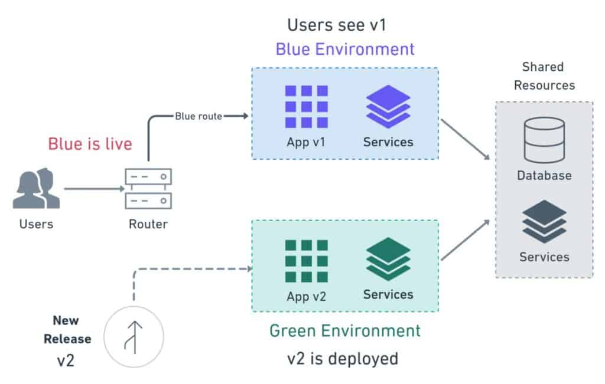

# Deployment Strategies in DevOps

## 1. Introduction

Deployment is the final, but arguably the most critical step in the DevOps lifecycle. You can write elegant code, test it thoroughly, and pass all reviews — but if deployment fails, users never see the value.

Traditionally, deployment was a manual, high-stress process (*“it works on my machine”* was a common frustration). Modern DevOps flips this around by making deployments **reproducible, automated, and scalable**. Instead of being a bottleneck, deployment becomes a **routine, low-risk step** integrated directly into the CI/CD pipeline.

In this article, we’ll explore:

* The foundation of **VMs vs. containers**, and why they matter for deployment.
* Common deployment strategies: **rolling updates, blue/green deployments, and canary releases**.
* Supporting concepts like **autoscaling** and **service discovery**, which make these strategies work at scale.

---

## 2. Virtual Machines (VMs) vs. Containers

Before diving into strategies, it’s important to understand the **environments we deploy into**.

### Virtual Machines (VMs)

* A **VM** is essentially a full operating system running on top of a hypervisor.
* Each VM has its own kernel, memory, and resources, which makes it **highly isolated** from others.
* Pros: strong isolation, predictable environments, great for running multiple OSes on one machine.
* Cons: **heavier** — each VM needs gigabytes of storage and minutes to boot.

### Containers

* A **container** is a lightweight environment that packages your app with its dependencies, but shares the host OS kernel.
* This makes containers **faster to spin up** and **smaller in size** compared to VMs.
* Perfect fit for **microservices**, where you need dozens or hundreds of small services running in parallel.

### Why It Matters for Deployment

* VMs are still common in enterprise and legacy systems, but they can slow down deployments.
* Containers, on the other hand, make **modern rollouts cheaper, faster, and more flexible**.
* Most advanced deployment strategies (blue/green, canary, autoscaling) are designed with containers in mind.

### Recap from My Previous Blog

In my [Backend Programming Roadmap article on Containerization and Virtualization](../Roadmap_Backend/14_Container.md), I broke down these concepts in detail:

* **Virtualization** → strong isolation, compatibility with legacy apps, but higher overhead and slower scaling.
* **Containerization** → lightweight, portable, and efficient; ideal for cloud-native apps but with less isolation.
* **Docker** simplifies packaging apps into containers.
* **Kubernetes** orchestrates containers at scale with features like auto-scaling, resilience, and load balancing.

➡️ *That article goes deep into the trade-offs, real-world use cases, and examples with Dockerfiles and Kubernetes YAML. Here, we’re just focusing on why this distinction matters for DevOps deployment strategies.*

---

# Deployment Strategies in DevOps

## 3. Deployment Strategies

Once your application is packaged (VMs or containers), the next challenge is: **how do you roll out updates without breaking users?** DevOps provides several strategies for deploying safely and efficiently.

### 3.1 Rolling Deployments

* **Definition**: update your application gradually, server by server (or container by container), until all instances run the new version.
* **Pros**:

  * Zero downtime (as long as at least some old instances keep serving traffic).
  * Safer than replacing everything at once.
* **Cons**:

  * Old and new versions may overlap temporarily. If backward compatibility isn’t maintained (e.g., database schema changes), issues can occur.

👉 **Common in Kubernetes**: rolling updates are the default strategy (`kubectl rollout`).

---

### 3.2 Blue/Green Deployments

* **Definition**: run two identical environments:
  * **Blue** = the live production environment.
  * **Green** = a staging environment with the new version.

* Once the green environment is ready and tested, traffic is switched from blue → green in one step.

* **Pros**:
  * Near-instant rollback (just switch back to blue).
  * Very low risk; users only see the new version when it’s proven stable.

* **Cons**:
  * Doubles infrastructure costs (since both environments must run simultaneously).

💡 **Mini-Tutorial Idea**:

* Imagine a **GitLab CI/CD pipeline** that builds a Docker image, deploys it to the green environment, runs automated tests, and—if successful—updates an **Nginx reverse proxy** to direct traffic from blue → green.
* Rollback? Simply flip the proxy config back to blue.

---

### 3.3 Canary Releases

* **Definition**: roll out a new version to a **small subset of users** (say 5%). If monitoring shows no errors, gradually increase traffic until 100% is on the new version.

* **Pros**:
  * Problems only impact a small % of users.
  * Useful for real-world testing under production load.

* **Cons**:
  * Requires sophisticated monitoring and routing setup.

* **Industry Example**: Google, Facebook, and Netflix all use canary releases to ship updates safely at massive scale.

---

## 4. Scaling and Service Management

Deployment doesn’t end once the code is live. Applications need to handle **traffic spikes, failures, and dynamic service discovery**.

### 4.1 What is Autoscaling?

* **Definition**: automatically adjusting the number of servers or containers based on load.

* **How it works**:
  * If CPU usage spikes, more containers are spun up.
  * When traffic drops, unused instances are shut down to save costs.

* **Examples**:
  * **AWS Auto Scaling Groups** → scale EC2 VMs up/down.
  * **Kubernetes Horizontal Pod Autoscaler (HPA)** → scale pods automatically based on metrics.

* **Benefits**:
  * Cost-efficient (you only pay for what you use).
  * Prevents outages during traffic surges.

---

### 4.2 What is Service Discovery?

In microservices, containers are constantly being created and destroyed. Hardcoding IPs is impossible.

* **Service Discovery** = a system that allows services to find each other dynamically.

* **How it works**:
  * When a new service instance comes online, it registers itself.
  * Other services can query by name (not IP).

* **Examples**:
  * **Kubernetes DNS**: every service gets a stable DNS name (`auth-service.default.svc.cluster.local`).
  * **HashiCorp Consul**: service registry + health checks.
  * **Netflix Eureka**: widely used in Spring Cloud setups.

💡 Without service discovery, scaling microservices would be chaos. With it, you can freely scale apps up/down and they’ll still find each other.

---

## 5. Lessons Learned

* **Deployment strategies** (rolling, blue/green, canary) balance speed, safety, and cost.
* **Containers + CI/CD pipelines** make advanced deployments practical and repeatable.
* **Autoscaling** ensures apps adapt to changing demand without manual ops.
* **Service discovery** enables microservices to scale dynamically without breaking connections.
* The golden rule: **automation reduces risk, speeds delivery, and scales better than humans ever could.**

---

## 6. What’s Next

Now that we’ve covered **deployment strategies and scaling**, the next step is **Monitoring & Observability**.

➡️ How do you know if your app is healthy? How do you detect issues before users complain? In the next article, we’ll dive into:

* Logging, metrics, and tracing.
* Tools like **Prometheus, Grafana, ELK, and Sentry**.
* Building a culture of **observability-first DevOps**.

---
