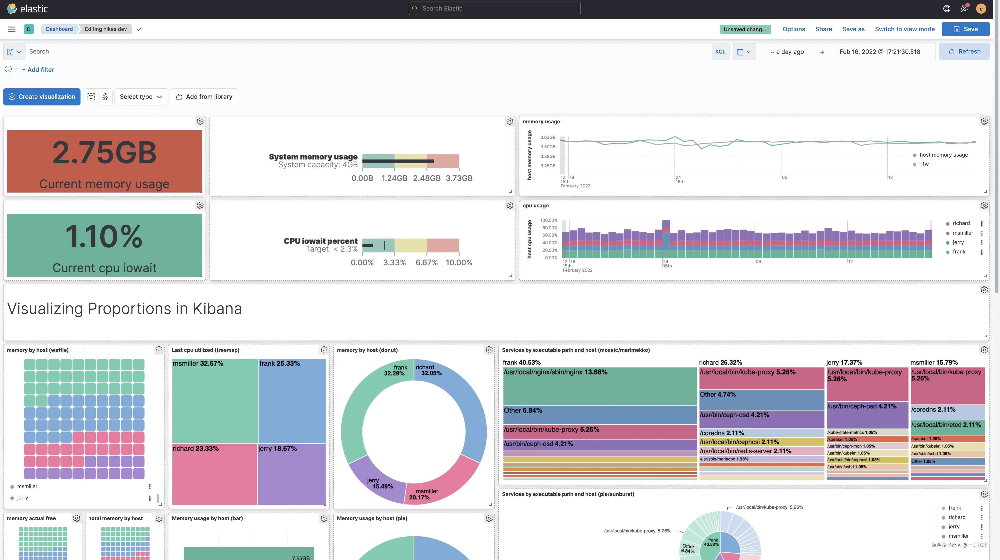
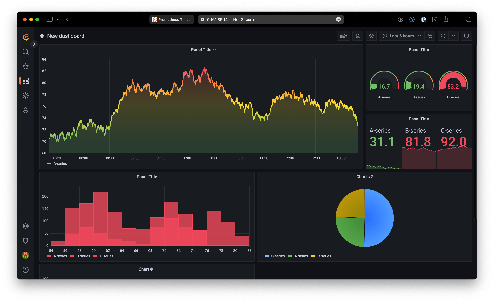

# Application Performance Management (APM) for DevOps

## 1. Introduction

When we talk about **DevOps**, a lot of attention goes into *how to deploy* applications — rolling updates, blue/green strategies, CI/CD pipelines, etc. But deployments alone don’t guarantee success. If you can’t measure how the system performs once it’s live, you’re essentially flying blind.

That’s where **Application Performance Management (APM)** comes in. APM ensures that once code is running in production, you can **see how it behaves, catch issues early, and understand user impact**.

In many teams, monitoring used to be purely reactive — waiting until something broke, then scrambling to investigate. Modern DevOps shifts this mindset toward **proactive monitoring**: setting up dashboards, alerts, and logs that highlight problems *before* they spiral into outages.

At the heart of this approach are the **three pillars of observability**:

* **Logs** → the detailed record of what happened.
* **Metrics** → the quantitative health signals (CPU, error rate, latency).
* **Traces** → the story of a request as it flows through multiple services.

---

## 2. What is Log Aggregation?

When you run a single application on a single server, checking logs is easy: SSH into the server and tail the logs. But in a modern system, you might have **dozens of services** running across **hundreds of containers or VMs**. Manually chasing logs on individual machines is no longer feasible.

That’s why DevOps teams use **log aggregation** — the practice of collecting logs from all services and servers into a **centralized system**.

**Why this matters:**

* Debugging distributed systems is impossible if logs are scattered across machines.
* Aggregated logs let you **search, filter, and correlate events** in one place.
* Helps you quickly answer questions like: *“Did all login requests fail after the new deployment?”* or *“Which microservice threw this error first?”*

**Popular tools for log aggregation include:**

* **ELK Stack (ElasticSearch, Logstash, Kibana)** → The most widely used **open-source log aggregation solution**.

  * **ElasticSearch** indexes and stores huge volumes of logs so they can be searched quickly.
  * **Logstash** collects and processes logs from different sources (servers, apps, containers), transforming them into structured data.
  * **Kibana** provides rich dashboards and visualizations, making it easy to spot errors, trends, or spikes in activity.
  * Great for teams that want flexibility and control, but it does require more setup and maintenance compared to managed services.

📌 *If you’ve been following my Backend Programming Roadmap, you’ll remember I wrote a detailed article about the [**ELK Stack**](../Roadmap_Backend/16_ElasticSearch_Kibana.md). That post dives deep into ElasticSearch, Logstash, and Kibana, explaining how they work together. In this series, we’ll just highlight their importance in the DevOps context.*

👉 **Example in action:** Imagine a user reports they can’t log in. Without log aggregation, you’d have to manually dig through logs on the API server, auth-service, and database separately. With centralized logs, you just search across all services in one dashboard — saving hours of guesswork and accelerating resolution.

---

## 3. Key Production Metrics to Track

When systems go live, raw logs alone aren’t enough — you need **metrics** to understand the *health and performance* of your applications in real time.

**System Metrics (infrastructure-level):**

* **CPU & Memory usage** → detect bottlenecks, memory leaks, or runaway processes.
* **Disk I/O** → crucial for database-heavy apps (slow disk = slow queries).
* **Network latency & bandwidth** → reveals if slowness is caused by infrastructure, not code.

**Application Metrics (service-level):**

* **Request latency** → how long requests take to complete. Tracking **P95/P99** ensures you see *worst-case scenarios*, not just averages.
* **Error rate** → percentage of failed requests (5xx, timeouts, failed transactions). A sudden spike usually signals a bug or outage.
* **Throughput (RPS/QPS)** → how many requests per second your system is handling; helps capacity planning.

**Business Metrics (user-impact level):**

* **Signups per minute/hour/day** → measure if onboarding flow is healthy.
* **Checkout/payment success rate** → detects revenue-impacting issues early.
* **DAU/MAU (Daily/Monthly Active Users)** → connects system health to business outcomes.

**Popular tools for metrics collection and visualization:**

* **Prometheus** →

  * Open-source monitoring system originally built by SoundCloud, now part of the CNCF.
  * Uses a **pull-based model**: Prometheus scrapes metrics from endpoints (usually `/metrics`) exposed by your apps or services.
  * Stores data in a **time-series database**, optimized for querying trends over time.
  * Supports **PromQL** (Prometheus Query Language) for powerful filtering and aggregations (e.g., `avg_over_time(http_requests_total[5m])`).
  * Widely integrated with Kubernetes, making it the de facto standard for containerized environments.

* **Grafana** →

  * A flexible visualization and dashboarding tool that connects to Prometheus (and many other data sources like Elasticsearch, InfluxDB, Loki).
  * Provides **real-time dashboards** that can show system metrics (CPU, memory), application latency, or business KPIs on a single screen.
  * Supports **alerts** — e.g., send a Slack notification if error rate > 5% or if CPU > 90% for 10 minutes.
  * Teams often build **custom dashboards** for different audiences (DevOps team = infra metrics, Product team = business metrics).

👉 **How they work together:** Prometheus collects and stores the raw metrics, while Grafana visualizes them and makes the data actionable for engineers and stakeholders. Together, they form the backbone of monitoring in many modern DevOps setups.

👉 **Why metrics matter:** Logs tell you *what happened*, but metrics reveal the *overall health* of your system. For example, logs may show 20 “timeout errors,” but metrics reveal that error rate jumped from 0.1% → 5% in 5 minutes — a system-wide incident.

---

## 4. Tracing: Seeing the Bigger Picture

In modern **microservices**, a single user request often flows through dozens of services. When something slows down, how do you know *where* the bottleneck is? That’s where **distributed tracing** comes in.

**Definition:**
Distributed tracing = following a single request as it travels through multiple services and components.

**Example:**
Login request →

* **API Gateway** → forwards request.
* **Auth Service** → validates credentials.
* **Database** → retrieves user info.

If login is slow, tracing can show **exactly where time was spent** (e.g., 80% inside the database query).

**Popular tools:**

* **Jaeger** (open source, widely adopted).
* **Zipkin** (lightweight, often integrated in Java/Spring ecosystems).
* **OpenTelemetry** (emerging standard for traces, metrics, and logs in one).

**Value:**

* Pinpoint performance bottlenecks across services.
* Reveal hidden dependencies between microservices.
* Improve MTTR (mean time to recovery) by quickly locating root causes.

---

## 5. Lessons Learned

* **Log aggregation** prevents the old-school headache of “ssh-ing into random servers to grep logs.”
* **Metrics** give a big-picture view of health and user experience.
* **Traces** connect the dots across microservices, exposing bottlenecks.
* Together, these three pillars (logs, metrics, traces) form the foundation of **Application Performance Management (APM)**.

⚡️ APM isn’t just about uptime — it’s about ensuring **performance, reliability, and user experience** at scale.
