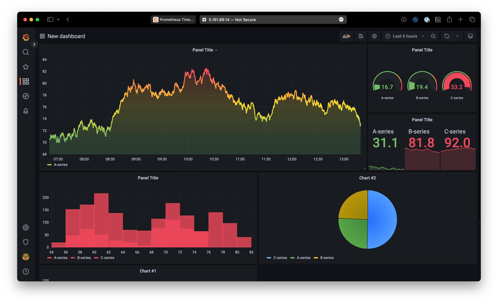

# DevOps 的应用性能管理 (APM)

## 1. 引言

在讨论 **DevOps** 时，很多注意力都集中在 *如何部署* 应用上——滚动更新、蓝绿部署、CI/CD 流水线等等。但仅仅部署并不能保证成功。如果你无法衡量系统上线后的表现，实际上就是在“盲飞”。

这就是 **应用性能管理 (APM)** 的价值所在。APM 确保代码在生产环境运行后，你可以 **看到系统表现、尽早发现问题、理解用户影响**。

在许多团队中，监控曾经是被动的——等问题发生，再慌忙排查。现代 DevOps 倡导 **主动监控**：设置仪表盘、告警和日志，提前发现潜在问题，避免演变为宕机。

这一方法的核心是 **可观测性的三大支柱**：

* **日志 (Logs)** → 详细记录发生了什么。
* **指标 (Metrics)** → 定量的健康信号（CPU、错误率、延迟）。
* **追踪 (Traces)** → 请求在多个服务中流转的故事。

本篇博客重点关注前两项支柱——**日志与指标**，以及它们如何支持高效的 APM。

---

## 2. 什么是日志聚合？

当你在单台服务器上运行单个应用时，查看日志很简单：SSH 登录服务器，tail 日志即可。但在现代系统中，你可能有 **数十个服务**，运行在 **数百个容器或 VM** 上。手动在每台机器上查日志已经不可行。

这就是 DevOps 团队使用 **日志聚合** 的原因——将所有服务和服务器的日志收集到 **集中系统** 中。

**为什么重要：**

* 分布式系统如果日志分散在各机器上，排查问题几乎不可能。
* 聚合日志可以让你在一个地方 **搜索、过滤、关联事件**。
* 可以快速回答问题，例如：*“新版本上线后，所有登录请求都失败了吗？”* 或 *“哪个微服务最先抛出这个错误？”*

**常用日志聚合工具包括：**

* **ELK Stack (ElasticSearch, Logstash, Kibana)** → 最流行的 **开源日志聚合解决方案**。

  * **ElasticSearch** 索引和存储海量日志，使搜索快速高效。
  * **Logstash** 收集来自不同来源（服务器、应用、容器）的日志，并转换为结构化数据。
  * **Kibana** 提供丰富仪表盘和可视化功能，轻松发现错误、趋势或活动峰值。
  * 适合希望灵活控制的团队，但相比托管服务需要更多配置和维护。

📌 *如果你关注过我的 后台编程路线图，会记得我写过一篇关于 [**ELK Stack**](../Roadmap_Backend/16_ElasticSearch_Kibana.md) 的详细文章。那篇文章深入讲解了 ElasticSearch、Logstash 和 Kibana 如何协作。在本系列中，我们仅强调它们在 DevOps 中的重要性。*

👉 **实际示例**：假设用户反馈无法登录。如果没有日志聚合，你需要分别在 API 服务器、auth-service 和数据库中手动查日志。使用集中化日志后，只需在一个仪表盘中搜索所有服务日志——节省数小时排查时间，加快问题解决。

---

## 3. 关键生产指标

系统上线后，仅有原始日志是不够的——你还需要 **指标** 来实时了解应用的 *健康和性能*。

**系统指标（基础设施级别）：**

* **CPU & 内存使用率** → 检测瓶颈、内存泄漏或异常进程。
* **磁盘 I/O** → 数据库密集型应用关键指标（慢磁盘 = 慢查询）。
* **网络延迟 & 带宽** → 分析性能瓶颈是否源于基础设施而非代码。

**应用指标（服务级别）：**

* **请求延迟** → 请求完成所需时间。跟踪 **P95/P99** 可以看到 *最坏情况*，而非仅仅平均值。
* **错误率** → 失败请求的比例（5xx、超时、失败事务）。突然上升通常意味着 bug 或故障。
* **吞吐量 (RPS/QPS)** → 系统每秒处理请求数，有助于容量规划。

**业务指标（用户影响级别）：**

* **每分钟/小时/天的注册量** → 衡量用户引导流程是否健康。
* **结账/支付成功率** → 及早发现影响收入的问题。
* **DAU/MAU（日活/月活）** → 将系统健康与业务结果关联。

**常用指标收集与可视化工具：**

* **Prometheus** →

  * 开源监控系统，最初由 SoundCloud 开发，现为 CNCF 项目。
  * 使用 **拉取模型**：Prometheus 从应用或服务暴露的 `/metrics` 端点抓取指标。
  * 存储在 **时间序列数据库** 中，优化趋势查询。
  * 支持 **PromQL**（Prometheus 查询语言）进行强大过滤和聚合（如 `avg_over_time(http_requests_total[5m])`）。
  * 与 Kubernetes 高度集成，是容器化环境的事实标准。

* **Grafana** →

  * 灵活的可视化与仪表盘工具，可连接 Prometheus（及 Elasticsearch、InfluxDB、Loki 等多种数据源）。
  * 提供 **实时仪表盘**，在同一屏幕展示系统指标（CPU、内存）、应用延迟或业务 KPI。
  * 支持 **告警** —— 例如错误率 >5% 或 CPU >90% 持续 10 分钟时发送 Slack 通知。
  * 团队常为不同受众构建 **自定义仪表盘**（DevOps 团队 = 基础设施指标，产品团队 = 业务指标）。

👉 **协作方式**：Prometheus 收集并存储原始指标，Grafana 可视化并让工程师和管理者快速采取行动。它们共同构成现代 DevOps 监控体系的核心。

👉 **指标重要性**：日志告诉你 *发生了什么*，指标揭示系统 *整体健康状况*。例如日志显示 20 个“超时错误”，但指标显示错误率在 5 分钟内从 0.1% → 5% —— 一个系统级事件。

---

## 4. 追踪：看到全局

在现代 **微服务** 中，一个用户请求通常会流经几十个服务。当出现性能下降时，如何找到 *瓶颈所在*？这就是 **分布式追踪** 的价值。

**定义：**
分布式追踪 = 跟踪单个请求在多个服务和组件中的流转路径。

**示例：**
登录请求 →

* **API 网关** → 转发请求
* **Auth 服务** → 验证凭证
* **数据库** → 获取用户信息

如果登录变慢，追踪可以显示 **时间消耗的具体环节**（例如 80% 在数据库查询中）。

**常用工具：**

* **Jaeger**（开源，广泛采用）
* **Zipkin**（轻量，常用于 Java/Spring 生态）
* **OpenTelemetry**（新兴标准，整合追踪、指标和日志）

**价值：**

* 精确定位跨服务性能瓶颈。
* 揭示微服务间隐藏依赖。
* 快速定位根因，提高平均恢复时间 (MTTR)。

---

## 5. 经验总结

* **日志聚合** 避免了“ssh 到随机服务器 grep 日志”的老式痛苦。
* **指标** 提供系统健康和用户体验的整体视图。
* **追踪** 将微服务连接起来，暴露性能瓶颈。
* 这三大支柱（日志、指标、追踪）共同构成 **应用性能管理 (APM)** 的基础。

⚡️ APM 不仅关注可用性，还确保 **性能、可靠性和用户体验** 在大规模系统中得到保障。
