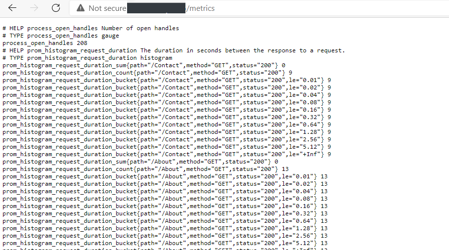
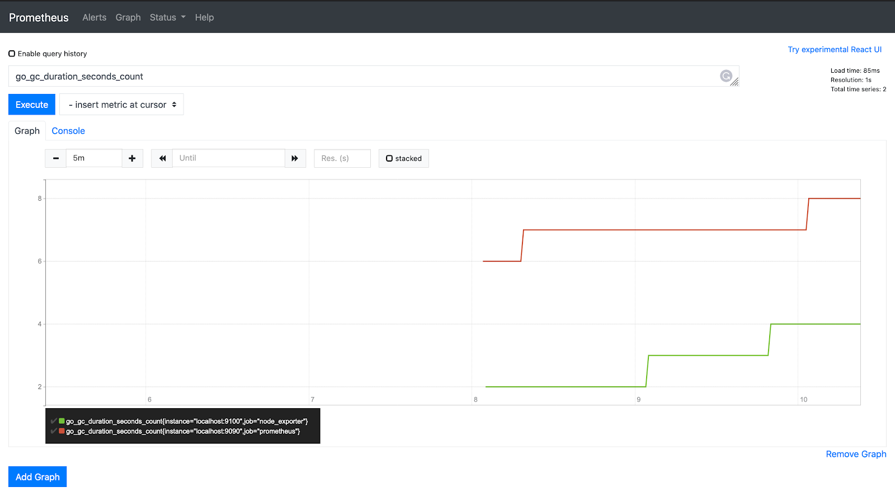

# 正确暴露指标：Prometheus + Grafana 实战

## **引言**

在[上一篇博客](../Roadmap_DevOps/06_Application_Performance_Management_CN.md)中，我们从 DevOps 的角度讨论了应用性能管理（APM）——日志和链路追踪如何帮助团队理解系统内部的运行情况。但监控不止于此。下一步是从临时检查走向系统化，开始以**结构化、一致化的方式**暴露指标（metrics）。

指标是现代应用的“心跳”。它们提供了关于系统健康状况、可靠性以及性能趋势的可量化信号。通过合适的指标，团队可以回答这样的问题：

- *我们的服务是否比平时处理了更多请求？*  
- *错误率是否在慢慢上升？*  
- *今天的表现和上周相比如何？*  

没有指标，你只能靠猜测，或者不断翻查原始日志来判断系统是否正常运行。

### **为什么 Prometheus 比 API 更适合处理指标**

先说清楚：API 在监控中并不是没用。它们非常适合深入排查或获取详细记录。但如果把 API 当作主要的指标工具，就会遇到局限。

- **API 只能提供快照**：你发起请求，得到当前值，仅此而已。如果想要历史数据，你得自己负责轮询、存储和聚合。  
- **自建看板代价高**：依赖 API 时，每个团队都需要自己造轮子，写查询引擎、存储、可视化——这些工作和产品本身没直接价值。  

Prometheus 则完全相反。它会**按计划自动抓取（scrape）端点**。每次抓取都会记录下指标值，并存入**时序数据库**，于是你就能“免费”获得历史数据。

除此之外：

- Prometheus 提供了 **PromQL**，一个强大的查询语言，可以轻松做聚合、比较和趋势分析。  
- 暴露指标的代价很低：应用只需在 `/metrics` 提供当前值，剩下的交给 Prometheus。  
- Grafana 可以与 Prometheus 无缝集成，提供现成的看板、图表和分享功能。  

所以正确的思路是：API 依旧用于详细排查，但**指标端点应该为 Prometheus 而设计**。这样才能最大化两者的优势，避免重复劳动。

这就是 **Prometheus + Grafana** 的价值所在。它们提供了一种简洁、业界标准的方式来暴露、收集和可视化指标，而不用重新造轮子。与其手动调用 API 拼凑看板，不如让 Prometheus 负责采集与存储，Grafana 提供开箱即用的可视化。

---

## **在 C# 项目中设计指标**

当你在 ASP.NET Core 应用中暴露指标时，实际上就是为 Prometheus 打开了一扇**观察应用状态的窗口**。这意味着你需要决定：

- **要测量什么**
- **如何表示它**（counter、gauge、histogram 等）
- **附加哪些标签（label）**（既能支持有意义的聚合，又避免高基数爆炸）

让我们来看一个实际例子：假设你正在开发优衣库（Uniqlo）的移动应用，想要跟踪**有多少用户登录**。

### **1. 选择合适的指标类型**

- **Counter（计数器）**：这里最合适。每次用户登录，计数器加一。计数器只增不减，非常适合用来跟踪事件随时间的累计情况。  
- 你还可能需要一个 **Gauge（仪表盘）**：表示当前活跃会话数——用户登录时加一，登出时减一。  

### **2. 设计标签（Labels）**

标签能让你在 Prometheus 查询时灵活切分数据。对于登录来说，有用的标签可能是：

- `region` → 比较不同地区（如北美和亚洲）的用户活跃度。  
- `platform` → 对比 iOS 和 Android 的登录量。  

但你绝对不应该用 **高基数标识符**（如 `user_id` 或 `session_uid`）作为标签。因为 Prometheus 会为每种唯一的标签组合存储一条时序数据——如果有几百万用户，监控系统会直接崩溃。

一个合理的指标可能长这样：

```plaintext
app_user_logins_total{region="NorthAmerica", platform="ios"} 124
app_user_logins_total{region="NorthAmerica", platform="android"} 203
app_user_logins_total{region="Asia", platform="ios"} 89
```

### **3. 在 ASP.NET Core 中实现**

借助 [`prometheus-net`](https://github.com/prometheus-net/prometheus-net) 库，你可以快速接入。

```csharp
using Prometheus;

public class MetricsCollector
{
    private static readonly Counter UserLogins = Metrics
        .CreateCounter("app_user_logins_total", "Total number of user logins",
            new CounterConfiguration
            {
                LabelNames = new[] { "region", "platform" }
            });

    private static readonly Gauge ActiveSessions = Metrics
        .CreateGauge("app_active_sessions", "Number of currently active user sessions",
            new GaugeConfiguration
            {
                LabelNames = new[] { "region", "platform" }
            });

    public static void RecordLogin(string region, string platform)
    {
        UserLogins.WithLabels(region, platform).Inc();
        ActiveSessions.WithLabels(region, platform).Inc();
    }

    public static void RecordLogout(string region, string platform)
    {
        ActiveSessions.WithLabels(region, platform).Dec();
    }
}
```

然后在 `Program.cs`（或 `Startup.cs`，取决于项目结构）里：

```csharp
var builder = WebApplication.CreateBuilder(args);
var app = builder.Build();

app.UseRouting();

// 在 /metrics 暴露默认和自定义指标
app.UseHttpMetrics();
app.UseMetricServer();

app.MapGet("/login/{region}/{platform}", (string region, string platform) =>
{
    MetricsCollector.RecordLogin(region, platform);
    return Results.Ok($"Login recorded for {region}/{platform}");
});

app.MapGet("/logout/{region}/{platform}", (string region, string platform) =>
{
    MetricsCollector.RecordLogout(region, platform);
    return Results.Ok($"Logout recorded for {region}/{platform}");
});

app.Run();
```



### **4. 为什么这很重要**

通过这种方式设计指标：

- **Prometheus** 自动负责抓取和构建时序数据。
- **Grafana** 可以几乎零配置地展示不同地区或平台的登录趋势。
- 你避免了 API 快照的局限，获得了用户行为的持续历史记录。

---

## **Prometheus 设置**

现在我们的 ASP.NET Core 应用已经在 `/metrics` 暴露了指标，下一步是让 Prometheus 去抓取这些数据。

Prometheus 本身只是一个**时序数据库 + 抓取器**。你的应用只报告**当前值**（比如“当前有 124 次登录”），Prometheus 会按计划查询这个端点，自动附上时间戳，并构建历史视图。

首先，你需要 Prometheus 本身。可以直接从 [Prometheus 官方网站](https://prometheus.io/download/) 下载最新版本。用于本地测试的话，下载对应操作系统的包，解压后会看到 `prometheus`（Windows 下为 `prometheus.exe`）二进制文件。运行方法很简单，只需指定配置文件：

```bash
./prometheus --config.file=prometheus.yml
```

这会启动 Prometheus，并在本地提供 Web UI：[http://localhost:9090](http://localhost:9090)，你可以在这里探索指标并测试查询。在服务器上运行会稍微复杂一些（通常会以服务或容器方式部署），但流程本质相同：把 `prometheus.yml` 放在合适位置，用该配置启动即可。

### 示例 `prometheus.yml`

下面是一个抓取你应用的最小配置示例：

```yaml
global:
  scrape_interval: 15s    # Prometheus 抓取所有目标的频率
  evaluation_interval: 15s

scrape_configs:
  - job_name: "uniqlo-app-metrics"
    metrics_path: "/metrics"   # ASP.NET Core 应用中的端点
    static_configs:
      - targets: ["localhost:7301"]
        labels:
          app: "uniqlo-store"
          env: "dev"
```

### 解析配置

- **`scrape_interval`**：每 15 秒 Prometheus 会访问一次 `/metrics`。
- **`job_name`**：目标的逻辑分组名称（在查询时会用到）。
- **`metrics_path`**：Prometheus 默认访问 `/metrics`，可按需修改。
- **`targets`**：应用运行的主机和端口。在真实部署中，这可能是 Kubernetes 服务 DNS 或 ECS 任务地址。
- **`labels`**：为每个抓取的指标附加额外元数据（如 `env="prod"`、`app="mobile-api"`）。

配置好之后，Prometheus 会开始轮询你的应用。每次抓取会产生类似条目：

```plaintext
app_user_logins_total{region="NorthAmerica", platform="ios", job="uniqlo-app-metrics", env="dev"} 124
```



注意 Prometheus 自动添加了 `job` 以及在 `prometheus.yml` 中配置的自定义标签。这些元数据使得在 Grafana 中进行过滤和聚合非常强大。

### 最佳实践：抓取时不要查询数据库

一个关键点：你的 `/metrics` 端点**不应**在每次 Prometheus 抓取时访问数据库。抓取频繁（示例中每 15 秒一次），每次都查询数据库会给系统带来压力。

行业标准做法是：

1. 在后台周期性收集数据（例如每 1–5 分钟轮询数据库）。
2. 将数据缓存或预聚合到内存中（或写入专门的“metrics 表”）。
3. Prometheus 抓取 `/metrics` 时，直接返回缓存的值即可。

这种模式保证了端点**快速、低成本且可靠**，Prometheus 则负责历史存储和可视化的重任。

---

## **Grafana 可视化**

Prometheus 本身擅长抓取和存储指标，但真正的价值在于能够随时间**可视化这些数据**。这就是 [Grafana](https://grafana.com/) 的作用。Grafana 是业界标准的可视化工具，可无缝集成 Prometheus，创建强大的仪表盘。

### 本地搭建 Grafana

测试环境下，可以从 [Grafana 官方下载页](https://grafana.com/grafana/download) 下载。Windows 和 macOS 提供安装包（`.msi` 或 `.dmg`），Linux 可用 `.tar.gz` 或通过包管理器安装。安装完成后启动 Grafana 服务器，默认访问地址为 [http://localhost:3000](http://localhost:3000)。

默认登录信息：

- **用户名:** `admin`
- **密码:** `admin`（首次登录会要求修改密码）

### 配置 Prometheus 为数据源

1. 在 Grafana 中进入 **Configuration → Data Sources**。
2. 从内置列表中选择 **Prometheus**。
3. 填写 Prometheus 服务器 URL，例如 `http://localhost:9090`。
4. 点击 **Save & Test**，Grafana 会确认连接是否成功。

此时 Grafana 就可以查询 Prometheus 抓取的所有指标。

### 创建仪表盘和面板

Grafana 将可视化内容组织为 **仪表盘（Dashboard）**，每个仪表盘包含一个或多个 **面板（Panel）**。面板可以是时间序列图、仪表盘、柱状图，甚至单值统计数字。

例如，对于之前的 `app_user_logins_total` 指标，你可以创建：

- **时间序列面板**：按地区展示登录趋势。
- **统计面板**：显示当前 iOS 与 Android 用户数量。
- **柱状图面板**：一眼对比各地区登录量。

由于指标带有 `region` 和 `platform` 标签，你可以使用 PromQL 轻松聚合或过滤，例如：

```promql
sum by (region) (app_user_logins_total)
```

这个查询会显示各地区总登录量（跨所有平台）。


### 嵌入面板实现实时更新

仪表盘准备好后，Grafana 提供简单的分享方式。每个面板都有 **Share** 功能，可以复制 `<iframe>` 代码片段。将其嵌入公司内部门户、文档 wiki 或团队仪表盘即可。面板会持续连接 Grafana，**实时更新**指标数据。

这样，你就不用依赖静态报告或截图，而是为团队提供了实时、可交互的系统健康视图。

---

## **经验总结与结论**

通过这个实践，有几个关键经验：

- **保持指标轻量且聚合**——避免暴露原始事件流，指标应保持可预测、易抓取。
- **分离关注点**——业务指标（如登录量、每秒交易数）应与系统指标（CPU、内存、请求延迟）分开。这样看板更有意义，也避免重要信号被噪声淹没。
- **指标端点不是 API**——把它们当作结构化、可查询的数据源优化监控，而不是详细事务数据源。需要深入排查时，再使用 API 或日志。

遵循这些原则，Prometheus 和 Grafana 能提供一种标准化、可扩展、低成本的应用监控方案。Prometheus 确保指标可靠抓取和时序存储，Grafana 提供可视化、实时仪表盘以及方便嵌入内部门户或 wiki 的能力。

这只是基础：一旦指标流动起来，你还可以扩展生态系统，例如配置 **Prometheus 告警规则**、**Grafana 警报**，甚至集成到 **CI/CD 流水线** 实现自动质量门控。换句话说，指标不仅用于监控，还可以主动影响团队构建、交付和运维软件的方式。
