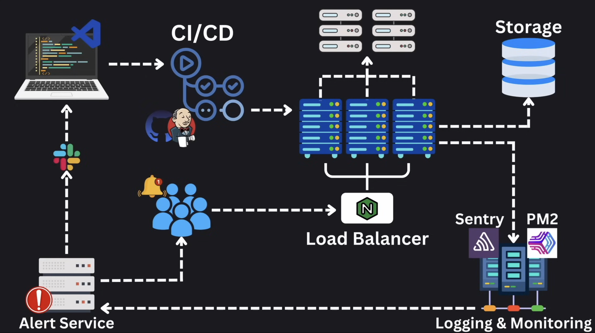

# Overview of a Typical Production App Architecture

Modern web applications are built with various components working together to ensure scalability, reliability, and maintainability. Understanding how these components interact is crucial for backend developers who aim to design efficient and robust systems.

This post provides a high-level overview of a typical production app architecture, using YouTube as an example, to illustrate the flow of a user request. Each component introduced here will be explored in-depth in subsequent posts in this series.

---

## **Example: How YouTube Handles a Video Request**

During a system design interview, you might be asked to design a Youtube App. Let's walk through a simplified flow of what happens when a user requests to watch a video on YouTube.

### **1. Client Request**

The process begins when a user opens YouTube on their browser or app and clicks on a video. This action generates a request to the backend servers, which starts the journey of retrieving the video data.

### **2. Load Balancer**

The request first arrives at a **load balancer**. The primary purpose of a load balancer is to:

- Distribute incoming traffic across multiple backend servers to avoid overloading a single server.
- Ensure high availability and reliability by rerouting traffic if a server becomes unavailable.

In YouTube's case, the load balancer ensures that the massive number of video requests is efficiently managed.

### **3. Backend Server**

After passing through the load balancer, the request is forwarded to one of the **backend servers**. This server is responsible for:

- Authenticating the user (if required).
- Fetching video metadata and streaming data from the database or storage service.

For scalability, these backend servers are often stateless, meaning they don't store user data locally but rely on databases or distributed caches.

### **4. Database and Storage**

The backend server retrieves video information and associated metadata from the database. This could involve:

- Accessing a relational database for structured metadata (e.g., video title, description, user comments).
- Fetching video files from distributed storage systems or CDNs (Content Delivery Networks) optimized for large-scale video delivery.

### **5. Logging and Monitoring**

As the request is processed, logs are generated to capture critical events such as:

- Request and response times.
- Errors encountered during processing.
- User activity for analytics purposes.

These logs are sent to dedicated **logging and monitoring servers**. Tools like Sentry and PM2 may be used to:

- Monitor application performance.
- Detect and report issues in real time.

### **6. Error Handling and Alerts**

If an error occurs while processing the request (e.g., video file not found or server timeout), the system will:

- Log the error for future analysis.
- Send an alert to developers or operations teams via tools like Slack or PagerDuty. These alerts help ensure that issues are addressed promptly.

### **7. Developer Workflow and CI/CD**

When developers need to:

- Fix a bug reported by the monitoring system.
- Add new features requested by product manager.

They start by making changes to their local codebase. Before these changes are deployed to production, they pass through a **CI/CD pipeline**. The pipeline typically involves:

- Running automated tests to ensure code quality.
- Building and packaging the application.
- Deploying the updated application to production servers.

This workflow ensures that changes are deployed safely and efficiently without disrupting the system.

---

## **System Diagram**

Below is a visual representation of the architecture, showing the flow of a client request through the system and the roles of each component:

---

## **Conclusion**

This post provided a high-level overview of a typical production app architecture, demonstrating how various components work together to handle user requests. From load balancers and backend servers to logging and monitoring systems, each element plays a critical role in ensuring the system's efficiency and reliability.

In the upcoming posts, we will dive deeper into each of these components, exploring their designs, use cases, and best practices. Stay tuned as we uncover the building blocks of scalable and maintainable systems!
