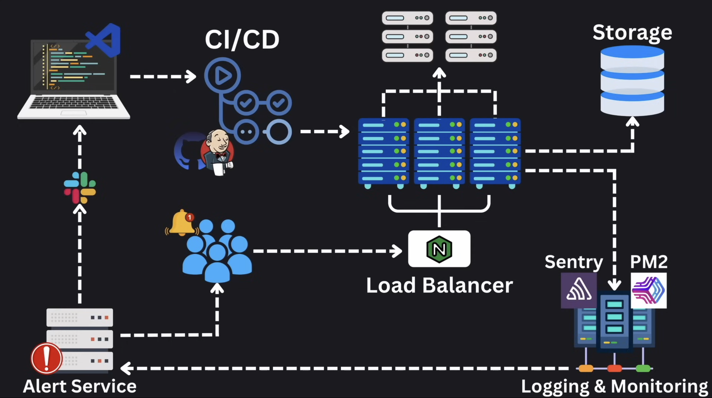

# 一个典型的生产应用架构

现代 Web 应用程序由各种组件协同工作，以确保其可扩展性、可靠性和可维护性。了解这些组件如何交互对希望设计高效且健壮系统的后端开发人员至关重要。

本文提供了典型生产应用架构的高级概览，以 YouTube 为例，展示用户请求的处理流程。本文介绍的每个组件将在本系列的后续文章中深入探讨。

---

## **示例：YouTube 如何处理视频请求**

在系统设计面试中，你可能会被要求设计一个类似 YouTube 的应用程序。下面我们通过一个简化的流程，展示当用户请求观看视频时，系统的处理过程。

### **1. 客户端请求**

流程开始于用户在浏览器或应用程序中打开 YouTube 并点击一个视频。这一操作会向后端服务器生成一个请求，开启了视频数据检索的旅程。

### **2. 负载均衡器**

请求首先到达 **负载均衡器（Load Balancer）**。负载均衡器的主要功能包括：

- 将传入的流量分配到多个后端服务器，以避免单个服务器过载。
- 确保高可用性和可靠性，如果某台服务器不可用，则重新路由流量。

在 YouTube 的场景中，负载均衡器能够高效地管理大量的视频请求。

### **3. 后端服务器**

通过负载均衡器后，请求会被转发到某个 **后端服务器**。该服务器的职责包括：

- 验证用户身份（如果需要）。
- 从数据库或存储服务中获取视频元数据和流数据。

为了可扩展性，这些后端服务器通常是无状态的（stateless），即不在本地存储用户数据，而是依赖数据库或分布式缓存。

### **4. 数据库和存储**

后端服务器从数据库中检索视频信息和相关的元数据。这可能涉及：

- 从关系型数据库中访问结构化的元数据（如视频标题、描述、用户评论）。
- 从分布式存储系统或 CDN（内容分发网络）中获取视频文件，这些系统专为大规模视频交付优化。

### **5. 日志记录和监控**

在处理请求的过程中，系统会生成日志以捕获关键事件，例如：

- 请求和响应的时间。
- 处理过程中遇到的错误。
- 用户活动数据（用于分析）。

这些日志会发送到专门的 **日志记录和监控服务器**。工具如 Sentry 和 PM2 可能会被用来：

- 监控应用程序性能。
- 实时检测和报告问题。

### **6. 错误处理和告警**

如果在处理请求时发生错误（例如，视频文件未找到或服务器超时），系统会：

- 记录错误以供日后分析。
- 通过工具（如 Slack 或 PagerDuty）向开发者或运维团队发送告警。这些告警有助于确保问题能够及时解决。

### **7. 开发者工作流和 CI/CD**

当开发者需要：

- 修复监控系统报告的 Bug。
- 添加产品经理请求的新功能。

他们会从本地代码库开始更改。在这些更改部署到生产环境之前，它们会经过一个 **CI/CD 管道**。CI/CD 管道通常包括：

- 运行自动化测试以确保代码质量。
- 构建和打包应用程序。
- 将更新后的应用程序部署到生产服务器。

这一工作流程确保更改可以安全、高效地部署，不会对系统造成中断。

---

## **系统架构图**

下方是架构的可视化表示，展示了客户端请求通过系统的流程以及各组件的角色：

---

## **总结**

本文提供了典型生产应用架构的高级概览，展示了各种组件如何协同工作以处理用户请求。从负载均衡器和后端服务器到日志记录和监控系统，每个元素在确保系统效率和可靠性方面都扮演了重要角色。

在接下来的文章中，我们将深入探讨这些组件中的每一个，研究它们的设计、使用场景和最佳实践。敬请期待，我们将一起揭开可扩展和可维护系统的构建块！
