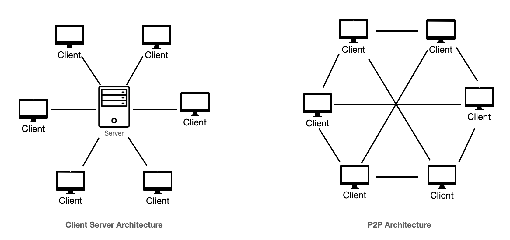

# **Architectural Design Patterns**

## **1. Introduction**

When designing software systems, one of the most critical decisions developers face is determining how to structure the system’s architecture. This decision has a profound impact on the system's scalability, maintainability, performance, and overall success.

Architectural design patterns provide reusable solutions to common problems faced during the design of software systems. These patterns act as blueprints, guiding developers to build robust and efficient architectures while addressing recurring challenges.

This blog post is part of a larger series on **System Design for Backend Developers**, tailored to help you prepare for system design interviews and build scalable, production-grade systems. By understanding architectural patterns, you'll not only gain insight into proven design approaches but also develop a strong foundation to tackle real-world system design problems and ace interview questions.

In this post, we'll explore common architectural design patterns, discuss their strengths and weaknesses, and highlight scenarios where each pattern excels. Whether you're preparing for an interview or architecting your next big project, these insights will equip you with the tools to make informed decisions and create systems that stand the test of time.

---

## **2. Common Architectural Design Patterns**

### **2.1 Layered Architecture (n-tier Architecture)**

Layered Architecture, often referred to as n-tier architecture, is one of the most commonly used patterns in software design. It organizes the system into layers, such as the Presentation Layer, Business Logic Layer, and Data Access Layer, ensuring a clear separation of concerns.

For a deeper dive into how to set up APIs using a layered architecture, refer to my previous post: [Setting Up APIs with Layered Projects](../Industry_Experience/02_API_Structure.md).

### **2.2 Client-Server Architecture**

The Client-Server Architecture is a foundational design pattern where the system is divided into two main components: clients and servers. The client sends requests, while the server processes them and returns responses.

**Key Characteristics**:

- **Separation of Roles**: Clients handle user interaction, while servers manage data and business logic.
- **Scalability**: Servers can be scaled vertically or horizontally to handle increased load.
- **Centralized Management**: Servers act as a central repository for data and control.

**Use Cases**:

- Web applications, where browsers act as clients, and web servers handle requests.
- Mobile applications that interact with backend APIs.

**Benefits**:

- Centralized data management ensures consistency.
- Easier to implement security policies on the server.

**Challenges**:

- Server can become a bottleneck under heavy load.
- Requires robust mechanisms for handling failures and scaling.

### **2.3 Microservices Architecture**

Microservices Architecture divides a system into small, independently deployable services. Each service focuses on a specific business capability and communicates with other services through APIs.

For an in-depth exploration of microservices, refer to my previous post: [Understanding Architectural Patterns](../Roadmap_Backend/12_Architectural_Patterns.md).

### **2.4 Event-Driven Architecture**

Event-Driven Architecture is centered around the production, detection, and consumption of events. It decouples components by enabling asynchronous communication through an event bus or message broker.

**Key Characteristics**:

- **Producers and Consumers**: Events are produced by one component and consumed by others.
- **Asynchronous Communication**: Components don’t need to wait for a response, improving system responsiveness.

**Benefits**:

- Decouples components, making them easier to scale and maintain.
- Enables real-time updates, critical for applications like stock trading or chat systems.

**Challenges**:

- Debugging and monitoring can be complex due to asynchronous flows.
- Requires robust event-handling mechanisms to ensure reliability.

**Use Cases**:

- Real-time messaging platforms.
- Internet of Things (IoT) systems.

### **2.5 Serverless Architecture**

Serverless Architecture abstracts infrastructure management, allowing developers to focus solely on writing code. Cloud providers handle provisioning, scaling, and maintenance.

For more details on serverless systems, see my previous post: [Understanding Architectural Patterns](../Roadmap_Backend/12_Architectural_Patterns.md).

### **2.6 Monolithic Architecture**

Monolithic Architecture consolidates all components of a system into a single codebase. While simple to develop and deploy, it can become challenging to scale and maintain as the system grows.

For a detailed analysis of monolithic systems, refer to my post: [Understanding Architectural Patterns](../Roadmap_Backend/12_Architectural_Patterns.md).

### **2.7 Peer-to-Peer Architecture**

Peer-to-Peer (P2P) Architecture eliminates the traditional client-server model. Instead, each node in the system acts as both a client and a server, sharing resources directly with other nodes.

**Key Characteristics**:

- **Decentralization**: No single point of failure, as resources are distributed across nodes.
- **Scalability**: Easily scales as new nodes join the network.

**Benefits**:

- Resilient and fault-tolerant due to decentralization.
- Reduces infrastructure costs by utilizing node resources.

**Challenges**:

- Complex to manage and secure, as trust must be established between nodes.
- May experience performance issues due to network latency.

**Use Cases**:

- File-sharing systems like BitTorrent.
- Blockchain-based applications like cryptocurrencies.

---

## **3. Choosing the Right Pattern**

Selecting the appropriate architectural pattern depends on the specific needs and constraints of your project. Here are some key factors to consider:

- **Scalability Requirements**: If your application needs to handle millions of users, consider patterns like Microservices or Event-Driven Architecture.
- **Team Expertise**: Choose a pattern that aligns with the skills and experience of your development team.
- **Time to Market**: Simpler patterns like Monolithic Architecture may be more suitable for projects with tight deadlines.
- **Cost and Infrastructure**: Serverless Architecture can reduce costs by offloading infrastructure management to cloud providers.
- **Maintenance and Flexibility**: Patterns like Layered Architecture provide clear separation of concerns, making it easier to maintain and extend the system.

Each pattern has its trade-offs, and understanding them will help you make an informed decision that aligns with your project goals.

---

## **4. Common Questions in System Design Interviews**

When preparing for system design interviews, it's crucial to have a solid understanding of architectural patterns. Here are some commonly asked questions:

1. **Compare and Contrast Patterns**:
   - When would you choose Microservices over Monolithic Architecture?
   - What are the trade-offs between Client-Server and Peer-to-Peer Architecture?

2. **Real-World Applications**:
   - How would you design a real-time chat application using Event-Driven Architecture?
   - Describe the architecture of a video streaming platform using Layered Architecture.

3. **Problem-Specific Scenarios**:
   - How would you design a system to handle millions of concurrent requests?
   - What architectural pattern would you recommend for a rapidly growing startup and why?

By practicing these questions and understanding the rationale behind different architectural decisions, you'll be well-prepared to demonstrate your expertise in interviews.

---

## **5. Conclusion**

Architectural design patterns are the backbone of building scalable and maintainable systems. Whether you're designing a small project or a large-scale application, understanding these patterns will guide you in making informed decisions. This knowledge is not only valuable in real-world scenarios but also a key component of succeeding in system design interviews.

Take the time to explore each pattern, understand its use cases, and analyze its trade-offs. By doing so, you'll build the confidence and skills needed to tackle any system design challenge that comes your way.

Stay tuned for the next post in this series, where we'll dive deeper into another critical aspect of system design!
