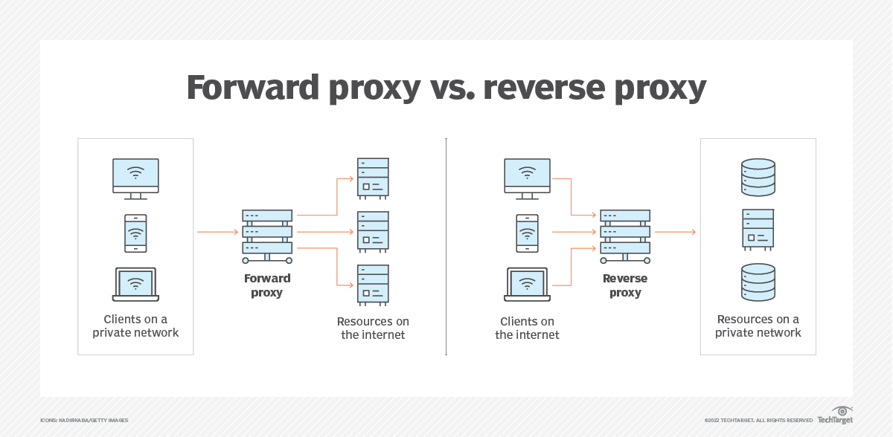
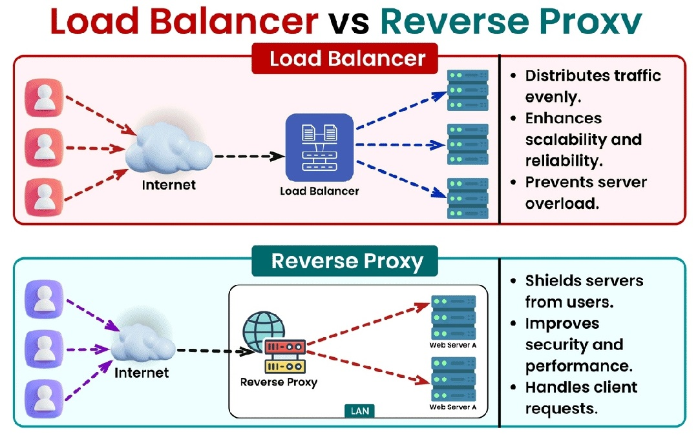

# **Proxy Servers and Load Balancers**

## **1. Introduction**

In the world of modern system design, proxy servers and load balancers play a crucial role in ensuring the scalability, reliability, and performance of distributed systems. They are fundamental building blocks for handling traffic efficiently, securing backend systems, and managing requests in high-traffic applications.

A **proxy server** acts as an intermediary between clients and servers, while a **load balancer** ensures that incoming requests are distributed evenly across multiple servers to prevent any single server from becoming overwhelmed. Together, they form the backbone of many architectures, supporting systems from small startups to global-scale enterprises.

Their importance extends beyond practical implementations, as understanding these concepts is a common requirement in system design interviews. Candidates are often tasked with designing scalable systems where proxies and load balancers are integral components. Real-world scenarios also demand proficiency in these technologies to address challenges like traffic spikes, server failures, and performance optimization.

---

## **2. What is a Proxy Server?**

A **proxy server** is a system component that acts as an intermediary between clients and servers, routing requests and responses while providing additional functionalities such as caching, access control, and security. Proxy servers come in two primary types, each serving distinct purposes in system architecture:

### **Types of Proxy Servers**

1. **Forward Proxy**  
   A forward proxy sits between the client and the internet, acting on behalf of the client to fetch resources from external servers. Common use cases include:
   - **Access Control**: Restricting internet access for internal users based on predefined policies.
   - **Caching**: Storing frequently accessed data to reduce bandwidth usage and improve response times.
   - **Anonymity**: Masking the client's IP address to enhance privacy.

2. **Reverse Proxy**  
   A reverse proxy sits between external clients and internal servers, acting on behalf of the server. It is widely used in backend systems to:
   - **Enhance Performance**: By caching responses and compressing data.
   - **Improve Security**: By hiding internal server details and protecting against direct attacks.
   - **Distribute Traffic**: By routing requests to multiple backend servers, often in combination with load balancing.

### **Benefits of Using Proxy Servers**

- **Improved Security**  
  Proxy servers can hide the details of the internal network from external clients, reducing the attack surface. They can also enforce security measures such as IP filtering and SSL/TLS termination.

- **Caching for Better Performance**  
  By storing frequently accessed resources closer to the client, proxies can reduce latency and decrease the load on backend servers.

- **Traffic Monitoring and Filtering**  
  Proxy servers can log requests and responses, helping organizations analyze traffic patterns and enforce policies to block malicious activity.

### **Challenges and Limitations**

While proxy servers offer numerous benefits, they also come with challenges:

- **Single Point of Failure**: Without proper redundancy, a proxy server can become a bottleneck or a single point of failure for the system.
- **Increased Latency**: Adding an intermediary can introduce additional processing time, potentially slowing down requests.
- **Complexity**: Configuring and maintaining proxy servers requires careful planning and expertise, particularly in large-scale systems.

---

## **3. What is a Load Balancer?**

A **load balancer** is a crucial component in system architecture that distributes incoming network traffic across multiple servers to ensure no single server is overwhelmed. It acts as the “traffic manager,” improving system reliability, scalability, and performance by balancing the load effectively. Load balancers are especially critical in high-traffic applications where uninterrupted service and fault tolerance are essential.

### **Types of Load Balancers**

1. **Hardware Load Balancers**  
   Hardware load balancers are specialized physical devices designed to handle traffic distribution.  
   - **Use Cases**: Ideal for enterprises that need high-performance, hardware-optimized solutions for massive traffic loads.  
   - **Downsides**: They are expensive to acquire and maintain, lack flexibility, and may not scale as easily as software or cloud-based alternatives.

2. **Software Load Balancers**  
   Software load balancers are implemented as programs that can run on commodity hardware or virtual machines.  
   - **Flexibility**: They offer customizable configurations and can integrate seamlessly into existing systems.  
   - **Examples**: Popular options include **NGINX**, **HAProxy**, and **Traefik**. These are widely used in modern microservices architectures.  

3. **Cloud Load Balancers**  
   Cloud providers offer managed load balancing services that are highly scalable and easy to configure.  
   - **Scalability**: These services dynamically adjust to handle fluctuating traffic without manual intervention.  
   - **Examples**: **AWS Elastic Load Balancer (ELB)**, **Google Cloud Platform Load Balancer**, and **Azure Load Balancer**.  

### **Benefits of Load Balancers**

- **Ensuring High Availability**  
  Load balancers prevent system downtime by redirecting traffic away from failed servers to healthy ones.  

- **Improved Performance and Reliability**  
  By evenly distributing the traffic, they ensure optimal utilization of server resources, reducing response times for clients.  

- **Traffic Distribution and Fault Tolerance**  
  Load balancers help distribute traffic geographically or by capacity, and they implement redundancy mechanisms to handle unexpected server outages effectively.

---

## **4. Load Balancing Algorithms**

Load balancing algorithms determine how incoming requests are distributed among the available servers. Here are some common algorithms:

1. **Round Robin**  
   - **Overview**: Each request is distributed sequentially to the next server in the list, cycling back to the first server after reaching the last.  
   - **Pros**: Simple to implement and effective in environments where all servers have similar capacity and performance.  
   - **Cons**: May not perform well if servers have unequal workloads or varying capacities.  

2. **Least Connections**  
   - **Overview**: Directs traffic to the server with the fewest active connections.  
   - **Pros**: Particularly useful in environments where server loads fluctuate due to long-running requests.  
   - **Cons**: Requires real-time monitoring of connection counts, adding some complexity.  

3. **IP Hashing**  
   - **Overview**: Maps client IP addresses to specific servers based on a hashing algorithm. This ensures that a client’s requests are consistently routed to the same server.  
   - **Pros**: Useful for session persistence when server-side state is required.  
   - **Cons**: May result in uneven traffic distribution if client IP distribution is not balanced.  

4. **Weighted Round Robin and Weighted Least Connections**  
   - **Overview**: Adds a weight factor to balance traffic proportionally to each server's capacity.  
   - **Pros**: Handles servers with varying performance or resource capacities more effectively.  
   - **Cons**: Requires precise weight configuration and monitoring.  

### **Comparison of Algorithms**

| **Algorithm**             | **Best For**                                  | **Challenges**                      |
|---------------------------|-----------------------------------------------|-------------------------------------|
| **Round Robin**           | Uniform servers with equal capacity           | Struggles with uneven workloads     |
| **Least Connections**     | High-variance traffic loads                   | Real-time connection monitoring     |
| **IP Hashing**            | Session persistence requirements              | May cause imbalance in traffic      |
| **Weighted Algorithms**   | Servers with varying resource capacities      | Requires fine-tuned configuration   |

Each algorithm has its strengths and weaknesses, and the choice depends on the specific requirements of the system. Many load balancers combine multiple algorithms or use advanced adaptive mechanisms to optimize performance dynamically.

---

## **5. Reverse Proxy vs. Load Balancer**

### **Key Differences and Overlap**

While both reverse proxies and load balancers manage traffic and improve system performance, their roles differ:  

| **Feature**               | **Reverse Proxy**                                         | **Load Balancer**                                  |
|---------------------------|----------------------------------------------------------|--------------------------------------------------|
| **Primary Role**          | Manages traffic between clients and servers.              | Distributes traffic across multiple servers.      |
| **Use Case**              | Improves security, caching, and hides server details.     | Ensures high availability and optimal performance.|
| **Scope**                 | Operates at the front of one or more servers.             | Operates across a cluster of servers.            |

### **When to Use One or Both**

- **Reverse Proxy Only**: Use a reverse proxy when your focus is on securing backend servers, caching content, or handling SSL termination for a single application or service.  
- **Load Balancer Only**: Use a load balancer when you need to distribute traffic evenly across multiple servers for fault tolerance and high availability.  
- **Both**: In larger systems, reverse proxies and load balancers are often used together. For example, a reverse proxy like NGINX may sit in front of multiple load balancers to handle SSL termination and caching, while the load balancers manage traffic distribution among server clusters.

---

## **6. Challenges and Considerations**

Designing and deploying proxy servers and load balancers involves addressing several challenges:

### **Avoiding Single Points of Failure**

- **Challenge**: If the proxy server or load balancer fails, it could take down the entire system.  
- **Solution**: Use redundancy strategies like active-passive or active-active failover setups. Many cloud providers offer managed solutions with built-in fault tolerance.  

### **Security Considerations**

1. **Protecting Against DDoS Attacks**  
   - Proxy servers can act as a shield to absorb or filter malicious traffic before it reaches backend servers.  
   - Employ rate limiting and traffic filtering to mitigate large-scale attacks.  
2. **Proper SSL/TLS Termination**  
   - Terminate SSL/TLS at the reverse proxy or load balancer to offload cryptographic processing from backend servers.  
   - Use modern encryption standards to ensure secure communication.  

### **Performance Tuning and Monitoring**

- **Challenge**: Poorly configured proxies and load balancers can introduce latency or create bottlenecks.  
- **Solution**:  
  - Monitor metrics like latency, request throughput, and error rates.  
  - Use tools like Prometheus or Grafana for real-time monitoring and alerting.  
  - Continuously tune configurations, such as buffer sizes, timeout settings, and caching strategies.  

### **Cost Implications**

- **Cloud Load Balancers**: Offer scalability and simplicity but can become expensive with heavy traffic.  
- **Self-Hosted Solutions**: Require upfront investment in hardware and ongoing maintenance but may be cost-effective for predictable workloads.  
- Consider hybrid setups to balance cost and scalability.  

---

## **7. Conclusion**

Proxy servers and load balancers are fundamental components of scalable, reliable system architectures. They enhance performance, security, and fault tolerance while enabling systems to handle high traffic efficiently.  

Understanding the differences between proxies and load balancers, along with their implementation challenges, is crucial for designing robust systems. This knowledge not only prepares you for system design interviews but also equips you with the skills to handle real-world scenarios.  

To deepen your understanding, experiment with tools like **NGINX**, **HAProxy**, or cloud-based solutions such as AWS Elastic Load Balancer. Practical experience will help you grasp how these tools work and how to fine-tune them for your specific use cases.
