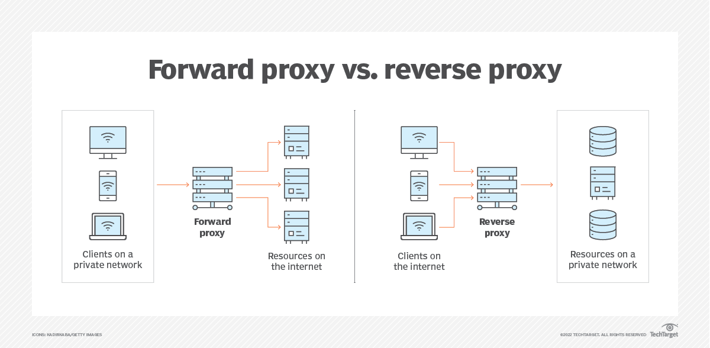
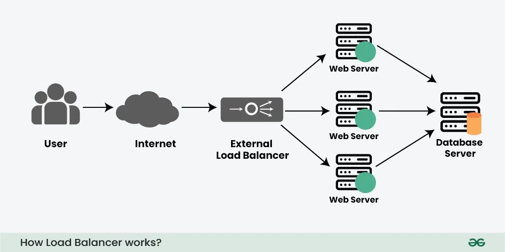
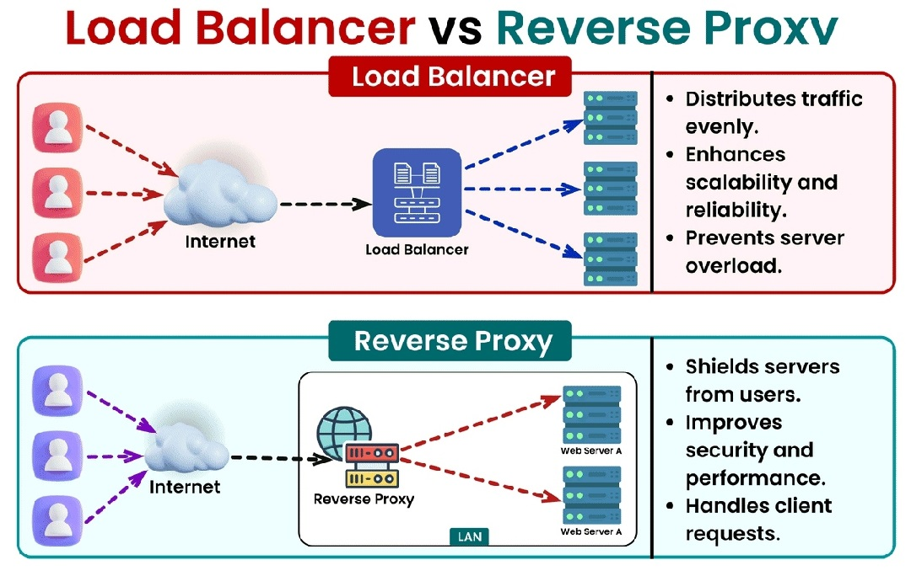

# **代理服务器和负载均衡器**

## **1. 引言**

在现代系统设计中，代理服务器和负载均衡器在确保分布式系统的可扩展性、可靠性和性能方面起着至关重要的作用。它们是高效处理流量、保护后端系统以及管理高流量应用请求的基础构件。

**代理服务器**充当客户端和服务器之间的中介，而**负载均衡器**通过均匀分配流量到多个服务器，防止单个服务器超载。两者共同构成了许多架构的核心，无论是小型初创公司还是全球性企业都依赖它们。

它们的重要性不仅体现在实际应用中，在系统设计面试中也是常见考点。候选人通常需要设计可扩展的系统，其中代理和负载均衡器是不可或缺的组成部分。而在实际场景中，掌握这些技术可以有效应对流量高峰、服务器故障和性能优化等挑战。

---

## **2. 什么是代理服务器？**

**代理服务器**是一种系统组件，它在客户端和服务器之间充当中介，路由请求和响应，同时提供额外功能，如缓存、访问控制和安全性。在系统架构中，代理服务器主要分为两种类型，每种类型在架构中扮演不同角色：

### **代理服务器的类型**

1. **正向代理（Forward Proxy）**  
   正向代理位于客户端和互联网之间，代表客户端从外部服务器获取资源。常见的使用场景包括：  
   - **访问控制**：根据预设策略限制内部用户的互联网访问。  
   - **缓存**：存储常用数据，减少带宽使用并提升响应速度。  
   - **匿名性**：隐藏客户端 IP 地址以增强隐私保护。

2. **反向代理（Reverse Proxy）**  
   反向代理位于外部客户端和内部服务器之间，代表服务器处理请求。它在后端系统中广泛使用：  
   - **提升性能**：通过缓存响应和压缩数据提升效率。  
   - **增强安全性**：隐藏内部服务器细节并防范直接攻击。  
   - **流量分配**：将请求路由到多个后端服务器，通常与负载均衡结合使用。

### **使用代理服务器的优势**

- **提高安全性**  
  代理服务器可以隐藏内部网络的细节，减少攻击面。同时可以执行 IP 过滤和 SSL/TLS 终止等安全措施。

- **通过缓存提升性能**  
  代理服务器通过将常用资源存储在靠近客户端的位置，减少延迟并降低后端服务器的负载。

- **流量监控和过滤**  
  代理服务器可以记录请求和响应，帮助组织分析流量模式并实施策略阻止恶意活动。

### **挑战和限制**

尽管代理服务器具有诸多优势，但也存在一些挑战：  

- **单点故障**：如果没有适当的冗余配置，代理服务器可能成为系统的瓶颈或单点故障。  
- **增加延迟**：添加一个中间节点可能会引入额外的处理时间，从而导致请求变慢。  
- **复杂性**：配置和维护代理服务器需要仔细规划和专业技能，特别是在大规模系统中。

---

## **3. 什么是负载均衡器？**

**负载均衡器**是系统架构中的关键组件，用于将传入的网络流量分配到多个服务器上，以确保单个服务器不会超载。它充当“流量管理器”，通过有效地平衡负载来提高系统的可靠性、可扩展性和性能。在高流量应用中，负载均衡器尤为重要，能够确保服务不中断并提供容错能力。

### **负载均衡器的类型**

1. **硬件负载均衡器**  
   硬件负载均衡器是专用的物理设备，用于处理流量分配。  
   - **使用场景**：适用于需要高性能、硬件优化解决方案的大型企业。  
   - **缺点**：采购和维护成本高，灵活性不足，扩展性较差。

2. **软件负载均衡器**  
   软件负载均衡器是以程序形式实现的，可以运行在普通硬件或虚拟机上。  
   - **灵活性**：提供可定制的配置，能够无缝集成到现有系统中。  
   - **示例**：常见的软件负载均衡器包括 **NGINX**、**HAProxy** 和 **Traefik**，它们广泛应用于现代微服务架构。

3. **云负载均衡器**  
   云服务商提供的托管负载均衡服务，具备高度可扩展性且易于配置。  
   - **可扩展性**：这些服务可以动态调整以应对流量波动，无需人工干预。  
   - **示例**：**AWS Elastic Load Balancer (ELB)**、**Google Cloud Platform Load Balancer** 和 **Azure Load Balancer**。

### **负载均衡器的优势**

- **确保高可用性**  
  负载均衡器通过将流量从失败的服务器重定向到健康的服务器，防止系统停机。  

- **提升性能和可靠性**  
  通过均匀分配流量，确保服务器资源得到最优利用，从而减少客户端的响应时间。  

- **流量分配与容错能力**  
  负载均衡器可以按地理位置或服务器容量分配流量，并实现冗余机制，以有效应对意外的服务器故障。

---

## **4. 负载均衡算法**

负载均衡算法决定了如何将传入的请求分配到可用的服务器上。以下是一些常见的算法：

1. **轮询（Round Robin）**  
   - **概述**：每个请求依次分配给列表中的下一台服务器，循环到最后一台后重新开始。  
   - **优点**：实现简单，在所有服务器容量和性能相似的环境中效果良好。  
   - **缺点**：如果服务器的工作负载或容量不均衡，性能可能不佳。  

2. **最少连接（Least Connections）**  
   - **概述**：将流量引导到当前活动连接最少的服务器。  
   - **优点**：适合处理因长期请求导致负载波动的环境。  
   - **缺点**：需要实时监控连接数，增加了复杂性。  

3. **IP 哈希（IP Hashing）**  
   - **概述**：根据哈希算法将客户端 IP 地址映射到特定的服务器。这确保了客户端的请求始终路由到同一台服务器。  
   - **优点**：适用于需要会话持久性的场景，当服务器需要保存会话状态时尤为有效。  
   - **缺点**：如果客户端 IP 分布不均，可能导致流量分配不平衡。  

4. **加权轮询和加权最少连接（Weighted Round Robin and Weighted Least Connections）**  
   - **概述**：为每台服务器添加权重，按服务器容量的比例分配流量。  
   - **优点**：更有效地处理具有不同性能或资源容量的服务器。  
   - **缺点**：需要精确配置权重和实时监控。  

### **算法比较**

| **算法**                  | **适用场景**                                    | **挑战**                          |
|---------------------------|-----------------------------------------------|-----------------------------------|
| **轮询（Round Robin）**    | 服务器性能均等且容量相同的环境                   | 难以处理不均衡的工作负载          |
| **最少连接（Least Connections）** | 高流量波动的环境                           | 需要实时监控连接数                |
| **IP 哈希（IP Hashing）**   | 需要会话持久性或状态依赖的场景                   | 客户端 IP 分布可能不平衡          |
| **加权算法（Weighted Algorithms）** | 具有不同资源容量的服务器环境                 | 权重配置和监控需要精细调整         |

每种算法各有优劣，选择取决于系统的具体需求。许多负载均衡器结合多种算法，或使用高级自适应机制动态优化性能。

---

## **5. 反向代理与负载均衡器**

### **关键差异与重叠**

尽管反向代理和负载均衡器都用于管理流量并提高系统性能，它们的职责有所不同：  

| **功能**                   | **反向代理**                                         | **负载均衡器**                                |
|---------------------------|----------------------------------------------------|---------------------------------------------|
| **主要角色**               | 管理客户端与服务器之间的流量。                        | 在多台服务器之间分配流量。                     |
| **使用场景**               | 提升安全性、缓存内容、隐藏服务器细节。                  | 确保高可用性和最佳性能。                        |
| **作用范围**               | 位于一台或多台服务器的前端。                          | 跨服务器集群工作。                              |

### **使用场景：单独使用或结合使用**

- **仅使用反向代理**：当重点在于保护后端服务器安全、缓存内容或为单个应用/服务处理 SSL 终止时。  
- **仅使用负载均衡器**：当需要在多台服务器间均衡分配流量，以实现容错和高可用性时。  
- **结合使用**：在大型系统中，反向代理和负载均衡器通常结合使用。例如，像 NGINX 这样的反向代理可以位于多个负载均衡器前端，处理 SSL 终止和缓存，而负载均衡器管理服务器集群之间的流量分配。

---

## **6. 挑战与考虑因素**

设计和部署代理服务器及负载均衡器需要解决多个挑战：

### **避免单点故障**

- **挑战**：如果代理服务器或负载均衡器发生故障，可能导致整个系统宕机。  
- **解决方案**：采用冗余策略，例如主动-被动（Active-Passive）或主动-主动（Active-Active）故障转移设置。许多云服务商提供内置容错的托管解决方案。  

### **安全性考虑**

1. **防范 DDoS 攻击**  
   - 代理服务器可以作为屏障，在恶意流量到达后端服务器之前进行吸收或过滤。  
   - 使用速率限制和流量过滤机制缓解大规模攻击。  
2. **正确处理 SSL/TLS 终止**  
   - 在反向代理或负载均衡器处终止 SSL/TLS，以减轻后端服务器的加密处理负担。  
   - 使用现代加密标准确保通信安全。  

### **性能调优与监控**

- **挑战**：配置不当的代理和负载均衡器可能引入延迟或成为瓶颈。  
- **解决方案**：  
  - 监控延迟、请求吞吐量和错误率等指标。  
  - 使用 Prometheus 或 Grafana 等工具进行实时监控和告警。  
  - 持续优化配置，例如缓冲区大小、超时设置和缓存策略。  

### **成本考虑**

- **云负载均衡器**：提供扩展性和简便性，但在高流量场景下可能成本较高。  
- **自托管解决方案**：需要硬件的前期投资和持续维护，但在流量稳定时可能更加经济。  
- **建议**：考虑混合部署，平衡成本与可扩展性。  

---

## **7. 总结**

代理服务器和负载均衡器是可扩展、可靠系统架构的基础组件。它们通过提升性能、安全性和容错能力，帮助系统高效处理大流量。  

理解代理和负载均衡器的区别以及实现中的挑战，对于设计稳健的系统至关重要。这些知识不仅能帮助你应对系统设计面试，还能使你在实际场景中游刃有余。  

为了深入理解，建议尝试使用 **NGINX**、**HAProxy** 或云服务提供的解决方案（如 AWS Elastic Load Balancer）。实践经验将帮助你掌握这些工具的工作原理，并根据具体需求对它们进行优化。
