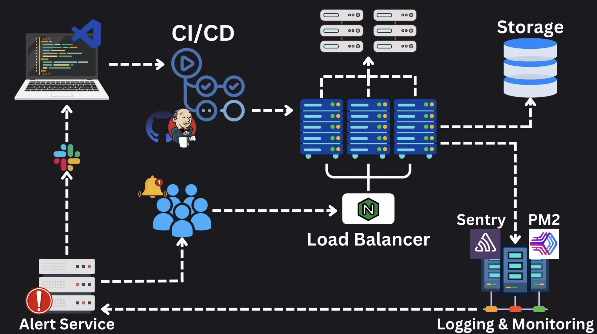

# **Mock Interview: How to Design an eBook Reader App**

## **1. Introduction**

Designing a robust, scalable, and efficient system is a core challenge in many system design interviews. This article serves as a comprehensive, step-by-step guide to help you design an **eBook Reader app**—a common yet versatile problem often posed in interviews. Beyond just preparing for the interview, understanding how to architect such a system equips you with real-world insights into building systems that can handle millions of users, complex functionalities, and high reliability.

The primary goals of this design are:  

- **Delivering eBooks to users across platforms**: The system should enable users to browse, purchase, and read eBooks seamlessly on mobile and web interfaces. Features such as syncing progress, offline reading, and robust content delivery are key aspects to consider.
- **Supporting a large user base**: High performance, fault tolerance, and scalability are essential to ensure the app works smoothly even under significant traffic or during peak usage.  
- **Incorporating system-wide features**: The design must include monitoring tools, error alerting mechanisms, and deployment pipelines to ensure the system remains maintainable and adaptable to changing requirements.

This post is part of a broader series on **system design** and builds on the concepts introduced in earlier articles. It provides practical guidance on how to structure and articulate your solution in a system design interview, with a focus on **back-end architecture**. By breaking down the key components and exploring optimizations, you'll learn how to approach similar design problems confidently and effectively.  

Let’s dive into the architecture, starting with the role of mobile and web interfaces in enabling user interactions with eBooks.

---

## **2. Mobile and Web Interface**

The **mobile and web interfaces** are the primary points of interaction for users, enabling them to access and enjoy eBooks seamlessly. These interfaces must be intuitive and responsive, offering a smooth user experience while relying heavily on the backend for data and functionality.  

The interface serves several key purposes:  

1. **Browsing the Library**: Users should be able to explore available eBooks (ideally categorized by genres, authors, and recommendations).  
2. **Reading eBooks**: Provide a feature-rich reading experience, such as turn pages.  
3. **Syncing Progress**: Automatically track and sync a user’s reading progress across devices, ensuring continuity.  
4. **Offline Mode**: Allow users to download eBooks for offline access, caching necessary content locally on the device.

### **Data Required from the Backend**

- **eBook Metadata**: Titles, authors, genres, summaries, cover images, and availability status.  
- **User Progress**: The last-read locations for each eBook.  
- **Content Delivery**: The actual eBook files or chapters in a secure and optimized format for streaming or downloading.  
- **Cached Data for Offline Mode**: Prefetched eBooks and essential library information for uninterrupted access.

By structuring the mobile and web interfaces in this way, the system provides a seamless and user-friendly experience while offloading complex operations to the backend for efficient processing and scaling. Next, we’ll examine how proxy servers and load balancers ensure reliability and scalability in such a system.  

---

## **3. Proxy Servers and Load Balancers**

In the context of an eBook Reader platform, proxy servers and load balancers play a crucial role in ensuring the system's scalability, reliability, and security. These components handle incoming traffic, distribute it efficiently, and shield backend systems from direct exposure, making them indispensable for a robust and high-performing architecture.

### **Functions in the Platform**

1. **Traffic Distribution for High Availability**:  
   The platform is expected to serve thousands or even millions of users, especially during peak hours. Load balancers distribute incoming requests across multiple backend servers, ensuring no single server is overwhelmed. This guarantees high availability and a smooth user experience.  

2. **Abstraction and Security**:  
   Proxy servers act as intermediaries between the users and backend services. This abstraction layer hides the details of the backend infrastructure, protecting it from direct attacks and unauthorized access.  

3. **SSL/TLS Termination**:  
   Proxy servers handle encryption and decryption of HTTPS traffic, ensuring secure communication while reducing the load on backend servers.  

4. **Caching Common Responses**:  
   For frequently requested resources like eBook metadata, cover images, or static assets, caching at the proxy layer significantly reduces backend load and speeds up response times.  

5. **Traffic Monitoring and Filtering**:  
   Proxy servers monitor traffic for anomalies, block malicious requests, and enforce security policies to safeguard the platform from threats like DDoS attacks.  

6. **Load Balancing Across Backend Services**:  
   Load balancers intelligently route requests to backend servers based on various algorithms (e.g., Round Robin, Least Connections) to ensure efficient utilization of resources and prevent bottlenecks.  

### **Other Optimizations for the Platform**

1. **Redundancy for Fault Tolerance**:  
   To avoid a single point of failure, implement redundant load balancers in an active-active or active-passive setup. This ensures the system remains operational even if one load balancer fails.  

2. **Geo-Distributed Load Balancers**:  
   For a global user base, deploy load balancers in multiple geographic regions. This reduces latency by routing users to the nearest server and improves the platform’s scalability.  

3. **Rate Limiting and Throttling**:  
   Prevent abuse by implementing rate limiting to restrict excessive requests from a single client. This protects backend services from being overwhelmed and ensures fair usage for all users.  

4. **Health Checks for Backend Servers**:  
   Load balancers perform periodic health checks on backend servers and automatically remove unresponsive servers from the rotation. This ensures traffic is routed only to healthy servers, maintaining platform reliability.  

---

## **4. API Design**

In the eBook Reader platform, APIs serve as the backbone of client-server communication, enabling users to browse, read, and manage their eBooks seamlessly. A well-designed API ensures that the platform remains scalable, reliable, and easy to maintain while delivering a high-quality user experience.

The primary goal of the API layer is to provide structured, efficient, and secure endpoints for various client applications (mobile, web, etc.). These APIs enable core functionalities such as library management, user authentication, and syncing reading progress while abstracting the complexities of backend systems.

### **Key APIs**

1. **Library Management API**:  
   - **Purpose**: Allow users to search, browse, and explore the eBook library.  
   - **Endpoints**:
     - `/api/library/search`: Search eBooks by title, author, genre, etc.
     - `/api/library/browse`: Fetch paginated results for browsing categories or collections.
     - `/api/library/details/{bookId}`: Retrieve detailed metadata for a specific eBook.  

2. **Reading Features API**:  
   - **Purpose**: Support reading functionalities such as syncing progress and offline access.  
   - **Endpoints**:
     - `/api/reading/progress`: Sync and retrieve the user's reading position for an eBook.
     - `/api/reading/download/{bookId}`: Download eBook content for offline reading.

### **OOP Design Interview Reference**

For a detailed look at how to design classes and implement business logic for such features, refer to the **[OOP Mock Interview article](../CSharp_OOP/07_OOP_Mock_Interview.md)**. This article delves into lower-level design, including class diagrams, Business Logic Layer (BLL) implementation, and best practices for modular code.

### **Optimizations**

To ensure scalability and high performance, several optimizations can be applied to the API layer:

1. **Versioned APIs**:  
   Introduce API versioning (e.g., `/v1/api/...`) to maintain backward compatibility when introducing new features or updates.  

2. **Pagination for Large Datasets**:  
   Implement pagination for APIs that return large datasets, such as browsing the library, to improve response times and reduce server load.  

3. **Rate Limiting**:  
   Prevent abuse by setting request limits for high-traffic endpoints, ensuring fair usage and protecting backend systems from being overwhelmed.  

4. **Efficient API Responses**:  
   - Use lightweight data formats like JSON or Protocol Buffers (for gRPC) to minimize response payload size.  
   - Optimize database queries to reduce latency for API responses.  

5. **Caching with CDNs**:  
   Leverage a CDN to cache static resources like eBook covers, thumbnails, and app assets. This reduces the load on backend servers and improves response times for end users.  

6. **Scalable Backend Services**:  
   - Employ horizontal scaling to handle increased traffic by adding more backend servers.  
   - Use load balancers to distribute API traffic efficiently.  

7. **Monitoring and Analytics**:  
   Integrate API monitoring tools to track performance, detect anomalies, and optimize frequently accessed endpoints.  

---

## **5. Database Design**

Efficient database design is critical for supporting the eBook Reader platform's core functionalities, including storing metadata, user activity, and actual eBook content. The database must be scalable, reliable, and optimized for both reads and writes to ensure a seamless user experience.

The database serves as the backbone for managing:

1. **Metadata**: Information about eBooks, such as titles, authors, genres, descriptions, and cover images.  
2. **User Activity**: Reading progress, bookmarks, highlights, and annotations for individual users.
3. **eBook Content**: Actual eBook files, which are typically stored in cloud storage while maintaining references in the database.  

### **Schema Design**

A well-structured schema is key to organizing data efficiently. Below are the main entities and their relationships:  

1. **Users Table**:  
   - Columns: `UserID`, `Name`, `Email`, `PasswordHash`, `CreatedAt`.  
   - Purpose: Store user information for authentication and personalization.  

2. **eBooks Table**:  
   - Columns: `BookID`, `Title`, `Author`, `Genre`, `Description`, `CoverImageURL`, `FileLocation`, `UploadedAt`.  
   - Purpose: Store metadata about eBooks and references to their file locations in cloud storage.  

3. **UserActivity Table**:  
   - Columns: `ActivityID`, `UserID`, `BookID`, `LastReadPosition`, `Progress`, `LastAccessedAt`.  
   - Purpose: Track user-specific reading progress and activity.  

### **Scaling Considerations**

As the platform grows, scaling the database to handle more users, eBooks, and activity logs is essential. The following strategies can be employed:

1. **Database Partitioning**:  
   - **Horizontal Partitioning (Sharding)**: Distribute user data across multiple shards based on `UserID` or `Region` to reduce the load on any single database instance.  
   - **Vertical Partitioning**: Separate tables for metadata and user activity to optimize query performance.  

2. **Data Replication**:  
   - Implement **master-slave replication** to ensure high availability and faster read operations.  
   - Use distributed databases (e.g., Amazon Aurora, Google Spanner) for global scalability.  

3. **Caching Layers**:  
   - Use tools like **Redis** or **Memcached** to cache frequently accessed data, such as eBook metadata and user progress, to reduce database query latency.  

4. **Backup and Disaster Recovery**:  
   - Set up automated backups to prevent data loss.  
   - Use geographically distributed replicas for disaster recovery in case of regional failures.  

For a deeper dive into designing database schemas, refer to the **[OOP Mock Interview article](../CSharp_OOP/07_OOP_Mock_Interview.md)**. This article outlines database design basics and their integration into system design scenarios.

---

## **6. ELK Stack for Logging and Monitoring**

Logging and monitoring are critical for understanding system health, identifying bottlenecks, and troubleshooting issues in the eBook Reader app.

### **ELK Stack - Purpose**

- Gain visibility into system performance and user interactions.
- Quickly diagnose and resolve production issues.

### **ELK Stack - Key Components**

1. **Elasticsearch**: Index and store log data for fast retrieval.  
2. **Logstash**: Collect, process, and format logs from various sources.  
3. **Kibana**: Provide a visual interface to monitor logs and metrics.

### **ELK Stack - Usage**

- Centralize logs from all backend services for seamless analysis.  
- Monitor critical metrics, such as request latency, error rates, and database query performance.  

### **ELK Stack - Optimizations**

- Configure alerts to notify teams of critical events, such as server failures or high error rates.  
- Regularly clean up old log data to prevent Elasticsearch from being overloaded.

---

## **7. Email System for Error Alerting**

Timely error notifications are essential for maintaining system reliability and ensuring prompt issue resolution.

### **Error Alerting - Purpose**

- Notify administrators about critical issues, such as API failures or high latencies.

### **Error Alerting - Implementation**

- Use email services like **SendGrid**, **Postmark**, or **AWS SES** for error notifications.  
- Set triggers for specific events, such as database connection failures or failed deployment jobs.

### **Error Alerting - Optimizations**

- Group multiple alerts into a single email to avoid notification overload.  
- Use alert thresholds to distinguish between minor issues and critical incidents.  
- Integrate with tools like **PagerDuty** or **Slack** for better incident management workflows.

---

## **8. CI/CD Pipeline with Docker and Kubernetes**

A robust CI/CD pipeline is key to delivering continuous updates without interrupting the service.

### **CI/CD Pipeline - Purpose**

- Automate the build, test, and deployment process to ensure consistent and reliable releases.

### **CI/CD Pipeline - Key Components**

1. **Docker**: Create lightweight containers for each application service to ensure environment consistency.  
2. **Kubernetes**: Handle container orchestration, scaling, and self-healing for high availability.

### **CI/CD Pipeline - Flow**

1. Developers push code to a repository.  
2. CI pipeline runs automated tests and builds Docker images.  
3. Successful builds are deployed to staging environments for testing.  
4. Approved builds roll out to production using Kubernetes, ensuring zero downtime.

### **CI/CD Pipeline - Optimizations**

- Use **canary deployments** to roll out updates incrementally, minimizing the risk of failure.  
- Monitor deployments in real time with tools like **Prometheus** or **Grafana** to detect potential issues early.  
- Implement rollback strategies to quickly revert to a stable version if problems arise.

---

## **9. Conclusion**

Designing a scalable and reliable eBook Reader app requires thoughtful integration of diverse components, including proxy servers, load balancers, APIs, databases, monitoring tools, and CI/CD pipelines.

### **Key Takeaways**

1. Balance performance, scalability, and reliability to create a seamless user experience.  
2. Incorporate monitoring and alerting systems to maintain operational stability.  
3. Design with future growth in mind, ensuring the architecture can handle increased traffic and data.  

By following these principles, developers can confidently approach system design interviews and real-world challenges. Practice designing systems like this one to solidify your understanding and gain the expertise needed to excel.
